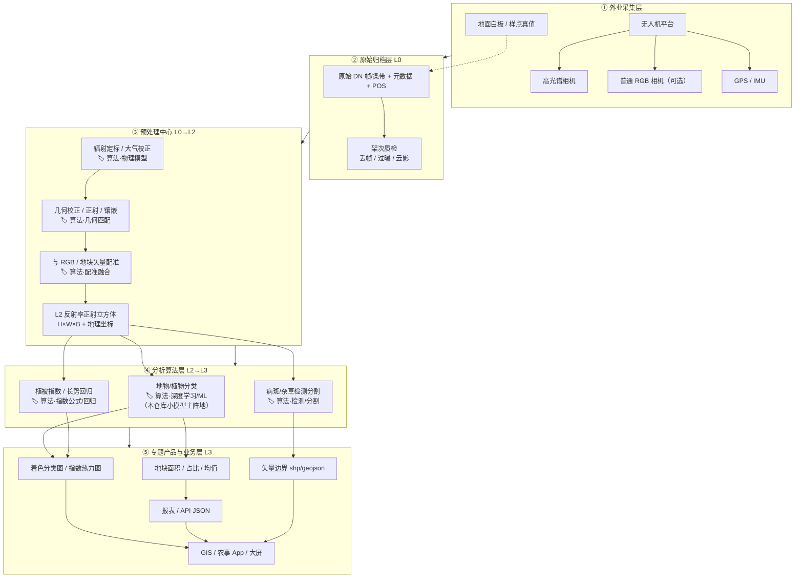
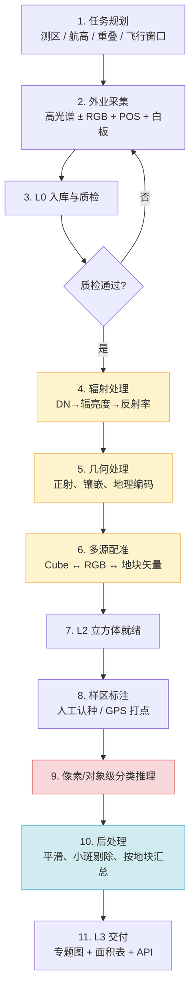
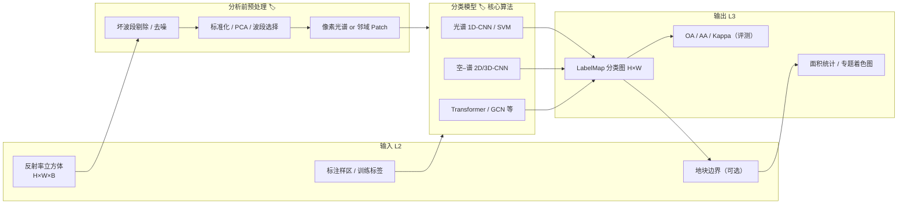

# 业界高光谱数据处理流程

> 面向无人机高光谱（可配合 RGB）业务，说明数据如何从采集扭转到应用端可读结果。  
> 以**植物/作物分类**为主线，并标出各环节是否使用算法、用什么类型的算法。

---

## 1. 一句话结论

业界不是「丢一组原始光谱 → 直接出一个指标」，而是：

**原始架次数据（L0）→ 反射率正射立方体（L2）→ 分析产品（L3）→ 地块级业务交付。**

你们仓库中的分类小模型，主要落在 **L2 → L3（分类图）** 这一段。

---

## 2. 数据层级（业界常用叫法）

| 层级 | 典型内容 | 形态举例 | 主要使用者 |
|------|----------|----------|------------|
| **L0** | 原始 DN、POS、元数据、定标板 | 帧/条带、日志、GPS/IMU | 仪器商、预处理管线 |
| **L1** | 辐亮度、初步几何 | 校正后条带/帧 | 处理中心 |
| **L2** | 地表反射率正射立方体 | `H×W×B` GeoTIFF/ENVI/Cube | 算法、二次开发 |
| **L3** | 分类图、指数图、面积表、矢量 | 专题图、shp、JSON 报表 | 客户、App、大屏 |

---

## 3. 总体架构图

下图按「采集 → 处理中心 → 算法分析 → 业务交付」分层。  
图例：**实线框 = 数据/系统；虚线框 + 「算法」标签 = 算法密集环节**。



---

## 4. 端到端流程图（植物分类场景）

按时间顺序展开；右侧标注 **是否用算法**。



| 步骤 | 是否用算法 | 算法类型（业界常见） | 说明 |
|------|------------|----------------------|------|
| 1 任务规划 | 少 | 航线优化（可选） | 多为规则 + 经验 |
| 2 外业采集 | 否 | — | 传感器与飞控 |
| 3 L0 质检 | **部分** | 阈值检测、云影检测 | 规则 + 轻量模型 |
| 4 辐射处理 | **是** | 定标模型、大气校正（如 MODTRAN/经验白板法） | 偏物理/遥感模型 |
| 5 几何处理 | **是** | SfM/影像匹配、正射校正 | 摄影测量算法 |
| 6 多源配准 | **是** | 特征匹配、互信息、RPC | 几何对齐 |
| 7 L2 就绪 | 否 | — | 数据产品落盘 |
| 8 样区标注 | 人工为主 | 半自动标注（可选） | 训练/验证真值 |
| 9 **分类推理** | **是（核心）** | CNN / Transformer / SVM 等 | **本仓库重点** |
| 10 后处理 | **是** | 形态学滤波、CRF、对象合并 | 提升可读性 |
| 11 L3 交付 | 少 | 统计聚合 | 面向人与业务系统 |

图中颜色约定：

- **黄**：预处理类算法（定标 / 几何 / 配准）
- **红**：分析类算法（分类 / 检测，业务价值核心）
- **蓝**：后处理与产品化算法

---

## 5. L2 → L3 分析层细化（算法主战场）



与本仓库关系：

| 本仓库能力 | 对应上图环节 |
|------------|--------------|
| `hyper-spectral-small-modes` 各类分类模型 | **分类模型 🏷️ 核心算法** |
| 公开数据集 `.mat` 立方体 + `_gt` | 模拟 **L2 + 标注**，跳过外业与预处理 |
| 输出 OA/AA/Kappa + 类别预测 | 对应 **评测指标 + LabelMap**；业务还要再做成面积/专题图 |

---

## 6. 数据扭转示意（形态变化）


植物分类业务故事（最短路径）：

1. 无人机挂高光谱（+ RGB）飞农田，地面放白板并记录样点作物种类。  
2. 处理中心完成定标、正射、配准 → **L2 Cube**。  
3. 用标注样区训练/微调分类模型（或套用已有模型）→ **每个像素一个作物类别**。  
4. 按地块统计面积占比，生成专题图与报表 → **App/大屏展示**。

---

## 7. 算法使用清单（汇总）

| 环节 | 算法强度 | 典型技术 | 是否本仓库范围 |
|------|----------|----------|----------------|
| 架次质检 | 中 | 异常检测、云检测 | 否（工程侧） |
| 辐射定标 / 大气校正 | 高（物理向） | 白板法、经验线、大气辐射传输 | 否 |
| 正射 / 镶嵌 | 高 | SfM、影像匹配、DEM 正射 | 否 |
| RGB–HSI–矢量配准 | 高 | 特征点、互信息 | 否 |
| 波段选择 / PCA / 去噪 | 中 | 统计降维、滤波 | 部分模型内含 |
| **植物/地物分类** | **高** | CNN、Transformer、传统 ML | **是** |
| 指数与长势回归 | 中高 | NDVI/NDRE、PLS/NN 回归 | 扩展场景 |
| 检测分割 | 高 | YOLO 类、语义分割 | 扩展场景 |
| 分类图后处理 | 中 | 形态学、CRF、小斑合并 | 工程侧常见 |
| 地块统计与制图 | 低 | GIS 空间聚合 | 否（产品侧） |

图例说明：

- **算法强度「高」**：没有模型/公式几乎做不出稳定产品。  
- **本仓库范围「是」**：对应 `wwwroot/hyper-spectral-small-modes` 等分类小模型。

---

## 8. 应用端最终吃什么（而不是原始波段）

| 交付物 | 人怎么理解 | 典型格式 |
|--------|------------|----------|
| 着色分类专题图 | 「这块地玉米/大豆分布」 | GeoTIFF、PNG 叠加底图 |
| 地块面积与占比 | 「玉米 XX 亩、占比 YY%」 | 表格、JSON API |
| 矢量斑块 | 可进 GIS 编辑 | shp / geojson |
| （可选）指数图层 | 「哪里长势差」 | 热力图 GeoTIFF |
| 评测报告（科研/验收） | OA/AA/Kappa | PDF / Markdown |

**不是**把几百个波段原样塞给业务人员；业务侧消费的是 **L3 图 + 统计**。

---

## 9. 目录与后续扩展建议

本文件路径：

```text
algorithm/
  docs/
    业界高光谱数据处理流程.md   ← 当前文档
  README.md
  dev.prompt.md                 ← 背景问题记录
```

后续可按场景拆分补充：

- `docs/场景-植物分类.md`
- `docs/场景-长势与胁迫.md`
- `docs/接口示意-L2输入L3输出.md`

---

## 10. 参考

- 项目背景问题：`../dev.prompt.md`
- 分类小模型分享卡片：`../../wwwroot/hyper-spectral-small-modes/*/docs/分享卡片.md`
- 公开资料线索：  
  - https://www.gisrsdata.com/pages/9a8b5b/  
  - https://zhuanlan.zhihu.com/p/492781907  
