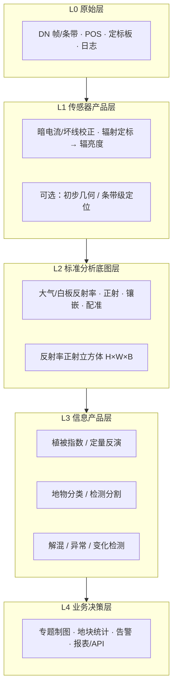

# 业界高光谱算法清单（按 L0–L4）

> 面向学习与汇报：先看**数据层级架构**，再按层级看**业界常用算法**。  
> 每条算法统一四要素：**作用 · 使用场景 · 数据输入 · 数据输出**。  
> 本清单共 **45** 项业界常用算法/方法（含工程侧与分析侧）。

配套：[业界高光谱数据处理流程.md](./业界高光谱数据处理流程.md) · [参考链接算法分析.md](./参考链接算法分析.md)

---

## 一、业界数据层级架构（先建立全局图）

业界把「从相机出来」到「领导/客户看得懂」拆成多层产品。不同厂商编号略有差异，农业无人机高光谱可按下表理解：


| 层级     | 名称（通俗）    | 数据长什么样                     | 谁主要用          |
| ------ | --------- | -------------------------- | ------------- |
| **L0** | 原始数据      | 原始 DN 帧/条带 + GPS/IMU + 元数据 | 采集队、预处理管线     |
| **L1** | 传感器级产品    | 辐亮度、初步几何，仍偏「仪器值」           | 处理中心          |
| **L2** | 地表反射率正射产品 | `高×宽×波段` 立方体，带地理坐标         | **算法研发、二次开发** |
| **L3** | 信息提取产品    | 分类图、指数图、反演图、斑块矢量           | 分析师、产品团队      |
| **L4** | 业务决策产品    | 地块报表、告警、产量/农事建议、API        | **客户、App/大屏** |


### 架构总图




### 一句话记住

```text
L0 原始计数 → L1 物理辐亮度 → L2 能上地图的反射率立方体
→ L3 图上的类别/指标 → L4 亩数、告警、给领导看的结论
```

本仓库分类小模型，主要吃 **L2**，产出靠近 **L3（分类图）**；真正给领导看的往往是 **L4**。

---


## 二、算法总表（45 项速览）


| #   | 所属层级  | 算法/方法                  | 一句话           |
| --- | ----- | ---------------------- | ------------- |
| 1   | L0 前  | 航线规划与覆盖优化              | 决定怎么飞才采得全     |
| 2   | L0    | 同步曝光与时间戳对齐             | 多拍传感器时间对齐     |
| 3   | L0    | POS 解算（GPS+IMU）        | 算出位置和姿态       |
| 4   | L0    | 架次质检（丢帧/过曝）            | 坏数据先拦下        |
| 5   | L0    | 云/云影检测                 | 遮挡区域打标        |
| 6   | L0→L1 | 暗电流校正                  | 去本底噪声         |
| 7   | L0→L1 | 坏线/坏像元修复               | 修传感器缺陷        |
| 8   | L0→L1 | 条带噪声去除                 | 去推扫条纹         |
| 9   | L0→L1 | 光谱微笑/关键畸变校正            | 修光谱几何畸变       |
| 10  | L0→L1 | 辐射定标 DN→辐亮度            | 变成物理量         |
| 11  | L1    | 相对辐射归一（多架次）            | 不同架次亮度对齐      |
| 12  | L1→L2 | 白板/灰板反射率定标             | 无人机常用变反射率     |
| 13  | L1→L2 | 大气校正                   | 去大气影响（多用于星载）  |
| 14  | L1→L2 | BRDF/双向反射校正            | 减弱观测角造成的明暗差   |
| 15  | L1→L2 | 几何粗校正 / 地理定位           | 像素落到大概坐标      |
| 16  | L1→L2 | 正射校正                   | 消地形与姿态畸变      |
| 17  | L2    | 影像匹配与镶嵌                | 多航带拼成整景       |
| 18  | L2    | 匀色/接缝线优化               | 拼接更自然         |
| 19  | L2    | 多源配准 HSI-RGB-矢量        | 人看图、算法吃谱、按地块裁 |
| 20  | L2    | 坏波段剔除与光谱去噪             | 清洗立方体         |
| 21  | L2    | Savitzky–Golay / 包络线去除 | 光谱平滑与特征增强     |
| 22  | L2    | 标准化/归一化                | 给模型统一量纲       |
| 23  | L2    | PCA / MNF / ICA 降维     | 百波段压到几十维      |
| 24  | L2    | 波段/特征选择                | 选出最有用的波段      |
| 25  | L2    | 超像素/对象分割               | 按斑块而非纯像素分析    |
| 26  | L2    | Patch/样本构建             | 切出训练推理小块      |
| 27  | L3    | NDVI                   | 最常用长势指数       |
| 28  | L3    | NDRE / 红边指数            | 密冠层/氮相关       |
| 29  | L3    | EVI / SAVI / MSAVI     | 抑大气或土壤背景      |
| 30  | L3    | NDMI / NDWI / MNDWI    | 水分与水体         |
| 31  | L3    | 红边位置/光谱特征参数            | 高光谱特色物候/胁迫特征  |
| 32  | L3    | PLS/RF 等回归反演           | 叶绿素、氮等连续量     |
| 33  | L3    | 辐射传输物理反演               | 机理法反演 LAI 等   |
| 34  | L3    | SVM / 随机森林分类           | 传统像素分类        |
| 35  | L3    | 光谱匹配 / SAM             | 与光谱库比对识物      |
| 36  | L3    | 1D-CNN / RNN 光谱分类      | 沿光谱深度学习       |
| 37  | L3    | 2D/3D-CNN 空谱分类         | 业界与论文主流分类     |
| 38  | L3    | Transformer / GCN 分类   | 复杂场景高精度分类     |
| 39  | L3    | 少样本/迁移学习分类             | 标注少也能上线       |
| 40  | L3    | 语义分割/目标检测              | 病斑、杂草斑块       |
| 41  | L3    | 混合像元分解（解混）             | 像素内各类占比       |
| 42  | L3    | 异常检测                   | 找「不像周围」的点     |
| 43  | L3    | 多时相变化检测                | 前后对比找变化       |
| 44  | L3→L4 | 分类后处理（平滑/小斑剔除）         | 图更好看更稳        |
| 45  | L4    | 地块汇总、专题制图与告警           | 领导/客户最终交付     |


---


## 三、按层级详解（作用 · 场景 · 输入 · 输出）

---


### L0 原始层（及上机前）


#### 1. 航线规划与覆盖优化


| 项        | 内容                      |
| -------- | ----------------------- |
| **作用**   | 规划航高、重叠、航迹，保证测区采全、可拼接   |
| **使用场景** | 无人机起飞前；大田、园区、矿区测绘任务     |
| **数据输入** | 测区边界、DEM、相机参数、分辨率要求、禁飞区 |
| **数据输出** | 航线文件、航点列表、预估架次与时长       |


#### 2. 同步曝光与时间戳对齐


| 项        | 内容                              |
| -------- | ------------------------------- |
| **作用**   | 让高光谱、RGB、POS 在时间轴上对齐，避免「图对不上姿态」 |
| **使用场景** | 多传感器挂载同飞；后续几何与融合的前提             |
| **数据输入** | 各传感器时间戳、触发脉冲记录                  |
| **数据输出** | 对齐后的帧-姿态对应表                     |


#### 3. POS 解算（GPS + IMU）


| 项        | 内容                               |
| -------- | -------------------------------- |
| **作用**   | 算出每帧/每条带的位置与姿态（POS）；IMU 提供姿态与加速度 |
| **使用场景** | 所有需要正射、镶嵌、上地图的飞行任务               |
| **数据输入** | GPS 轨迹、IMU 角速度/加速度、可选基站差分        |
| **数据输出** | 逐帧位置 (x,y,z) + 姿态角（俯仰/横滚/航向）     |


#### 4. 架次质检（丢帧 / 过曝 / 欠曝）


| 项        | 内容                    |
| -------- | --------------------- |
| **作用**   | 判断本架原始数据是否可用，避免垃圾进管线  |
| **使用场景** | 落地后第一道关；光照突变、颠簸、存储异常时 |
| **数据输入** | L0 DN、曝光增益日志、POS 完整性  |
| **数据输出** | 质检报告、坏帧列表、重飞建议        |


#### 5. 云 / 云影检测


| 项        | 内容                      |
| -------- | ----------------------- |
| **作用**   | 识别云与阴影覆盖，避免当正常地物分析      |
| **使用场景** | 卫星与高空数据常见；低空偶发薄云/树影也可借鉴 |
| **数据输入** | L0/L1 多波段或 RGB          |
| **数据输出** | 云/影掩膜（0/1 或概率图）         |


---


### L0 → L1 传感器产品层


#### 6. 暗电流校正


| 项        | 内容                  |
| -------- | ------------------- |
| **作用**   | 减去传感器在无光时的本底，降低固定偏差 |
| **使用场景** | 高光谱相机预处理几乎标配        |
| **数据输入** | 原始 DN、暗电流参考帧        |
| **数据输出** | 去本底后的 DN            |


#### 7. 坏线 / 坏像元修复


| 项        | 内容                |
| -------- | ----------------- |
| **作用**   | 修复探测器坏点、坏列，避免条纹伪影 |
| **使用场景** | 推扫相机老化或出厂缺陷       |
| **数据输入** | DN、坏像元表           |
| **数据输出** | 修复后 DN（插值或邻域填充）   |


#### 8. 条带噪声去除


| 项        | 内容             |
| -------- | -------------- |
| **作用**   | 去除推扫方向周期性亮暗条纹  |
| **使用场景** | 机载/星载推扫高光谱常见问题 |
| **数据输入** | 校正中 DN 或辐亮度    |
| **数据输出** | 去条带影像          |


#### 9. 光谱微笑 / 关键畸变校正（Smile / Keystone）


| 项        | 内容                            |
| -------- | ----------------------------- |
| **作用**   | 校正光谱维与空间维耦合畸变，保证「同一波段真的是同一波长」 |
| **使用场景** | 精密定量与光谱库匹配前；高端机载/星载处理         |
| **数据输入** | 传感器模型、实验室光谱定标数据、DN/辐亮度        |
| **数据输出** | 光谱几何校正后的数据立方体                 |


#### 10. 辐射定标（DN → 辐亮度）


| 项        | 内容                             |
| -------- | ------------------------------ |
| **作用**   | 把仪器计数变成有单位的辐亮度，具备物理可比性         |
| **使用场景** | 定量遥感、跨传感器对比、进入大气校正前            |
| **数据输入** | 校正后 DN、定标系数、积分时间等元数据           |
| **数据输出** | **L1 辐亮度产品**（Radiance Cube/条带） |


#### 11. 相对辐射归一（多架次 / 多时相）


| 项        | 内容                   |
| -------- | -------------------- |
| **作用**   | 消除不同架次光照、增益差异，使亮度可对比 |
| **使用场景** | 一天多架次、多日监测、镶嵌前匀光     |
| **数据输入** | 多景 L1/L2、重叠区或伪不变特征   |
| **数据输出** | 辐射一致化后的多景数据          |


---


### L1 → L2 标准分析底图层


#### 12. 白板 / 灰板反射率定标（经验线法）


| 项        | 内容                        |
| -------- | ------------------------- |
| **作用**   | 用地面参考板把辐亮度转为地表反射率（无人机最常用） |
| **使用场景** | 低空农情、植被指数、分类前；替代完整大气校正    |
| **数据输入** | 辐亮度、白板光谱/同步测量             |
| **数据输出** | 近似/地表 **反射率立方体**          |


#### 13. 大气校正


| 项        | 内容                     |
| -------- | ---------------------- |
| **作用**   | 扣除大气吸收散射，得到更接近真实的地表反射率 |
| **使用场景** | 卫星高光谱、有人机高空；跨区域定量对比    |
| **数据输入** | 辐亮度、大气参数（水汽、气溶胶等）      |
| **数据输出** | 地表反射率产品（常称 L2A 一类）     |


#### 14. BRDF / 观测几何校正


| 项        | 内容                     |
| -------- | ---------------------- |
| **作用**   | 减弱太阳-观测角度不同造成的「一边亮一边暗」 |
| **使用场景** | 宽视场航带边缘、多日多角度合成        |
| **数据输入** | 反射率、太阳/观测天顶角方位角        |
| **数据输出** | 角度归一后的反射率              |


#### 15. 几何粗校正 / 地理定位


| 项        | 内容                       |
| -------- | ------------------------ |
| **作用**   | 依据 POS 与相机模型，给影像赋予初始地理坐标 |
| **使用场景** | 正射前；快速预览落点               |
| **数据输入** | 影像条带、POS、相机内参            |
| **数据输出** | 带粗略地理参考的条带               |


#### 16. 正射校正


| 项        | 内容                            |
| -------- | ----------------------------- |
| **作用**   | 消除地形起伏与姿态引起的几何畸变，像素可准确落图      |
| **使用场景** | 要量面积、叠地块、做 GIS 的所有项目          |
| **数据输入** | 条带、POS、DEM、相机模型               |
| **数据输出** | 正射条带（Orthophoto / Ortho Cube） |


#### 17. 影像匹配与镶嵌


| 项        | 内容                       |
| -------- | ------------------------ |
| **作用**   | 多航带拼成测区完整一张图             |
| **使用场景** | 大田多航线飞行；生成整景 L2          |
| **数据输入** | 多条正射条带、重叠区               |
| **数据输出** | **整景反射率正射立方体（典型 L2 交付）** |


#### 18. 匀色与接缝线优化


| 项        | 内容                 |
| -------- | ------------------ |
| **作用**   | 消除拼接接缝处色差与硬边，提高可读性 |
| **使用场景** | 出图给客户看；镶嵌后美化       |
| **数据输入** | 镶嵌前多条带或初镶嵌图        |
| **数据输出** | 匀色后镶嵌产品            |


#### 19. 多源配准（高光谱 ↔ RGB ↔ 地块矢量）


| 项        | 内容                          |
| -------- | --------------------------- |
| **作用**   | 让光谱、真彩色、田块边界对齐，便于标注与按地块统计   |
| **使用场景** | 「人看 RGB、算法吃 HSI、报表按地块」的标准业务 |
| **数据输入** | HSI Cube、RGB 正射、shp/geojson |
| **数据输出** | 共配准多层数据（同一网格/坐标系）           |


#### 20. 坏波段剔除与光谱去噪


| 项        | 内容                           |
| -------- | ---------------------------- |
| **作用**   | 去掉水汽强吸收等噪声波段，提升后续稳定          |
| **使用场景** | 分类/指数/反演前；1400、1900 nm 附近常剔除 |
| **数据输入** | L2 反射率 Cube                  |
| **数据输出** | 清洗后 Cube（波段数减少）              |


#### 21. Savitzky–Golay 平滑 / 包络线去除


| 项        | 内容                 |
| -------- | ------------------ |
| **作用**   | 平滑光谱噪声；包络线去除突出吸收特征 |
| **使用场景** | 矿物识别、精细光谱匹配、特征工程   |
| **数据输入** | 像素光谱或整景 Cube       |
| **数据输出** | 平滑谱 / 去包络光谱特征      |


#### 22. 标准化 / 归一化


| 项        | 内容                      |
| -------- | ----------------------- |
| **作用**   | 统一数值范围，便于机器学习           |
| **使用场景** | 几乎所有 ML/DL 训练与推理前       |
| **数据输入** | Cube 或光谱向量              |
| **数据输出** | z-score / minmax 等标准化特征 |


#### 23. 降维（PCA / MNF / ICA）


| 项        | 内容                           |
| -------- | ---------------------------- |
| **作用**   | 压缩高度相关的上百波段，降冗余与噪声           |
| **使用场景** | 深度学习前、小样本、算力有限；本仓库部分模型内含 PCA |
| **数据输入** | 高维 Cube                      |
| **数据输出** | 低维特征立方体（如 10–40 维）           |


#### 24. 波段选择 / 特征选择


| 项        | 内容                        |
| -------- | ------------------------- |
| **作用**   | 选出对任务最有区分力的波段或指数，而不是盲目全波段 |
| **使用场景** | 特定作物区分、传感器定波段、边缘设备轻量化     |
| **数据输入** | Cube +（可选）样区标签            |
| **数据输出** | 优选波段列表 / 特征表              |


#### 25. 超像素 / 面向对象分割


| 项        | 内容                          |
| -------- | --------------------------- |
| **作用**   | 把影像切成均质小对象，再以对象为单位分类，减少椒盐噪声 |
| **使用场景** | 农田斑块、林斑；对象级分类前处理            |
| **数据输入** | L2 影像（可含 RGB）               |
| **数据输出** | 超像素标签图 / 对象多边形              |


#### 26. Patch / 样本构建


| 项        | 内容                                          |
| -------- | ------------------------------------------- |
| **作用**   | 切出模型可训练、可推理的邻域立方体或光谱向量                      |
| **使用场景** | CNN/Transformer 训练；本仓库常见 `createImageCubes` |
| **数据输入** | Cube、标签图、窗宽                                 |
| **数据输出** | 样本张量 `(N,W,W,B)` 或 `(N,B)` + 类别             |


---


### L3 信息产品层（算法价值最集中）


#### 27. NDVI（归一化植被指数）


| 项        | 内容                |
| -------- | ----------------- |
| **作用**   | 快速表征植被绿度与光合活性     |
| **使用场景** | 长势监测、物候；农情最通用指标   |
| **数据输入** | 红光、近红外反射率         |
| **数据输出** | NDVI 单波段图（约 −1～1） |


#### 28. NDRE / 红边植被指数


| 项        | 内容                  |
| -------- | ------------------- |
| **作用**   | 利用红边对叶绿素更敏感，适合密冠层   |
| **使用场景** | 成熟期、氮营养相关监测；高光谱优势场景 |
| **数据输入** | 近红外、红边反射率           |
| **数据输出** | NDRE（或同类红边指数）图      |


#### 29. EVI / SAVI / MSAVI（改进植被指数）


| 项        | 内容                         |
| -------- | -------------------------- |
| **作用**   | 减轻大气干扰、土壤背景或 NDVI 饱和       |
| **使用场景** | 茂密冠层用 EVI；苗期稀疏用 SAVI/MSAVI |
| **数据输入** | NIR、RED，及 BLUE 或土壤因子 L     |
| **数据输出** | 对应指数专题图                    |


#### 30. NDMI / NDWI / MNDWI（水分与水体指数）


| 项        | 内容                        |
| -------- | ------------------------- |
| **作用**   | 估计冠层水分或提取水体/淹田            |
| **使用场景** | 干旱、灌溉、湿地、农田积水             |
| **数据输入** | NIR+SWIR 或 GREEN+NIR/SWIR |
| **数据输出** | 水分/水体指数图                  |


#### 31. 红边位置与光谱特征参数提取


| 项        | 内容                     |
| -------- | ---------------------- |
| **作用**   | 从连续光谱提取红边位置、吸收谷深度等参数   |
| **使用场景** | 物候、胁迫早期、高光谱相对多光谱的差异化能力 |
| **数据输入** | 连续反射率光谱                |
| **数据输出** | 参数栅格（如红边位置 nm）         |


#### 32. 经验回归反演（PLS / 随机森林 / 神经网络等）


| 项        | 内容                      |
| -------- | ----------------------- |
| **作用**   | 把光谱映射为叶绿素、氮含量、含水率等连续生化量 |
| **使用场景** | 精准施肥、长势诊断；有地面化验样本时      |
| **数据输入** | 光谱/指数特征 + 地面真值（训练时）     |
| **数据输出** | 连续量专题图（带物理单位）           |


#### 33. 辐射传输物理模型反演


| 项        | 内容                   |
| -------- | -------------------- |
| **作用**   | 用冠层辐射传输机理反演 LAI、叶绿素等 |
| **使用场景** | 高精度定量科研与业务；成本高于简单指数  |
| **数据输入** | 反射率、模型先验参数           |
| **数据输出** | 物理参数图（如 LAI）         |


#### 34. 传统机器学习分类（SVM / 随机森林 / 逻辑回归）


| 项        | 内容                          |
| -------- | --------------------------- |
| **作用**   | 按像素判别作物/地物类别                |
| **使用场景** | 小样本基线、快速上线、可解释要求高；本仓库含此类    |
| **数据输入** | 光谱或降维特征 + 训练标签              |
| **数据输出** | 分类图 LabelMap；可算 OA/AA/Kappa |


#### 35. 光谱匹配分类（如 SAM 光谱角制图）


| 项        | 内容                |
| -------- | ----------------- |
| **作用**   | 用光谱形状与标准光谱库比对识别物质 |
| **使用场景** | 矿物填图、已知光谱库的目标识别   |
| **数据输入** | 像素光谱、端元/光谱库       |
| **数据输出** | 匹配类别图或光谱角距离图      |


#### 36. 光谱深度学习分类（1D-CNN / RNN）


| 项        | 内容              |
| -------- | --------------- |
| **作用**   | 沿光谱维自动提取特征做像素分类 |
| **使用场景** | 光谱可分性强、空间纹理弱的场景 |
| **数据输入** | 单像素光谱 `(B,)`    |
| **数据输出** | 像素类别 / 全图分类图    |


#### 37. 空–谱 CNN 分类（2D/3D-CNN）


| 项        | 内容                                 |
| -------- | ---------------------------------- |
| **作用**   | 同时利用邻域空间与光谱，提高分类精度                 |
| **使用场景** | **农田作物精细分类、城市地物一张图**；业界与论文主流；本仓库核心 |
| **数据输入** | 邻域立方体 `(W,W,B)`                    |
| **数据输出** | 分类着色图（各类作物/地物）                     |


#### 38. Transformer / GCN 等现代分类网络


| 项        | 内容                    |
| -------- | --------------------- |
| **作用**   | 用注意力或图结构捕捉长程依赖，冲击更高精度 |
| **使用场景** | 复杂地物、大场景、研究型与高端产品     |
| **数据输入** | Patch / 超像素图结构特征      |
| **数据输出** | 像素或对象级分类图             |


#### 39. 少样本 / 迁移学习分类


| 项        | 内容                  |
| -------- | ------------------- |
| **作用**   | 标注很少或换了一个农场时仍能分类    |
| **使用场景** | 新区域快速部署、降低外业认种成本    |
| **数据输入** | 源域模型 + 目标域少量标签 Cube |
| **数据输出** | 目标场景分类图             |


#### 40. 语义分割 / 目标检测（病斑、杂草等）


| 项        | 内容                        |
| -------- | ------------------------- |
| **作用**   | 找出病变、杂草等目标的位置与边界，而不是整幅填类别 |
| **使用场景** | 植保巡田、精准喷药；常融合 RGB         |
| **数据输入** | Cube 和/或 RGB、框/掩膜标注       |
| **数据输出** | 检测框、分割掩膜、斑块矢量（shp）        |


#### 41. 混合像元分解（端元提取 + 丰度反演）


| 项        | 内容                    |
| -------- | --------------------- |
| **作用**   | 一个像素里有多种物质时，估计各类占地比例  |
| **使用场景** | 分辨率不够细、混种、稀疏植被、矿物丰度填图 |
| **数据输入** | 混合光谱、端元库或自动端元         |
| **数据输出** | 各类丰度图（0～1 连续）         |


#### 42. 异常检测


| 项        | 内容                |
| -------- | ----------------- |
| **作用**   | 找出光谱上「不像周围大部分」的像元 |
| **使用场景** | 病虫害爆发点、污染点、未知目标初筛 |
| **数据输入** | 单时相 Cube          |
| **数据输出** | 异常得分图 / 告警点位      |


#### 43. 多时相变化检测


| 项        | 内容               |
| -------- | ---------------- |
| **作用**   | 对比两个或多个时相，找出变化区域 |
| **使用场景** | 灾损、砍伐、作物轮作、施工占地  |
| **数据输入** | 配准后的多时相 L2/L3    |
| **数据输出** | 变化掩膜、变化类型图       |


---


### L3 → L4 业务决策层


#### 44. 分类后处理（形态学滤波 / CRF / 小斑剔除）


| 项        | 内容                     |
| -------- | ---------------------- |
| **作用**   | 去掉椒盐噪声与过小斑块，使结果符合地物连续性 |
| **使用场景** | 像素分类出图前；验收图美化          |
| **数据输入** | 原始 LabelMap            |
| **数据输出** | 平滑后的分类图、更干净的作物斑块       |


#### 45. 地块汇总、专题制图与业务告警（L4 核心）


| 项        | 内容                                    |
| -------- | ------------------------------------- |
| **作用**   | 把像素结果变成「人能拍板」的亩数、占比、告警和建议             |
| **使用场景** | 领导汇报、农事 App、补贴核对、产量预估输入               |
| **数据输入** | L3 分类图/指数图 + 地块矢量 + 阈值规则              |
| **数据输出** | **面积表、地块 JSON、着色专题图、shp 斑块、告警列表、API** |


---


## 四、给领导看的「输入→输出」对照（简化）


| 层级  | 输入（上一层给什么）      | 本层典型输出          | 人能不能直接决策   |
| --- | --------------- | --------------- | ---------- |
| L0  | 相机原始流           | DN + POS 数据包    | 否          |
| L1  | DN              | 辐亮度条带           | 否          |
| L2  | 辐亮度 + POS/DEM   | **反射率正射立方体**    | 专业人员可预览    |
| L3  | L2 Cube +（可选）标签 | 分类图 / 指数图 / 反演图 | 部分能看懂图     |
| L4  | L3 + 地块边界       | **亩数、报表、告警**    | **是，面向决策** |


两条最常用业务链：

**植物分类（本仓库相关）**

```text
L0 采集 → L1 定标 → L2 正射立方体
→ L3 空谱分类(#37等) → L4 地块面积与专题图(#45)
```

**长势指标**

```text
L0 采集 → L1 定标 → L2 正射立方体
→ L3 NDVI/NDRE(#27–28) → L4 地块均值与告警(#45)
```

---


## 五、与本仓库的关系（避免误解范围）


| 层级/算法                        | 本仓库算法实现（生产方法） |
| ---------------------------- | ---------------------------------- |
| L0 前 / L0 (#1–5) | 摄影测量 GSD 航线、POS 内插对时、互补滤波+RTS POS、位深饱和质检、Fmask 光谱云检 |
| L0→L1 (#6–11) | 暗电流+列 FPN、6σ 坏像元、矩匹配去条带、场景内 smile/keystone、DN→辐亮度、直方图匹配 |
| L1→L2 (#12–19) | 经验线 ELM、Chavez DOS2、Ross-Li BRDF、直接地理定位、共线方程+DEM 正射、地理羽化镶嵌、Wallis 匀光、Foroosh 亚像元配准 |
| L2 清洗/特征 (#20–26) | SNR+吸收带剔除、SG 平滑、SNV、MNF、ANOVA 波段选择、SLIC、邻域 Patch |
| L3 指数/反演 (#27–33) | NDVI/NDRE/EVI/SAVI/NDWI、Guyot 红边、SNV+PLS、PROSAIL LUT |
| L3 分类/探测 (#34–43) | SVM/RF、SAM/SID、Hu 2015 1-D CNN、HybridSN、SpectralFormer、SAM 原型网络、ACE、FCLS、LRX、IR-MAD |
| L4 (#44–45) | 众数滤波+筛斑、GeoJSON 栅格化分区统计 |

45 项均已在 `algorithm/source/algorithms/` 落地为统一 API：`POST /api/v1/{algorithm_id}/run`。

**能力边界（不是简化，是工具无法内嵌的商业软件）**：完整 MODTRAN/6S 大气剖面、Pix4D/Metashape 多视空三、厂商相机 SDK 不在本服务内。无人机生产路径用经验线；星载无热红外时用 DOS2；单片正射用共线方程+DEM 直接地理定位。


---


## 六、名词速记（阅读清单时用）


| 词           | 意思                          |
| ----------- | --------------------------- |
| DN          | 原始数字计数，还不是反射率               |
| IMU         | 惯性测量单元，测姿态/加速度；与 GPS 组成 POS |
| Cube        | 高×宽×波段的数据立方体                |
| shp         | 矢量边界文件，作物斑块常用格式             |
| OA/AA/Kappa | 分类精度指标，偏算法验收，不是给农户看的亩数      |


