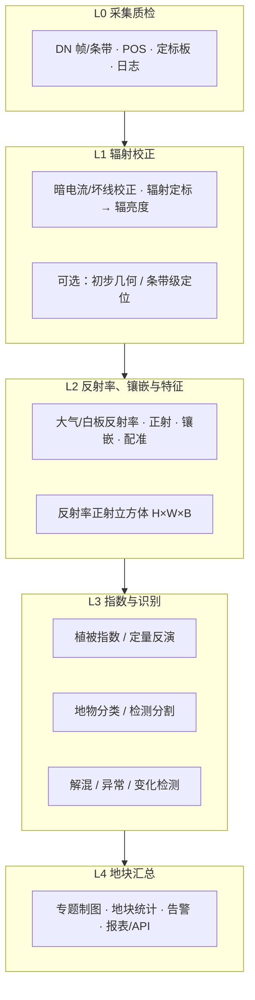

# 业界高光谱算法清单（按 L0–L4）

> 面向学习与汇报：先看**数据层级架构**，再按层级看**业界常用算法**。  
> 每条算法统一四要素：**作用 · 使用场景 · 数据输入 · 数据输出**。  
> 本清单共 **55** 项业界常用算法/方法（含工程侧与分析侧；46–55 为补齐的植被指数）。  
> 专家精读（原理、本仓库真实 I/O、与业界差距）：[55项算法科学证据审查报告.md](./55项算法科学证据审查报告.md)  
> 与外部「常用植被指数」18 项谁做了谁没做：[常用植被指数18项对照.md](./常用植被指数18项对照.md)

配套：[业界高光谱数据处理流程.md](./业界高光谱数据处理流程.md) · [参考链接算法分析.md](./参考链接算法分析.md)

---

## 一、业界数据层级架构（先建立全局图）

业界把「从相机出来」到「领导/客户看得懂」拆成多层产品。不同厂商编号略有差异，农业无人机高光谱可按下表理解：


| 层级     | 名称（与控制台菜单对齐） | 数据长什么样                     | 谁主要用          |
| ------ | --------------- | -------------------------- | ------------- |
| **L0** | 采集质检            | 原始 DN 帧/条带 + GPS/IMU + 元数据 | 采集队、预处理管线     |
| **L1** | 辐射校正            | 辐亮度、初步几何，仍偏「仪器值」           | 处理中心          |
| **L2** | 反射率、镶嵌与特征       | `高×宽×波段` 立方体，带地理坐标         | **算法研发、二次开发** |
| **L3** | 指数与识别           | 分类图、指数图、反演图、斑块矢量           | 分析师、产品团队      |
| **L4** | 地块汇总            | 地块报表、告警、产量/农事建议、API        | **客户、App/大屏** |


### 架构总图




### 一句话记住

```text
L0 采集质检 → L1 辐射校正 → L2 能上地图的反射率立方体
→ L3 指数与识别 → L4 地块汇总、给领导看的结论
```

本仓库分类小模型，主要吃 **L2（镶嵌与特征之后的立方体）**，产出靠近 **L3（指数与识别）**；真正给领导看的往往是 **L4 地块汇总**。

控制台左侧菜单把 L0–L4 拆成九段，与网页完全一致：

| 菜单 | 层级备注 | 算法 |
| --- | --- | --- |
| 全流程 | — | 首页 |
| 航线规划 | L0前 | 01 |
| 采集质检 | L0 | 02–05 |
| 辐射校正 | L0→L1 | 06–10 |
| 相对归一 | L1 | 11 |
| 反射率与正射 | L1→L2 | 12–16 |
| 镶嵌与特征 | L2 | 17–26 |
| 指数与识别 | L3 | 27–43、46–55 |
| 图斑整理 | L3→L4 | 44 |
| 地块汇总 | L4 | 45 |

---


## 二、算法总表（55 项速览）


| #   | 所属层级  | 算法/方法                  | 一句话           |
| --- | ----- | ---------------------- | ------------- |
| 1   | L0 前  | 航线规划与覆盖优化| 决定怎么飞才采得全     |
| 2   | L0    | 同步曝光与时间戳对齐| 多拍传感器时间对齐     |
| 3   | L0    | POS轨迹平滑与杠杆臂校正| 平滑轨迹并改正安装偏移       |
| 4   | L0    | 架次过曝与场景统计质检| 过曝门控与场景统计        |
| 5   | L0    | 云/云影检测| 遮挡区域打标        |
| 6   | L0→L1 | 暗电流校正| 去本底噪声         |
| 7   | L0→L1 | 坏线/坏像元修复| 修传感器缺陷        |
| 8   | L0→L1 | 条带噪声去除| 去推扫条纹         |
| 9   | L0→L1 | 光谱微笑/关键畸变校正| 修光谱几何畸变       |
| 10  | L0→L1 | 辐射定标 DN→辐亮度| 变成物理量         |
| 11  | L1    | 相对辐射归一| 不同架次亮度对齐      |
| 12  | L1→L2 | 白板/灰板反射率定标| 无人机常用变反射率     |
| 13  | L1→L2 | 大气校正| 去大气影响（多用于星载）  |
| 14  | L1→L2 | BRDF/观测几何校正| 减弱观测角造成的明暗差   |
| 15  | L1→L2 | POS中心点与GSD粗定位| 像素落到大概坐标      |
| 16  | L1→L2 | 正射校正| 消地形与姿态畸变      |
| 17  | L2    | 影像匹配与镶嵌| 多航带拼成整景       |
| 18  | L2    | Wallis局部匀色| 改善局部亮度观感     |
| 19  | L2    | HSI-RGB全局平移配准| RGB 平移对齐 HSI  |
| 20  | L2    | 坏波段剔除| 清洗立方体         |
| 21  | L2    | Savitzky-Golay平滑| 光谱平滑与特征增强     |
| 22  | L2    | 标准化/归一化| 给模型统一量纲       |
| 23  | L2    | PCA/MNF降维| 百波段压到几十维      |
| 24  | L2    | 波段/特征选择| 选出最有用的波段      |
| 25  | L2    | 超像素/对象分割| 按斑块而非纯像素分析    |
| 26  | L2    | Patch/样本构建| 切出训练推理小块      |
| 27  | L3    | NDVI植被指数| 最常用长势指数       |
| 28  | L3    | NDRE红边植被指数| 密冠层/氮相关       |
| 29  | L3    | EVI/SAVI/MSAVI| 抑大气或土壤背景      |
| 30  | L3    | NDMI/NDWI/MNDWI| 水分与水体         |
| 31  | L3    | 红边位置与光谱特征参数| 高光谱特色物候/胁迫特征  |
| 32  | L3    | 经验回归反演| 叶绿素、氮等连续量     |
| 33  | L3    | 辐射传输物理反演| 不用化验估叶面积和叶绿素 |
| 34  | L3    | SVM/随机森林分类| 传统像素分类        |
| 35  | L3    | 光谱匹配分类(SAM)| 与光谱库比对识物      |
| 36  | L3    | 1D-CNN光谱分类| 沿光谱深度学习       |
| 37  | L3    | 2D/3D-CNN空谱分类| 业界与论文主流分类     |
| 38  | L3    | SpectralFormer光谱分类| 光谱序列分类         |
| 39  | L3    | SAM均值原型少样本分类| 少量支持样本分类      |
| 40  | L3    | 低NDVI种子ACE目标检测| 相对目标候选斑块      |
| 41  | L3    | 混合像元分解| 像素内各类占比       |
| 42  | L3    | 异常检测| 找「不像周围」的点     |
| 43  | L3    | 多时相变化检测| 前后对比找变化       |
| 44  | L3→L4 | 分类后处理平滑/小斑剔除| 图更好看更稳        |
| 45  | L4    | 地块汇总与专题统计| 领导/客户最终交付     |
| 46  | L3    | RECI红边叶绿素指数| 红边叶绿素相对指数   |
| 47  | L3    | GNDVI绿色归一化植被指数| 绿光归一化绿度     |
| 48  | L3    | OSAVI优化土壤调节植被指数| 固定土壤项 L=0.16 |
| 49  | L3    | ARVI耐大气植被指数| 蓝光修正红光         |
| 50  | L3    | VARI可见大气阻力指数| 只用可见光估覆盖   |
| 51  | L3    | 叶面积经验指数| EVI 线性式，不是 #33 |
| 52  | L3    | NBR标准化燃烧率| 过火相对差异         |
| 53  | L3    | SIPI结构不敏感色素指数| 色素比值相对指数   |
| 54  | L3    | GCI绿色叶绿素指数| 绿光叶绿素相对指数   |
| 55  | L3    | NDSI归一化差值雪指数| 积雪相对指数，不是水 |


---


## 三、按层级详解（作用 · 场景 · 输入 · 输出）

---


### 航线规划 · 采集质检（L0 前 / L0）


#### 1. 航线规划与覆盖优化


| 项        | 内容                      |
| -------- | ----------------------- |
| **作用**   | 规划航高、重叠、航迹，保证测区采全、可拼接   |
| **使用场景** | 无人机起飞前；大田、园区、矿区测绘任务     |
| **数据输入** | 测区边界、DEM、相机参数、分辨率要求、禁飞区 |
| **数据输出** | 航线文件、航点列表、预估架次与时长       |
| **方法边界** | 当前只在测区外包矩形上铺直线往返航点，不处理 DEM、障碍、禁飞区、转弯动力学或飞控格式；理论 GSD 与简化航时不能替代可飞性审查。 |


#### 2. 同步曝光与时间戳对齐


| 项        | 内容                              |
| -------- | ------------------------------- |
| **作用**   | 让高光谱、RGB、POS 在时间轴上对齐，避免「图对不上姿态」 |
| **使用场景** | 多传感器挂载同飞；后续几何与融合的前提             |
| **数据输入** | 各传感器时间戳、触发脉冲记录                  |
| **数据输出** | 对齐后的帧-姿态对应表                     |
| **方法边界** | 结果是无容差拒绝、无漂移模型的软件后处理配对，不代表 PPS/PTP 硬件同步；固定钟差与端点外推可能在长任务或快速运动中失效。 |


#### 3. POS轨迹平滑与杠杆臂校正


| 项        | 内容                               |
| -------- | -------------------------------- |
| **作用**   | 对已解算 POS CSV 做轨迹平滑与杠杆臂校正 |
| **使用场景** | 所有需要正射、镶嵌、上地图的飞行任务               |
| **数据输入** | 已解算 POS CSV（time,lat,lon,alt,roll,pitch,yaw） |
| **数据输出** | 平滑后的位置、姿态、速度与 gnss_ok 标志（JSON/CSV） |
| **方法边界** | 该服务不读取原始 IMU 比力或角速度，不是 GNSS/IMU 紧组合解算，也未提供 RTK 状态、协方差或可溯源精度评定。 |


#### 4. 架次过曝与场景统计质检


| 项        | 内容                    |
| -------- | --------------------- |
| **作用**   | 统计过曝/欠曝比例与场景亮度，门控本架是否可进入后续处理 |
| **使用场景** | 落地后第一道关；光照突变、颠簸、存储异常时 |
| **数据输入** | L0 DN GeoTIFF，可选 bit_depth 与过曝比例阈值 |
| **数据输出** | 质检报告（过曝/欠曝比例、场景统计、通过/复飞建议） |
| **方法边界** | 全景 mean/std 混入地物组成和空间纹理，不能称为 EMVA 1288 传感器 SNR；服务也不检测丢帧、模糊、几何或定标质量。 |


#### 5. 云/云影检测


| 项        | 内容                      |
| -------- | ----------------------- |
| **作用**   | 识别云与阴影覆盖，避免当正常地物分析      |
| **使用场景** | 卫星与高空数据常见；低空偶发薄云/树影也可借鉴 |
| **数据输入** | L0/L1 多波段或 RGB          |
| **数据输出** | 云/影掩膜（0/1 或概率图）         |
| **方法边界** | 该实现无亮温、云概率、云对象、云高、太阳/观测几何与投影匹配，不能宣称完整 Fmask 或经几何确认的云影，暗水体、树影和地形阴影可能误报。 |


---


### 辐射校正 · 相对归一（L0→L1 / L1）


#### 6. 暗电流校正


| 项        | 内容                  |
| -------- | ------------------- |
| **作用**   | 减去传感器在无光时的本底，降低固定偏差 |
| **使用场景** | 高光谱相机预处理几乎标配        |
| **数据输入** | 原始 DN、暗电流参考帧        |
| **数据输出** | 去本底后的 DN            |
| **方法边界** | 无匹配暗帧时的逐波段最小值可能移除真实暗地物；温度、曝光或增益不匹配会造成过扣/欠扣，截零还会隐藏负残差。 |


#### 7. 坏线/坏像元修复


| 项        | 内容                |
| -------- | ----------------- |
| **作用**   | 修复探测器坏点、坏列，避免条纹伪影 |
| **使用场景** | 推扫相机老化或出厂缺陷       |
| **数据输入** | DN、坏像元表           |
| **数据输出** | 修复后 DN（插值或邻域填充）   |
| **方法边界** | 单景统计可能把高对比边缘和小目标误判为缺陷；填充值不是独立观测，且本服务没有出厂坏元时序表或跨批次稳定性验证。 |


#### 8. 条带噪声去除


| 项        | 内容             |
| -------- | -------------- |
| **作用**   | 去除推扫方向周期性亮暗条纹  |
| **使用场景** | 机载/星载推扫高光谱常见问题 |
| **数据输入** | 校正中 DN 或辐亮度    |
| **数据输出** | 去条带影像          |
| **方法边界** | 矩匹配依赖各列观测到统计相似地物的假设；贯穿列的真实结构或列间地物组成差异可能被误校正，结果不是平场绝对响应标定。 |


#### 9. 光谱微笑/关键畸变校正


| 项        | 内容                            |
| -------- | ----------------------------- |
| **作用**   | 校正光谱维与空间维耦合畸变，保证「同一波段真的是同一波长」 |
| **使用场景** | 精密定量与光谱库匹配前；高端机载/星载处理         |
| **数据输入** | 传感器模型、实验室光谱定标数据、DN/辐亮度        |
| **数据输出** | 光谱几何校正后的数据立方体                 |
| **方法边界** | 结果是场景互相关估计的相对偏移，不是实验室标定偏移；弱纹理、相关峰歧义与两次插值会影响稳定性和光谱/空间细节。 |


#### 10. 辐射定标 DN→辐亮度


| 项        | 内容                             |
| -------- | ------------------------------ |
| **作用**   | 把仪器计数变成有单位的辐亮度，具备物理可比性         |
| **使用场景** | 定量遥感、跨传感器对比、进入大气校正前            |
| **数据输入** | 校正后 DN、定标系数、积分时间等元数据           |
| **数据输出** | **L1 辐亮度产品**（Radiance Cube/条带） |
| **方法边界** | 只有系数与设备、波段、曝光/增益模式及单位匹配时，输出才具有对应辐亮度意义；默认系数结果不得用于正式定量产品，线性转换也不等于反射率。 |


#### 11. 相对辐射归一


| 项        | 内容                   |
| -------- | -------------------- |
| **作用**   | 消除不同架次光照、增益差异，使亮度可对比 |
| **使用场景** | 一天多架次、多日监测、镶嵌前匀光     |
| **数据输入** | 多景 L1/L2、重叠区或伪不变特征   |
| **数据输出** | 辐射一致化后的多景数据          |
| **方法边界** | 直方图匹配是轻量归一化而非物理辐射定标；未配准或地物组成不同会把场景差异写入映射，并可能压缩真实时相变化或形成处理边界接缝。 |


---


### 反射率与正射 · 镶嵌与特征（L1→L2 / L2）


#### 12. 白板/灰板反射率定标


| 项        | 内容                        |
| -------- | ------------------------- |
| **作用**   | 用地面参考板把辐亮度转为地表反射率（无人机最常用） |
| **使用场景** | 低空农情、植被指数、分类前；替代完整大气校正    |
| **数据输入** | 辐亮度、白板光谱/同步测量             |
| **数据输出** | 近似/地表 **反射率立方体**          |
| **方法边界** | 单板与自动亮端不能替代多目标 ELM、板证书光谱和照度/BRDF 控制。 |


#### 13. 大气校正


| 项        | 内容                     |
| -------- | ---------------------- |
| **作用**   | 扣除大气吸收散射，得到更接近真实的地表反射率 |
| **使用场景** | 卫星高光谱、有人机高空；跨区域定量对比    |
| **数据输入** | 辐亮度、大气参数（水汽、气溶胶等）      |
| **数据输出** | 地表反射率产品（常称 L2A 一类）     |
| **方法边界** | COST 是一阶影像近似，不替代含气溶胶、水汽和现场大气参数的辐射传输校正。 |


#### 14. BRDF/观测几何校正


| 项        | 内容                     |
| -------- | ---------------------- |
| **作用**   | 减弱太阳-观测角度不同造成的「一边亮一边暗」 |
| **使用场景** | 宽视场航带边缘、多日多角度合成        |
| **数据输入** | 反射率、太阳/观测天顶角方位角        |
| **数据输出** | 角度归一后的反射率              |
| **方法边界** | 单景固定核权重和统一太阳角不等价于 MODIS 多角度反演，也不能保证跨地物定量准确。 |


#### 15. POS中心点与GSD粗定位


| 项        | 内容                       |
| -------- | ------------------------ |
| **作用**   | 以单个 POS 中心点与 GSD 写北向上仿射，不使用姿态 |
| **使用场景** | 正射前；快速预览落点               |
| **数据输入** | 影像条带、POS、相机内参            |
| **数据输出** | 带粗略地理参考的条带               |
| **方法边界** | 精密直接地理定位依赖同步 GPS/INS、完整外方位、相机标定和地面交会；该论文只作完整方法背景。 |


#### 16. 正射校正


| 项        | 内容                            |
| -------- | ----------------------------- |
| **作用**   | 消除地形起伏与姿态引起的几何畸变，像素可准确落图      |
| **使用场景** | 要量面积、叠地块、做 GIS 的所有项目          |
| **数据输入** | 条带、POS、DEM、相机模型               |
| **数据输出** | 正射条带（Orthophoto / Ortho Cube） |
| **方法边界** | 当前实现没有空三/GCP、畸变模型、遮挡处理和真实地图格网。 |


#### 17. 影像匹配与镶嵌


| 项        | 内容                       |
| -------- | ------------------------ |
| **作用**   | 多航带拼成测区完整一张图             |
| **使用场景** | 大田多航线飞行；生成整景 L2          |
| **数据输入** | 多条正射条带、重叠区               |
| **数据输出** | **整景反射率正射立方体（典型 L2 交付）** |
| **方法边界** | 羽化不会修复错位、视差、移动目标或辐射差异；仓库也不搜索接缝线和处理 NoData 掩膜。 |


#### 18. Wallis局部匀色


| 项        | 内容                 |
| -------- | ------------------ |
| **作用**   | 逐波段 Wallis 局部匀光，不执行接缝线优化 |
| **使用场景** | 出图给客户看；镶嵌后美化       |
| **数据输入** | 镶嵌前多条带或初镶嵌图        |
| **数据输出** | 匀色后镶嵌产品            |
| **方法边界** | Wallis 是视觉增强而非物理辐射校正；逐波段应用可能改变光谱形状。 |


#### 19. HSI-RGB全局平移配准


| 项        | 内容                          |
| -------- | --------------------------- |
| **作用**   | 估计全局亚像元平移，把 RGB 对齐到 HSI |
| **使用场景** | 已粗对齐、仅剩平移差异的 HSI-RGB 栅格 |
| **数据输入** | HSI Cube、RGB 栅格 |
| **数据输出** | HSI 参考栅格与平移后的 RGB |
| **方法边界** | 单个全局平移不能处理旋转、尺度、透视、CRS 差异或局部形变。 |


#### 20. 坏波段剔除


| 项        | 内容                           |
| -------- | ---------------------------- |
| **作用**   | 去掉水汽强吸收等噪声波段，提升后续稳定          |
| **使用场景** | 分类/指数/反演前；1400、1900 nm 附近常剔除 |
| **数据输入** | L2 反射率 Cube                  |
| **数据输出** | 清洗后 Cube（波段数减少）              |
| **方法边界** | HITRAN 谱线库不能为固定宽窗口、场景 μ/σ 阈值或坏波段结论直接背书。 |


#### 21. Savitzky-Golay平滑


| 项        | 内容                 |
| -------- | ------------------ |
| **作用**   | 平滑光谱噪声；包络线去除突出吸收特征 |
| **使用场景** | 矿物识别、精细光谱匹配、特征工程   |
| **数据输入** | 像素光谱或整景 Cube       |
| **数据输出** | 平滑谱 / 去包络光谱特征      |
| **方法边界** | SG 不是包络线去除，窗口过大会削弱窄吸收峰；偶数窗口自动加一是仓库规则。 |


#### 22. 标准化/归一化


| 项        | 内容                      |
| -------- | ----------------------- |
| **作用**   | 统一数值范围，便于机器学习           |
| **使用场景** | 几乎所有 ML/DL 训练与推理前       |
| **数据输入** | Cube 或光谱向量              |
| **数据输出** | z-score / minmax 等标准化特征 |
| **方法边界** | 归一化改变物理量纲；当前整景 zscore/minmax 若在切分前拟合会引入数据泄漏。 |


#### 23. PCA/MNF降维


| 项        | 内容                           |
| -------- | ---------------------------- |
| **作用**   | 压缩高度相关的上百波段，降冗余与噪声           |
| **使用场景** | 深度学习前、小样本、算力有限；本仓库部分模型内含 PCA |
| **数据输入** | 高维 Cube                      |
| **数据输出** | 低维特征立方体（如 10–40 维）           |
| **方法边界** | 空间差分会把真实边缘混入噪声估计；单景现场拟合分量也不具有跨景固定语义。 |


#### 24. 波段/特征选择


| 项        | 内容                        |
| -------- | ------------------------- |
| **作用**   | 选出对任务最有区分力的波段或指数，而不是盲目全波段 |
| **使用场景** | 特定作物区分、传感器定波段、边缘设备轻量化     |
| **数据输入** | Cube +（可选）样区标签            |
| **数据输出** | 优选波段列表 / 特征表              |
| **方法边界** | 单变量 F 或方差不控制波段冗余；无效标签会静默退回方差法。 |


#### 25. 超像素/对象分割


| 项        | 内容                          |
| -------- | --------------------------- |
| **作用**   | 把影像切成均质小对象，再以对象为单位分类，减少椒盐噪声 |
| **使用场景** | 农田斑块、林斑；对象级分类前处理            |
| **数据输入** | L2 影像（可含 RGB）               |
| **数据输出** | 超像素标签图 / 对象多边形              |
| **方法边界** | 前三原始光谱波段未必具有适合分割的尺度或边界信息，且不能借 CIELAB SLIC 论文声称颜色感知等价。 |


#### 26. Patch/样本构建


| 项        | 内容                                          |
| -------- | ------------------------------------------- |
| **作用**   | 切出模型可训练、可推理的邻域立方体或光谱向量                      |
| **使用场景** | CNN/Transformer 训练；本仓库常见 `createImageCubes` |
| **数据输入** | Cube、标签图、窗宽                                 |
| **数据输出** | 样本张量 `(N,W,W,B)` 或 `(N,B)` + 类别             |
| **方法边界** | 相邻中心 Patch 高度重叠，先全图构建再随机切分会造成严重空间泄漏；HybridSN 的 PCA 前置也不是本服务自动步骤。 |


---


### 指数与识别（L3）


#### 27. NDVI植被指数


| 项        | 内容                |
| -------- | ----------------- |
| **作用**   | 表征植被绿度、活力及冠层覆盖状况     |
| **使用场景** | 长势监测、物候；农情最通用指标   |
| **数据输入** | 反射率立方体（按索引取红光与近红外）         |
| **数据输出** | NDVI 单波段图（约 −1～1） |
| **方法边界** | 高叶面积条件下 NDVI 容易饱和，对生物量增量敏感性下降；土壤、大气、云影和定标差异会影响数值，不能直接作为叶绿素含量或生物量定量产品。 |


#### 28. NDRE红边植被指数


| 项        | 内容                  |
| -------- | ------------------- |
| **作用**   | 利用红边对叶绿素更敏感，适合密冠层   |
| **使用场景** | 成熟期、氮营养相关监测；高光谱优势场景 |
| **数据输入** | 近红外、红边反射率           |
| **数据输出** | NDRE（或同类红边指数）图      |
| **方法边界** | 缺少真实红边通道、宽带内插或波长错配会使名称失去物理含义；指数不能直接换算叶绿素或氮含量。 |


#### 29. EVI/SAVI/MSAVI


| 项        | 内容                         |
| -------- | -------------------------- |
| **作用**   | 减轻大气干扰、土壤背景或 NDVI 饱和       |
| **使用场景** | 茂密冠层用 EVI；苗期稀疏用 SAVI/MSAVI |
| **数据输入** | NIR、RED，及 BLUE 或土壤因子 L     |
| **数据输出** | 对应指数专题图                    |
| **方法边界** | 三种指数的背景敏感性、值域和饱和行为不同；参数 L 与波段响应必须记录，不能把指数直接当作生物物理绝对量。 |


#### 30. NDMI/NDWI/MNDWI


| 项        | 内容                        |
| -------- | ------------------------- |
| **作用**   | 估计冠层水分或提取水体/淹田            |
| **使用场景** | 干旱、灌溉、湿地、农田积水             |
| **数据输入** | NIR+SWIR 或 GREEN+NIR/SWIR |
| **数据输出** | 水分/水体指数图                  |
| **方法边界** | 同名水分/水体指数不可混用；无真实 SWIR 时 NDMI 与 MNDWI 不具备相应物理定义，阈值也不能跨场景直接复用。 |


#### 31. 红边位置与光谱特征参数


| 项        | 内容                     |
| -------- | ---------------------- |
| **作用**   | 从连续光谱提取红边位置、吸收谷深度等参数   |
| **使用场景** | 物候、胁迫早期、高光谱相对多光谱的差异化能力 |
| **数据输入** | 连续反射率光谱                |
| **数据输出** | 参数栅格（如红边位置 nm）         |
| **方法边界** | 宽带采样、错误波长轴、低信噪或分母接近零会使纳米级峰位不可信；REP 不是叶绿素含量。 |


#### 32. 经验回归反演


| 项        | 内容                      |
| -------- | ----------------------- |
| **作用**   | 把光谱映射为叶绿素、氮含量、含水率等连续生化量 |
| **使用场景** | 精准施肥、长势诊断；有地面化验样本时      |
| **数据输入** | 光谱/指数特征 + 地面真值（训练时）     |
| **数据输出** | 连续量专题图（带物理单位）           |
| **方法边界** | 同景像元随机拆分会产生空间泄漏；真值 NoData、外推、成分数和跨传感器域差异必须另行控制。 |


#### 33. 辐射传输物理反演


| 项        | 内容                   |
| -------- | -------------------- |
| **作用**   | 不用化验图，一次给出叶面积和叶绿素两张图，用来分清是叶子少还是叶子黄 |
| **使用场景** | 已有反射率与采集几何，要看同一架次里哪里稀、哪里开始退绿 |
| **数据输入** | file=地表反射率立方体（非 DN）；wavelengths_nm；solar_zenith / view_zenith / relative_azimuth；n_lai、n_cab、best_frac、cost_method |
| **数据输出** | lai.tif 看密不密、cab.tif 看绿不绿、preview 只渲 LAI；lut_size、best_n、n_boundary_lai/cab 及全图均值 |
| **方法边界** | 土壤、叶倾角、叶片水和干物质仍固定，查找表不是全参数空间；未引入先验约束；边界命中不是可靠极值。 |


#### 34. SVM/随机森林分类


| 项        | 内容                          |
| -------- | --------------------------- |
| **作用**   | 按像素判别作物/地物类别                |
| **使用场景** | 小样本基线、快速上线、可解释要求高；本仓库含此类    |
| **数据输入** | 光谱或降维特征 + 训练标签              |
| **数据输出** | 分类图 LabelMap；可算 OA/AA/Kappa |
| **方法边界** | 像元随机拆分仍有空间泄漏；背景也会被强制赋为已知类，且当前未做超参数搜索、未知类拒绝或概率校准。 |


#### 35. 光谱匹配分类(SAM)


| 项        | 内容                |
| -------- | ----------------- |
| **作用**   | 用光谱形状与标准光谱库比对识别物质 |
| **使用场景** | 矿物填图、已知光谱库的目标识别   |
| **数据输入** | 像素光谱、端元/光谱库       |
| **数据输出** | 匹配类别图或光谱角距离图      |
| **方法边界** | 当前无拒绝阈值，所有像元都会硬分类；最小角/散度不是概率，混合像元也不能由唯一类别充分描述。 |


#### 36. 1D-CNN光谱分类


| 项        | 内容              |
| -------- | --------------- |
| **作用**   | 沿光谱维自动提取特征做像素分类 |
| **使用场景** | 光谱可分性强、空间纹理弱的场景 |
| **数据输入** | 单像素光谱 `(B,)`    |
| **数据输出** | 像素类别 / 全图分类图    |
| **方法边界** | 默认短训和像元随机拆分不能证明收敛或空间泛化；模型不使用空间邻域，RNN 仅是未实现差距。 |


#### 37. 2D/3D-CNN空谱分类


| 项        | 内容                                 |
| -------- | ---------------------------------- |
| **作用**   | 同时利用邻域空间与光谱，提高分类精度                 |
| **使用场景** | **农田作物精细分类、城市地物一张图**；业界与论文主流；本仓库核心 |
| **数据输入** | 邻域立方体 `(W,W,B)`                    |
| **数据输出** | 分类着色图（各类作物/地物）                     |
| **方法边界** | 重叠 patch 的随机拆分会严重泄漏空间邻域；当前缩小短训结构不是论文完整复现。 |


#### 38. SpectralFormer光谱分类


| 项        | 内容                    |
| -------- | --------------------- |
| **作用**   | 用注意力或图结构捕捉长程依赖，冲击更高精度 |
| **使用场景** | 复杂地物、大场景、研究型与高端产品     |
| **数据输入** | Patch / 超像素图结构特征      |
| **数据输出** | 像素或对象级分类图             |
| **方法边界** | 本仓库通道和层数缩小且短训；像元随机拆分会高估泛化，不能把它称为论文官方复现或 GCN。 |


#### 39. SAM均值原型少样本分类


| 项        | 内容                  |
| -------- | ------------------- |
| **作用**   | 标注很少或换了一个农场时仍能分类    |
| **使用场景** | 新区域快速部署、降低外业认种成本    |
| **数据输入** | 源域模型 + 目标域少量标签 Cube |
| **数据输出** | 目标场景分类图             |
| **方法边界** | 当前无可学习嵌入、源域预训练、迁移学习或未知类拒绝；随机支持集使单次结果不稳定。 |


#### 40. 低NDVI种子ACE目标检测


| 项        | 内容                        |
| -------- | ------------------------- |
| **作用**   | 用低 NDVI 种子构造目标光谱，以 ACE 得分找出候选斑块 |
| **使用场景** | 植保巡田、精准喷药；常融合 RGB         |
| **数据输入** | 反射率立方体、红/近红外波段索引、分位数与最小斑块参数 |
| **数据输出** | ACE 得分图、候选掩膜、GeoJSON 斑块 |
| **方法边界** | 高 ACE 仅表示与构造目标方向相似，不是概率或已确认类别；百分位只对本景有效，语义分割网络未实现。 |


#### 41. 混合像元分解


| 项        | 内容                    |
| -------- | --------------------- |
| **作用**   | 一个像素里有多种物质时，估计各类占地比例  |
| **使用场景** | 分辨率不够细、混种、稀疏植被、矿物丰度填图 |
| **数据输入** | 混合光谱、端元库或自动端元         |
| **数据输出** | 各类丰度图（0～1 连续）         |
| **方法边界** | 线性混合、端元完整性与矩阵条件数限制可辨识性；丰度不必等于面积、质量或产量比例。 |


#### 42. 异常检测


| 项        | 内容                |
| -------- | ----------------- |
| **作用**   | 找出光谱上「不像周围大部分」的像元 |
| **使用场景** | 病虫害爆发点、污染点、未知目标初筛 |
| **数据输入** | 单时相 Cube          |
| **数据输出** | 异常得分图 / 告警点位      |
| **方法边界** | 异常高分不是已命名类别；云影、饱和、坏波段与小样本协方差不稳都会制造伪异常。 |


#### 43. 多时相变化检测


| 项        | 内容               |
| -------- | ---------------- |
| **作用**   | 对比两个或多个时相，找出变化区域 |
| **使用场景** | 灾损、砍伐、作物轮作、施工占地  |
| **数据输入** | 配准后的多时相 L2/L3    |
| **数据输出** | 变化掩膜、变化类型图       |
| **方法边界** | 错位、云影、物候与观测差异会形成假变化；输出只表示统计变化，不给出原因或灾损等级。 |


---


### 图斑整理 · 地块汇总（L3→L4 / L4）


#### 44. 分类后处理平滑/小斑剔除


| 项        | 内容                     |
| -------- | ---------------------- |
| **作用**   | 去掉椒盐噪声与过小斑块，使结果符合地物连续性 |
| **使用场景** | 像素分类出图前；验收图美化          |
| **数据输入** | 原始 LabelMap            |
| **数据输出** | 平滑后的分类图、更干净的作物斑块       |
| **方法边界** | 平滑会吞并细线、小目标和边界，视觉整齐不代表分类精度提高；官方工具仅支持操作类型，不背书仓库具体组合。 |


#### 45. 地块汇总与专题统计


| 项        | 内容                                    |
| -------- | ------------------------------------- |
| **作用**   | 把像素结果变成「人能拍板」的亩数、占比、告警和建议             |
| **使用场景** | 领导汇报、农事 App、补贴核对、产量预估输入               |
| **数据输入** | L3 分类图/指数图 + 地块矢量 + 阈值规则              |
| **数据输出** | **面积表、地块 JSON、着色专题图、shp 斑块、告警列表、API** |
| **方法边界** | 模式错配、NoData 元数据错误、NaN、CRS/栅格化边界规则会改变统计口径；空有效区不得解释为 0。 |


#### 46. RECI红边叶绿素指数


| 项        | 内容                |
| -------- | ----------------- |
| **作用**   | 用近红外与红边比值减 1 表征叶绿素相关相对差异 |
| **使用场景** | 密冠层叶绿素相关对照；须有真红边 |
| **数据输入** | 反射率立方体（红边、近红外） |
| **数据输出** | 单波段 reci.tif |
| **方法边界** | 必须使用真实红边通道；不能把 RECI 直接当作叶绿素含量。 |


#### 47. GNDVI绿色归一化植被指数


| 项        | 内容                |
| -------- | ----------------- |
| **作用**   | 用绿光代替红光做归一化差 |
| **使用场景** | 绿光通道的相对绿度 |
| **数据输入** | 反射率立方体（绿光、近红外） |
| **数据输出** | 单波段 gndvi.tif |
| **方法边界** | 绿光窗口依传感器而定；不能直接当作叶绿素含量；高覆盖时仍可能饱和。 |


#### 48. OSAVI优化土壤调节植被指数


| 项        | 内容                |
| -------- | ----------------- |
| **作用**   | 在 NDVI 分母上加固定土壤项 |
| **使用场景** | 稀疏植被、土壤背景明显时的相对绿度 |
| **数据输入** | 反射率立方体（红光、近红外）与 L |
| **数据输出** | 单波段 osavi.tif |
| **方法边界** | L=0.16 不是现场标定；改 L 后不能与未改的图横比；不能直接当作叶面积或产量。 |


#### 49. ARVI耐大气植被指数


| 项        | 内容                |
| -------- | ----------------- |
| **作用**   | 用蓝光修正红光后再做归一化差 |
| **使用场景** | 气溶胶残差可见时的相对绿度对照 |
| **数据输入** | 反射率立方体（蓝、红、近红外）与 γ |
| **数据输出** | 单波段 arvi.tif |
| **方法边界** | ARVI 不能替代大气校正产品；蓝光差或阴影重时指数会乱。 |


#### 50. VARI可见大气阻力指数


| 项        | 内容                |
| -------- | ----------------- |
| **作用**   | 只用可见光三通道估相对覆盖 |
| **使用场景** | 没有近红外时的相对覆盖示意 |
| **数据输入** | 反射率立方体（蓝、绿、红） |
| **数据输出** | 单波段 vari.tif |
| **方法边界** | 没有近红外不等于能替代 NDVI；分母可能接近零；不能直接写成覆盖度百分比。 |


#### 51. 叶面积经验指数


| 项        | 内容                |
| -------- | ----------------- |
| **作用**   | 由 EVI 线性变换得到教学叶面积指数 |
| **使用场景** | 指数菜单里的经验 LAI 示意；不是 #33 |
| **数据输入** | 反射率立方体（蓝、红、近红外） |
| **数据输出** | 单波段 lai_index.tif |
| **方法边界** | 该线性式不是全球 LAI 产品，也不是 #33 PROSAIL；负值被裁成 0 不表示真实零叶面积。 |


#### 52. NBR标准化燃烧率


| 项        | 内容                |
| -------- | ----------------- |
| **作用**   | 近红外与短波红外归一化差，用于过火相对差异 |
| **使用场景** | 过火前后对照；须有真 SWIR |
| **数据输入** | 反射率立方体（近红外、短波红外） |
| **数据输出** | 单波段 nbr.tif |
| **方法边界** | 必须有真实 SWIR；Landsat NBR 常用 SWIR2 约 2.1 μm，与教学约 1600 nm 不能混比；不能直接写成过火面积。 |


#### 53. SIPI结构不敏感色素指数


| 项        | 内容                |
| -------- | ----------------- |
| **作用**   | 色素比值相关、对冠层结构相对不敏感的相对指数 |
| **使用场景** | 色素相对对照 |
| **数据输入** | 反射率立方体（蓝、红、近红外） |
| **数据输出** | 单波段 sipi.tif |
| **方法边界** | NIR 接近 RED 时分母接近零；不能直接当作类胡萝卜素或叶绿素含量。 |


#### 54. GCI绿色叶绿素指数


| 项        | 内容                |
| -------- | ----------------- |
| **作用**   | 近红外与绿光比值减 1 |
| **使用场景** | 无红边时的叶绿素相关相对对照 |
| **数据输入** | 反射率立方体（绿光、近红外） |
| **数据输出** | 单波段 gci.tif |
| **方法边界** | 与 RECI 同型但分母是绿光；不能直接当作叶绿素含量。 |


#### 55. NDSI归一化差值雪指数


| 项        | 内容                |
| -------- | ----------------- |
| **作用**   | 绿光与短波红外归一化差，用于积雪相对识别 |
| **使用场景** | 积雪相对格局；不是水体 |
| **数据输入** | 反射率立方体（绿光、短波红外） |
| **数据输出** | 单波段 ndsi.tif |
| **方法边界** | 与 MNDWI 公式同型但用途是雪不是水；本仓库不输出积雪二值图；无真实 SWIR 时无物理意义。 |


---


## 四、给领导看的「输入→输出」对照（简化）


| 层级  | 输入（上一层给什么）      | 本层典型输出          | 人能不能直接决策   |
| --- | --------------- | --------------- | ---------- |
| L0  | 相机原始流           | DN + POS 数据包    | 否          |
| L1  | DN              | 辐亮度条带           | 否          |
| L2  | 辐亮度 + POS/DEM   | **反射率正射立方体**    | 专业人员可预览    |
| L3  | L2 Cube +（可选）标签 | 分类图 / 指数图 / 反演图 | 部分能看懂图     |
| L4  | L3 + 地块边界       | **亩数、报表、告警**    | **是，面向决策** |


两条最常用业务链：

**植物分类（本仓库相关）**

```text
L0 采集 → L1 定标 → L2 正射立方体
→ L3 空谱分类(#37等) → L4 地块面积与专题图(#45)
```

**长势指标**

```text
L0 采集 → L1 定标 → L2 正射立方体
→ L3 NDVI/NDRE(#27–28) 与 RECI 等(#46–55) → L4 地块均值与告警(#45)
```

---


## 五、与本仓库的关系（避免误解范围）


| 层级/算法                        | 本仓库算法实现（生产方法） |
| ---------------------------- | ---------------------------------- |
| L0 前 / L0 (#1–5) | 摄影测量 GSD 航线、POS 内插对时、互补滤波+RTS POS、位深饱和质检、Fmask 光谱云检 |
| L0→L1 (#6–11) | 暗电流+列 FPN、6σ 坏像元、矩匹配去条带、场景内 smile/keystone、DN→辐亮度、直方图匹配 |
| L1→L2 (#12–19) | 经验线 ELM、Chavez DOS2、Ross-Li BRDF、直接地理定位、共线方程+DEM 正射、地理羽化镶嵌、Wallis 匀光、Foroosh 亚像元配准 |
| L2 清洗/特征 (#20–26) | 场景像元均值/标准差比+吸收带剔除、SG 平滑、SNV、MNF、ANOVA 波段选择、SLIC、邻域 Patch |
| L3 指数/反演 (#27–33、#46–55) | NDVI/NDRE/EVI/SAVI/NDWI、Guyot 红边、SNV+PLS、PROSAIL LUT；以及 RECI、GNDVI、OSAVI、ARVI、VARI、经验 LAI、NBR、SIPI、GCI、NDSI |
| L3 分类/探测 (#34–43) | SVM/RF、SAM/SID、Hu 2015 1-D CNN、HybridSN、SpectralFormer、SAM 原型网络、ACE、FCLS、LRX、IR-MAD |
| L4 (#44–45) | 众数滤波+筛斑、GeoJSON 栅格化分区统计 |

55 项均已在 `algorithm/source/algorithms/` 落地为统一 API：`POST /api/v1/{algorithm_id}/run`。

**能力边界（不是简化，是工具无法内嵌的商业软件）**：完整 MODTRAN/6S 大气剖面、Pix4D/Metashape 多视空三、厂商相机 SDK 不在本服务内。无人机生产路径用经验线；星载无热红外时用 DOS2；单片正射用共线方程+DEM 直接地理定位。


---


## 六、名词速记（阅读清单时用）


| 词           | 意思                          |
| ----------- | --------------------------- |
| DN          | 原始数字计数，还不是反射率               |
| IMU         | 惯性测量单元，测姿态/加速度；与 GPS 组成 POS |
| Cube        | 高×宽×波段的数据立方体                |
| shp         | 矢量边界文件，作物斑块常用格式             |
| OA/AA/Kappa | 分类精度指标，偏算法验收，不是给农户看的亩数      |


