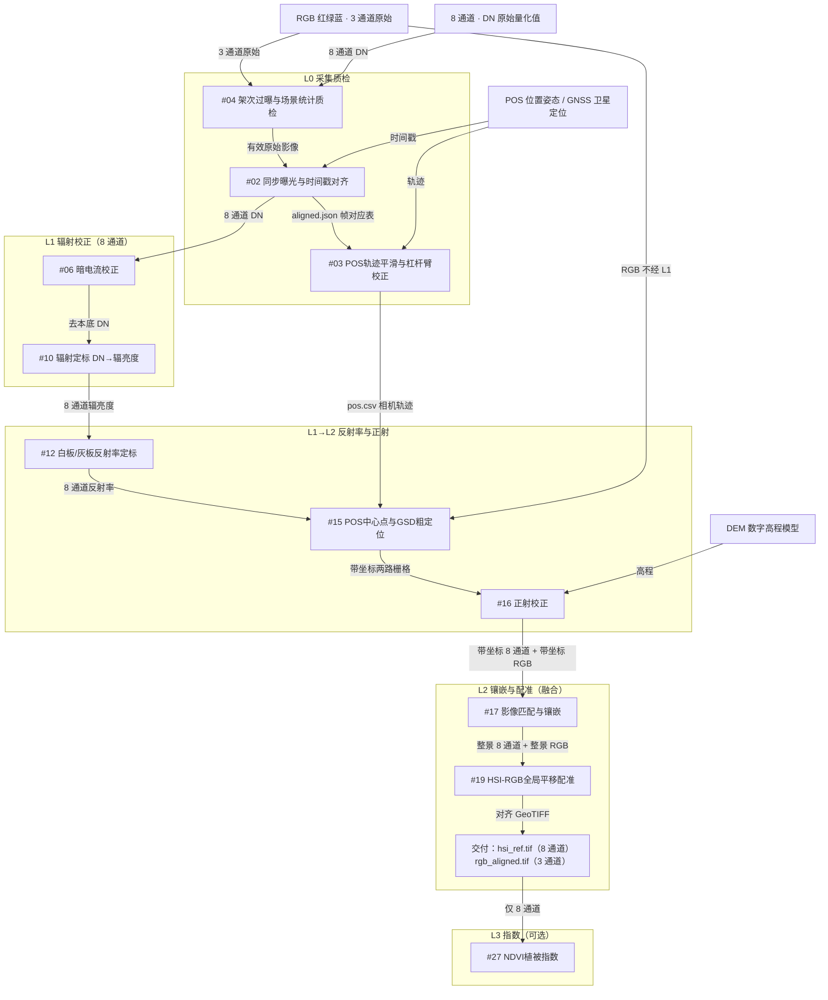

# RGB 与 8 通道数据融合

无人机双相机：可见光 RGB（红绿蓝真彩色）与 8 通道高光谱/多光谱。目标是将两路数据套合到同一地理格网。

**交付物：** 两张已对齐的 GeoTIFF（带地理坐标的栅格）。每个像元同时具备 3 个可见光通道与 8 个光谱通道。融合在 L2 由 **#19 HSI-RGB全局平移配准** 完成（HSI＝高光谱影像）。

**25 分钟 × 十几平方公里：** 套合网格取 8 通道地面分辨率（常见 0.2–0.5 m）、两路正射并行提交，#04/#06/#10/#12/#16/#17/#19 已改为抽检或分块流式与多线程。禁止把 8 通道重采样到厘米级 RGB。仍无空三，精度不是测绘级。

---

## 一、数据流程图

按 L0→L3 层级排列。箭头标注流出数据。

---

## 二、算法清单（含 25 分钟优化点）

建议墙钟：质检 2 分钟 · 两路正射镶嵌并行 16 分钟 · 统一网格 3 分钟 · 配准 3 分钟 · 写出 1 分钟。

| 层级 | 编号 | 算法名称 | 用途 | 输入 | 输出 | 25 分钟能否完成 | 需优化 |
| --- | --- | --- | --- | --- | --- | --- | --- |
| L0 | #04 | 架次过曝与场景统计质检 | 过曝与波段质量检查 | 原始 DN 立方体 | 质检报告 | 抽样可完成；全幅扫描会超时 | 分块/抽检，禁止整景载入内存 |
| L0 | #02 | 同步曝光与时间戳对齐 | 高光谱、RGB、POS 时间对齐 | 三路时间戳 | 帧对应表 | 能 | 否（硬件同步可跳过） |
| L0 | #03 | POS轨迹平滑与杠杆臂校正 | 轨迹平滑，位置归算到相机中心 | GNSS / POS | 相机中心轨迹 | 能 | 需接入双相机安装角标定，非耗时项 |
| L0→L1 | #06 | 暗电流校正 | 去除探测器本底（8 通道） | 8 通道 DN | 去本底 DN | 按航带处理可完成 | 按条带流式，禁止整测区一次读入 |
| L0→L1 | #10 | 辐射定标 DN→辐亮度 | DN 转为物理辐亮度（8 通道） | 8 通道 DN、定标系数 | 辐亮度立方体 | 按航带处理可完成 | 同 #06，逐条带乘系数 |
| L1→L2 | #12 | 白板/灰板反射率定标 | 8 通道转为反射率 | 辐亮度、白板 | 反射率立方体 | 按航带处理可完成 | 白板系数一次拟合，条带批处理 |
| L1→L2 | #15 | POS中心点与GSD粗定位 | 影像落到地图坐标（GSD＝地面采样距离） | 影像、中心经纬度 | 带坐标栅格 | 耗时不是问题，精度不够 | 不能替代正射；仅作粗定位 |
| L1→L2 | #16 | 正射校正 | 消除地形与姿态变形 | 影像、DEM、姿态 | 正射图 | **不能**（当前单片、整幅内存） | **必须优化：** 空三/多片、DEM 瓦片、GPU/多进程；与 RGB 并行；输出锁定 8 通道分辨率 |
| L2 | #17 | 影像匹配与镶嵌 | 多航带拼为整景 | 带坐标条带 | 镶嵌图 | **不能**（当前一次两条带、整幅内存） | **必须优化：** 多航带、地理瓦片羽化、COG/分块写出，禁止整景数组拼接 |
| L2 | #19 | HSI-RGB全局平移配准 | **融合：RGB 对齐到 8 通道网格** | 8 通道（主文件）、RGB（第二文件） | 8 通道参考图 + 对齐 RGB | **不能**（当前全区一次 FFT、仅一个平移） | **必须优化：** 先把 RGB 降到 8 通道格网再配；分块相位相关/仿射；边缘残差校核 |
| L3 | #27 | NDVI植被指数 | 套合后可选长势专题（NDVI＝归一化差值植被指数） | 对齐后的 8 通道 | 指数图 | 能（不计入 25 分钟套合验收） | 否；分块计算即可 |

**结论：** 时间瓶颈集中在 **#16 正射校正、#17 影像匹配与镶嵌、#19 HSI-RGB全局平移配准**。这三项不改为分块流式与并行正射，十几平方公里无法在 25 分钟内交付套合成果。#02 / #03 / #27 不是耗时项。
