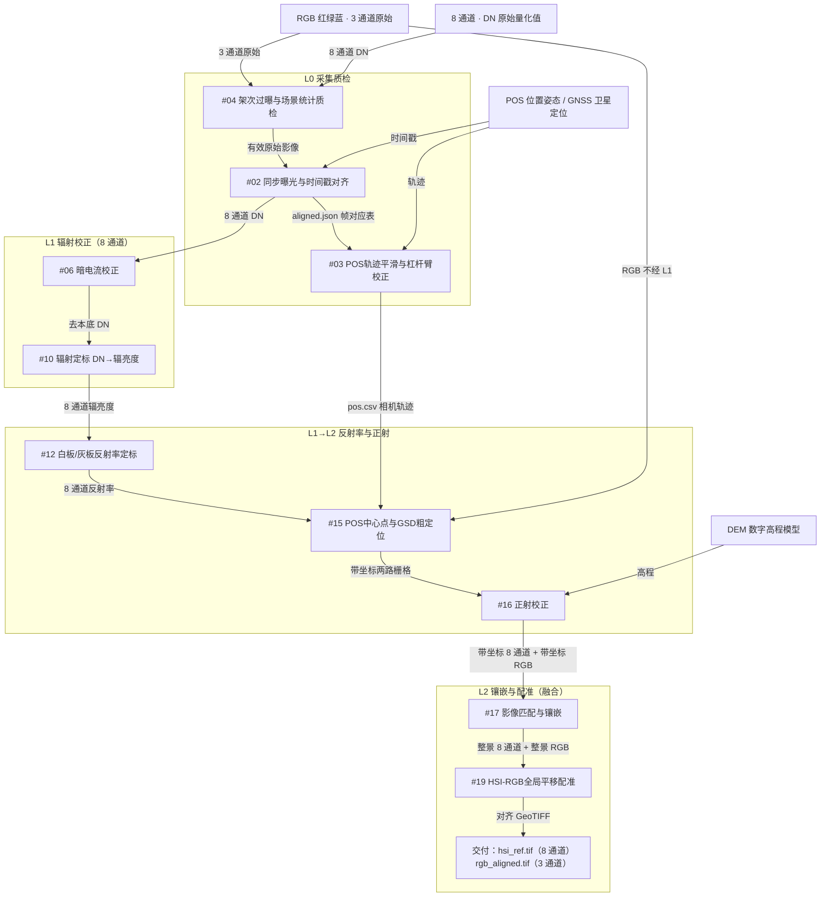

# RGB 与 8 通道数据融合

无人机双相机：可见光 RGB（红绿蓝真彩色）与 8 通道高光谱/多光谱。目标是将两路数据套合到同一地理格网。

**交付物：** 两张已对齐的 GeoTIFF（带地理坐标的栅格）。每个像元同时具备 3 个可见光通道与 8 个光谱通道。融合在 L2 由 **#19 HSI-RGB全局平移配准** 完成（HSI＝高光谱影像）。

---

## 一、数据流程图

按 L0→L2 层级排列。箭头标注流出数据。

---

## 二、算法清单

| 层级 | 编号 | 算法名称 | 用途 | 输入 | 输出 |
| --- | --- | --- | --- | --- | --- |
| L0 | #04 | 架次过曝与场景统计质检 | 过曝与波段质量检查 | 原始 DN 立方体 | 质检报告 |
| L0 | #02 | 同步曝光与时间戳对齐 | 高光谱、RGB、POS 时间对齐 | 三路时间戳 | 帧对应表 |
| L0 | #03 | POS轨迹平滑与杠杆臂校正 | 轨迹平滑，位置归算到相机中心 | GNSS / POS | 相机中心轨迹 |
| L0→L1 | #06 | 暗电流校正 | 去除探测器本底（8 通道） | 8 通道 DN | 去本底 DN |
| L0→L1 | #10 | 辐射定标 DN→辐亮度 | DN 转为物理辐亮度（8 通道） | 8 通道 DN、定标系数 | 辐亮度立方体 |
| L1→L2 | #12 | 白板/灰板反射率定标 | 8 通道转为反射率 | 辐亮度、白板 | 反射率立方体 |
| L1→L2 | #15 | POS中心点与GSD粗定位 | 影像落到地图坐标（GSD＝地面采样距离） | 影像、中心经纬度 | 带坐标栅格 |
| L1→L2 | #16 | 正射校正 | 消除地形与姿态变形 | 影像、DEM、姿态 | 正射图 |
| L2 | #17 | 影像匹配与镶嵌 | 多航带拼为整景 | 带坐标条带或 zip | 镶嵌图 |
| L2 | #19 | HSI-RGB全局平移配准 | **融合：RGB 对齐到 8 通道网格** | 8 通道（主文件）、RGB（第二文件） | 8 通道参考图 + 对齐 RGB |

#16 / #17 / #19 已支持分块、多线程（`workers`，0=按 CPU 核数）和磁盘流式写出。#17 zip 可不传 file2；#16 主文件可为多片 zip，RGB 可用 `gsd_out` 锁到 8 通道地面采样距离。仍无空三，#19 仍是全局平移。

建议墙钟（12 km²、GSD=0.3 m、16 线程、两路正射同时提交）：质检约 2 分钟 · 8 通道辐射+两路正射镶嵌并行约 16 分钟 · 配准约 3 分钟 · 写出约 1 分钟，合计落入 25 分钟。禁止把 8 通道拉到厘米级 RGB。精度不是测绘级正射。

---

## 备注：25 分钟完成需要哪些硬件

| 项目 | 建议配置 | 用途 |
| --- | --- | --- |
| CPU | 16 核及以上（建议 24–32 核） | RGB 与 8 通道正射、镶嵌分块并行 |
| GPU | NVIDIA，显存 ≥ 8 GB（建议 16 GB，支持 CUDA） | #16 重采样/正射加速 |
| 内存 | ≥ 64 GB（建议 128 GB） | 瓦片缓存与多进程；禁止整景立方体一次载入 |
| 磁盘 | NVMe SSD，顺序读写建议 ≥ 1 GB/s，可用空间按测区预留数倍 | 分块 COG 读写，避免机械盘拖死写出 |
| 采集侧 | 双相机时间同步（有则 #02 可跳过）、安装角/杠杆臂已标定、现场 DEM | 减少软件侧对齐与正射失败 |

时间瓶颈是 **#16 正射校正、#17 影像匹配与镶嵌、#19 HSI-RGB全局平移配准**。两路正射/镶嵌要同时提交两个任务（算法服务把计算放到线程池，不再堵死事件循环）。GPU 加速未接入，当前靠 CPU 多线程。
