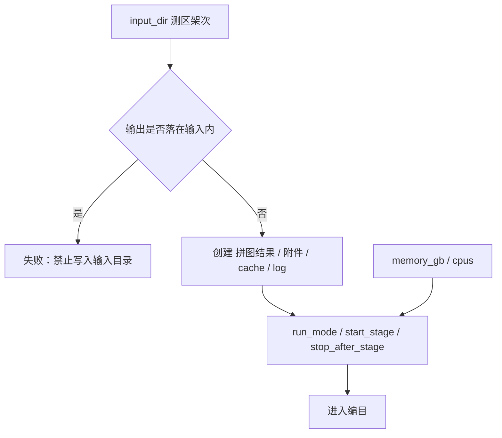
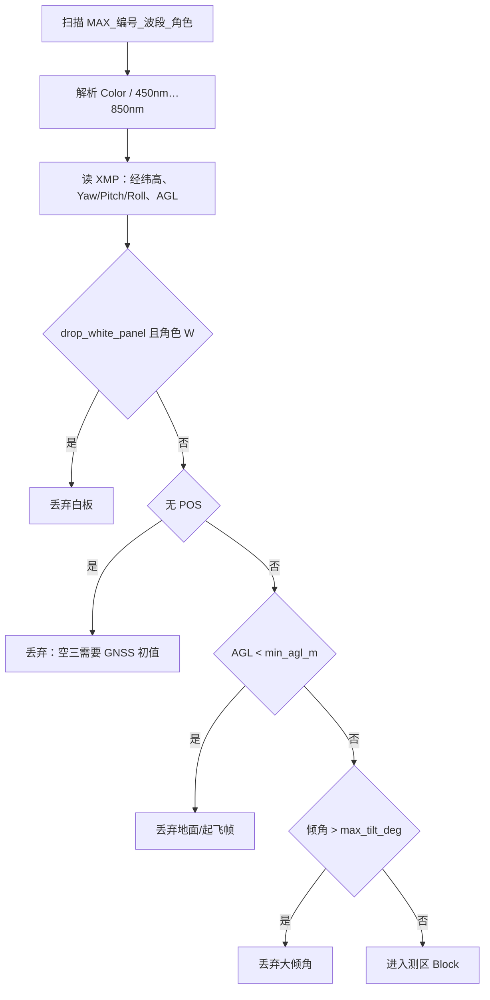
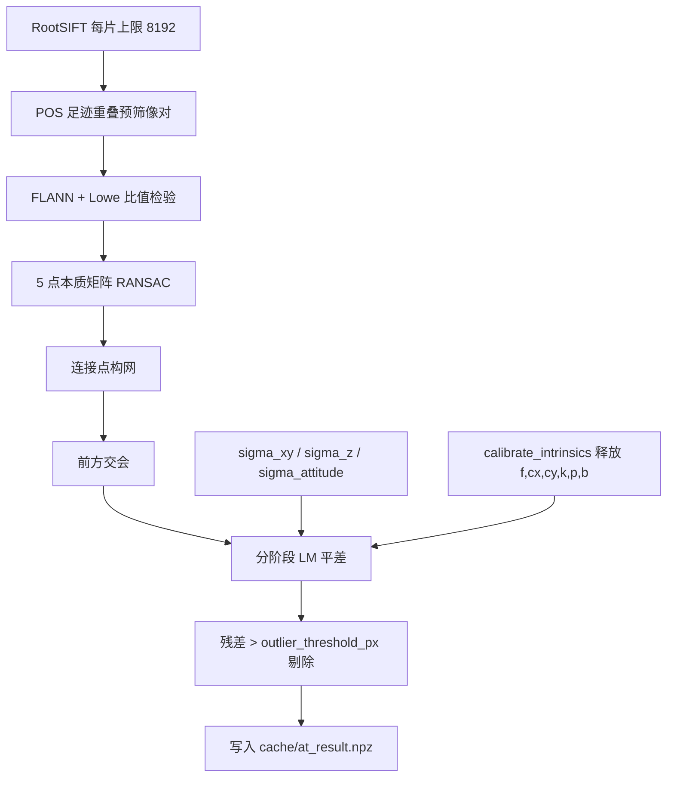
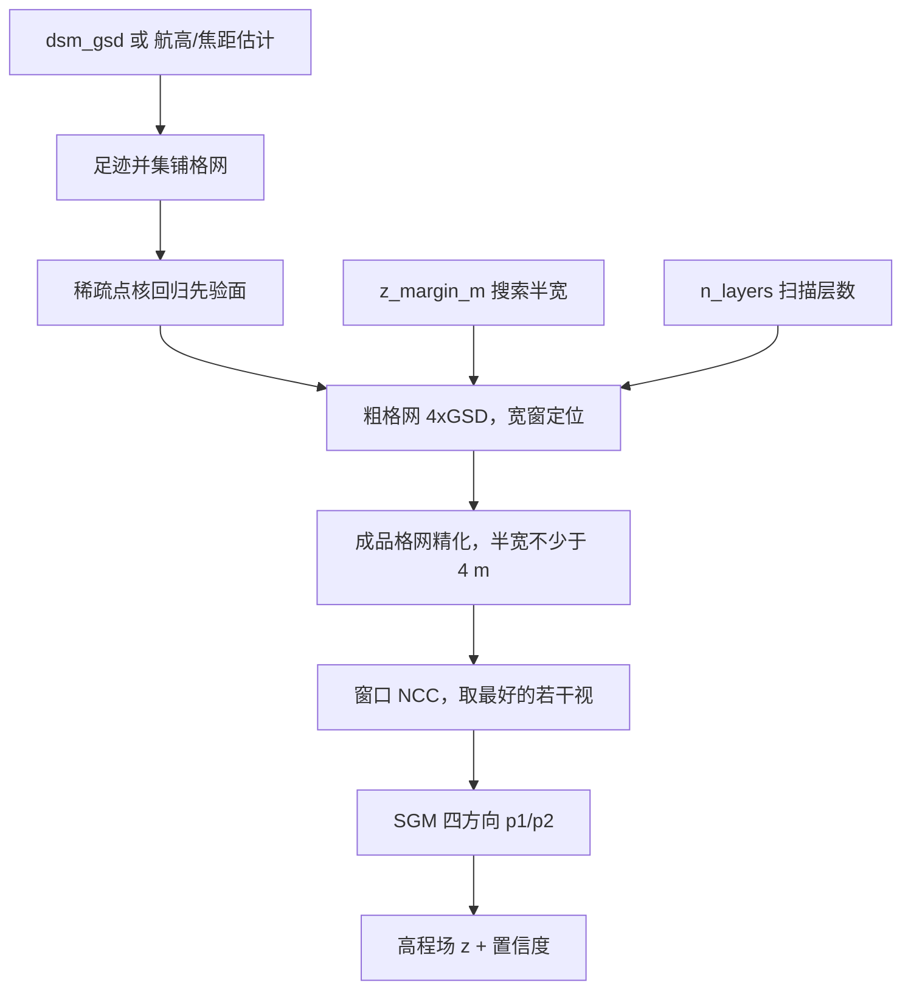
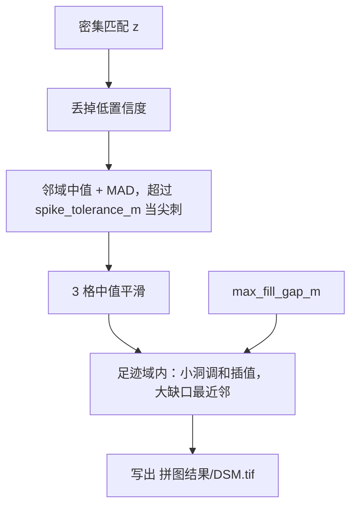
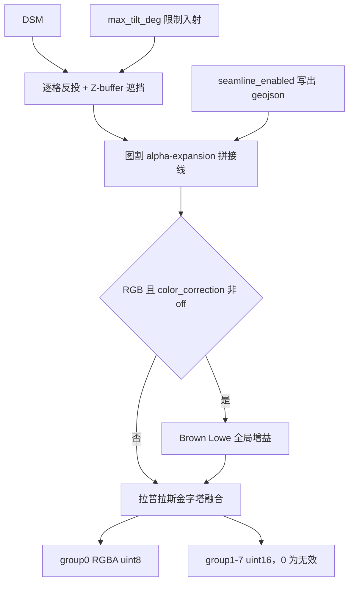
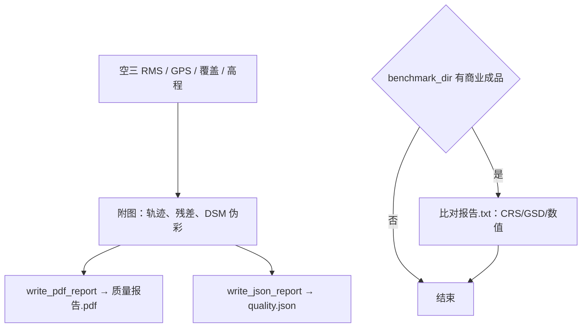

# 参数说明

处理方案里的每一项都会进管线。下面按进度条上的 **0～6 节点** 说明：节点做什么、用了哪些算法、参数对应哪一步、改大/改小/关闭会怎样。默认值对齐 LiMapper 报告与本测区实测，不是随手填的。

| 节点 | 阶段 | 算法主路径 |
| --- | --- | --- |
| 0 输入输出 | `S0_io` | 路径校验、目录约定、运行模式 |
| 1 影像编目 | `S1_catalog` | 文件名解析、POS 读取、白板/航高/倾角过滤 |
| 2 空三解算 | `S2_at` | RootSIFT → 比值检验 → 5 点 RANSAC → GNSS 约束平差 |
| 3 密集匹配 | `S3_dense` | 物方 2.5D 平面扫描 + NCC + SGM |
| 4 DSM 生成 | `S4_dsm` | 中值去尖、调和/最近邻补洞、写出 GeoTIFF |
| 5 正射镶嵌 | `S5_ortho` | DSM 真正射、图割拼接线、拉普拉斯融合 |
| 6 质量报告 | `S6_report` | 统计图、PDF/JSON、可选比对报告 |

---

## 0 输入输出

校验测区目录只读、成果写到输入树之外，并创建 `拼图结果/`、`附件/`、`cache/`、`log/`。不改影像内容。

### 算法

| 步骤 | 做法 | 为什么这样 |
| --- | --- | --- |
| 路径隔离 | 输出不得等于输入，也不得是输入的子目录 | 航摄目录只读，避免覆盖原始 JPG/TIF |
| 运行模式 | `full` 一次跑完；`until_stage` 停在指定节点；`step` 每阶段确认 | 便于从 DSM 后续跑、或逐步验收 |
| 资源封顶 | 并行度按 Docker 内存/CPU 下调 | 配再高也不会超出引擎上限 |

### 参数

| 参数 | 默认 | 作用 | 改大 / 打开 | 改小 / 关闭 / 留空 |
| --- | --- | --- | --- | --- |
| `input_dir` | 无（必填） | 航摄架次根目录，只扫描不写 | — | 指错目录会扫不到 `MAX_*_Color_D.jpg` |
| `output_dir` | 无（必填） | 本次任务输出根 | 换目录等于新任务，不覆盖旧成果 | 写进输入树会直接失败 |
| `cache_dir` | `{output}/cache/features` | RootSIFT 与空三检查点 | 指向已有缓存可跳过提特征 | 留空用默认；清空则空三重做 |
| `log_dir` | `{output}/log` | 文本日志 | 只改存放位置 | 留空用默认 |
| `process_dir` | `{output}/附件` | 拼接线、伪彩、KML | 只改存放位置 | 留空用默认 |
| `products_dir_name` | `拼图结果` | 成果子目录名 | 改名后下载路径跟着变 | 不要改，交付约定就是这个名字 |
| `run_mode` | `full` | 跑完全流程或中途停 | `until_stage`/`step` 用于分段验收 | 交付保持 `full` |
| `start_stage` | `S0_io` | 从哪一阶段开始 | 从 `S3_dense` 起须已有空三检查点；从 `S5_ortho` 起建议填 `reuse_dsm` | 往前开等于重算 |
| `stop_after_stage` | 空 | 跑完该阶段等待继续 | 填 `S4_dsm` 可先看 DSM 再决定是否正射 | `full` 时忽略 |
| `preset` | 空（通用） | 快捷覆盖 | `rgb_preview` 强制只跑 Color、全流程 | 通用=八波段 |
| `benchmark_dir` | 空 | 只写 `比对报告.txt`，不改出图 | 填商业 `拼图结果/` 做尺子 | 留空不比对 |
| `match_reference_color` | `false` | 把 RGB 低频套到参考图 | 打开等于抄颜色，合格主路径不要开 | 关闭才是算法自己的颜色 |
| `memory_gb` | `0` | 本任务内存预算，用来封顶进程数 | 配高不会多分内存，只放宽并行上限 | `0`=按引擎空闲内存自动封顶 |
| `cpus` | `0` | 本任务 CPU 核数 | 配高不会多给核 | `0`=按 Docker CPU 封顶 |

---

## 1 影像编目

按文件名识别曝光、波段、白板角色，读 XMP 里的 GNSS/IMU，丢掉不能进空三的帧。

### 算法

| 步骤 | 做法 | 出处 / 原因 |
| --- | --- | --- |
| 文件名 | `MAX_{编号}_{Color\\|波长nm}_{D\\|W}` | 与载荷命名一致 |
| POS | XMP 融合经纬高 + 姿态 | GNSS/INS 辅助 SfM，不做无 POS 增量重建 |
| 倾角 | 光轴偏离天底角 | LiMapper「最大倾斜角 60 度」 |
| 航高 | 相对起飞点 AGL | 低于 5 m 视为地面标定/无效 |

### 参数

| 参数 | 默认 | 作用 | 改大 / 打开 | 改小 / 关闭 |
| --- | --- | --- | --- | --- |
| `max_index` | 空 | 只扫文件名编号 ≤ 该值 | 变大覆盖更多曝光，更慢 | 变小只做局部调试；留空=全量 |
| `max_frames` | 空 | 过滤后最多用前 N 个可用曝光 | 变大覆盖更完整 | 变小拼图缺角、DSM 空洞多；交付留空 |
| `min_agl_m` | `5.0` | 低于此航高丢掉 | 变大：起飞/降落帧更多被扔，测区边缘可能缺影像 | 变小：可能把地面白板/滑行帧吃进空三，姿态乱 |
| `max_tilt_deg` | `60` | 超过此倾角丢掉 | 变大：侧视也能进网，接缝和正射遮挡更难 | 变小：可用片减少，航带边缘空洞 |
| `drop_white_panel` | `true` | 丢掉文件名 `_W` 白板 | 保持打开：白板是辐射定标不是地物 | 关闭会把高亮板当场景，匹配和外点暴增 |
| `require_pos` | `true` | 无 POS 的帧必须丢 | 打开才能给平差 GNSS 初值 | 关闭后仍会丢无 POS 帧：没有坐标无法建测区 |

---

## 2 空三解算

只在 **主波段 Color** 上提特征、匹配、平差；其它波段迁移外方位。GNSS/INS 当外方位初值，不做增量 SfM。

### 算法

| 步骤 | 做法 | 出处 |
| --- | --- | --- |
| 特征 | SIFT → RootSIFT（L1 再开方） | Lowe 2004；Arandjelović & Zisserman 2012 |
| 匹配 | kNN + ratio test + FLANN | Lowe；Muja & Lowe |
| 几何 | 5 点本质矩阵 + RANSAC | Nistér 2004 |
| 像对 | POS 足迹重叠，不用词袋 | *Remote Sens.* 2020, 12(3):351 |
| 相机 | Brown–Conrady + 仿射 b1/b2，10 参数 | Brown 1966；LiMapper 报告 |
| 平差 | Huber 核 + Schur 补稀疏 LM；GNSS 进法方程 | Triggs 1999；*Remote Sens.* 2021, 13(21):4222 |
| 外点 | 重投影 > 6 px 丢掉 | LiMapper 报告原文 |

### 参数

| 参数 | 默认 | 作用 | 改大 / 打开 | 改小 / 关闭 |
| --- | --- | --- | --- | --- |
| `primary_band` | `Color` | 只在此波段做匹配与平差 | 当前主路径固定 Color（纹理最丰富，对应组 0） | 改成多光谱会匹配变少，界面值暂不切换算法 |
| `workers_at` | `12` | 提特征 / 匹配进程数 | 变快，但内存按约 450 MB/进程涨；超预算会被自动下调 | 变慢；OOM 时可降到 4～8 |
| `sigma_xy_m` | `3.0` | GNSS 平面先验标准差（米） | 变大：更信影像、平面可能漂；适合 POS 很差 | 变小：更钉死 GPS。本批 XMP 写的是 3 m，再小会把真误差当约束拧变形 |
| `sigma_z_m` | `5.0` | GNSS 高程先验标准差（米） | 变大：高程更靠立体，碗状可能减轻 | 变小：高程被 GPS 拉住。本批 GPS Z RMSE 约 6 m，默认 5 已偏紧，不要再小于 3 |
| `sigma_attitude_deg` | `3.0` | IMU 姿态先验（度） | 变大：姿态更自由，弱纹理区可能抖 | 变小：更信云台。正下视数据默认 3° 够用 |
| `outlier_threshold_px` | `6.0` | 重投影超过该像素当外点 | 变大：留更多错匹配，接缝会花 | 变小：点更干净但可能剔光，平差失败。6 px 是报告口径 |
| `calibrate_intrinsics` | `true` | 分三阶段释放内参（先主点焦距，再 k1/k2，最后 k3/p/b） | 打开才能修厂家未给的畸变 | 关闭则内参钉死初值。本批 XMP 畸变全 0，关闭会出现边缘几何错位 |

---

## 3 密集匹配

在 DSM 格网上沿高程扫描，用多视 NCC + SGM 求每个格网点的 Z。类型是 **2.5D 高程场**，不是全 3D 点云。

### 算法

| 步骤 | 做法 | 出处 |
| --- | --- | --- |
| 格网 | DSM GSD = 中位航高 / f_px；正射为其一半 | Kraus；行业 DSM:正射 = 2:1 |
| 覆盖 | 相片足迹并集 + 闭运算修边 | Kraus 正射覆盖取足迹 |
| 立体 | 物方平面扫描 2.5D | Collins 1996；Gallup 2007；LiMapper「类型 2.5D」 |
| 分层 | 先粗 GSD 宽窗，再细格网精化 | Gallup；Scharstein & Szeliski |
| 半宽 | 稀疏点 p90−p10 的 1/4，夹在 8～48 m | 本测区起伏约 161 m，写死 ±12 m 会把树冠挡在窗外 |
| 代价 | NCC 窗口 7 + SGM | Hirschmüller 2008 |
| 复用 | `reuse_dsm` 跳过本节点 | 只重做正射时用 |

### 参数

| 参数 | 默认 | 作用 | 改大 / 打开 | 改小 / 关闭 / 留空 |
| --- | --- | --- | --- | --- |
| `dsm_gsd` | 空（自动） | DSM 地面分辨率（米），正射 = 一半 | 变大：图更粗、更快、文件更小 | 变小：更细但内存/时间平方涨。不要为对齐某份商业图手写 |
| `reuse_dsm` | 空 | 跳过立体，读已有 `DSM.tif` 并按足迹补洞 | 填路径后 S3 几乎为 0，适合只调正射 | 留空则重算密集匹配 |
| `n_layers` | `48` | 沿高程方向采样层数 | 变大：高程更细，更慢；64+ 收益很小 | 变小：台阶感、树冠被削。少于 24 明显糊 |
| `z_margin_m` | 空（按稀疏点估） | 搜索半宽（米） | 变大：能跟上陡坎/高树，更慢、更易配错弱纹理 | 变小：快，但真表面在窗外会整片错高。起伏大的测区不要小于 8 |
| `workers_dense` | 空（CPU−1，再按内存封顶） | 立体块进程数 | 变快，每进程约 2 GB 影像缓存 | 变小防 OOM；留空让系统按内存自动封顶 |

---

## 4 DSM 生成

把高程场做成可交付的 `DSM.tif`：去尖刺、补航带边缘空洞、LZW float32。

### 算法

| 步骤 | 做法 | 出处 |
| --- | --- | --- |
| 去尖 | 中值窗口 + 固定容差与局部 MAD 取大 | Kraus；稳健统计 |
| 平滑 | 3 格中值 | 压噪声、保陡坎 |
| 补洞 | 小洞 Laplace 调和；大缺口 EDT 最近邻；只在足迹内、跨度 ≤ 40 m | Numerical Recipes；Kraus 足迹覆盖 |

### 参数

| 参数 | 默认 | 作用 | 改大 | 改小 |
| --- | --- | --- | --- | --- |
| `spike_tolerance_m` | `2.5` | 相对邻域中值超过该高差视为噪声 | 变大：尖刺留下，屋顶/树尖更碎 | 变小：陡坡和树冠被削平。本测区 161 m 起伏下不要小于 1.5 |
| `max_fill_gap_m` | `40` | 足迹内允许填的最大缺口（米） | 变大：航带边缘更满，但可能把测区外“涂”进来 | 变小：边缘黑洞更多。40 m 对本测区 p99 缺口距离，小于商业图右下角游离斑间距 |

---

## 5 正射镶嵌

用 DSM 把每张影像反投到正射格网（真正射），图割选视角，拉普拉斯融合。RGB 可做全局曝光增益；多光谱不加增益以保辐射。

### 算法

| 步骤 | 做法 | 出处 |
| --- | --- | --- |
| 真正射 | DSM 逐格反投 | Kraus；Amhar 1998 |
| 遮挡 | 物方 Z-buffer 取近 | Habib 2018 |
| 拼接线 | 图割 α-expansion | Boykov 2001；Kwatra 2003 |
| 曝光 | 重叠区灰度最小二乘，**禁止按块** | Brown & Lowe, IJCV 2007 |
| 融合 | 拉普拉斯金字塔 + 重叠带羽化 | Burt & Adelson 1983；Szeliski |
| 颜色 | RGB 可增益；MS 强制禁用 | 商业报告「颜色校正：禁用」指多光谱 |

波段并发：先串行做 Color（拼接线以 RGB 为准），再按内存把多光谱波段并行（例如 3 波段 × 每波段 2 个块进程）。

### 参数

| 参数 | 默认 | 作用 | 改大 / 打开 | 改小 / 关闭 |
| --- | --- | --- | --- | --- |
| `bands` | 8 项全波段 | 要出图的波段列表 | 多加波段时间近似线性增加 | 只留 `Color` 即 RGB 预览，没有多光谱辐射产品 |
| `color_correction` | `off_for_ms` | RGB 是否做全局增益 | `on`/`off_for_ms`：RGB 接缝处亮度更匀；**多光谱始终不加增益** | `off`：RGB 也不增益，航带间可能一道亮一道暗 |
| `seamline_enabled` | `true` | 是否把拼接线写成 `附件/seamlines.geojson` | 打开便于质检谁覆盖了哪块 | 关闭仍内部做图割镶嵌，只是不写附件 |
| `workers_ortho` | 空（与内存封顶） | 正射分块进程数 | 变快，每进程约 2 GB | 变小防 OOM；多光谱并发时会再拆成「波段数 × 每波段进程」 |

---

## 6 质量报告

汇总空三残差、GPS 偏差、DSM 填充率、正射范围，写出 `质量报告.pdf` 和 `report/quality.json`。若填了 `benchmark_dir`，再写 `比对报告.txt`（不改已经出的图）。

### 参数

| 参数 | 默认 | 作用 | 打开 | 关闭 |
| --- | --- | --- | --- | --- |
| `write_pdf_report` | `true` | 生成 `质量报告.pdf` | 交付需要 | 关闭可略省时间，界面无法下载 PDF |
| `write_json_report` | `true` | 生成机器可读 JSON/Markdown | 便于二次统计 | 关闭不影响 GeoTIFF |

---

## 处理方案里怎么配

1. **新建方案**会带上参数字典全部默认值；保存时每个 key 都会写入模版。
2. **通用交付**：`run_mode=full`，`bands` 八波段，`calibrate_intrinsics=true`，`color_correction=off_for_ms`，`dsm_gsd` 留空，`match_reference_color=false`。
3. **RGB 快速预览**：预设会强制 `bands=["Color"]` 且全流程，立体和正射都只服务真彩色。
4. **只重做正射**：`start_stage=S5_ortho` 且填写 `reuse_dsm` 指向已有 `DSM.tif`，并保证 `cache/at_result.npz` 还在。
5. **改数值前先看本页「改大/改小」**：平面/高程先验、外点阈值、搜索半宽、尖刺容差都会直接改变几何或 DSM 形态；并行度只影响速度和是否 OOM，不改变算法口径。
