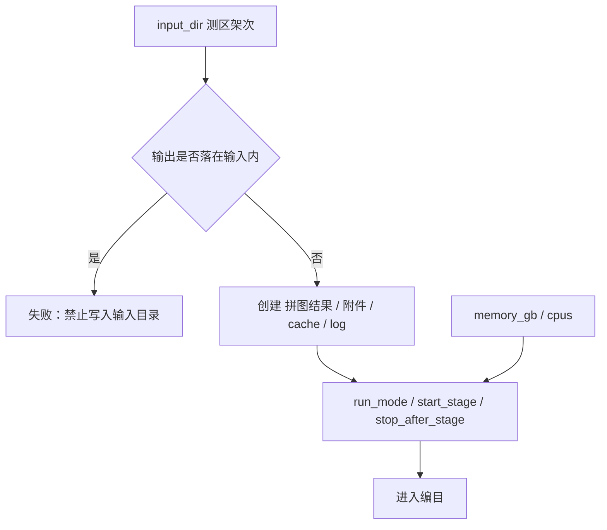
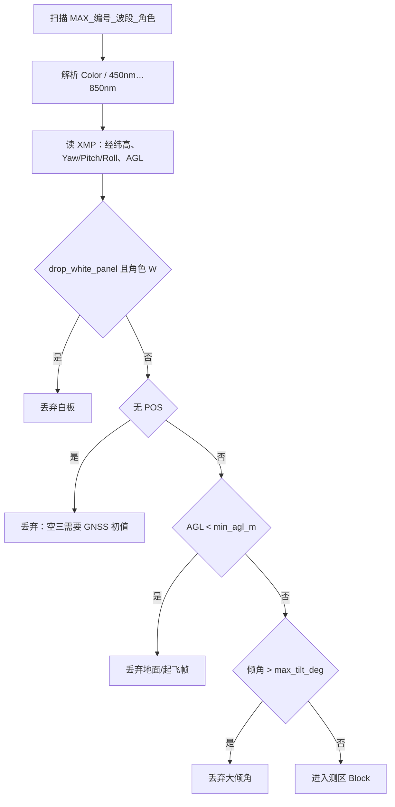
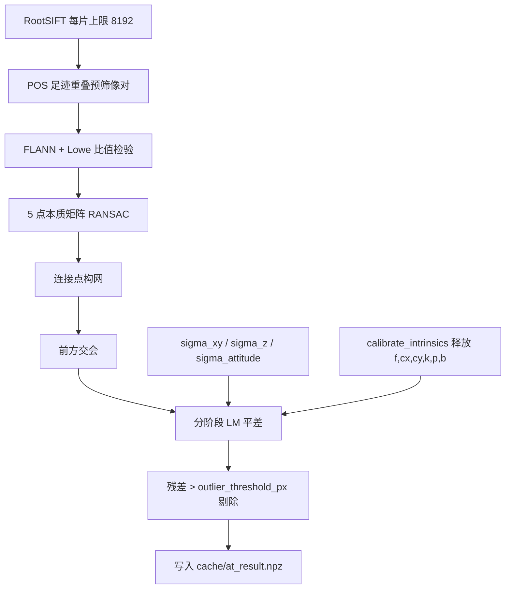
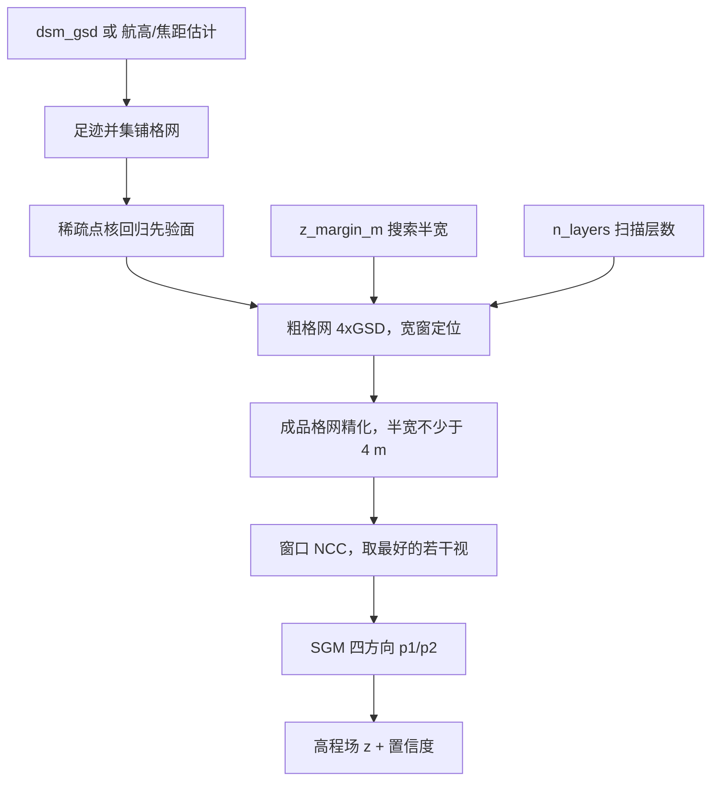
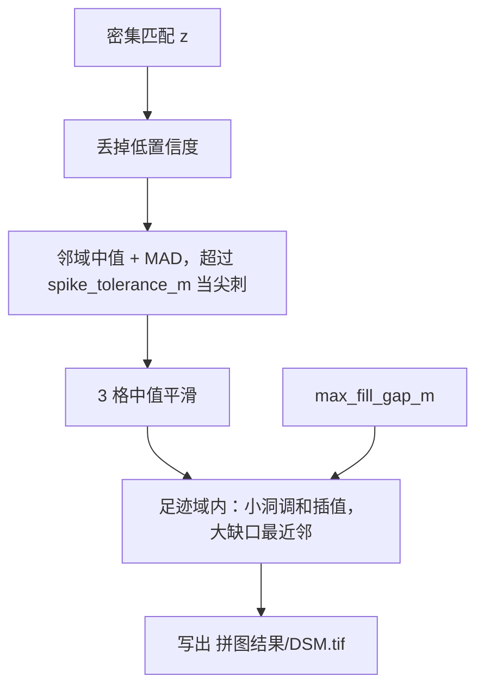
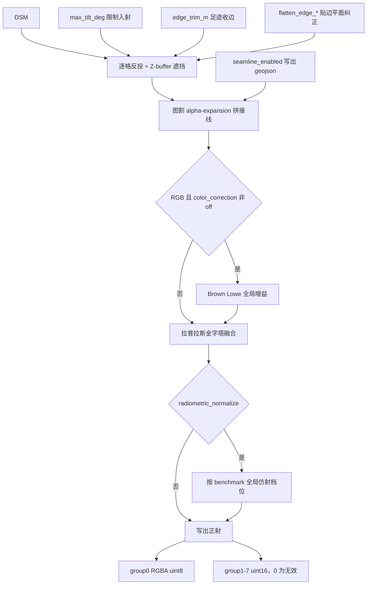
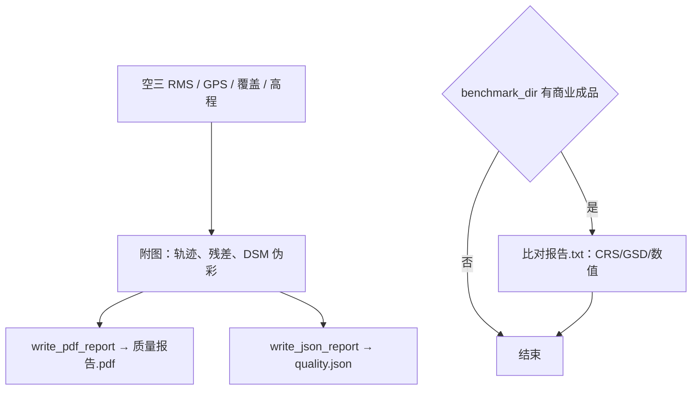

# 参数说明

处理方案里的每一项都会进管线。下面按进度条上的 **0～6 节点** 说明：节点做什么（先看白话）、用了哪些算法、参数对应哪一步、改大/改小/关闭会怎样。默认值对齐 LiMapper 报告与本测区实测，不是随手填的。CLI 旗标与下列 **key** 一一对应（`input_dir` → `--input-dir`），详见 `cli-usage.md`。

| 节点 | 阶段 | 白话（这一步在干什么） | 算法主路径 |
| --- | --- | --- | --- |
| 0 输入输出 | `S0_io` Input/Output | 核对「从哪读、写到哪」，建好输出文件夹，还不碰影像像素 | 路径校验、目录约定、运行模式 |
| 1 影像编目 | `S1_catalog` Catalog | 把航片点名入册，扔掉白板、贴地、大歪的废片 | 文件名解析、POS 读取、白板/航高/倾角过滤 |
| 2 空三解算 | `S2_at` Aerial Triangulation | 算出每张照片在天上的位置和朝向，以及地面稀疏三维点 | RootSIFT → 比值检验 → 5 点 RANSAC → GNSS 约束平差 |
| 3 密集匹配 | `S3_dense` Dense Matching | 用多张重叠照片「对立体」，给地面网格逐点估高程 | 物方 2.5D 平面扫描 + NCC + SGM |
| 4 DSM 生成 | `S4_dsm` Digital Surface Model | 把高程网格收拾干净，写成可交付的 DSM 地形文件 | 中值去尖、调和/最近邻补洞、写出 GeoTIFF |
| 5 正射镶嵌 | `S5_ortho` Orthomosaic | 按地形把照片「压平」到地图上，再拼成一张正射大图 | DSM 真正射、图割拼接线、拉普拉斯融合 |
| 6 质量报告 | `S6_report` Quality Report | 汇总精度、覆盖、高程，写出 PDF/JSON；可选和商业成品对表 | 统计图、PDF/JSON、可选比对报告 |

---

## 1 输入输出（S0_io · Input/Output）

> **白话：** 开跑前的「报到」。确认测区目录只能读、成果写到别处，并建好 `拼图结果/`、`附件/`、`cache/`、`log/`。**还不改任何一张影像的像素**，只定规矩和路径。

校验测区目录只读、成果写到输入树之外，并创建上述目录。各目录用途：

| 目录 | 存放 | 作用 |
| --- | --- | --- |
| `拼图结果/` | `DSM.tif`、RGB/多光谱正射 GeoTIFF | **主交付**，验收与下载看这里 |
| `附件/` | DSM 伪彩、测区 KML、拼接线 GeoJSON | 查看范围与接缝，非主成果 |
| `cache/` | 特征点、空三检查点 `at_result.npz` | 续跑复用，清空则空三重做 |
| `log/` | `run.log`、`control.json` | 进度、排障、暂停继续 |
| `report/` 与 `质量报告.pdf` | 统计图、JSON、PDF | 给人看的质量汇总 |
| `比对报告.txt` | 与商业成品对照（可选） | 只写报告，不改出图 |

**算法**

| 步骤 | 做法 | 为什么这样 |
| --- | --- | --- |
| 路径隔离 | 输出不得等于输入，也不得是输入的子目录 | 航摄目录只读，避免覆盖原始 JPG/TIF |
| 运行模式 | `full` 一次跑完；`until_stage` 停在指定节点；`step` 每阶段确认 | 便于从 DSM 后续跑、或逐步验收 |
| 资源封顶 | 并行度按 Docker 内存/CPU 下调 | 配再高也不会超出引擎上限 |

### 1.1 input_dir

无默认（必填）。航摄架次根目录，只扫描不写。指错目录会扫不到 `MAX_*_Color_D.jpg`。

### 1.2 output_dir

无默认（必填）。本次任务输出根。换目录等于新任务，不覆盖旧成果。写进输入树会直接失败。

### 1.3 cache_dir

默认 `{output}/cache/features`。RootSIFT 与空三检查点。指向已有缓存可跳过提特征；清空则空三重做。

### 1.4 log_dir

默认 `{output}/log`。文本日志，只改存放位置。

### 1.5 process_dir

默认 `{output}/附件`。拼接线、伪彩、KML。

### 1.6 products_dir_name

默认 `拼图结果`。成果子目录名。不要改，交付约定就是这个名字。

### 1.7 run_mode

默认 `full`。跑完全流程或中途停。`until_stage` / `step` 用于分段验收；交付保持 `full`。

### 1.8 start_stage

默认 `S0_io`。从哪一阶段开始。从 `S3_dense` 起须已有空三检查点；从 `S5_ortho` 起建议填 `reuse_dsm`。往前开等于重算。

### 1.9 stop_after_stage

默认空。跑完该阶段等待继续。填 `S4_dsm` 可先看 DSM 再决定是否正射。`full` 时忽略。

### 1.10 preset

默认空（通用）。`rgb_preview` 强制只跑 Color、全流程。通用 = 八波段。

### 1.11 benchmark_dir

默认空。只写 `比对报告.txt`，不改出图。填商业 `拼图结果/` 做尺子。

### 1.12 match_reference_color

默认 `false`。把 RGB 低频套到参考图。打开等于抄颜色，合格主路径不要开。

### 1.13 memory_gb

默认 `0`。本任务内存预算，用来封顶进程数。配高不会多分内存，只放宽并行上限。`0` = 按引擎空闲内存自动封顶。

### 1.14 cpus

默认 `0`。本任务 CPU 核数。配高不会多给核。`0` = 按 Docker CPU 封顶。

---

## 2 影像编目（S1_catalog · Catalog）

> **白话：** 给航片「点名入册」。看文件名知道是哪一曝光、哪个波段、是不是白板；读照片里的 GPS/姿态；把白板、贴地起飞、歪得太厉害的片子扔掉，剩下的才能进后面空三。

按文件名识别曝光、波段、白板角色，读 XMP 里的 GNSS/IMU，丢掉不能进空三的帧。

**算法**

| 步骤 | 做法 | 出处 / 原因 |
| --- | --- | --- |
| 文件名 | `MAX_{编号}_{Color\\|波长nm}_{D\\|W}` | 与载荷命名一致 |
| POS | XMP 融合经纬高 + 姿态 | GNSS/INS 辅助 SfM，不做无 POS 增量重建 |
| 倾角 | 光轴偏离天底角 | LiMapper「最大倾斜角 60 度」 |
| 航高 | 相对起飞点 AGL | 低于 5 m 视为地面标定/无效 |

### 2.1 max_index

默认空。只扫文件名编号 ≤ 该值。变大覆盖更多曝光、更慢；变小只做局部调试；留空 = 全量。

### 2.2 max_frames

默认空。过滤后最多用前 N 个可用曝光。变小拼图缺角、DSM 空洞多；交付留空。

### 2.3 min_agl_m

默认 `5.0`。低于此航高丢掉。变大：起飞/降落帧更多被扔；变小：可能把地面白板/滑行帧吃进空三。

### 2.4 max_tilt_deg

默认 `60`。超过此倾角丢掉。变大：侧视也能进网，接缝更难；变小：可用片减少，航带边缘空洞。

### 2.5 drop_white_panel

默认 `true`。丢掉文件名 `_W` 白板。保持打开：白板是辐射定标不是地物。关闭会把高亮板当场景。

### 2.6 require_pos

默认 `true`。无 POS 的帧必须丢。打开才能给平差 GNSS 初值。关闭后仍会丢无 POS 帧：没有坐标无法建测区。

---

## 3 空三解算（S2_at · Aerial Triangulation）

> **白话：** 搞清楚「飞机拍每张照片时站在哪、镜头朝哪」。在真彩色片上找同名点、连成网，再结合 GPS 把每张片的位置姿态算准，顺带得到地面稀疏三维点。其它波段不重复算，直接借用 Color 的姿态。

只在 **主波段 Color** 上提特征、匹配、平差；其它波段迁移外方位。GNSS/INS 当外方位初值，不做增量 SfM。

**算法**

| 步骤 | 做法 | 出处 |
| --- | --- | --- |
| 特征 | SIFT → RootSIFT（L1 再开方） | Lowe 2004；Arandjelović & Zisserman 2012 |
| 匹配 | kNN + ratio test + FLANN | Lowe；Muja & Lowe |
| 几何 | 5 点本质矩阵 + RANSAC | Nistér 2004 |
| 像对 | POS 足迹重叠，不用词袋 | *Remote Sens.* 2020, 12(3):351 |
| 相机 | Brown–Conrady + 仿射 b1/b2，10 参数 | Brown 1966；LiMapper 报告 |
| 平差 | Huber 核 + Schur 补稀疏 LM；GNSS 进法方程 | Triggs 1999；*Remote Sens.* 2021, 13(21):4222 |
| 外点 | 重投影 > 6 px 丢掉 | LiMapper 报告原文 |

### 3.1 primary_band

默认 `Color`。只在此波段做匹配与平差。主路径固定 Color（纹理最丰富，对应组 0）。

### 3.2 workers_at

默认 `12`。提特征 / 匹配进程数。变快但内存约 450 MB/进程；超预算会自动下调。OOM 时可降到 4～8。

### 3.3 sigma_xy_m

默认 `3.0`。GNSS 平面先验标准差（米）。变大更信影像；变小更钉死 GPS。本批 XMP 写的是 3 m，再小会把真误差当约束拧变形。

### 3.4 sigma_z_m

默认 `5.0`。GNSS 高程先验标准差（米）。本批 GPS Z RMSE 约 6 m，默认 5 已偏紧，不要再小于 3。

### 3.5 sigma_attitude_deg

默认 `3.0`。IMU 姿态先验（度）。正下视数据默认 3° 够用。

### 3.6 outlier_threshold_px

默认 `6.0`。重投影超过该像素当外点。6 px 是报告口径。变小可能剔光导致平差失败。

### 3.7 calibrate_intrinsics

默认 `true`。分三阶段释放内参。本批 XMP 畸变全 0，关闭会出现边缘几何错位。

---

## 4 密集匹配（S3_dense · Dense Matching）

> **白话：** 用多张重叠照片「对立体」，在地面铺一层细网格，网格上每个点估一个高度。得到的是 **高程场（2.5D）**，不是满屏飞点的三维点云。这一步最吃时间和内存。

在 DSM 格网上沿高程扫描，用多视 NCC + SGM 求每个格网点的 Z。类型是 **2.5D 高程场**，不是全 3D 点云。

**算法**

| 步骤 | 做法 | 出处 |
| --- | --- | --- |
| 格网 | DSM GSD = 中位航高 / f_px；正射为其一半 | Kraus；行业 DSM:正射 = 2:1 |
| 覆盖 | 相片足迹并集 + 闭运算修边 | Kraus 正射覆盖取足迹 |
| 立体 | 物方平面扫描 2.5D | Collins 1996；Gallup 2007；LiMapper「类型 2.5D」 |
| 分层 | 先粗 GSD 宽窗，再细格网精化 | Gallup；Scharstein & Szeliski |
| 半宽 | 稀疏点 p90−p10 的 1/4，夹在 8～48 m | 本测区起伏约 161 m，写死 ±12 m 会把树冠挡在窗外 |
| 代价 | NCC 窗口 7 + SGM | Hirschmüller 2008 |
| 复用 | `reuse_dsm` 跳过本节点 | 只重做正射时用 |

### 4.1 dsm_gsd

默认空（自动）。DSM 地面分辨率（米），正射 = 一半。变大图更粗、更快；变小更细但内存/时间平方涨。不要为对齐某份商业图手写。

### 4.2 reuse_dsm

默认空。跳过立体，读已有 `DSM.tif` 并按足迹补洞。填路径后 S3 几乎为 0，适合只调正射。

### 4.3 n_layers

默认 `48`。沿高程方向采样层数。64+ 收益很小；少于 24 明显糊。

### 4.4 z_margin_m

默认空（按稀疏点估）。搜索半宽（米）。起伏大的测区不要小于 8。

### 4.5 workers_dense

默认空（CPU−1，再按内存封顶）。立体块进程数。每进程约 2 GB 影像缓存。

---

## 5 DSM 生成（S4_dsm · Digital Surface Model）

> **白话：** 把上一步的「毛坯高程」收拾成可交付的地形图：去掉尖刺噪点，把能补的小洞补上，写成 `拼图结果/DSM.tif`。后面正射要踩在这张地形上。

把高程场做成可交付的 `DSM.tif`：去尖刺、补航带边缘空洞、LZW float32。

**算法**

| 步骤 | 做法 | 出处 |
| --- | --- | --- |
| 去尖 | 中值窗口 + 固定容差与局部 MAD 取大 | Kraus；稳健统计 |
| 平滑 | 3 格中值 | 压噪声、保陡坎 |
| 补洞 | 小洞 Laplace 调和；大缺口 EDT 最近邻；只在足迹内、跨度 ≤ 40 m | Numerical Recipes；Kraus 足迹覆盖 |

### 5.1 spike_tolerance_m

默认 `2.5`。相对邻域中值超过该高差视为噪声。本测区 161 m 起伏下不要小于 1.5。

### 5.2 max_fill_gap_m

默认 `40`。足迹内允许填的最大缺口（米）。40 m 对本测区 p99 缺口距离。

### 5.3 grid_reference

默认空。锁定交付格网：填参考成果目录（含 `DSM.tif`，可选正射）或单个 GeoTIFF，采用其 GSD/原点/宽高。留空则按航高/焦距估计。只锁格网，高程与颜色仍自算。

### 5.4 terrain_margin_lo_m

默认 `30`。DSM 合理高程带下余量（米）：空三点 p1 再往下留。林区洼地深或 GPS 噪声大时加大。

### 5.5 terrain_margin_hi_m

默认 `50`。DSM 合理高程带上余量（米）：空三点 p99 再往上留。树高/楼高超限会削顶，须加大。

### 5.6 terrain_min_half_span_m

默认 `80`。无空三参考时，DSM 中值 ± 半宽的下限（米）。平坦测区可减小。

---

## 6 正射镶嵌（S5_ortho · Orthomosaic）

> **白话：** 按 DSM 把斜着拍的照片「压平」到地图坐标上，再挑接缝、融颜色，拼成一张正射大图（RGB + 各光谱波段）。看见的最终拼图成果主要就在这一步出来。

用 DSM 把每张影像反投到正射格网（真正射），图割选视角，拉普拉斯融合。RGB 可做全局曝光增益；多光谱不加增益以保辐射。

**算法**

| 步骤 | 做法 | 出处 |
| --- | --- | --- |
| 真正射 | DSM 逐格反投 | Kraus；Amhar 1998 |
| 遮挡 | 物方 Z-buffer 取近 | Habib 2018 |
| 贴边 | 距 nodata 带宽内改用块平均面 | Amhar 1998；错误 DSM 上真正射更差 |
| 拼接线 | 图割 α-expansion | Boykov 2001；Kwatra 2003 |
| 曝光 | 重叠区灰度最小二乘，**禁止按块** | Brown & Lowe, IJCV 2007 |
| 融合 | 拉普拉斯金字塔 + 重叠带羽化 | Burt & Adelson 1983；Szeliski |
| 颜色 | RGB 可增益；MS 强制禁用 | 商业报告「颜色校正：禁用」指多光谱 |
| 辐射档 | 可选相对参考的全局仿射 | Hall et al. 1991 |

波段并发：先串行做 Color（拼接线以 RGB 为准），再按内存把多光谱波段并行（例如 3 波段 × 每波段 2 个块进程）。

### 6.1 bands

默认 8 项全波段。要出图的波段列表。只留 `Color` 即 RGB 预览，没有多光谱辐射产品。

### 6.2 color_correction

默认 `off_for_ms`。RGB 是否做全局增益。多光谱始终不加增益。`off` 时 RGB 航带间可能一道亮一道暗。

### 6.3 seamline_enabled

默认 `true`。是否把拼接线写成 `附件/seamlines.geojson`。关闭仍内部做图割镶嵌，只是不写附件。

### 6.4 workers_ortho

默认空（与内存封顶）。正射分块进程数。每进程约 2 GB。

### 6.5 edge_trim_m

默认 `0`。交付覆盖从相片足迹外缘往里收的米数。本测区商业有效区往往不比足迹小，默认不收边；外沿观感靠贴边平面纠正。

### 6.6 flatten_edge_win_m

默认 `40`。贴边平面纠正的块平均窗口（米）。错误 DSM 边缘上真正射会呈油彩波纹，改用局部水平面采样。只影响正射，不改交付 DSM。

### 6.7 flatten_edge_band_m

默认 `80`。贴边纠正带宽（米）：距 nodata 这么远才改用块平均面，内部仍真正射。

### 6.8 radiometric_normalize

默认 `false`。按 `benchmark_dir` 参考成果做全局仿射辐射归一化（每波段 gain/offset），只改档位不动纹理。须同时填 `benchmark_dir`。合格主路径可按对标需要开启。

---

## 7 质量报告（S6_report · Quality Report）

> **白话：** 收尾写报告：空三准不准、覆盖够不够、高程和正射范围如何，汇总成 PDF/JSON。若填了商业对照目录，再写一份「和商业成品差多少」的 `比对报告.txt`——**只写字不改图**。

汇总空三残差、GPS 偏差、DSM 填充率、正射范围，写出 `质量报告.pdf` 和 `report/quality.json`。若填了 `benchmark_dir`，再写 `比对报告.txt`（不改已经出的图）。

### 7.1 write_pdf_report

默认 `true`。生成 `质量报告.pdf`。交付需要；关闭可略省时间，界面无法下载 PDF。

### 7.2 write_json_report

默认 `true`。生成机器可读 JSON/Markdown。关闭不影响 GeoTIFF。

---

## 处理方案里怎么配

1. **新建方案**会带上参数字典全部默认值；保存时每个 key 都会写入模版。
2. **通用交付**：`run_mode=full`，`bands` 八波段，`calibrate_intrinsics=true`，`color_correction=off_for_ms`，`dsm_gsd` 留空，`match_reference_color=false`。
3. **RGB 快速预览**：预设会强制 `bands=["Color"]` 且全流程，立体和正射都只服务真彩色。
4. **只重做正射**：`start_stage=S5_ortho` 且填写 `reuse_dsm` 指向已有 `DSM.tif`，并保证 `cache/at_result.npz` 还在。
5. **改数值前先看本页「改大/改小」**：平面/高程先验、外点阈值、搜索半宽、尖刺容差都会直接改变几何或 DSM 形态；并行度只影响速度和是否 OOM，不改变算法口径。
