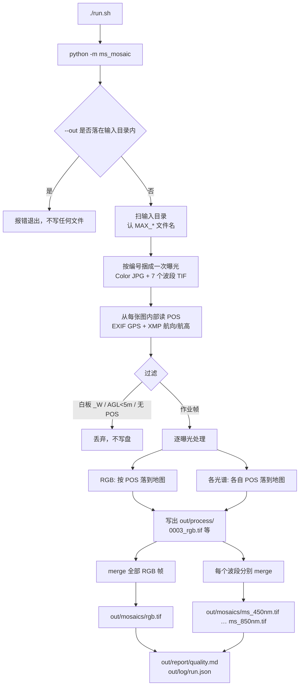
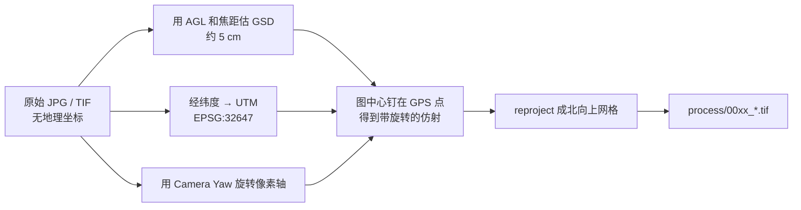
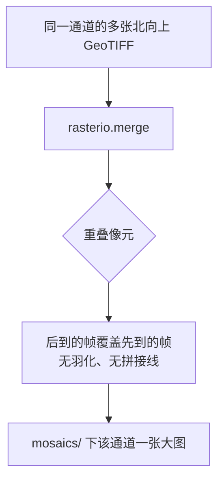

# 多光谱拼图执行流程

当前实现：`POS 直接地理定位 + 北向上重投影 + merge`。  
入口：`./run.sh` → `python -m ms_mosaic` → `run_mosaic()`。  
原始 `MAX_*` 目录只读，成果只写 `--out`。

## 总流程



## 单帧如何落到地图（process/ 里的 GeoTIFF）



地面按水平面处理，不用 DEM，也没有空三。

## 镶嵌（mosaics/ 里的大图）



RGB 和 7 个光谱是 8 次独立镶嵌，波段之间不做特征配准。

## 目录对应关系

```text
--input  MAX_20251017_001/     只读原始影像
--out
  process/                     中途：每一曝光、每一通道的正射单帧
  mosaics/                     结果：拼好的 RGB + 7 个光谱大图
  report/quality.md            人看的摘要
  log/run.json                 同样内容的日志
```
