# 高光谱分类小模型一览（领导精简版 · Markdown 审阅稿）

> 生成时间：2026-07-28 11:35  
> 模型数：87  
> 状态：**先 Markdown 审阅/修改，确认后再转 Word**  
> 原则：类别明细全展开；输入按模型真实数据集区分；无原始文件则标明，不用别的数据顶替。

---

## 目录

1. [30秒读懂](#1-30秒读懂)
2. [人工下载地址与保存路径](#2-人工下载地址与保存路径重要)
3. [公开数据集类别总表](#3-公开数据集类别总表完整明细)
4. [模型总览表](#4-模型总览表)
5. [分模型详述](#5-分模型详述)
6. [附录](#6-附录)

---

## 1. 30秒读懂

这些模型做的事：输入一张**高光谱影像**（每个像素有几十到上百个窄波段），输出一张**地物分类彩图**（一种颜色一类地物）。

领导/学习时重点看三件事：

1. **能识别什么**：具体到每一类地物名称（不是只写“16类”）
2. **输入/输出示例**：该模型对应哪些真实数据；图在 `_demo_figs/`
3. **典型用途**：适合什么业务场景

仓库已有可演示原始数据：

- `HSI_data/Indian_pines_corrected.mat`（影像立方体 145×145×200）
- `HSI_data/Indian_pines_gt.mat`（标签，0=未标注，1–16=地物）

预览图示例：

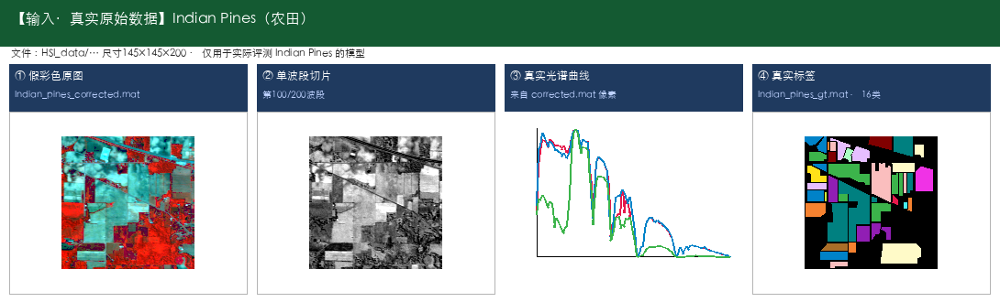

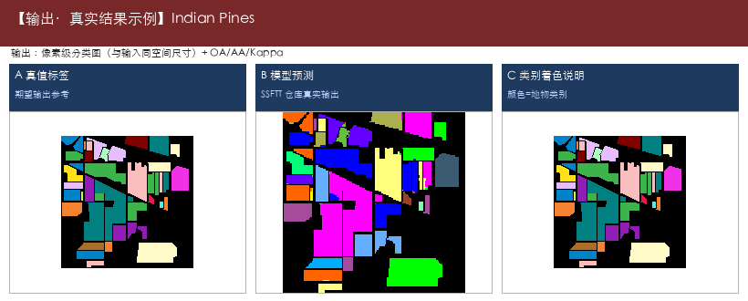

---

## 2. 人工下载地址与保存路径（重要）

因外网自动下载常失败，请手工下载。更完整清单见：[`数据集人工下载清单.md`](数据集人工下载清单.md)

**统一保存根目录：** `/Users/jiangshengping/wwwroot/shenzhen/spectrum/small_models/Hyperspectral-Image-Classification-Models/_raw_datasets`

| 数据 | 保存路径 | 下载地址 |
|------|----------|----------|
| Indian Pines 影像 | `HSI_data/Indian_pines_corrected.mat`（已有） | https://www.ehu.eus/ccwintco/uploads/6/67/Indian_pines_corrected.mat |
| Indian Pines 标签 | `HSI_data/Indian_pines_gt.mat`（已有） | https://www.ehu.eus/ccwintco/uploads/c/c4/Indian_pines_gt.mat |
| PaviaU 影像 | `_raw_datasets/PaviaU.mat` | https://github.com/gokriznastic/HybridSN/raw/master/data/PaviaU.mat （国内可走 https://ghproxy.net/https://raw.githubusercontent.com/gokriznastic/HybridSN/master/data/PaviaU.mat ） |
| PaviaU 标签 | `_raw_datasets/PaviaU_gt.mat` | https://github.com/gokriznastic/HybridSN/raw/master/data/PaviaU_gt.mat （国内可走 https://ghproxy.net/https://raw.githubusercontent.com/gokriznastic/HybridSN/master/data/PaviaU_gt.mat ） |
| Pavia Centre 影像 | `_raw_datasets/Pavia.mat` | https://huggingface.co/datasets/danaroth/pavia/resolve/main/Pavia.mat （国内推荐 https://hf-mirror.com/datasets/danaroth/pavia/resolve/main/Pavia.mat ） |
| Pavia Centre 标签 | `_raw_datasets/Pavia_gt.mat` | https://huggingface.co/datasets/danaroth/pavia/resolve/main/Pavia_gt.mat （国内推荐 https://hf-mirror.com/datasets/danaroth/pavia/resolve/main/Pavia_gt.mat ） |
| Salinas 影像 | `_raw_datasets/Salinas_corrected.mat` | https://www.ehu.eus/ccwintco/uploads/a/a3/Salinas_corrected.mat |
| Salinas 标签 | `_raw_datasets/Salinas_gt.mat`（已有） | https://www.ehu.eus/ccwintco/uploads/f/fa/Salinas_gt.mat |
| Botswana 影像 | `_raw_datasets/Botswana.mat` | https://hf-mirror.com/datasets/danaroth/botswana/resolve/main/Botswana.mat |
| Botswana 标签 | `_raw_datasets/Botswana_gt.mat` | https://hf-mirror.com/datasets/danaroth/botswana/resolve/main/Botswana_gt.mat |
| KSC 影像 | `_raw_datasets/KSC.mat` | https://hf-mirror.com/datasets/danaroth/kennedy_space_center/resolve/main/KSC.mat |
| KSC 标签 | `_raw_datasets/KSC_gt.mat` | https://ghproxy.net/https://raw.githubusercontent.com/qiangge666666/MAAN/master/KSC_gt.mat |
| Houston2018（优先） | `_raw_datasets/Houston2018/houstonU2018.mat` | 百度网盘：https://pan.baidu.com/s/1hnVsruXw1QozOeUVh8Fymw?pwd=UIST （提取码 UIST；详见下载清单 §7） |
| Houston2013 | `_raw_datasets/Houston2013/` | 官方申请：https://machinelearning.ee.uh.edu/2013-ieee-grss-data-fusion-contest/ （非单文件直链） |

**总入口（原站）：** https://www.ehu.eus/ccwintco/index.php/Hyperspectral_Remote_Sensing_Scenes  
说明：原站 `uploads/*.mat` 直链目前多为 **403 Forbidden**。  
- PaviaU / Salinas：优先 GitHub HybridSN（见上表；国内可加 `ghproxy.net`）  
- Pavia Centre：HybridSN 无此数据，请用 Hugging Face `danaroth/pavia`（国内推荐 `hf-mirror.com`）  
- Botswana：影像和标签都用 HF `danaroth/botswana`（国内推荐 `hf-mirror.com`）
- KSC：影像用 HF `danaroth/kennedy_space_center`；标签用 GitHub `qiangge666666/MAAN`（HybridSN/HF 均无 gt）

**推荐镜像：**  
- HybridSN：https://github.com/gokriznastic/HybridSN/tree/master/data  
- Pavia（含 Centre + University）：https://huggingface.co/datasets/danaroth/pavia  
- Botswana：https://huggingface.co/datasets/danaroth/botswana  
- KSC：https://huggingface.co/datasets/danaroth/kennedy_space_center + https://github.com/qiangge666666/MAAN  

下载完成后告诉我，可再刷新各模型真实立方体预览图。

---

## 3. 公开数据集类别总表（完整明细）

### Indian Pines｜农田作物与植被（印第安纳松）｜16类

- **规格：** 145×145，常用200波段，光谱约0.4–2.5μm（400–2500nm）
- **类别明细：**

  - 1. 苜蓿（Alfalfa）
  - 2. 玉米-非耕（Corn-notill）
  - 3. 玉米-少耕（Corn-mintill）
  - 4. 玉米（Corn）
  - 5. 牧草-牧场（Grass-pasture）
  - 6. 牧草-树木（Grass-trees）
  - 7. 牧草-已刈（Grass-pasture-mowed）
  - 8. 干草堆/干草仓库（Hay-windrowed）
  - 9. 燕麦（Oats）
  - 10. 大豆-非耕（Soybean-notill）
  - 11. 大豆-少耕（Soybean-mintill）
  - 12. 大豆干净（Soybean-clean）
  - 13. 小麦（Wheat）
  - 14. 树林（Woods）
  - 15. 建筑-草-树-车道（Buildings-Grass-Trees-Drives）
  - 16. 石钢塔（Stone-Steel-Towers）

### Salinas｜农业区蔬菜/葡萄园/裸土｜16类

- **规格：** 512×217，常用204波段
- **类别明细：**

  - 1. 西兰花绿杂草1（Brocoli_green_weeds_1）
  - 2. 西兰花绿杂草2（Brocoli_green_weeds_2）
  - 3. 休耕地（Fallow）
  - 4. 休耕地-粗耕（Fallow_rough_plow）
  - 5. 休耕地-平整（Fallow_smooth）
  - 6. 茬地（Stubble）
  - 7. 芹菜（Celery）
  - 8. 葡萄园-未修剪（Grapes_untrained）
  - 9. 葡萄园发育土壤（Soil_vinyard_develop）
  - 10. 玉米衰老绿杂草（Corn_senesced_green_weeds）
  - 11. 生菜长叶4周（Lettuce_romaine_4wk）
  - 12. 生菜长叶5周（Lettuce_romaine_5wk）
  - 13. 生菜长叶6周（Lettuce_romaine_6wk）
  - 14. 生菜长叶7周（Lettuce_romaine_7wk）
  - 15. 葡萄园-未修剪2（Vinyard_untrained）
  - 16. 葡萄园-垂直棚架（Vinyard_vertical_trellis）

### Pavia University｜城市道路/建筑/植被｜9类

- **规格：** 610×340（常用），约103波段
- **类别明细：**

  - 1. 沥青路面（Asphalt）
  - 2. 草地/草甸（Meadows）
  - 3. 砾石（Gravel）
  - 4. 树木（Trees）
  - 5. 涂装金属板（Painted metal sheets）
  - 6. 裸土（Bare Soil）
  - 7. 柏油（Bitumen）
  - 8. 自锁砖块（Self-Blocking Bricks）
  - 9. 阴影（Shadows）

### Pavia Centre｜城市中心地物｜9类

- **规格：** 约1096×715有效区，约102波段
- **类别明细：**

  - 1. 水体（Water）
  - 2. 树木（Trees）
  - 3. 沥青（Asphalt）
  - 4. 自锁砖块（Self-Blocking Bricks）
  - 5. 柏油（Bitumen）
  - 6. 瓦片（Tiles）
  - 7. 阴影（Shadows）
  - 8. 草地/草甸（Meadows）
  - 9. 裸土（Bare Soil）

### Kennedy Space Center (KSC)｜海岸湿地植被与土地覆盖｜13类

- **规格：** 常用176波段，400–2500nm
- **类别明细：**

  - 1. 灌木丛（Scrub）
  - 2. 柳栎沼泽（Willow swamp）
  - 3. CP旱地树丛（CP hammock）
  - 4. 湿地松（Slash pine）
  - 5. 橡树/阔叶（Oak/Broadleaf）
  - 6. 硬木（Hardwood）
  - 7. 沼泽（Swamp）
  - 8. 禾本沼泽（Graminoid marsh）
  - 9. 米草沼泽（Spartina marsh）
  - 10. 香蒲沼泽（Cattail marsh）
  - 11. 盐沼（Salt marsh）
  - 12. 泥滩（Mud flats）
  - 13. 水体（Water）

### Botswana｜三角洲沼泽/林地｜14类

- **规格：** 常用145波段，400–2500nm
- **类别明细：**

  - 1. 水体（Water）
  - 2. 河马草（Hippo grass）
  - 3. 洪泛平原草地1（Floodplain grasses1）
  - 4. 洪泛平原草地2（Floodplain grasses2）
  - 5. 芦苇1（Reeds1）
  - 6. 河岸带（Riparian）
  - 7. 火烧迹地（Firescar2）
  - 8. 岛屿内部（Island interior）
  - 9. 金合欢林地（Acacia woodlands）
  - 10. 金合欢灌丛（Acacia shrublands）
  - 11. 金合欢草地（Acacia grasslands）
  - 12. 矮mopane（Short mopane）
  - 13. 混交mopane（Mixed mopane）
  - 14. 裸露土壤（Exposed soils）

### Houston｜城市精细地物｜15类

- **规格：** IEEE GRSS 城市场景（常见 Houston 2013 设定）
- **类别明细：**

  - 1. 健康草地（Healthy grass）
  - 2. 胁迫草地（Stressed grass）
  - 3. 合成草地（Synthetic grass）
  - 4. 树木（Trees）
  - 5. 土壤（Soil）
  - 6. 水体（Water）
  - 7. 居民区（Residential）
  - 8. 商业区（Commercial）
  - 9. 道路（Road）
  - 10. 高速公路（Highway）
  - 11. 铁路（Railway）
  - 12. 停车场1（Parking Lot 1）
  - 13. 停车场2（Parking Lot 2）
  - 14. 网球场（Tennis Court）
  - 15. 跑道（Running Track）

### Houston2013｜城市精细地物（Houston 2013）｜15类

- **规格：** 2013 IEEE GRSS Data Fusion Contest
- **类别明细：**

  - 1. 健康草地（Healthy grass）
  - 2. 胁迫草地（Stressed grass）
  - 3. 合成草地（Synthetic grass）
  - 4. 树木（Trees）
  - 5. 土壤（Soil）
  - 6. 水体（Water）
  - 7. 居民区（Residential）
  - 8. 商业区（Commercial）
  - 9. 道路（Road）
  - 10. 高速公路（Highway）
  - 11. 铁路（Railway）
  - 12. 停车场1（Parking Lot 1）
  - 13. 停车场2（Parking Lot 2）
  - 14. 网球场（Tennis Court）
  - 15. 跑道（Running Track）

### Houston2018｜城市精细地物（Houston 2018）｜20类

- **规格：** 2018 IEEE GRSS Data Fusion Contest（以官方说明为准）
- **类别明细：**

  - 1. Healthy grass（健康草地）
  - 2. Stressed grass（胁迫草地）
  - 3. Artificial turf（人造草皮）
  - 4. Evergreen trees（常绿树）
  - 5. Deciduous trees（落叶树）
  - 6. Bare earth（裸地）
  - 7. Water（水体）
  - 8. Residential buildings（居民建筑）
  - 9. Non-residential buildings（非居民建筑）
  - 10. Roads（道路）
  - 11. Sidewalks（人行道）
  - 12. Crosswalks（人行横道）
  - 13. Major thoroughfares（主干道）
  - 14. Highways（高速公路）
  - 15. Railways（铁路）
  - 16. Paved parking lots（铺装停车场）
  - 17. Unpaved parking lots（未铺装停车场）
  - 18. Cars（车辆）
  - 19. Trains（火车）
  - 20. Stadium seats（体育场座席）

### Trento｜城郊地物（常配合 LiDAR）｜6类

- **规格：** 多源 HSI+LiDAR
- **类别明细：**

  - 1. 苹果树（Apple trees）
  - 2. 建筑（Buildings）
  - 3. 地面（Ground）
  - 4. 木材（Woods）
  - 5. 葡萄园（Vineyard）
  - 6. 道路（Roads）

### MUUFL｜校园/城市地物（常配合 LiDAR）｜11类

- **规格：** 多源 HSI+LiDAR
- **类别明细：**

  - 1. 树木（Trees）
  - 2. 多为草地（Mostly grass）
  - 3. 混合地物（Mixed ground surface）
  - 4. 裸土/沙地（Dirt and sand）
  - 5. 道路（Road）
  - 6. 水体（Water）
  - 7. 建筑旁阴影（Building shadow）
  - 8. 建筑（Building）
  - 9. 人行道（Sidewalk）
  - 10. 黄色路缘（Yellow curb）
  - 11. 布质遮盖物（Cloth panels）

### WHU-Hi｜无人机精细农业/地物｜若干类

- **规格：** WHU-Hi-HanChuan / HongHu / LongKou 等子数据集类别不同
- **类别明细：**

  - 说明：WHU-Hi 含多个子场景，类别不完全相同。
  - 常见包含：草莓、水稻、大豆、各类蔬菜、道路、裸土、水体等。
  - 请下载后按子数据集标签文件核对完整类别表。

### BigEarthNet｜大范围多标签场景｜43类

- **规格：** Sentinel-2 大规模场景（多标签）
- **类别明细：**

  - 说明：BigEarthNet 为多标签场景分类，约 43 个 CORINE 土地覆盖类。
  - 示例：城市结构、农田、牧场、阔叶林、针叶林、混交林、自然草原、沼泽、水体等。
  - 完整 43 类请见 BigEarthNet 官方说明。

---

## 4. 模型总览表

| 序号 | 模型名称 —— 能力 | 年份 | 所用数据集 | 典型用途摘要 |
|------|-----------------|------|------------|--------------|
| 1 | A-SPN —— 高光谱地物分类 | 2021 | Indian Pines、Pavia University、Houston | 作物种植结构调查；田块地类一张图 |
| 2 | ACDFSL —— 少样本地物分类 | 2023 | Salinas、Pavia University、Kennedy Space Center (KSC) | 少标注制图；新区域冷启动 |
| 3 | ADASR —— 高光谱–多光谱融合 / 质量提升 | 2023 | Houston | 融合提质；服务精细分类 |
| 4 | AMGCFN —— 高光谱地物分类 | 2023 | Indian Pines、Salinas、Pavia University | 作物种植结构调查；田块地类一张图 |
| 5 | AMS-M2ESL —— 高光谱地物分类 | 2023 | Indian Pines、Pavia University、Kennedy Space Center (KSC)、Houston | 作物种植结构调查；田块地类一张图 |
| 6 | ASPC —— 少样本地物分类 | 2022 | Salinas | 少标注制图；新区域冷启动 |
| 7 | ASSMN —— 高光谱地物分类 | 2020 | Indian Pines、Pavia University、Kennedy Space Center (KSC)、Houston | 作物种植结构调查；田块地类一张图 |
| 8 | CDMLC —— 少样本地物分类 | 2025 | 未明确 | 少标注制图；新区域冷启动 |
| 9 | CMR-CNN —— 高光谱地物分类 | 2022 | Indian Pines | 作物种植结构调查；田块地类一张图 |
| 10 | CNCMN —— 高光谱地物分类 | 2022 | Indian Pines、Salinas、Pavia University、Kennedy Space Center (KSC) | 作物种植结构调查；田块地类一张图 |
| 11 | CNN_Enhanced_GCN —— 高光谱地物分类 | 2020 | Indian Pines、Salinas、Pavia University、Kennedy Space Center (KSC) | 作物种植结构调查；田块地类一张图 |
| 12 | CS2DT —— 高光谱地物分类；Transformer特征建模 | 2023 | Indian Pines、Salinas、Pavia University、Kennedy Space Center (KSC) | 作物种植结构调查；田块地类一张图 |
| 13 | CSIL —— 高光谱地物分类 | 2023 | Indian Pines、Salinas、Pavia University、Kennedy Space Center (KSC) | 作物种植结构调查；田块地类一张图 |
| 14 | CTF-SSCL —— 少样本地物分类；Transformer特征建模 | 2024 | 未明确 | 少标注制图；新区域冷启动 |
| 15 | CTN —— 高光谱地物分类；Transformer特征建模 | 2022 | Indian Pines、Pavia University | 作物种植结构调查；田块地类一张图 |
| 16 | CVNNs —— 高光谱地物分类 | 2023 | Indian Pines、Salinas、Pavia University、Botswana | 作物种植结构调查；田块地类一张图 |
| 17 | CVSSN —— 高光谱地物分类 | 2022 | Indian Pines、Pavia University、Kennedy Space Center (KSC)、Houston | 作物种植结构调查；田块地类一张图 |
| 18 | DACNET —— 高光谱地物分类 | 2025 | 未明确 | 地物制图；调查底图 |
| 19 | DADBN —— 高光谱地物分类 | 2021 | 未明确 | 地物制图；调查底图 |
| 20 | DBDA —— 高光谱地物分类 | 2020 | Kennedy Space Center (KSC) | 湿地土地覆盖监测；水体/沼泽/林地区分 |
| 21 | DCN-T —— 高光谱地物分类；Transformer特征建模 | 2023 | WHU-Hi | 作物种植结构调查；田块地类一张图 |
| 22 | DDCD —— 高光谱地物分类；轻量化 | 2021 | 未明确 | 算力受限环境部署；快速出图演示 |
| 23 | DeepMatrixCapsules —— 高光谱地物分类 | 2022 | Indian Pines、Salinas、Pavia University | 作物种植结构调查；田块地类一张图 |
| 24 | DeepTreeAttention —— 高光谱地物分类 | 2020 | 未明确 | 地物制图；调查底图 |
| 25 | DKDMN —— 高光谱地物分类 | 2024 | Indian Pines、Salinas、Pavia University、Kennedy Space Center (KSC) | 作物种植结构调查；田块地类一张图 |
| 26 | DM-MRN —— 少样本地物分类 | 2023 | Salinas、Pavia University、Houston2018 | 少标注制图；新区域冷启动 |
| 27 | DPRN —— 高光谱地物分类 | 2018 | Indian Pines、Salinas、Pavia University、Kennedy Space Center (KSC) | 作物种植结构调查；田块地类一张图 |
| 28 | DRGCN —— 高光谱地物分类 | 2022 | 未明确 | 地物制图；调查底图 |
| 29 | DSFormer —— 高光谱地物分类；Transformer特征建模 | 2025 | Indian Pines、Salinas、Pavia University、Houston2013 | 作物种植结构调查；田块地类一张图 |
| 30 | ENL-FCN —— 高光谱地物分类 | 2020 | Indian Pines、Pavia University、Kennedy Space Center (KSC) | 作物种植结构调查；田块地类一张图 |
| 31 | F2HNN —— 高光谱地物分类 | 2022 | Indian Pines、Kennedy Space Center (KSC)、Botswana | 作物种植结构调查；田块地类一张图 |
| 32 | FDSSC —— 高光谱地物分类 | 2018 | Indian Pines、Pavia University、Kennedy Space Center (KSC) | 作物种植结构调查；田块地类一张图 |
| 33 | FSKNet —— 高光谱地物分类 | 2022 | Indian Pines、Salinas、Pavia University、Kennedy Space Center (KSC) | 作物种植结构调查；田块地类一张图 |
| 34 | FullyContNet —— 高光谱地物分类 | 2021 | 未明确 | 地物制图；调查底图 |
| 35 | GCN_TGRS_DFH —— 高光谱地物分类 | 2020 | Indian Pines、Pavia University | 作物种植结构调查；田块地类一张图 |
| 36 | HKNAS —— 高光谱地物分类 | 2023 | 未明确 | 地物制图；调查底图 |
| 37 | HSI_DeepLearning_Review —— 方法综述与选型参考 | 2016 | Indian Pines、Salinas、Pavia University、Houston | 技术调研；汇报底稿 |
| 38 | HSIC-FM —— 高光谱地物分类 | 2023 | Indian Pines、Salinas、Pavia University、Kennedy Space Center (KSC) | 作物种植结构调查；田块地类一张图 |
| 39 | HSIFormer —— 高光谱地物分类；Transformer特征建模 | 2024 | Indian Pines、Salinas、Pavia University、Botswana | 作物种植结构调查；田块地类一张图 |
| 40 | HSIMAE —— 高光谱地物分类 | 2024 | Salinas、Pavia University、Houston2013、WHU-Hi | 作物种植结构调查；田块地类一张图 |
| 41 | HSISurvey —— 方法综述与选型参考 | 2024 | 未明确 | 技术调研；汇报底稿 |
| 42 | HybridSN —— 高光谱地物分类 | 2019 | Indian Pines、Salinas、Pavia University | 作物种植结构调查；田块地类一张图 |
| 43 | HyLiOSR —— 开放集识别（能标出未知类）；可融合激光雷达 | 2025 | Pavia University、Houston、Trento、MUUFL | 发现未知地物；异常告警 |
| 44 | HypelCNN —— 高光谱地物分类；可融合激光雷达 | 2024 | Houston | 多源联合调查；建筑道路植被分层 |
| 45 | Hyper-LKCNet —— 高光谱地物分类 | 2025 | 未明确 | 地物制图；调查底图 |
| 46 | HyT_NAS —— 高光谱地物分类；Transformer特征建模 | 2022 | 未明确 | 地物制图；调查底图 |
| 47 | LFSMIM —— 高光谱地物分类；Transformer特征建模 | 2024 | Indian Pines | 作物种植结构调查；田块地类一张图 |
| 48 | LMSS-NAS —— 高光谱地物分类；轻量化 | 2023 | Pavia University、Pavia Centre、Kennedy Space Center (KSC)、Houston | 算力受限环境部署；快速出图演示 |
| 49 | Machine_Learning_Methods —— 经典基线分类（KNN / SVM / CNN） | 2016 | Indian Pines、Salinas、Pavia University | 对照组；教学演示 |
| 50 | MAFN —— 高光谱地物分类 | 2021 | Indian Pines、Pavia University、Kennedy Space Center (KSC)、Houston | 作物种植结构调查；田块地类一张图 |
| 51 | MambaHSI —— 高光谱地物分类；Mamba高效建模；Transformer特征建模 | 2024 | Pavia University、Houston、WHU-Hi | 作物种植结构调查；田块地类一张图 |
| 52 | MambaHSI+ —— 高光谱地物分类 | 2025 | 未明确 | 地物制图；调查底图 |
| 53 | MambaMoE —— 高光谱地物分类 | 2025 | Indian Pines、Salinas、Pavia University、Houston2013 | 作物种植结构调查；田块地类一张图 |
| 54 | MCMD-CFSL —— 少样本地物分类 | 2025 | 未明确 | 少标注制图；新区域冷启动 |
| 55 | MCNN-based_HSI_Classification —— 少样本地物分类 | 2020 | Indian Pines、Salinas、Pavia University、Kennedy Space Center (KSC) | 作物种植结构调查；田块地类一张图 |
| 56 | MIEPN —— 高光谱地物分类 | 2024 | 未明确 | 地物制图；调查底图 |
| 57 | MLPA —— 少样本地物分类 | 2024 | 未明确 | 少标注制图；新区域冷启动 |
| 58 | morphFormer —— 高光谱地物分类；Transformer特征建模 | 2023 | Houston、Trento、MUUFL | 城市土地利用一张图；区分道路/建筑/绿地/停车场等 |
| 59 | MRViT —— 高光谱地物分类；Transformer特征建模 | 2022 | Salinas、Pavia University、Kennedy Space Center (KSC) | 作物种植结构调查；田块地类一张图 |
| 60 | MSA-GCN —— 高光谱地物分类；可融合激光雷达 | 2024 | Houston2013、Trento、MUUFL | 多源联合调查；建筑道路植被分层 |
| 61 | MSSG-UNet —— 高光谱地物分类 | 2022 | Indian Pines、Salinas、Pavia University、Pavia Centre | 作物种植结构调查；田块地类一张图 |
| 62 | MTLSC-Diff —— 高光谱–多光谱融合 / 质量提升 | 2024 | 未明确 | 先超分辨再分类 |
| 63 | MUNet —— 高光谱地物分类 | 2022 | Houston | 城市土地利用一张图；区分道路/建筑/绿地/停车场等 |
| 64 | MVAHN —— 高光谱地物分类；Transformer特征建模 | 2023 | Indian Pines | 作物种植结构调查；田块地类一张图 |
| 65 | NCGLF2 —— 高光谱地物分类 | 2023 | Houston2013 | 城市土地利用一张图；区分道路/建筑/绿地/停车场等 |
| 66 | OSICN —— 高光谱地物分类 | 2023 | Salinas、Botswana、WHU-Hi | 作物种植结构调查；田块地类一张图 |
| 67 | PHDMamba —— 高光谱地物分类；Mamba高效建模 | 2025 | 未明确 | 地物制图；调查底图 |
| 68 | pResNet-HSI —— 高光谱地物分类 | 2018 | Indian Pines、Salinas、Pavia University、Kennedy Space Center (KSC) | 作物种植结构调查；田块地类一张图 |
| 69 | S2PST —— 跨地区/跨场景迁移分类 | 2025 | 未明确 | 跨地区迁移；减少重复标注 |
| 70 | S3Net —— 少样本地物分类 | 2022 | Indian Pines、Salinas、Pavia University、Pavia Centre | 少标注制图；新区域冷启动 |
| 71 | S4L-FSC —— 少样本地物分类 | 2025 | 未明确 | 少标注制图；新区域冷启动 |
| 72 | SACNet —— 高光谱地物分类 | 2021 | Indian Pines、Salinas、Pavia University、Kennedy Space Center (KSC) | 对抗扰动稳健性评测；作物种植结构调查 |
| 73 | SGMAE —— 高光谱地物分类 | 2025 | Houston2018 | 城市土地利用一张图；区分道路/建筑/绿地/停车场等 |
| 74 | SKDN —— 高光谱地物分类 | 2024 | 未明确 | 地物制图；调查底图 |
| 75 | SpectralFormer —— 高光谱地物分类；Transformer特征建模 | 2022 | Houston | 城市土地利用一张图；区分道路/建筑/绿地/停车场等 |
| 76 | SpectralGPT —— 高光谱地物分类；大模型预训练后迁移 | 2024 | BigEarthNet | 预训练复用；迁移冷启动 |
| 77 | SSDC —— 跨地区/跨场景迁移分类 | 2023 | 未明确 | 跨地区迁移；减少重复标注 |
| 78 | SSFTM —— 高光谱地物分类；Mamba高效建模 | 2026 | 未明确 | 地物制图；调查底图 |
| 79 | SSFTT —— 高光谱地物分类；Transformer特征建模 | 2022 | Indian Pines | 作物种植结构调查；田块地类一张图 |
| 80 | SSGRN —— 高光谱地物分类 | 2023 | Indian Pines、Salinas、Pavia University、Kennedy Space Center (KSC) | 作物种植结构调查；田块地类一张图 |
| 81 | SSMLP-RPL —— 开放集识别（能标出未知类） | 2022 | Indian Pines、Salinas、Pavia University、Pavia Centre | 发现未知地物；异常告警 |
| 82 | SSMTR —— 高光谱地物分类；Transformer特征建模 | 2023 | Indian Pines、Pavia University、Houston | 作物种植结构调查；田块地类一张图 |
| 83 | SSNSC —— 高光谱地物分类 | 2022 | Indian Pines、Salinas、Pavia University、Pavia Centre | 作物种植结构调查；田块地类一张图 |
| 84 | SSRN —— 高光谱地物分类 | 2017 | Indian Pines、Pavia University | 作物种植结构调查；田块地类一张图 |
| 85 | SSTN —— 高光谱地物分类；Transformer特征建模 | 2021 | Indian Pines、Pavia University、Kennedy Space Center (KSC) | 作物种植结构调查；田块地类一张图 |
| 86 | TCRL —— 高光谱地物分类 | 2023 | 未明确 | 标签噪声下稳健训练 |
| 87 | TP-Net —— 高光谱地物分类 | 2022 | 未明确 | 地物制图；调查底图 |

---

## 5. 分模型详述

### 通用高光谱地物分类（47 个）

#### 1. A-SPN —— 高光谱地物分类

- **仓库路径：** `2021/A-SPN`
- **论文/题目：** Attention-Based Second-Order Pooling Network for Hyperspectral Image Classification
- **能识别什么（摘要）：** Indian Pines（农田作物与植被（印第安纳松），共16类；145×145，常用200波段，光谱约0.4–2.5μm（400–2500nm））；Pavia University（城市道路/建筑/植被，共9类；610×340（常用），约103波段）；Houston（城市精细地物，共15类；IEEE GRSS 城市场景（常见 Houston 2013 设定））

**能识别什么（完整类别明细）：**

- **Indian Pines（农田作物与植被（印第安纳松），共16类；145×145，常用200波段，光谱约0.4–2.5μm（400–2500nm））**

  - 1. 苜蓿（Alfalfa）
  - 2. 玉米-非耕（Corn-notill）
  - 3. 玉米-少耕（Corn-mintill）
  - 4. 玉米（Corn）
  - 5. 牧草-牧场（Grass-pasture）
  - 6. 牧草-树木（Grass-trees）
  - 7. 牧草-已刈（Grass-pasture-mowed）
  - 8. 干草堆/干草仓库（Hay-windrowed）
  - 9. 燕麦（Oats）
  - 10. 大豆-非耕（Soybean-notill）
  - 11. 大豆-少耕（Soybean-mintill）
  - 12. 大豆干净（Soybean-clean）
  - 13. 小麦（Wheat）
  - 14. 树林（Woods）
  - 15. 建筑-草-树-车道（Buildings-Grass-Trees-Drives）
  - 16. 石钢塔（Stone-Steel-Towers）

- **Pavia University（城市道路/建筑/植被，共9类；610×340（常用），约103波段）**

  - 1. 沥青路面（Asphalt）
  - 2. 草地/草甸（Meadows）
  - 3. 砾石（Gravel）
  - 4. 树木（Trees）
  - 5. 涂装金属板（Painted metal sheets）
  - 6. 裸土（Bare Soil）
  - 7. 柏油（Bitumen）
  - 8. 自锁砖块（Self-Blocking Bricks）
  - 9. 阴影（Shadows）

- **Houston（城市精细地物，共15类；IEEE GRSS 城市场景（常见 Houston 2013 设定））**

  - 1. 健康草地（Healthy grass）
  - 2. 胁迫草地（Stressed grass）
  - 3. 合成草地（Synthetic grass）
  - 4. 树木（Trees）
  - 5. 土壤（Soil）
  - 6. 水体（Water）
  - 7. 居民区（Residential）
  - 8. 商业区（Commercial）
  - 9. 道路（Road）
  - 10. 高速公路（Highway）
  - 11. 铁路（Railway）
  - 12. 停车场1（Parking Lot 1）
  - 13. 停车场2（Parking Lot 2）
  - 14. 网球场（Tennis Court）
  - 15. 跑道（Running Track）

- **代码中的数据集：** Indian Pines、Pavia University、Houston

- **输入数据示例：** [Indian Pines] 农田作物与植被（印第安纳松），16类；仓库真实原始立方体 `HSI_data/Indian_pines_corrected.mat`（145×145×200）+ `Indian_pines_gt.mat`；[Pavia University] 城市道路/建筑/植被，9类；仓库真实标签 `TRpaviaU.mat`/`TSpaviaU.mat`（610×340）+ 超像素 `segmentmapspaviau.mat`；完整立方体请下载到 `_raw_datasets/PaviaU.mat`

  

  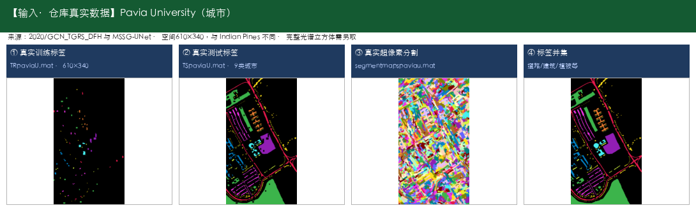

- **输出数据示例：** [Indian Pines] 输出为同场景像素级分类图（16类着色）；[Pavia University] 输出为同场景像素级分类图（9类着色）

  

  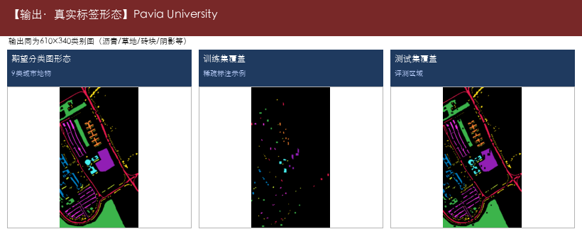

- **典型用途：**

  - 作物种植结构调查
  - 田块地类一张图
  - 区分玉米/大豆等细类
  - 城市土地利用一张图
  - 区分道路/建筑/绿地/停车场等
  - 规划底图支撑
  - 交通设施识别辅助

- **源码/论文入口：** https://sites.google.com/site/zhaohuixuers/

---

#### 2. AMGCFN —— 高光谱地物分类

- **仓库路径：** `2023/AMGCFN`
- **论文/题目：** Attention Multihop Graph and Multiscale Convolutional Fusion Network for Hyperspectral Image Classification
- **能识别什么（摘要）：** Indian Pines（农田作物与植被（印第安纳松），共16类；145×145，常用200波段，光谱约0.4–2.5μm（400–2500nm））；Salinas（农业区蔬菜/葡萄园/裸土，共16类；512×217，常用204波段）；Pavia University（城市道路/建筑/植被，共9类；610×340（常用），约103波段）

**能识别什么（完整类别明细）：**

- **Indian Pines（农田作物与植被（印第安纳松），共16类；145×145，常用200波段，光谱约0.4–2.5μm（400–2500nm））**

  - 1. 苜蓿（Alfalfa）
  - 2. 玉米-非耕（Corn-notill）
  - 3. 玉米-少耕（Corn-mintill）
  - 4. 玉米（Corn）
  - 5. 牧草-牧场（Grass-pasture）
  - 6. 牧草-树木（Grass-trees）
  - 7. 牧草-已刈（Grass-pasture-mowed）
  - 8. 干草堆/干草仓库（Hay-windrowed）
  - 9. 燕麦（Oats）
  - 10. 大豆-非耕（Soybean-notill）
  - 11. 大豆-少耕（Soybean-mintill）
  - 12. 大豆干净（Soybean-clean）
  - 13. 小麦（Wheat）
  - 14. 树林（Woods）
  - 15. 建筑-草-树-车道（Buildings-Grass-Trees-Drives）
  - 16. 石钢塔（Stone-Steel-Towers）

- **Salinas（农业区蔬菜/葡萄园/裸土，共16类；512×217，常用204波段）**

  - 1. 西兰花绿杂草1（Brocoli_green_weeds_1）
  - 2. 西兰花绿杂草2（Brocoli_green_weeds_2）
  - 3. 休耕地（Fallow）
  - 4. 休耕地-粗耕（Fallow_rough_plow）
  - 5. 休耕地-平整（Fallow_smooth）
  - 6. 茬地（Stubble）
  - 7. 芹菜（Celery）
  - 8. 葡萄园-未修剪（Grapes_untrained）
  - 9. 葡萄园发育土壤（Soil_vinyard_develop）
  - 10. 玉米衰老绿杂草（Corn_senesced_green_weeds）
  - 11. 生菜长叶4周（Lettuce_romaine_4wk）
  - 12. 生菜长叶5周（Lettuce_romaine_5wk）
  - 13. 生菜长叶6周（Lettuce_romaine_6wk）
  - 14. 生菜长叶7周（Lettuce_romaine_7wk）
  - 15. 葡萄园-未修剪2（Vinyard_untrained）
  - 16. 葡萄园-垂直棚架（Vinyard_vertical_trellis）

- **Pavia University（城市道路/建筑/植被，共9类；610×340（常用），约103波段）**

  - 1. 沥青路面（Asphalt）
  - 2. 草地/草甸（Meadows）
  - 3. 砾石（Gravel）
  - 4. 树木（Trees）
  - 5. 涂装金属板（Painted metal sheets）
  - 6. 裸土（Bare Soil）
  - 7. 柏油（Bitumen）
  - 8. 自锁砖块（Self-Blocking Bricks）
  - 9. 阴影（Shadows）

- **代码中的数据集：** Indian Pines、Salinas、Pavia University

- **输入数据示例：** [Indian Pines] 农田作物与植被（印第安纳松），16类；仓库真实原始立方体 `HSI_data/Indian_pines_corrected.mat`（145×145×200）+ `Indian_pines_gt.mat`；[Salinas] 农业区蔬菜/葡萄园/裸土，16类；真实标签 `_raw_datasets/Salinas_gt.mat`（512×217）+ 超像素；影像请下载 `Salinas_corrected.mat`

  

  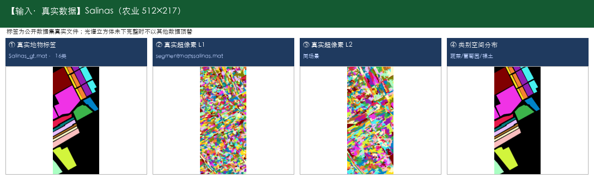

- **输出数据示例：** [Indian Pines] 输出为同场景像素级分类图（16类着色）；[Salinas] 输出为同场景像素级分类图（16类着色）

  

  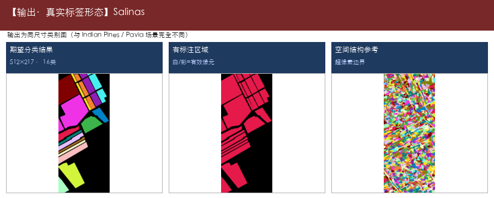

- **典型用途：**

  - 作物种植结构调查
  - 田块地类一张图
  - 区分玉米/大豆等细类
  - 城市土地利用一张图
  - 区分道路/建筑/绿地/停车场等
  - 规划底图支撑

- **源码/论文入口：** https://ieeexplore.ieee.org/document/10098209

---

#### 3. AMS-M2ESL —— 高光谱地物分类

- **仓库路径：** `2023/AMS-M2ESL`
- **论文/题目：** Adaptive Mask Sampling and Manifold to Euclidean Subspace Learning with Distance Covariance Representation for Hyperspectral Image Classification
- **能识别什么（摘要）：** Indian Pines（农田作物与植被（印第安纳松），共16类；145×145，常用200波段，光谱约0.4–2.5μm（400–2500nm））；Pavia University（城市道路/建筑/植被，共9类；610×340（常用），约103波段）；Kennedy Space Center (KSC)（海岸湿地植被与土地覆盖，共13类；常用176波段，400–2500nm）；Houston（城市精细地物，共15类；IEEE GRSS 城市场景（常见 Houston 2013 设定））

**能识别什么（完整类别明细）：**

- **Indian Pines（农田作物与植被（印第安纳松），共16类；145×145，常用200波段，光谱约0.4–2.5μm（400–2500nm））**

  - 1. 苜蓿（Alfalfa）
  - 2. 玉米-非耕（Corn-notill）
  - 3. 玉米-少耕（Corn-mintill）
  - 4. 玉米（Corn）
  - 5. 牧草-牧场（Grass-pasture）
  - 6. 牧草-树木（Grass-trees）
  - 7. 牧草-已刈（Grass-pasture-mowed）
  - 8. 干草堆/干草仓库（Hay-windrowed）
  - 9. 燕麦（Oats）
  - 10. 大豆-非耕（Soybean-notill）
  - 11. 大豆-少耕（Soybean-mintill）
  - 12. 大豆干净（Soybean-clean）
  - 13. 小麦（Wheat）
  - 14. 树林（Woods）
  - 15. 建筑-草-树-车道（Buildings-Grass-Trees-Drives）
  - 16. 石钢塔（Stone-Steel-Towers）

- **Pavia University（城市道路/建筑/植被，共9类；610×340（常用），约103波段）**

  - 1. 沥青路面（Asphalt）
  - 2. 草地/草甸（Meadows）
  - 3. 砾石（Gravel）
  - 4. 树木（Trees）
  - 5. 涂装金属板（Painted metal sheets）
  - 6. 裸土（Bare Soil）
  - 7. 柏油（Bitumen）
  - 8. 自锁砖块（Self-Blocking Bricks）
  - 9. 阴影（Shadows）

- **Kennedy Space Center (KSC)（海岸湿地植被与土地覆盖，共13类；常用176波段，400–2500nm）**

  - 1. 灌木丛（Scrub）
  - 2. 柳栎沼泽（Willow swamp）
  - 3. CP旱地树丛（CP hammock）
  - 4. 湿地松（Slash pine）
  - 5. 橡树/阔叶（Oak/Broadleaf）
  - 6. 硬木（Hardwood）
  - 7. 沼泽（Swamp）
  - 8. 禾本沼泽（Graminoid marsh）
  - 9. 米草沼泽（Spartina marsh）
  - 10. 香蒲沼泽（Cattail marsh）
  - 11. 盐沼（Salt marsh）
  - 12. 泥滩（Mud flats）
  - 13. 水体（Water）

- **Houston（城市精细地物，共15类；IEEE GRSS 城市场景（常见 Houston 2013 设定））**

  - 1. 健康草地（Healthy grass）
  - 2. 胁迫草地（Stressed grass）
  - 3. 合成草地（Synthetic grass）
  - 4. 树木（Trees）
  - 5. 土壤（Soil）
  - 6. 水体（Water）
  - 7. 居民区（Residential）
  - 8. 商业区（Commercial）
  - 9. 道路（Road）
  - 10. 高速公路（Highway）
  - 11. 铁路（Railway）
  - 12. 停车场1（Parking Lot 1）
  - 13. 停车场2（Parking Lot 2）
  - 14. 网球场（Tennis Court）
  - 15. 跑道（Running Track）

- **代码中的数据集：** Indian Pines、Pavia University、Kennedy Space Center (KSC)、Houston

- **输入数据示例：** [Indian Pines] 农田作物与植被（印第安纳松），16类；仓库真实原始立方体 `HSI_data/Indian_pines_corrected.mat`（145×145×200）+ `Indian_pines_gt.mat`；[Pavia University] 城市道路/建筑/植被，9类；仓库真实标签 `TRpaviaU.mat`/`TSpaviaU.mat`（610×340）+ 超像素 `segmentmapspaviau.mat`；完整立方体请下载到 `_raw_datasets/PaviaU.mat`

  

  

- **输出数据示例：** [Indian Pines] 输出为同场景像素级分类图（16类着色）；[Pavia University] 输出为同场景像素级分类图（9类着色）

  

  

- **典型用途：**

  - 作物种植结构调查
  - 田块地类一张图
  - 区分玉米/大豆等细类
  - 城市土地利用一张图
  - 区分道路/建筑/绿地/停车场等
  - 规划底图支撑
  - 交通设施识别辅助

- **源码/论文入口：** https://github.com/danfenghong/ECCV2018_J-Play

---

#### 4. ASSMN —— 高光谱地物分类

- **仓库路径：** `2020/ASSMN`
- **论文/题目：** Adaptive Spectral–Spatial Multiscale Contextual Feature Extraction for Hyperspectral Image Classification
- **能识别什么（摘要）：** Indian Pines（农田作物与植被（印第安纳松），共16类；145×145，常用200波段，光谱约0.4–2.5μm（400–2500nm））；Pavia University（城市道路/建筑/植被，共9类；610×340（常用），约103波段）；Kennedy Space Center (KSC)（海岸湿地植被与土地覆盖，共13类；常用176波段，400–2500nm）；Houston（城市精细地物，共15类；IEEE GRSS 城市场景（常见 Houston 2013 设定））

**能识别什么（完整类别明细）：**

- **Indian Pines（农田作物与植被（印第安纳松），共16类；145×145，常用200波段，光谱约0.4–2.5μm（400–2500nm））**

  - 1. 苜蓿（Alfalfa）
  - 2. 玉米-非耕（Corn-notill）
  - 3. 玉米-少耕（Corn-mintill）
  - 4. 玉米（Corn）
  - 5. 牧草-牧场（Grass-pasture）
  - 6. 牧草-树木（Grass-trees）
  - 7. 牧草-已刈（Grass-pasture-mowed）
  - 8. 干草堆/干草仓库（Hay-windrowed）
  - 9. 燕麦（Oats）
  - 10. 大豆-非耕（Soybean-notill）
  - 11. 大豆-少耕（Soybean-mintill）
  - 12. 大豆干净（Soybean-clean）
  - 13. 小麦（Wheat）
  - 14. 树林（Woods）
  - 15. 建筑-草-树-车道（Buildings-Grass-Trees-Drives）
  - 16. 石钢塔（Stone-Steel-Towers）

- **Pavia University（城市道路/建筑/植被，共9类；610×340（常用），约103波段）**

  - 1. 沥青路面（Asphalt）
  - 2. 草地/草甸（Meadows）
  - 3. 砾石（Gravel）
  - 4. 树木（Trees）
  - 5. 涂装金属板（Painted metal sheets）
  - 6. 裸土（Bare Soil）
  - 7. 柏油（Bitumen）
  - 8. 自锁砖块（Self-Blocking Bricks）
  - 9. 阴影（Shadows）

- **Kennedy Space Center (KSC)（海岸湿地植被与土地覆盖，共13类；常用176波段，400–2500nm）**

  - 1. 灌木丛（Scrub）
  - 2. 柳栎沼泽（Willow swamp）
  - 3. CP旱地树丛（CP hammock）
  - 4. 湿地松（Slash pine）
  - 5. 橡树/阔叶（Oak/Broadleaf）
  - 6. 硬木（Hardwood）
  - 7. 沼泽（Swamp）
  - 8. 禾本沼泽（Graminoid marsh）
  - 9. 米草沼泽（Spartina marsh）
  - 10. 香蒲沼泽（Cattail marsh）
  - 11. 盐沼（Salt marsh）
  - 12. 泥滩（Mud flats）
  - 13. 水体（Water）

- **Houston（城市精细地物，共15类；IEEE GRSS 城市场景（常见 Houston 2013 设定））**

  - 1. 健康草地（Healthy grass）
  - 2. 胁迫草地（Stressed grass）
  - 3. 合成草地（Synthetic grass）
  - 4. 树木（Trees）
  - 5. 土壤（Soil）
  - 6. 水体（Water）
  - 7. 居民区（Residential）
  - 8. 商业区（Commercial）
  - 9. 道路（Road）
  - 10. 高速公路（Highway）
  - 11. 铁路（Railway）
  - 12. 停车场1（Parking Lot 1）
  - 13. 停车场2（Parking Lot 2）
  - 14. 网球场（Tennis Court）
  - 15. 跑道（Running Track）

- **代码中的数据集：** Indian Pines、Pavia University、Kennedy Space Center (KSC)、Houston

- **输入数据示例：** [Indian Pines] 农田作物与植被（印第安纳松），16类；仓库真实原始立方体 `HSI_data/Indian_pines_corrected.mat`（145×145×200）+ `Indian_pines_gt.mat`；[Pavia University] 城市道路/建筑/植被，9类；仓库真实标签 `TRpaviaU.mat`/`TSpaviaU.mat`（610×340）+ 超像素 `segmentmapspaviau.mat`；完整立方体请下载到 `_raw_datasets/PaviaU.mat`

  

  

- **输出数据示例：** [Indian Pines] 输出为同场景像素级分类图（16类着色）；[Pavia University] 输出为同场景像素级分类图（9类着色）

  

  

- **典型用途：**

  - 作物种植结构调查
  - 田块地类一张图
  - 区分玉米/大豆等细类
  - 城市土地利用一张图
  - 区分道路/建筑/绿地/停车场等
  - 规划底图支撑
  - 交通设施识别辅助

- **源码/论文入口：** https://github.com/DotWang/ASSMN.git

---

#### 5. CMR-CNN —— 高光谱地物分类

- **仓库路径：** `2022/CMR-CNN`
- **论文/题目：** Cross-Mixing Residual Network for Hyperspectral Image Classification
- **能识别什么（摘要）：** Indian Pines（农田作物与植被（印第安纳松），共16类；145×145，常用200波段，光谱约0.4–2.5μm（400–2500nm））

**能识别什么（完整类别明细）：**

- **Indian Pines（农田作物与植被（印第安纳松），共16类；145×145，常用200波段，光谱约0.4–2.5μm（400–2500nm））**

  - 1. 苜蓿（Alfalfa）
  - 2. 玉米-非耕（Corn-notill）
  - 3. 玉米-少耕（Corn-mintill）
  - 4. 玉米（Corn）
  - 5. 牧草-牧场（Grass-pasture）
  - 6. 牧草-树木（Grass-trees）
  - 7. 牧草-已刈（Grass-pasture-mowed）
  - 8. 干草堆/干草仓库（Hay-windrowed）
  - 9. 燕麦（Oats）
  - 10. 大豆-非耕（Soybean-notill）
  - 11. 大豆-少耕（Soybean-mintill）
  - 12. 大豆干净（Soybean-clean）
  - 13. 小麦（Wheat）
  - 14. 树林（Woods）
  - 15. 建筑-草-树-车道（Buildings-Grass-Trees-Drives）
  - 16. 石钢塔（Stone-Steel-Towers）

- **代码中的数据集：** Indian Pines

- **输入数据示例：** [Indian Pines] 农田作物与植被（印第安纳松），16类；仓库真实原始立方体 `HSI_data/Indian_pines_corrected.mat`（145×145×200）+ `Indian_pines_gt.mat`

  

- **输出数据示例：** [Indian Pines] 输出为同场景像素级分类图（16类着色）

  

- **典型用途：**

  - 作物种植结构调查
  - 田块地类一张图
  - 区分玉米/大豆等细类

- **源码/论文入口：** 仓库未提供链接

---

#### 6. CNCMN —— 高光谱地物分类

- **仓库路径：** `2022/CNCMN`
- **论文/题目：** Composite Neighbor-Aware Convolutional Metric Networks for Hyperspectral Image Classification
- **能识别什么（摘要）：** Indian Pines（农田作物与植被（印第安纳松），共16类；145×145，常用200波段，光谱约0.4–2.5μm（400–2500nm））；Salinas（农业区蔬菜/葡萄园/裸土，共16类；512×217，常用204波段）；Pavia University（城市道路/建筑/植被，共9类；610×340（常用），约103波段）；Kennedy Space Center (KSC)（海岸湿地植被与土地覆盖，共13类；常用176波段，400–2500nm）

**能识别什么（完整类别明细）：**

- **Indian Pines（农田作物与植被（印第安纳松），共16类；145×145，常用200波段，光谱约0.4–2.5μm（400–2500nm））**

  - 1. 苜蓿（Alfalfa）
  - 2. 玉米-非耕（Corn-notill）
  - 3. 玉米-少耕（Corn-mintill）
  - 4. 玉米（Corn）
  - 5. 牧草-牧场（Grass-pasture）
  - 6. 牧草-树木（Grass-trees）
  - 7. 牧草-已刈（Grass-pasture-mowed）
  - 8. 干草堆/干草仓库（Hay-windrowed）
  - 9. 燕麦（Oats）
  - 10. 大豆-非耕（Soybean-notill）
  - 11. 大豆-少耕（Soybean-mintill）
  - 12. 大豆干净（Soybean-clean）
  - 13. 小麦（Wheat）
  - 14. 树林（Woods）
  - 15. 建筑-草-树-车道（Buildings-Grass-Trees-Drives）
  - 16. 石钢塔（Stone-Steel-Towers）

- **Salinas（农业区蔬菜/葡萄园/裸土，共16类；512×217，常用204波段）**

  - 1. 西兰花绿杂草1（Brocoli_green_weeds_1）
  - 2. 西兰花绿杂草2（Brocoli_green_weeds_2）
  - 3. 休耕地（Fallow）
  - 4. 休耕地-粗耕（Fallow_rough_plow）
  - 5. 休耕地-平整（Fallow_smooth）
  - 6. 茬地（Stubble）
  - 7. 芹菜（Celery）
  - 8. 葡萄园-未修剪（Grapes_untrained）
  - 9. 葡萄园发育土壤（Soil_vinyard_develop）
  - 10. 玉米衰老绿杂草（Corn_senesced_green_weeds）
  - 11. 生菜长叶4周（Lettuce_romaine_4wk）
  - 12. 生菜长叶5周（Lettuce_romaine_5wk）
  - 13. 生菜长叶6周（Lettuce_romaine_6wk）
  - 14. 生菜长叶7周（Lettuce_romaine_7wk）
  - 15. 葡萄园-未修剪2（Vinyard_untrained）
  - 16. 葡萄园-垂直棚架（Vinyard_vertical_trellis）

- **Pavia University（城市道路/建筑/植被，共9类；610×340（常用），约103波段）**

  - 1. 沥青路面（Asphalt）
  - 2. 草地/草甸（Meadows）
  - 3. 砾石（Gravel）
  - 4. 树木（Trees）
  - 5. 涂装金属板（Painted metal sheets）
  - 6. 裸土（Bare Soil）
  - 7. 柏油（Bitumen）
  - 8. 自锁砖块（Self-Blocking Bricks）
  - 9. 阴影（Shadows）

- **Kennedy Space Center (KSC)（海岸湿地植被与土地覆盖，共13类；常用176波段，400–2500nm）**

  - 1. 灌木丛（Scrub）
  - 2. 柳栎沼泽（Willow swamp）
  - 3. CP旱地树丛（CP hammock）
  - 4. 湿地松（Slash pine）
  - 5. 橡树/阔叶（Oak/Broadleaf）
  - 6. 硬木（Hardwood）
  - 7. 沼泽（Swamp）
  - 8. 禾本沼泽（Graminoid marsh）
  - 9. 米草沼泽（Spartina marsh）
  - 10. 香蒲沼泽（Cattail marsh）
  - 11. 盐沼（Salt marsh）
  - 12. 泥滩（Mud flats）
  - 13. 水体（Water）

- **代码中的数据集：** Indian Pines、Salinas、Pavia University、Kennedy Space Center (KSC)

- **输入数据示例：** [Indian Pines] 农田作物与植被（印第安纳松），16类；仓库真实原始立方体 `HSI_data/Indian_pines_corrected.mat`（145×145×200）+ `Indian_pines_gt.mat`；[Salinas] 农业区蔬菜/葡萄园/裸土，16类；真实标签 `_raw_datasets/Salinas_gt.mat`（512×217）+ 超像素；影像请下载 `Salinas_corrected.mat`

  

  

- **输出数据示例：** [Indian Pines] 输出为同场景像素级分类图（16类着色）；[Salinas] 输出为同场景像素级分类图（16类着色）

  

  

- **典型用途：**

  - 作物种植结构调查
  - 田块地类一张图
  - 区分玉米/大豆等细类
  - 城市土地利用一张图
  - 区分道路/建筑/绿地/停车场等
  - 规划底图支撑
  - 湿地土地覆盖监测

- **源码/论文入口：** https://ieeexplore.ieee.org/document/10004589

---

#### 7. CNN_Enhanced_GCN —— 高光谱地物分类

- **仓库路径：** `2020/CNN_Enhanced_GCN`
- **论文/题目：** CNN-Enhanced Graph Convolutional Network With Pixel- and Superpixel-Level Feature Fusion for Hyperspectral Image Classification
- **能识别什么（摘要）：** Indian Pines（农田作物与植被（印第安纳松），共16类；145×145，常用200波段，光谱约0.4–2.5μm（400–2500nm））；Salinas（农业区蔬菜/葡萄园/裸土，共16类；512×217，常用204波段）；Pavia University（城市道路/建筑/植被，共9类；610×340（常用），约103波段）；Kennedy Space Center (KSC)（海岸湿地植被与土地覆盖，共13类；常用176波段，400–2500nm）

**能识别什么（完整类别明细）：**

- **Indian Pines（农田作物与植被（印第安纳松），共16类；145×145，常用200波段，光谱约0.4–2.5μm（400–2500nm））**

  - 1. 苜蓿（Alfalfa）
  - 2. 玉米-非耕（Corn-notill）
  - 3. 玉米-少耕（Corn-mintill）
  - 4. 玉米（Corn）
  - 5. 牧草-牧场（Grass-pasture）
  - 6. 牧草-树木（Grass-trees）
  - 7. 牧草-已刈（Grass-pasture-mowed）
  - 8. 干草堆/干草仓库（Hay-windrowed）
  - 9. 燕麦（Oats）
  - 10. 大豆-非耕（Soybean-notill）
  - 11. 大豆-少耕（Soybean-mintill）
  - 12. 大豆干净（Soybean-clean）
  - 13. 小麦（Wheat）
  - 14. 树林（Woods）
  - 15. 建筑-草-树-车道（Buildings-Grass-Trees-Drives）
  - 16. 石钢塔（Stone-Steel-Towers）

- **Salinas（农业区蔬菜/葡萄园/裸土，共16类；512×217，常用204波段）**

  - 1. 西兰花绿杂草1（Brocoli_green_weeds_1）
  - 2. 西兰花绿杂草2（Brocoli_green_weeds_2）
  - 3. 休耕地（Fallow）
  - 4. 休耕地-粗耕（Fallow_rough_plow）
  - 5. 休耕地-平整（Fallow_smooth）
  - 6. 茬地（Stubble）
  - 7. 芹菜（Celery）
  - 8. 葡萄园-未修剪（Grapes_untrained）
  - 9. 葡萄园发育土壤（Soil_vinyard_develop）
  - 10. 玉米衰老绿杂草（Corn_senesced_green_weeds）
  - 11. 生菜长叶4周（Lettuce_romaine_4wk）
  - 12. 生菜长叶5周（Lettuce_romaine_5wk）
  - 13. 生菜长叶6周（Lettuce_romaine_6wk）
  - 14. 生菜长叶7周（Lettuce_romaine_7wk）
  - 15. 葡萄园-未修剪2（Vinyard_untrained）
  - 16. 葡萄园-垂直棚架（Vinyard_vertical_trellis）

- **Pavia University（城市道路/建筑/植被，共9类；610×340（常用），约103波段）**

  - 1. 沥青路面（Asphalt）
  - 2. 草地/草甸（Meadows）
  - 3. 砾石（Gravel）
  - 4. 树木（Trees）
  - 5. 涂装金属板（Painted metal sheets）
  - 6. 裸土（Bare Soil）
  - 7. 柏油（Bitumen）
  - 8. 自锁砖块（Self-Blocking Bricks）
  - 9. 阴影（Shadows）

- **Kennedy Space Center (KSC)（海岸湿地植被与土地覆盖，共13类；常用176波段，400–2500nm）**

  - 1. 灌木丛（Scrub）
  - 2. 柳栎沼泽（Willow swamp）
  - 3. CP旱地树丛（CP hammock）
  - 4. 湿地松（Slash pine）
  - 5. 橡树/阔叶（Oak/Broadleaf）
  - 6. 硬木（Hardwood）
  - 7. 沼泽（Swamp）
  - 8. 禾本沼泽（Graminoid marsh）
  - 9. 米草沼泽（Spartina marsh）
  - 10. 香蒲沼泽（Cattail marsh）
  - 11. 盐沼（Salt marsh）
  - 12. 泥滩（Mud flats）
  - 13. 水体（Water）

- **代码中的数据集：** Indian Pines、Salinas、Pavia University、Kennedy Space Center (KSC)

- **输入数据示例：** [Indian Pines] 农田作物与植被（印第安纳松），16类；仓库真实原始立方体 `HSI_data/Indian_pines_corrected.mat`（145×145×200）+ `Indian_pines_gt.mat`；[Salinas] 农业区蔬菜/葡萄园/裸土，16类；真实标签 `_raw_datasets/Salinas_gt.mat`（512×217）+ 超像素；影像请下载 `Salinas_corrected.mat`

  

  

- **输出数据示例：** [Indian Pines] 输出为同场景像素级分类图（16类着色）；[Salinas] 输出为同场景像素级分类图（16类着色）

  

  

- **典型用途：**

  - 作物种植结构调查
  - 田块地类一张图
  - 区分玉米/大豆等细类
  - 城市土地利用一张图
  - 区分道路/建筑/绿地/停车场等
  - 规划底图支撑
  - 湿地土地覆盖监测

- **源码/论文入口：** 仓库未提供链接

---

#### 8. CSIL —— 高光谱地物分类

- **仓库路径：** `2023/CSIL`
- **论文/题目：** An interactive learning framework for hyperspectral image classification
- **能识别什么（摘要）：** Indian Pines（农田作物与植被（印第安纳松），共16类；145×145，常用200波段，光谱约0.4–2.5μm（400–2500nm））；Salinas（农业区蔬菜/葡萄园/裸土，共16类；512×217，常用204波段）；Pavia University（城市道路/建筑/植被，共9类；610×340（常用），约103波段）；Kennedy Space Center (KSC)（海岸湿地植被与土地覆盖，共13类；常用176波段，400–2500nm）；Houston2018（城市精细地物（Houston 2018），共20类；2018 IEEE GRSS Data Fusion Contest（以官方说明为准））；WHU-Hi（无人机精细农业/地物，共若干类；WHU-Hi-HanChuan / HongHu / LongKou 等子数据集类别不同）

**能识别什么（完整类别明细）：**

- **Indian Pines（农田作物与植被（印第安纳松），共16类；145×145，常用200波段，光谱约0.4–2.5μm（400–2500nm））**

  - 1. 苜蓿（Alfalfa）
  - 2. 玉米-非耕（Corn-notill）
  - 3. 玉米-少耕（Corn-mintill）
  - 4. 玉米（Corn）
  - 5. 牧草-牧场（Grass-pasture）
  - 6. 牧草-树木（Grass-trees）
  - 7. 牧草-已刈（Grass-pasture-mowed）
  - 8. 干草堆/干草仓库（Hay-windrowed）
  - 9. 燕麦（Oats）
  - 10. 大豆-非耕（Soybean-notill）
  - 11. 大豆-少耕（Soybean-mintill）
  - 12. 大豆干净（Soybean-clean）
  - 13. 小麦（Wheat）
  - 14. 树林（Woods）
  - 15. 建筑-草-树-车道（Buildings-Grass-Trees-Drives）
  - 16. 石钢塔（Stone-Steel-Towers）

- **Salinas（农业区蔬菜/葡萄园/裸土，共16类；512×217，常用204波段）**

  - 1. 西兰花绿杂草1（Brocoli_green_weeds_1）
  - 2. 西兰花绿杂草2（Brocoli_green_weeds_2）
  - 3. 休耕地（Fallow）
  - 4. 休耕地-粗耕（Fallow_rough_plow）
  - 5. 休耕地-平整（Fallow_smooth）
  - 6. 茬地（Stubble）
  - 7. 芹菜（Celery）
  - 8. 葡萄园-未修剪（Grapes_untrained）
  - 9. 葡萄园发育土壤（Soil_vinyard_develop）
  - 10. 玉米衰老绿杂草（Corn_senesced_green_weeds）
  - 11. 生菜长叶4周（Lettuce_romaine_4wk）
  - 12. 生菜长叶5周（Lettuce_romaine_5wk）
  - 13. 生菜长叶6周（Lettuce_romaine_6wk）
  - 14. 生菜长叶7周（Lettuce_romaine_7wk）
  - 15. 葡萄园-未修剪2（Vinyard_untrained）
  - 16. 葡萄园-垂直棚架（Vinyard_vertical_trellis）

- **Pavia University（城市道路/建筑/植被，共9类；610×340（常用），约103波段）**

  - 1. 沥青路面（Asphalt）
  - 2. 草地/草甸（Meadows）
  - 3. 砾石（Gravel）
  - 4. 树木（Trees）
  - 5. 涂装金属板（Painted metal sheets）
  - 6. 裸土（Bare Soil）
  - 7. 柏油（Bitumen）
  - 8. 自锁砖块（Self-Blocking Bricks）
  - 9. 阴影（Shadows）

- **Kennedy Space Center (KSC)（海岸湿地植被与土地覆盖，共13类；常用176波段，400–2500nm）**

  - 1. 灌木丛（Scrub）
  - 2. 柳栎沼泽（Willow swamp）
  - 3. CP旱地树丛（CP hammock）
  - 4. 湿地松（Slash pine）
  - 5. 橡树/阔叶（Oak/Broadleaf）
  - 6. 硬木（Hardwood）
  - 7. 沼泽（Swamp）
  - 8. 禾本沼泽（Graminoid marsh）
  - 9. 米草沼泽（Spartina marsh）
  - 10. 香蒲沼泽（Cattail marsh）
  - 11. 盐沼（Salt marsh）
  - 12. 泥滩（Mud flats）
  - 13. 水体（Water）

- **Houston2018（城市精细地物（Houston 2018），共20类；2018 IEEE GRSS Data Fusion Contest（以官方说明为准））**

  - 1. Healthy grass（健康草地）
  - 2. Stressed grass（胁迫草地）
  - 3. Artificial turf（人造草皮）
  - 4. Evergreen trees（常绿树）
  - 5. Deciduous trees（落叶树）
  - 6. Bare earth（裸地）
  - 7. Water（水体）
  - 8. Residential buildings（居民建筑）
  - 9. Non-residential buildings（非居民建筑）
  - 10. Roads（道路）
  - 11. Sidewalks（人行道）
  - 12. Crosswalks（人行横道）
  - 13. Major thoroughfares（主干道）
  - 14. Highways（高速公路）
  - 15. Railways（铁路）
  - 16. Paved parking lots（铺装停车场）
  - 17. Unpaved parking lots（未铺装停车场）
  - 18. Cars（车辆）
  - 19. Trains（火车）
  - 20. Stadium seats（体育场座席）

- **WHU-Hi（无人机精细农业/地物，共若干类；WHU-Hi-HanChuan / HongHu / LongKou 等子数据集类别不同）**

  - 说明：WHU-Hi 含多个子场景，类别不完全相同。
  - 常见包含：草莓、水稻、大豆、各类蔬菜、道路、裸土、水体等。
  - 请下载后按子数据集标签文件核对完整类别表。

- **代码中的数据集：** Indian Pines、Salinas、Pavia University、Kennedy Space Center (KSC)、Houston2018、WHU-Hi

- **输入数据示例：** [Indian Pines] 农田作物与植被（印第安纳松），16类；仓库真实原始立方体 `HSI_data/Indian_pines_corrected.mat`（145×145×200）+ `Indian_pines_gt.mat`；[Salinas] 农业区蔬菜/葡萄园/裸土，16类；真实标签 `_raw_datasets/Salinas_gt.mat`（512×217）+ 超像素；影像请下载 `Salinas_corrected.mat`

  

  

- **输出数据示例：** [Indian Pines] 输出为同场景像素级分类图（16类着色）；[Salinas] 输出为同场景像素级分类图（16类着色）

  

  

- **典型用途：**

  - 作物种植结构调查
  - 田块地类一张图
  - 区分玉米/大豆等细类
  - 城市土地利用一张图
  - 区分道路/建筑/绿地/停车场等
  - 规划底图支撑
  - 交通设施识别辅助

- **源码/论文入口：** https://github.com/jqyang22/CSIL

---

#### 9. CVNNs —— 高光谱地物分类

- **仓库路径：** `2023/CVNNs`
- **论文/题目：** Attention based Dual-Branch Complex Feature Fusion Network for Hyperspectral Image Classification
- **能识别什么（摘要）：** Indian Pines（农田作物与植被（印第安纳松），共16类；145×145，常用200波段，光谱约0.4–2.5μm（400–2500nm））；Salinas（农业区蔬菜/葡萄园/裸土，共16类；512×217，常用204波段）；Pavia University（城市道路/建筑/植被，共9类；610×340（常用），约103波段）；Botswana（三角洲沼泽/林地，共14类；常用145波段，400–2500nm）

**能识别什么（完整类别明细）：**

- **Indian Pines（农田作物与植被（印第安纳松），共16类；145×145，常用200波段，光谱约0.4–2.5μm（400–2500nm））**

  - 1. 苜蓿（Alfalfa）
  - 2. 玉米-非耕（Corn-notill）
  - 3. 玉米-少耕（Corn-mintill）
  - 4. 玉米（Corn）
  - 5. 牧草-牧场（Grass-pasture）
  - 6. 牧草-树木（Grass-trees）
  - 7. 牧草-已刈（Grass-pasture-mowed）
  - 8. 干草堆/干草仓库（Hay-windrowed）
  - 9. 燕麦（Oats）
  - 10. 大豆-非耕（Soybean-notill）
  - 11. 大豆-少耕（Soybean-mintill）
  - 12. 大豆干净（Soybean-clean）
  - 13. 小麦（Wheat）
  - 14. 树林（Woods）
  - 15. 建筑-草-树-车道（Buildings-Grass-Trees-Drives）
  - 16. 石钢塔（Stone-Steel-Towers）

- **Salinas（农业区蔬菜/葡萄园/裸土，共16类；512×217，常用204波段）**

  - 1. 西兰花绿杂草1（Brocoli_green_weeds_1）
  - 2. 西兰花绿杂草2（Brocoli_green_weeds_2）
  - 3. 休耕地（Fallow）
  - 4. 休耕地-粗耕（Fallow_rough_plow）
  - 5. 休耕地-平整（Fallow_smooth）
  - 6. 茬地（Stubble）
  - 7. 芹菜（Celery）
  - 8. 葡萄园-未修剪（Grapes_untrained）
  - 9. 葡萄园发育土壤（Soil_vinyard_develop）
  - 10. 玉米衰老绿杂草（Corn_senesced_green_weeds）
  - 11. 生菜长叶4周（Lettuce_romaine_4wk）
  - 12. 生菜长叶5周（Lettuce_romaine_5wk）
  - 13. 生菜长叶6周（Lettuce_romaine_6wk）
  - 14. 生菜长叶7周（Lettuce_romaine_7wk）
  - 15. 葡萄园-未修剪2（Vinyard_untrained）
  - 16. 葡萄园-垂直棚架（Vinyard_vertical_trellis）

- **Pavia University（城市道路/建筑/植被，共9类；610×340（常用），约103波段）**

  - 1. 沥青路面（Asphalt）
  - 2. 草地/草甸（Meadows）
  - 3. 砾石（Gravel）
  - 4. 树木（Trees）
  - 5. 涂装金属板（Painted metal sheets）
  - 6. 裸土（Bare Soil）
  - 7. 柏油（Bitumen）
  - 8. 自锁砖块（Self-Blocking Bricks）
  - 9. 阴影（Shadows）

- **Botswana（三角洲沼泽/林地，共14类；常用145波段，400–2500nm）**

  - 1. 水体（Water）
  - 2. 河马草（Hippo grass）
  - 3. 洪泛平原草地1（Floodplain grasses1）
  - 4. 洪泛平原草地2（Floodplain grasses2）
  - 5. 芦苇1（Reeds1）
  - 6. 河岸带（Riparian）
  - 7. 火烧迹地（Firescar2）
  - 8. 岛屿内部（Island interior）
  - 9. 金合欢林地（Acacia woodlands）
  - 10. 金合欢灌丛（Acacia shrublands）
  - 11. 金合欢草地（Acacia grasslands）
  - 12. 矮mopane（Short mopane）
  - 13. 混交mopane（Mixed mopane）
  - 14. 裸露土壤（Exposed soils）

- **代码中的数据集：** Indian Pines、Salinas、Pavia University、Botswana

- **输入数据示例：** [Indian Pines] 农田作物与植被（印第安纳松），16类；仓库真实原始立方体 `HSI_data/Indian_pines_corrected.mat`（145×145×200）+ `Indian_pines_gt.mat`；[Salinas] 农业区蔬菜/葡萄园/裸土，16类；真实标签 `_raw_datasets/Salinas_gt.mat`（512×217）+ 超像素；影像请下载 `Salinas_corrected.mat`

  

  

- **输出数据示例：** [Indian Pines] 输出为同场景像素级分类图（16类着色）；[Salinas] 输出为同场景像素级分类图（16类着色）

  

  

- **典型用途：**

  - 作物种植结构调查
  - 田块地类一张图
  - 区分玉米/大豆等细类
  - 城市土地利用一张图
  - 区分道路/建筑/绿地/停车场等
  - 规划底图支撑
  - 湿地土地覆盖监测

- **源码/论文入口：** 仓库未提供链接

---

#### 10. CVSSN —— 高光谱地物分类

- **仓库路径：** `2022/CVSSN`
- **论文/题目：** Exploring the Relationship between Center and Neighborhoods: Central Vector oriented Self-Similarity Network for Hyperspectral Image Classification
- **能识别什么（摘要）：** Indian Pines（农田作物与植被（印第安纳松），共16类；145×145，常用200波段，光谱约0.4–2.5μm（400–2500nm））；Pavia University（城市道路/建筑/植被，共9类；610×340（常用），约103波段）；Kennedy Space Center (KSC)（海岸湿地植被与土地覆盖，共13类；常用176波段，400–2500nm）；Houston（城市精细地物，共15类；IEEE GRSS 城市场景（常见 Houston 2013 设定））

**能识别什么（完整类别明细）：**

- **Indian Pines（农田作物与植被（印第安纳松），共16类；145×145，常用200波段，光谱约0.4–2.5μm（400–2500nm））**

  - 1. 苜蓿（Alfalfa）
  - 2. 玉米-非耕（Corn-notill）
  - 3. 玉米-少耕（Corn-mintill）
  - 4. 玉米（Corn）
  - 5. 牧草-牧场（Grass-pasture）
  - 6. 牧草-树木（Grass-trees）
  - 7. 牧草-已刈（Grass-pasture-mowed）
  - 8. 干草堆/干草仓库（Hay-windrowed）
  - 9. 燕麦（Oats）
  - 10. 大豆-非耕（Soybean-notill）
  - 11. 大豆-少耕（Soybean-mintill）
  - 12. 大豆干净（Soybean-clean）
  - 13. 小麦（Wheat）
  - 14. 树林（Woods）
  - 15. 建筑-草-树-车道（Buildings-Grass-Trees-Drives）
  - 16. 石钢塔（Stone-Steel-Towers）

- **Pavia University（城市道路/建筑/植被，共9类；610×340（常用），约103波段）**

  - 1. 沥青路面（Asphalt）
  - 2. 草地/草甸（Meadows）
  - 3. 砾石（Gravel）
  - 4. 树木（Trees）
  - 5. 涂装金属板（Painted metal sheets）
  - 6. 裸土（Bare Soil）
  - 7. 柏油（Bitumen）
  - 8. 自锁砖块（Self-Blocking Bricks）
  - 9. 阴影（Shadows）

- **Kennedy Space Center (KSC)（海岸湿地植被与土地覆盖，共13类；常用176波段，400–2500nm）**

  - 1. 灌木丛（Scrub）
  - 2. 柳栎沼泽（Willow swamp）
  - 3. CP旱地树丛（CP hammock）
  - 4. 湿地松（Slash pine）
  - 5. 橡树/阔叶（Oak/Broadleaf）
  - 6. 硬木（Hardwood）
  - 7. 沼泽（Swamp）
  - 8. 禾本沼泽（Graminoid marsh）
  - 9. 米草沼泽（Spartina marsh）
  - 10. 香蒲沼泽（Cattail marsh）
  - 11. 盐沼（Salt marsh）
  - 12. 泥滩（Mud flats）
  - 13. 水体（Water）

- **Houston（城市精细地物，共15类；IEEE GRSS 城市场景（常见 Houston 2013 设定））**

  - 1. 健康草地（Healthy grass）
  - 2. 胁迫草地（Stressed grass）
  - 3. 合成草地（Synthetic grass）
  - 4. 树木（Trees）
  - 5. 土壤（Soil）
  - 6. 水体（Water）
  - 7. 居民区（Residential）
  - 8. 商业区（Commercial）
  - 9. 道路（Road）
  - 10. 高速公路（Highway）
  - 11. 铁路（Railway）
  - 12. 停车场1（Parking Lot 1）
  - 13. 停车场2（Parking Lot 2）
  - 14. 网球场（Tennis Court）
  - 15. 跑道（Running Track）

- **代码中的数据集：** Indian Pines、Pavia University、Kennedy Space Center (KSC)、Houston

- **输入数据示例：** [Indian Pines] 农田作物与植被（印第安纳松），16类；仓库真实原始立方体 `HSI_data/Indian_pines_corrected.mat`（145×145×200）+ `Indian_pines_gt.mat`；[Pavia University] 城市道路/建筑/植被，9类；仓库真实标签 `TRpaviaU.mat`/`TSpaviaU.mat`（610×340）+ 超像素 `segmentmapspaviau.mat`；完整立方体请下载到 `_raw_datasets/PaviaU.mat`

  

  

- **输出数据示例：** [Indian Pines] 输出为同场景像素级分类图（16类着色）；[Pavia University] 输出为同场景像素级分类图（9类着色）

  

  

- **典型用途：**

  - 作物种植结构调查
  - 田块地类一张图
  - 区分玉米/大豆等细类
  - 城市土地利用一张图
  - 区分道路/建筑/绿地/停车场等
  - 规划底图支撑
  - 交通设施识别辅助

- **源码/论文入口：** https://github.com/lms-07/CVSSN

---

#### 11. DACNET —— 高光谱地物分类

- **仓库路径：** `2025/DACNET`
- **论文/题目：** Efficient Dynamic Attention 3D Convolution for Hyperspectral Image Classification
- **能识别什么（摘要）：** （代码未明确数据集时，类别以实际标签文件为准）

**能识别什么（完整类别明细）：**

- （无明确公开数据集类别表；下载数据后可按标签文件补全）

- **代码中的数据集：** 未明确

- **输入数据示例：** 未明确数据集且无原始文件，不展示替身数据

  > （原始立方体待下载后补图；当前不顶替）

- **输出数据示例：** 一般为像素级分类图 + OA/AA/Kappa

  > （无对应输出示例图，见文字说明）

- **典型用途：**

  - 地物制图
  - 调查底图
  - 方案演示

- **源码/论文入口：** 仓库未提供链接

---

#### 12. DADBN —— 高光谱地物分类

- **仓库路径：** `2021/DABAN`
- **论文/题目：** Hyperspectral Image Classification Based on Domain Adversarial Broad Adaptation Network
- **能识别什么（摘要）：** （代码未明确数据集时，类别以实际标签文件为准）

**能识别什么（完整类别明细）：**

- （无明确公开数据集类别表；下载数据后可按标签文件补全）

- **代码中的数据集：** 未明确

- **输入数据示例：** 未明确数据集且无原始文件，不展示替身数据

  > （原始立方体待下载后补图；当前不顶替）

- **输出数据示例：** 一般为像素级分类图 + OA/AA/Kappa

  > （无对应输出示例图，见文字说明）

- **典型用途：**

  - 地物制图
  - 调查底图
  - 方案演示

- **源码/论文入口：** https://github.com/r0nl/DABANforHSI/tree/master

---

#### 13. DBDA —— 高光谱地物分类

- **仓库路径：** `2020/DBDA`
- **论文/题目：** Double-Branch Dual-Attention Mechanism Network for Hyperspectral Image Classification
- **能识别什么（摘要）：** Kennedy Space Center (KSC)（海岸湿地植被与土地覆盖，共13类；常用176波段，400–2500nm）

**能识别什么（完整类别明细）：**

- **Kennedy Space Center (KSC)（海岸湿地植被与土地覆盖，共13类；常用176波段，400–2500nm）**

  - 1. 灌木丛（Scrub）
  - 2. 柳栎沼泽（Willow swamp）
  - 3. CP旱地树丛（CP hammock）
  - 4. 湿地松（Slash pine）
  - 5. 橡树/阔叶（Oak/Broadleaf）
  - 6. 硬木（Hardwood）
  - 7. 沼泽（Swamp）
  - 8. 禾本沼泽（Graminoid marsh）
  - 9. 米草沼泽（Spartina marsh）
  - 10. 香蒲沼泽（Cattail marsh）
  - 11. 盐沼（Salt marsh）
  - 12. 泥滩（Mud flats）
  - 13. 水体（Water）

- **代码中的数据集：** Kennedy Space Center (KSC)

- **输入数据示例：** [Kennedy Space Center (KSC)] 海岸湿地植被与土地覆盖，13类；仓库真实超像素 `segmentmapsksc.mat`；完整数据请下载到 `_raw_datasets/`

  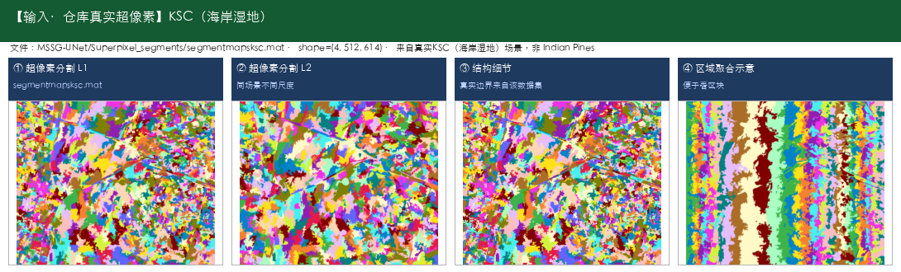

- **输出数据示例：** [Kennedy Space Center (KSC)] 输出为同场景像素级分类图（13类着色）

  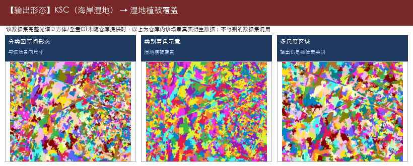

- **典型用途：**

  - 湿地土地覆盖监测
  - 水体/沼泽/林地区分

- **源码/论文入口：** 仓库未提供链接

---

#### 14. DDCD —— 高光谱地物分类；轻量化

- **仓库路径：** `2021/DDCD`
- **论文/题目：** LiteDenseNet: A Lightweight Network for Hyperspectral Image Classification
- **能识别什么（摘要）：** （代码未明确数据集时，类别以实际标签文件为准）

**能识别什么（完整类别明细）：**

- （无明确公开数据集类别表；下载数据后可按标签文件补全）

- **代码中的数据集：** 未明确

- **输入数据示例：** 未明确数据集且无原始文件，不展示替身数据

  > （原始立方体待下载后补图；当前不顶替）

- **输出数据示例：** 一般为像素级分类图 + OA/AA/Kappa

  > （无对应输出示例图，见文字说明）

- **典型用途：**

  - 算力受限环境部署
  - 快速出图演示

- **源码/论文入口：** https://github.com/lironui/Double-Branch-Dual-Attention-Mechanism-Network

---

#### 15. DeepMatrixCapsules —— 高光谱地物分类

- **仓库路径：** `2022/DeepMatrixCapsules`
- **论文/题目：** Hyperspectral Image Classification Using Deep Matrix Capsules
- **能识别什么（摘要）：** Indian Pines（农田作物与植被（印第安纳松），共16类；145×145，常用200波段，光谱约0.4–2.5μm（400–2500nm））；Salinas（农业区蔬菜/葡萄园/裸土，共16类；512×217，常用204波段）；Pavia University（城市道路/建筑/植被，共9类；610×340（常用），约103波段）

**能识别什么（完整类别明细）：**

- **Indian Pines（农田作物与植被（印第安纳松），共16类；145×145，常用200波段，光谱约0.4–2.5μm（400–2500nm））**

  - 1. 苜蓿（Alfalfa）
  - 2. 玉米-非耕（Corn-notill）
  - 3. 玉米-少耕（Corn-mintill）
  - 4. 玉米（Corn）
  - 5. 牧草-牧场（Grass-pasture）
  - 6. 牧草-树木（Grass-trees）
  - 7. 牧草-已刈（Grass-pasture-mowed）
  - 8. 干草堆/干草仓库（Hay-windrowed）
  - 9. 燕麦（Oats）
  - 10. 大豆-非耕（Soybean-notill）
  - 11. 大豆-少耕（Soybean-mintill）
  - 12. 大豆干净（Soybean-clean）
  - 13. 小麦（Wheat）
  - 14. 树林（Woods）
  - 15. 建筑-草-树-车道（Buildings-Grass-Trees-Drives）
  - 16. 石钢塔（Stone-Steel-Towers）

- **Salinas（农业区蔬菜/葡萄园/裸土，共16类；512×217，常用204波段）**

  - 1. 西兰花绿杂草1（Brocoli_green_weeds_1）
  - 2. 西兰花绿杂草2（Brocoli_green_weeds_2）
  - 3. 休耕地（Fallow）
  - 4. 休耕地-粗耕（Fallow_rough_plow）
  - 5. 休耕地-平整（Fallow_smooth）
  - 6. 茬地（Stubble）
  - 7. 芹菜（Celery）
  - 8. 葡萄园-未修剪（Grapes_untrained）
  - 9. 葡萄园发育土壤（Soil_vinyard_develop）
  - 10. 玉米衰老绿杂草（Corn_senesced_green_weeds）
  - 11. 生菜长叶4周（Lettuce_romaine_4wk）
  - 12. 生菜长叶5周（Lettuce_romaine_5wk）
  - 13. 生菜长叶6周（Lettuce_romaine_6wk）
  - 14. 生菜长叶7周（Lettuce_romaine_7wk）
  - 15. 葡萄园-未修剪2（Vinyard_untrained）
  - 16. 葡萄园-垂直棚架（Vinyard_vertical_trellis）

- **Pavia University（城市道路/建筑/植被，共9类；610×340（常用），约103波段）**

  - 1. 沥青路面（Asphalt）
  - 2. 草地/草甸（Meadows）
  - 3. 砾石（Gravel）
  - 4. 树木（Trees）
  - 5. 涂装金属板（Painted metal sheets）
  - 6. 裸土（Bare Soil）
  - 7. 柏油（Bitumen）
  - 8. 自锁砖块（Self-Blocking Bricks）
  - 9. 阴影（Shadows）

- **代码中的数据集：** Indian Pines、Salinas、Pavia University

- **输入数据示例：** [Indian Pines] 农田作物与植被（印第安纳松），16类；仓库真实原始立方体 `HSI_data/Indian_pines_corrected.mat`（145×145×200）+ `Indian_pines_gt.mat`；[Salinas] 农业区蔬菜/葡萄园/裸土，16类；真实标签 `_raw_datasets/Salinas_gt.mat`（512×217）+ 超像素；影像请下载 `Salinas_corrected.mat`

  

  

- **输出数据示例：** [Indian Pines] 输出为同场景像素级分类图（16类着色）；[Salinas] 输出为同场景像素级分类图（16类着色）

  

  

- **典型用途：**

  - 作物种植结构调查
  - 田块地类一张图
  - 区分玉米/大豆等细类
  - 城市土地利用一张图
  - 区分道路/建筑/绿地/停车场等
  - 规划底图支撑

- **源码/论文入口：** 仓库未提供链接

---

#### 16. DeepTreeAttention —— 高光谱地物分类

- **仓库路径：** `2020/DeepTreeAttention`
- **论文/题目：** Hyperspectral Image Classification with Attention Aided CNNs (https://arxiv.org/abs/2005.11977)
- **能识别什么（摘要）：** （代码未明确数据集时，类别以实际标签文件为准）

**能识别什么（完整类别明细）：**

- （无明确公开数据集类别表；下载数据后可按标签文件补全）

- **代码中的数据集：** 未明确

- **输入数据示例：** 未明确数据集且无原始文件，不展示替身数据

  > （原始立方体待下载后补图；当前不顶替）

- **输出数据示例：** 一般为像素级分类图 + OA/AA/Kappa

  > （无对应输出示例图，见文字说明）

- **典型用途：**

  - 地物制图
  - 调查底图
  - 方案演示

- **源码/论文入口：** https://github.com/weecology/DeepTreeAttention

---

#### 17. DKDMN —— 高光谱地物分类

- **仓库路径：** `2024/DKDMN`
- **论文/题目：** Data and knowledge-driven deep multiview fusion network based on diffusion model for hyperspectral image classification
- **能识别什么（摘要）：** Indian Pines（农田作物与植被（印第安纳松），共16类；145×145，常用200波段，光谱约0.4–2.5μm（400–2500nm））；Salinas（农业区蔬菜/葡萄园/裸土，共16类；512×217，常用204波段）；Pavia University（城市道路/建筑/植被，共9类；610×340（常用），约103波段）；Kennedy Space Center (KSC)（海岸湿地植被与土地覆盖，共13类；常用176波段，400–2500nm）；Houston2013（城市精细地物（Houston 2013），共15类；2013 IEEE GRSS Data Fusion Contest）

**能识别什么（完整类别明细）：**

- **Indian Pines（农田作物与植被（印第安纳松），共16类；145×145，常用200波段，光谱约0.4–2.5μm（400–2500nm））**

  - 1. 苜蓿（Alfalfa）
  - 2. 玉米-非耕（Corn-notill）
  - 3. 玉米-少耕（Corn-mintill）
  - 4. 玉米（Corn）
  - 5. 牧草-牧场（Grass-pasture）
  - 6. 牧草-树木（Grass-trees）
  - 7. 牧草-已刈（Grass-pasture-mowed）
  - 8. 干草堆/干草仓库（Hay-windrowed）
  - 9. 燕麦（Oats）
  - 10. 大豆-非耕（Soybean-notill）
  - 11. 大豆-少耕（Soybean-mintill）
  - 12. 大豆干净（Soybean-clean）
  - 13. 小麦（Wheat）
  - 14. 树林（Woods）
  - 15. 建筑-草-树-车道（Buildings-Grass-Trees-Drives）
  - 16. 石钢塔（Stone-Steel-Towers）

- **Salinas（农业区蔬菜/葡萄园/裸土，共16类；512×217，常用204波段）**

  - 1. 西兰花绿杂草1（Brocoli_green_weeds_1）
  - 2. 西兰花绿杂草2（Brocoli_green_weeds_2）
  - 3. 休耕地（Fallow）
  - 4. 休耕地-粗耕（Fallow_rough_plow）
  - 5. 休耕地-平整（Fallow_smooth）
  - 6. 茬地（Stubble）
  - 7. 芹菜（Celery）
  - 8. 葡萄园-未修剪（Grapes_untrained）
  - 9. 葡萄园发育土壤（Soil_vinyard_develop）
  - 10. 玉米衰老绿杂草（Corn_senesced_green_weeds）
  - 11. 生菜长叶4周（Lettuce_romaine_4wk）
  - 12. 生菜长叶5周（Lettuce_romaine_5wk）
  - 13. 生菜长叶6周（Lettuce_romaine_6wk）
  - 14. 生菜长叶7周（Lettuce_romaine_7wk）
  - 15. 葡萄园-未修剪2（Vinyard_untrained）
  - 16. 葡萄园-垂直棚架（Vinyard_vertical_trellis）

- **Pavia University（城市道路/建筑/植被，共9类；610×340（常用），约103波段）**

  - 1. 沥青路面（Asphalt）
  - 2. 草地/草甸（Meadows）
  - 3. 砾石（Gravel）
  - 4. 树木（Trees）
  - 5. 涂装金属板（Painted metal sheets）
  - 6. 裸土（Bare Soil）
  - 7. 柏油（Bitumen）
  - 8. 自锁砖块（Self-Blocking Bricks）
  - 9. 阴影（Shadows）

- **Kennedy Space Center (KSC)（海岸湿地植被与土地覆盖，共13类；常用176波段，400–2500nm）**

  - 1. 灌木丛（Scrub）
  - 2. 柳栎沼泽（Willow swamp）
  - 3. CP旱地树丛（CP hammock）
  - 4. 湿地松（Slash pine）
  - 5. 橡树/阔叶（Oak/Broadleaf）
  - 6. 硬木（Hardwood）
  - 7. 沼泽（Swamp）
  - 8. 禾本沼泽（Graminoid marsh）
  - 9. 米草沼泽（Spartina marsh）
  - 10. 香蒲沼泽（Cattail marsh）
  - 11. 盐沼（Salt marsh）
  - 12. 泥滩（Mud flats）
  - 13. 水体（Water）

- **Houston2013（城市精细地物（Houston 2013），共15类；2013 IEEE GRSS Data Fusion Contest）**

  - 1. 健康草地（Healthy grass）
  - 2. 胁迫草地（Stressed grass）
  - 3. 合成草地（Synthetic grass）
  - 4. 树木（Trees）
  - 5. 土壤（Soil）
  - 6. 水体（Water）
  - 7. 居民区（Residential）
  - 8. 商业区（Commercial）
  - 9. 道路（Road）
  - 10. 高速公路（Highway）
  - 11. 铁路（Railway）
  - 12. 停车场1（Parking Lot 1）
  - 13. 停车场2（Parking Lot 2）
  - 14. 网球场（Tennis Court）
  - 15. 跑道（Running Track）

- **代码中的数据集：** Indian Pines、Salinas、Pavia University、Kennedy Space Center (KSC)、Houston2013

- **输入数据示例：** [Indian Pines] 农田作物与植被（印第安纳松），16类；仓库真实原始立方体 `HSI_data/Indian_pines_corrected.mat`（145×145×200）+ `Indian_pines_gt.mat`；[Salinas] 农业区蔬菜/葡萄园/裸土，16类；真实标签 `_raw_datasets/Salinas_gt.mat`（512×217）+ 超像素；影像请下载 `Salinas_corrected.mat`

  

  

- **输出数据示例：** [Indian Pines] 输出为同场景像素级分类图（16类着色）；[Salinas] 输出为同场景像素级分类图（16类着色）

  

  

- **典型用途：**

  - 作物种植结构调查
  - 田块地类一张图
  - 区分玉米/大豆等细类
  - 城市土地利用一张图
  - 区分道路/建筑/绿地/停车场等
  - 规划底图支撑
  - 交通设施识别辅助

- **源码/论文入口：** https://github.com/chenning0115/spectraldiff_diffusion/

---

#### 18. DPRN —— 高光谱地物分类

- **仓库路径：** `2018/DPRN`
- **论文/题目：** Deep Pyramidal Residual Networks for Hyperspectral Image Classification
- **能识别什么（摘要）：** Indian Pines（农田作物与植被（印第安纳松），共16类；145×145，常用200波段，光谱约0.4–2.5μm（400–2500nm））；Salinas（农业区蔬菜/葡萄园/裸土，共16类；512×217，常用204波段）；Pavia University（城市道路/建筑/植被，共9类；610×340（常用），约103波段）；Kennedy Space Center (KSC)（海岸湿地植被与土地覆盖，共13类；常用176波段，400–2500nm）

**能识别什么（完整类别明细）：**

- **Indian Pines（农田作物与植被（印第安纳松），共16类；145×145，常用200波段，光谱约0.4–2.5μm（400–2500nm））**

  - 1. 苜蓿（Alfalfa）
  - 2. 玉米-非耕（Corn-notill）
  - 3. 玉米-少耕（Corn-mintill）
  - 4. 玉米（Corn）
  - 5. 牧草-牧场（Grass-pasture）
  - 6. 牧草-树木（Grass-trees）
  - 7. 牧草-已刈（Grass-pasture-mowed）
  - 8. 干草堆/干草仓库（Hay-windrowed）
  - 9. 燕麦（Oats）
  - 10. 大豆-非耕（Soybean-notill）
  - 11. 大豆-少耕（Soybean-mintill）
  - 12. 大豆干净（Soybean-clean）
  - 13. 小麦（Wheat）
  - 14. 树林（Woods）
  - 15. 建筑-草-树-车道（Buildings-Grass-Trees-Drives）
  - 16. 石钢塔（Stone-Steel-Towers）

- **Salinas（农业区蔬菜/葡萄园/裸土，共16类；512×217，常用204波段）**

  - 1. 西兰花绿杂草1（Brocoli_green_weeds_1）
  - 2. 西兰花绿杂草2（Brocoli_green_weeds_2）
  - 3. 休耕地（Fallow）
  - 4. 休耕地-粗耕（Fallow_rough_plow）
  - 5. 休耕地-平整（Fallow_smooth）
  - 6. 茬地（Stubble）
  - 7. 芹菜（Celery）
  - 8. 葡萄园-未修剪（Grapes_untrained）
  - 9. 葡萄园发育土壤（Soil_vinyard_develop）
  - 10. 玉米衰老绿杂草（Corn_senesced_green_weeds）
  - 11. 生菜长叶4周（Lettuce_romaine_4wk）
  - 12. 生菜长叶5周（Lettuce_romaine_5wk）
  - 13. 生菜长叶6周（Lettuce_romaine_6wk）
  - 14. 生菜长叶7周（Lettuce_romaine_7wk）
  - 15. 葡萄园-未修剪2（Vinyard_untrained）
  - 16. 葡萄园-垂直棚架（Vinyard_vertical_trellis）

- **Pavia University（城市道路/建筑/植被，共9类；610×340（常用），约103波段）**

  - 1. 沥青路面（Asphalt）
  - 2. 草地/草甸（Meadows）
  - 3. 砾石（Gravel）
  - 4. 树木（Trees）
  - 5. 涂装金属板（Painted metal sheets）
  - 6. 裸土（Bare Soil）
  - 7. 柏油（Bitumen）
  - 8. 自锁砖块（Self-Blocking Bricks）
  - 9. 阴影（Shadows）

- **Kennedy Space Center (KSC)（海岸湿地植被与土地覆盖，共13类；常用176波段，400–2500nm）**

  - 1. 灌木丛（Scrub）
  - 2. 柳栎沼泽（Willow swamp）
  - 3. CP旱地树丛（CP hammock）
  - 4. 湿地松（Slash pine）
  - 5. 橡树/阔叶（Oak/Broadleaf）
  - 6. 硬木（Hardwood）
  - 7. 沼泽（Swamp）
  - 8. 禾本沼泽（Graminoid marsh）
  - 9. 米草沼泽（Spartina marsh）
  - 10. 香蒲沼泽（Cattail marsh）
  - 11. 盐沼（Salt marsh）
  - 12. 泥滩（Mud flats）
  - 13. 水体（Water）

- **代码中的数据集：** Indian Pines、Salinas、Pavia University、Kennedy Space Center (KSC)

- **输入数据示例：** [Indian Pines] 农田作物与植被（印第安纳松），16类；仓库真实原始立方体 `HSI_data/Indian_pines_corrected.mat`（145×145×200）+ `Indian_pines_gt.mat`；[Salinas] 农业区蔬菜/葡萄园/裸土，16类；真实标签 `_raw_datasets/Salinas_gt.mat`（512×217）+ 超像素；影像请下载 `Salinas_corrected.mat`

  

  

- **输出数据示例：** [Indian Pines] 输出为同场景像素级分类图（16类着色）；[Salinas] 输出为同场景像素级分类图（16类着色）

  

  

- **典型用途：**

  - 作物种植结构调查
  - 田块地类一张图
  - 区分玉米/大豆等细类
  - 城市土地利用一张图
  - 区分道路/建筑/绿地/停车场等
  - 规划底图支撑
  - 湿地土地覆盖监测

- **源码/论文入口：** 仓库未提供链接

---

#### 19. DRGCN —— 高光谱地物分类

- **仓库路径：** `2022/DRGCN`
- **论文/题目：** Dual Residual Graph Convolutional Network for Hyperspectral Image Classification
- **能识别什么（摘要）：** （代码未明确数据集时，类别以实际标签文件为准）

**能识别什么（完整类别明细）：**

- （无明确公开数据集类别表；下载数据后可按标签文件补全）

- **代码中的数据集：** 未明确

- **输入数据示例：** 未明确数据集且无原始文件，不展示替身数据

  > （原始立方体待下载后补图；当前不顶替）

- **输出数据示例：** 一般为像素级分类图 + OA/AA/Kappa

  > （无对应输出示例图，见文字说明）

- **典型用途：**

  - 地物制图
  - 调查底图
  - 方案演示

- **源码/论文入口：** 仓库未提供链接

---

#### 20. ENL-FCN —— 高光谱地物分类

- **仓库路径：** `2020/ENL-FCN`
- **论文/题目：** Efficient Deep Learning of Non-local Features for Hyperspectral Image Classification
- **能识别什么（摘要）：** Indian Pines（农田作物与植被（印第安纳松），共16类；145×145，常用200波段，光谱约0.4–2.5μm（400–2500nm））；Pavia University（城市道路/建筑/植被，共9类；610×340（常用），约103波段）；Kennedy Space Center (KSC)（海岸湿地植被与土地覆盖，共13类；常用176波段，400–2500nm）

**能识别什么（完整类别明细）：**

- **Indian Pines（农田作物与植被（印第安纳松），共16类；145×145，常用200波段，光谱约0.4–2.5μm（400–2500nm））**

  - 1. 苜蓿（Alfalfa）
  - 2. 玉米-非耕（Corn-notill）
  - 3. 玉米-少耕（Corn-mintill）
  - 4. 玉米（Corn）
  - 5. 牧草-牧场（Grass-pasture）
  - 6. 牧草-树木（Grass-trees）
  - 7. 牧草-已刈（Grass-pasture-mowed）
  - 8. 干草堆/干草仓库（Hay-windrowed）
  - 9. 燕麦（Oats）
  - 10. 大豆-非耕（Soybean-notill）
  - 11. 大豆-少耕（Soybean-mintill）
  - 12. 大豆干净（Soybean-clean）
  - 13. 小麦（Wheat）
  - 14. 树林（Woods）
  - 15. 建筑-草-树-车道（Buildings-Grass-Trees-Drives）
  - 16. 石钢塔（Stone-Steel-Towers）

- **Pavia University（城市道路/建筑/植被，共9类；610×340（常用），约103波段）**

  - 1. 沥青路面（Asphalt）
  - 2. 草地/草甸（Meadows）
  - 3. 砾石（Gravel）
  - 4. 树木（Trees）
  - 5. 涂装金属板（Painted metal sheets）
  - 6. 裸土（Bare Soil）
  - 7. 柏油（Bitumen）
  - 8. 自锁砖块（Self-Blocking Bricks）
  - 9. 阴影（Shadows）

- **Kennedy Space Center (KSC)（海岸湿地植被与土地覆盖，共13类；常用176波段，400–2500nm）**

  - 1. 灌木丛（Scrub）
  - 2. 柳栎沼泽（Willow swamp）
  - 3. CP旱地树丛（CP hammock）
  - 4. 湿地松（Slash pine）
  - 5. 橡树/阔叶（Oak/Broadleaf）
  - 6. 硬木（Hardwood）
  - 7. 沼泽（Swamp）
  - 8. 禾本沼泽（Graminoid marsh）
  - 9. 米草沼泽（Spartina marsh）
  - 10. 香蒲沼泽（Cattail marsh）
  - 11. 盐沼（Salt marsh）
  - 12. 泥滩（Mud flats）
  - 13. 水体（Water）

- **代码中的数据集：** Indian Pines、Pavia University、Kennedy Space Center (KSC)

- **输入数据示例：** [Indian Pines] 农田作物与植被（印第安纳松），16类；仓库真实原始立方体 `HSI_data/Indian_pines_corrected.mat`（145×145×200）+ `Indian_pines_gt.mat`；[Pavia University] 城市道路/建筑/植被，9类；仓库真实标签 `TRpaviaU.mat`/`TSpaviaU.mat`（610×340）+ 超像素 `segmentmapspaviau.mat`；完整立方体请下载到 `_raw_datasets/PaviaU.mat`

  

  

- **输出数据示例：** [Indian Pines] 输出为同场景像素级分类图（16类着色）；[Pavia University] 输出为同场景像素级分类图（9类着色）

  

  

- **典型用途：**

  - 作物种植结构调查
  - 田块地类一张图
  - 区分玉米/大豆等细类
  - 城市土地利用一张图
  - 区分道路/建筑/绿地/停车场等
  - 规划底图支撑
  - 湿地土地覆盖监测

- **源码/论文入口：** 仓库未提供链接

---

#### 21. F2HNN —— 高光谱地物分类

- **仓库路径：** `2022/F2HNN`
- **论文/题目：** Hyperspectral Image Classification Using Feature Fusion Hypergraph Convolution Neural Network
- **能识别什么（摘要）：** Indian Pines（农田作物与植被（印第安纳松），共16类；145×145，常用200波段，光谱约0.4–2.5μm（400–2500nm））；Kennedy Space Center (KSC)（海岸湿地植被与土地覆盖，共13类；常用176波段，400–2500nm）；Botswana（三角洲沼泽/林地，共14类；常用145波段，400–2500nm）

**能识别什么（完整类别明细）：**

- **Indian Pines（农田作物与植被（印第安纳松），共16类；145×145，常用200波段，光谱约0.4–2.5μm（400–2500nm））**

  - 1. 苜蓿（Alfalfa）
  - 2. 玉米-非耕（Corn-notill）
  - 3. 玉米-少耕（Corn-mintill）
  - 4. 玉米（Corn）
  - 5. 牧草-牧场（Grass-pasture）
  - 6. 牧草-树木（Grass-trees）
  - 7. 牧草-已刈（Grass-pasture-mowed）
  - 8. 干草堆/干草仓库（Hay-windrowed）
  - 9. 燕麦（Oats）
  - 10. 大豆-非耕（Soybean-notill）
  - 11. 大豆-少耕（Soybean-mintill）
  - 12. 大豆干净（Soybean-clean）
  - 13. 小麦（Wheat）
  - 14. 树林（Woods）
  - 15. 建筑-草-树-车道（Buildings-Grass-Trees-Drives）
  - 16. 石钢塔（Stone-Steel-Towers）

- **Kennedy Space Center (KSC)（海岸湿地植被与土地覆盖，共13类；常用176波段，400–2500nm）**

  - 1. 灌木丛（Scrub）
  - 2. 柳栎沼泽（Willow swamp）
  - 3. CP旱地树丛（CP hammock）
  - 4. 湿地松（Slash pine）
  - 5. 橡树/阔叶（Oak/Broadleaf）
  - 6. 硬木（Hardwood）
  - 7. 沼泽（Swamp）
  - 8. 禾本沼泽（Graminoid marsh）
  - 9. 米草沼泽（Spartina marsh）
  - 10. 香蒲沼泽（Cattail marsh）
  - 11. 盐沼（Salt marsh）
  - 12. 泥滩（Mud flats）
  - 13. 水体（Water）

- **Botswana（三角洲沼泽/林地，共14类；常用145波段，400–2500nm）**

  - 1. 水体（Water）
  - 2. 河马草（Hippo grass）
  - 3. 洪泛平原草地1（Floodplain grasses1）
  - 4. 洪泛平原草地2（Floodplain grasses2）
  - 5. 芦苇1（Reeds1）
  - 6. 河岸带（Riparian）
  - 7. 火烧迹地（Firescar2）
  - 8. 岛屿内部（Island interior）
  - 9. 金合欢林地（Acacia woodlands）
  - 10. 金合欢灌丛（Acacia shrublands）
  - 11. 金合欢草地（Acacia grasslands）
  - 12. 矮mopane（Short mopane）
  - 13. 混交mopane（Mixed mopane）
  - 14. 裸露土壤（Exposed soils）

- **代码中的数据集：** Indian Pines、Kennedy Space Center (KSC)、Botswana

- **输入数据示例：** [Indian Pines] 农田作物与植被（印第安纳松），16类；仓库真实原始立方体 `HSI_data/Indian_pines_corrected.mat`（145×145×200）+ `Indian_pines_gt.mat`；[Kennedy Space Center (KSC)] 海岸湿地植被与土地覆盖，13类；仓库真实超像素 `segmentmapsksc.mat`；完整数据请下载到 `_raw_datasets/`

  

  

- **输出数据示例：** [Indian Pines] 输出为同场景像素级分类图（16类着色）；[Kennedy Space Center (KSC)] 输出为同场景像素级分类图（13类着色）

  

  

- **典型用途：**

  - 作物种植结构调查
  - 田块地类一张图
  - 区分玉米/大豆等细类
  - 湿地土地覆盖监测
  - 水体/沼泽/林地区分

- **源码/论文入口：** https://doi.org/10.1109/TGRS.2021.3123423

---

#### 22. FDSSC —— 高光谱地物分类

- **仓库路径：** `2018/FDSSC`
- **论文/题目：** A Fast Dense Spectral–Spatial Convolution Network Framework for Hyperspectral Images Classification
- **能识别什么（摘要）：** Indian Pines（农田作物与植被（印第安纳松），共16类；145×145，常用200波段，光谱约0.4–2.5μm（400–2500nm））；Pavia University（城市道路/建筑/植被，共9类；610×340（常用），约103波段）；Kennedy Space Center (KSC)（海岸湿地植被与土地覆盖，共13类；常用176波段，400–2500nm）

**能识别什么（完整类别明细）：**

- **Indian Pines（农田作物与植被（印第安纳松），共16类；145×145，常用200波段，光谱约0.4–2.5μm（400–2500nm））**

  - 1. 苜蓿（Alfalfa）
  - 2. 玉米-非耕（Corn-notill）
  - 3. 玉米-少耕（Corn-mintill）
  - 4. 玉米（Corn）
  - 5. 牧草-牧场（Grass-pasture）
  - 6. 牧草-树木（Grass-trees）
  - 7. 牧草-已刈（Grass-pasture-mowed）
  - 8. 干草堆/干草仓库（Hay-windrowed）
  - 9. 燕麦（Oats）
  - 10. 大豆-非耕（Soybean-notill）
  - 11. 大豆-少耕（Soybean-mintill）
  - 12. 大豆干净（Soybean-clean）
  - 13. 小麦（Wheat）
  - 14. 树林（Woods）
  - 15. 建筑-草-树-车道（Buildings-Grass-Trees-Drives）
  - 16. 石钢塔（Stone-Steel-Towers）

- **Pavia University（城市道路/建筑/植被，共9类；610×340（常用），约103波段）**

  - 1. 沥青路面（Asphalt）
  - 2. 草地/草甸（Meadows）
  - 3. 砾石（Gravel）
  - 4. 树木（Trees）
  - 5. 涂装金属板（Painted metal sheets）
  - 6. 裸土（Bare Soil）
  - 7. 柏油（Bitumen）
  - 8. 自锁砖块（Self-Blocking Bricks）
  - 9. 阴影（Shadows）

- **Kennedy Space Center (KSC)（海岸湿地植被与土地覆盖，共13类；常用176波段，400–2500nm）**

  - 1. 灌木丛（Scrub）
  - 2. 柳栎沼泽（Willow swamp）
  - 3. CP旱地树丛（CP hammock）
  - 4. 湿地松（Slash pine）
  - 5. 橡树/阔叶（Oak/Broadleaf）
  - 6. 硬木（Hardwood）
  - 7. 沼泽（Swamp）
  - 8. 禾本沼泽（Graminoid marsh）
  - 9. 米草沼泽（Spartina marsh）
  - 10. 香蒲沼泽（Cattail marsh）
  - 11. 盐沼（Salt marsh）
  - 12. 泥滩（Mud flats）
  - 13. 水体（Water）

- **代码中的数据集：** Indian Pines、Pavia University、Kennedy Space Center (KSC)

- **输入数据示例：** [Indian Pines] 农田作物与植被（印第安纳松），16类；仓库真实原始立方体 `HSI_data/Indian_pines_corrected.mat`（145×145×200）+ `Indian_pines_gt.mat`；[Pavia University] 城市道路/建筑/植被，9类；仓库真实标签 `TRpaviaU.mat`/`TSpaviaU.mat`（610×340）+ 超像素 `segmentmapspaviau.mat`；完整立方体请下载到 `_raw_datasets/PaviaU.mat`

  

  

- **输出数据示例：** [Indian Pines] 输出为同场景像素级分类图（16类着色）；[Pavia University] 输出为同场景像素级分类图（9类着色）

  

  

- **典型用途：**

  - 作物种植结构调查
  - 田块地类一张图
  - 区分玉米/大豆等细类
  - 城市土地利用一张图
  - 区分道路/建筑/绿地/停车场等
  - 规划底图支撑
  - 湿地土地覆盖监测

- **源码/论文入口：** 仓库未提供链接

---

#### 23. FSKNet —— 高光谱地物分类

- **仓库路径：** `2022/FSKNet`
- **论文/题目：** Faster hyperspectral image classification based on selective kernel mechanism using deep convolutional networks
- **能识别什么（摘要）：** Indian Pines（农田作物与植被（印第安纳松），共16类；145×145，常用200波段，光谱约0.4–2.5μm（400–2500nm））；Salinas（农业区蔬菜/葡萄园/裸土，共16类；512×217，常用204波段）；Pavia University（城市道路/建筑/植被，共9类；610×340（常用），约103波段）；Kennedy Space Center (KSC)（海岸湿地植被与土地覆盖，共13类；常用176波段，400–2500nm）；Botswana（三角洲沼泽/林地，共14类；常用145波段，400–2500nm）

**能识别什么（完整类别明细）：**

- **Indian Pines（农田作物与植被（印第安纳松），共16类；145×145，常用200波段，光谱约0.4–2.5μm（400–2500nm））**

  - 1. 苜蓿（Alfalfa）
  - 2. 玉米-非耕（Corn-notill）
  - 3. 玉米-少耕（Corn-mintill）
  - 4. 玉米（Corn）
  - 5. 牧草-牧场（Grass-pasture）
  - 6. 牧草-树木（Grass-trees）
  - 7. 牧草-已刈（Grass-pasture-mowed）
  - 8. 干草堆/干草仓库（Hay-windrowed）
  - 9. 燕麦（Oats）
  - 10. 大豆-非耕（Soybean-notill）
  - 11. 大豆-少耕（Soybean-mintill）
  - 12. 大豆干净（Soybean-clean）
  - 13. 小麦（Wheat）
  - 14. 树林（Woods）
  - 15. 建筑-草-树-车道（Buildings-Grass-Trees-Drives）
  - 16. 石钢塔（Stone-Steel-Towers）

- **Salinas（农业区蔬菜/葡萄园/裸土，共16类；512×217，常用204波段）**

  - 1. 西兰花绿杂草1（Brocoli_green_weeds_1）
  - 2. 西兰花绿杂草2（Brocoli_green_weeds_2）
  - 3. 休耕地（Fallow）
  - 4. 休耕地-粗耕（Fallow_rough_plow）
  - 5. 休耕地-平整（Fallow_smooth）
  - 6. 茬地（Stubble）
  - 7. 芹菜（Celery）
  - 8. 葡萄园-未修剪（Grapes_untrained）
  - 9. 葡萄园发育土壤（Soil_vinyard_develop）
  - 10. 玉米衰老绿杂草（Corn_senesced_green_weeds）
  - 11. 生菜长叶4周（Lettuce_romaine_4wk）
  - 12. 生菜长叶5周（Lettuce_romaine_5wk）
  - 13. 生菜长叶6周（Lettuce_romaine_6wk）
  - 14. 生菜长叶7周（Lettuce_romaine_7wk）
  - 15. 葡萄园-未修剪2（Vinyard_untrained）
  - 16. 葡萄园-垂直棚架（Vinyard_vertical_trellis）

- **Pavia University（城市道路/建筑/植被，共9类；610×340（常用），约103波段）**

  - 1. 沥青路面（Asphalt）
  - 2. 草地/草甸（Meadows）
  - 3. 砾石（Gravel）
  - 4. 树木（Trees）
  - 5. 涂装金属板（Painted metal sheets）
  - 6. 裸土（Bare Soil）
  - 7. 柏油（Bitumen）
  - 8. 自锁砖块（Self-Blocking Bricks）
  - 9. 阴影（Shadows）

- **Kennedy Space Center (KSC)（海岸湿地植被与土地覆盖，共13类；常用176波段，400–2500nm）**

  - 1. 灌木丛（Scrub）
  - 2. 柳栎沼泽（Willow swamp）
  - 3. CP旱地树丛（CP hammock）
  - 4. 湿地松（Slash pine）
  - 5. 橡树/阔叶（Oak/Broadleaf）
  - 6. 硬木（Hardwood）
  - 7. 沼泽（Swamp）
  - 8. 禾本沼泽（Graminoid marsh）
  - 9. 米草沼泽（Spartina marsh）
  - 10. 香蒲沼泽（Cattail marsh）
  - 11. 盐沼（Salt marsh）
  - 12. 泥滩（Mud flats）
  - 13. 水体（Water）

- **Botswana（三角洲沼泽/林地，共14类；常用145波段，400–2500nm）**

  - 1. 水体（Water）
  - 2. 河马草（Hippo grass）
  - 3. 洪泛平原草地1（Floodplain grasses1）
  - 4. 洪泛平原草地2（Floodplain grasses2）
  - 5. 芦苇1（Reeds1）
  - 6. 河岸带（Riparian）
  - 7. 火烧迹地（Firescar2）
  - 8. 岛屿内部（Island interior）
  - 9. 金合欢林地（Acacia woodlands）
  - 10. 金合欢灌丛（Acacia shrublands）
  - 11. 金合欢草地（Acacia grasslands）
  - 12. 矮mopane（Short mopane）
  - 13. 混交mopane（Mixed mopane）
  - 14. 裸露土壤（Exposed soils）

- **代码中的数据集：** Indian Pines、Salinas、Pavia University、Kennedy Space Center (KSC)、Botswana

- **输入数据示例：** [Indian Pines] 农田作物与植被（印第安纳松），16类；仓库真实原始立方体 `HSI_data/Indian_pines_corrected.mat`（145×145×200）+ `Indian_pines_gt.mat`；[Salinas] 农业区蔬菜/葡萄园/裸土，16类；真实标签 `_raw_datasets/Salinas_gt.mat`（512×217）+ 超像素；影像请下载 `Salinas_corrected.mat`

  

  

- **输出数据示例：** [Indian Pines] 输出为同场景像素级分类图（16类着色）；[Salinas] 输出为同场景像素级分类图（16类着色）

  

  

- **典型用途：**

  - 作物种植结构调查
  - 田块地类一张图
  - 区分玉米/大豆等细类
  - 城市土地利用一张图
  - 区分道路/建筑/绿地/停车场等
  - 规划底图支撑
  - 湿地土地覆盖监测

- **源码/论文入口：** 仓库未提供链接

---

#### 24. FullyContNet —— 高光谱地物分类

- **仓库路径：** `2021/FullyContNet`
- **论文/题目：** Fully Contextual Network for Hyperspectral Scene Parsing
- **能识别什么（摘要）：** （代码未明确数据集时，类别以实际标签文件为准）

**能识别什么（完整类别明细）：**

- （无明确公开数据集类别表；下载数据后可按标签文件补全）

- **代码中的数据集：** 未明确

- **输入数据示例：** 未明确数据集且无原始文件，不展示替身数据

  > （原始立方体待下载后补图；当前不顶替）

- **输出数据示例：** 一般为像素级分类图 + OA/AA/Kappa

  > （无对应输出示例图，见文字说明）

- **典型用途：**

  - 地物制图
  - 调查底图
  - 方案演示

- **源码/论文入口：** https://github.com/DotWang/FullyContNet

---

#### 25. GCN_TGRS_DFH —— 高光谱地物分类

- **仓库路径：** `2020/GCN_TGRS_DFH`
- **论文/题目：** Graph Convolutional Networks for Hyperspectral Image Classification
- **能识别什么（摘要）：** Indian Pines（农田作物与植被（印第安纳松），共16类；145×145，常用200波段，光谱约0.4–2.5μm（400–2500nm））；Pavia University（城市道路/建筑/植被，共9类；610×340（常用），约103波段）

**能识别什么（完整类别明细）：**

- **Indian Pines（农田作物与植被（印第安纳松），共16类；145×145，常用200波段，光谱约0.4–2.5μm（400–2500nm））**

  - 1. 苜蓿（Alfalfa）
  - 2. 玉米-非耕（Corn-notill）
  - 3. 玉米-少耕（Corn-mintill）
  - 4. 玉米（Corn）
  - 5. 牧草-牧场（Grass-pasture）
  - 6. 牧草-树木（Grass-trees）
  - 7. 牧草-已刈（Grass-pasture-mowed）
  - 8. 干草堆/干草仓库（Hay-windrowed）
  - 9. 燕麦（Oats）
  - 10. 大豆-非耕（Soybean-notill）
  - 11. 大豆-少耕（Soybean-mintill）
  - 12. 大豆干净（Soybean-clean）
  - 13. 小麦（Wheat）
  - 14. 树林（Woods）
  - 15. 建筑-草-树-车道（Buildings-Grass-Trees-Drives）
  - 16. 石钢塔（Stone-Steel-Towers）

- **Pavia University（城市道路/建筑/植被，共9类；610×340（常用），约103波段）**

  - 1. 沥青路面（Asphalt）
  - 2. 草地/草甸（Meadows）
  - 3. 砾石（Gravel）
  - 4. 树木（Trees）
  - 5. 涂装金属板（Painted metal sheets）
  - 6. 裸土（Bare Soil）
  - 7. 柏油（Bitumen）
  - 8. 自锁砖块（Self-Blocking Bricks）
  - 9. 阴影（Shadows）

- **代码中的数据集：** Indian Pines、Pavia University

- **输入数据示例：** [Indian Pines] 农田作物与植被（印第安纳松），16类；仓库真实原始立方体 `HSI_data/Indian_pines_corrected.mat`（145×145×200）+ `Indian_pines_gt.mat`；[Pavia University] 城市道路/建筑/植被，9类；仓库真实标签 `TRpaviaU.mat`/`TSpaviaU.mat`（610×340）+ 超像素 `segmentmapspaviau.mat`；完整立方体请下载到 `_raw_datasets/PaviaU.mat`

  

  

- **输出数据示例：** [Indian Pines] 输出为同场景像素级分类图（16类着色）；[Pavia University] 输出为同场景像素级分类图（9类着色）

  

  

- **典型用途：**

  - 作物种植结构调查
  - 田块地类一张图
  - 区分玉米/大豆等细类
  - 城市土地利用一张图
  - 区分道路/建筑/绿地/停车场等
  - 规划底图支撑

- **源码/论文入口：** 仓库未提供链接

---

#### 26. HKNAS —— 高光谱地物分类

- **仓库路径：** `2023/HKNAS`
- **论文/题目：** Classification of Hyperspectral Imagery Based on Hyper Kernel Neural Architecture Search
- **能识别什么（摘要）：** （代码未明确数据集时，类别以实际标签文件为准）

**能识别什么（完整类别明细）：**

- （无明确公开数据集类别表；下载数据后可按标签文件补全）

- **代码中的数据集：** 未明确

- **输入数据示例：** 未明确数据集且无原始文件，不展示替身数据

  > （原始立方体待下载后补图；当前不顶替）

- **输出数据示例：** 一般为像素级分类图 + OA/AA/Kappa

  > （无对应输出示例图，见文字说明）

- **典型用途：**

  - 地物制图
  - 调查底图
  - 方案演示

- **源码/论文入口：** 仓库未提供链接

---

#### 27. HSIC-FM —— 高光谱地物分类

- **仓库路径：** `2023/HSIC-FM`
- **论文/题目：** Overcoming the Barrier of Incompleteness: A Hyperspectral Image Classification Full Model
- **能识别什么（摘要）：** Indian Pines（农田作物与植被（印第安纳松），共16类；145×145，常用200波段，光谱约0.4–2.5μm（400–2500nm））；Salinas（农业区蔬菜/葡萄园/裸土，共16类；512×217，常用204波段）；Pavia University（城市道路/建筑/植被，共9类；610×340（常用），约103波段）；Kennedy Space Center (KSC)（海岸湿地植被与土地覆盖，共13类；常用176波段，400–2500nm）；Houston（城市精细地物，共15类；IEEE GRSS 城市场景（常见 Houston 2013 设定））；WHU-Hi（无人机精细农业/地物，共若干类；WHU-Hi-HanChuan / HongHu / LongKou 等子数据集类别不同）

**能识别什么（完整类别明细）：**

- **Indian Pines（农田作物与植被（印第安纳松），共16类；145×145，常用200波段，光谱约0.4–2.5μm（400–2500nm））**

  - 1. 苜蓿（Alfalfa）
  - 2. 玉米-非耕（Corn-notill）
  - 3. 玉米-少耕（Corn-mintill）
  - 4. 玉米（Corn）
  - 5. 牧草-牧场（Grass-pasture）
  - 6. 牧草-树木（Grass-trees）
  - 7. 牧草-已刈（Grass-pasture-mowed）
  - 8. 干草堆/干草仓库（Hay-windrowed）
  - 9. 燕麦（Oats）
  - 10. 大豆-非耕（Soybean-notill）
  - 11. 大豆-少耕（Soybean-mintill）
  - 12. 大豆干净（Soybean-clean）
  - 13. 小麦（Wheat）
  - 14. 树林（Woods）
  - 15. 建筑-草-树-车道（Buildings-Grass-Trees-Drives）
  - 16. 石钢塔（Stone-Steel-Towers）

- **Salinas（农业区蔬菜/葡萄园/裸土，共16类；512×217，常用204波段）**

  - 1. 西兰花绿杂草1（Brocoli_green_weeds_1）
  - 2. 西兰花绿杂草2（Brocoli_green_weeds_2）
  - 3. 休耕地（Fallow）
  - 4. 休耕地-粗耕（Fallow_rough_plow）
  - 5. 休耕地-平整（Fallow_smooth）
  - 6. 茬地（Stubble）
  - 7. 芹菜（Celery）
  - 8. 葡萄园-未修剪（Grapes_untrained）
  - 9. 葡萄园发育土壤（Soil_vinyard_develop）
  - 10. 玉米衰老绿杂草（Corn_senesced_green_weeds）
  - 11. 生菜长叶4周（Lettuce_romaine_4wk）
  - 12. 生菜长叶5周（Lettuce_romaine_5wk）
  - 13. 生菜长叶6周（Lettuce_romaine_6wk）
  - 14. 生菜长叶7周（Lettuce_romaine_7wk）
  - 15. 葡萄园-未修剪2（Vinyard_untrained）
  - 16. 葡萄园-垂直棚架（Vinyard_vertical_trellis）

- **Pavia University（城市道路/建筑/植被，共9类；610×340（常用），约103波段）**

  - 1. 沥青路面（Asphalt）
  - 2. 草地/草甸（Meadows）
  - 3. 砾石（Gravel）
  - 4. 树木（Trees）
  - 5. 涂装金属板（Painted metal sheets）
  - 6. 裸土（Bare Soil）
  - 7. 柏油（Bitumen）
  - 8. 自锁砖块（Self-Blocking Bricks）
  - 9. 阴影（Shadows）

- **Kennedy Space Center (KSC)（海岸湿地植被与土地覆盖，共13类；常用176波段，400–2500nm）**

  - 1. 灌木丛（Scrub）
  - 2. 柳栎沼泽（Willow swamp）
  - 3. CP旱地树丛（CP hammock）
  - 4. 湿地松（Slash pine）
  - 5. 橡树/阔叶（Oak/Broadleaf）
  - 6. 硬木（Hardwood）
  - 7. 沼泽（Swamp）
  - 8. 禾本沼泽（Graminoid marsh）
  - 9. 米草沼泽（Spartina marsh）
  - 10. 香蒲沼泽（Cattail marsh）
  - 11. 盐沼（Salt marsh）
  - 12. 泥滩（Mud flats）
  - 13. 水体（Water）

- **Houston（城市精细地物，共15类；IEEE GRSS 城市场景（常见 Houston 2013 设定））**

  - 1. 健康草地（Healthy grass）
  - 2. 胁迫草地（Stressed grass）
  - 3. 合成草地（Synthetic grass）
  - 4. 树木（Trees）
  - 5. 土壤（Soil）
  - 6. 水体（Water）
  - 7. 居民区（Residential）
  - 8. 商业区（Commercial）
  - 9. 道路（Road）
  - 10. 高速公路（Highway）
  - 11. 铁路（Railway）
  - 12. 停车场1（Parking Lot 1）
  - 13. 停车场2（Parking Lot 2）
  - 14. 网球场（Tennis Court）
  - 15. 跑道（Running Track）

- **WHU-Hi（无人机精细农业/地物，共若干类；WHU-Hi-HanChuan / HongHu / LongKou 等子数据集类别不同）**

  - 说明：WHU-Hi 含多个子场景，类别不完全相同。
  - 常见包含：草莓、水稻、大豆、各类蔬菜、道路、裸土、水体等。
  - 请下载后按子数据集标签文件核对完整类别表。

- **代码中的数据集：** Indian Pines、Salinas、Pavia University、Kennedy Space Center (KSC)、Houston、WHU-Hi

- **输入数据示例：** [Indian Pines] 农田作物与植被（印第安纳松），16类；仓库真实原始立方体 `HSI_data/Indian_pines_corrected.mat`（145×145×200）+ `Indian_pines_gt.mat`；[Salinas] 农业区蔬菜/葡萄园/裸土，16类；真实标签 `_raw_datasets/Salinas_gt.mat`（512×217）+ 超像素；影像请下载 `Salinas_corrected.mat`

  

  

- **输出数据示例：** [Indian Pines] 输出为同场景像素级分类图（16类着色）；[Salinas] 输出为同场景像素级分类图（16类着色）

  

  

- **典型用途：**

  - 作物种植结构调查
  - 田块地类一张图
  - 区分玉米/大豆等细类
  - 城市土地利用一张图
  - 区分道路/建筑/绿地/停车场等
  - 规划底图支撑
  - 交通设施识别辅助

- **源码/论文入口：** https://github.com/jqyang22/HSIC-FM

---

#### 28. HSIMAE —— 高光谱地物分类

- **仓库路径：** `2024/HSIMAE`
- **论文/题目：** HSIMAE：A Unified Masked Autoencoder with Large-scale Pretraining for Hyperspectral Image Classification
- **能识别什么（摘要）：** Salinas（农业区蔬菜/葡萄园/裸土，共16类；512×217，常用204波段）；Pavia University（城市道路/建筑/植被，共9类；610×340（常用），约103波段）；Houston2013（城市精细地物（Houston 2013），共15类；2013 IEEE GRSS Data Fusion Contest）；WHU-Hi（无人机精细农业/地物，共若干类；WHU-Hi-HanChuan / HongHu / LongKou 等子数据集类别不同）

**能识别什么（完整类别明细）：**

- **Salinas（农业区蔬菜/葡萄园/裸土，共16类；512×217，常用204波段）**

  - 1. 西兰花绿杂草1（Brocoli_green_weeds_1）
  - 2. 西兰花绿杂草2（Brocoli_green_weeds_2）
  - 3. 休耕地（Fallow）
  - 4. 休耕地-粗耕（Fallow_rough_plow）
  - 5. 休耕地-平整（Fallow_smooth）
  - 6. 茬地（Stubble）
  - 7. 芹菜（Celery）
  - 8. 葡萄园-未修剪（Grapes_untrained）
  - 9. 葡萄园发育土壤（Soil_vinyard_develop）
  - 10. 玉米衰老绿杂草（Corn_senesced_green_weeds）
  - 11. 生菜长叶4周（Lettuce_romaine_4wk）
  - 12. 生菜长叶5周（Lettuce_romaine_5wk）
  - 13. 生菜长叶6周（Lettuce_romaine_6wk）
  - 14. 生菜长叶7周（Lettuce_romaine_7wk）
  - 15. 葡萄园-未修剪2（Vinyard_untrained）
  - 16. 葡萄园-垂直棚架（Vinyard_vertical_trellis）

- **Pavia University（城市道路/建筑/植被，共9类；610×340（常用），约103波段）**

  - 1. 沥青路面（Asphalt）
  - 2. 草地/草甸（Meadows）
  - 3. 砾石（Gravel）
  - 4. 树木（Trees）
  - 5. 涂装金属板（Painted metal sheets）
  - 6. 裸土（Bare Soil）
  - 7. 柏油（Bitumen）
  - 8. 自锁砖块（Self-Blocking Bricks）
  - 9. 阴影（Shadows）

- **Houston2013（城市精细地物（Houston 2013），共15类；2013 IEEE GRSS Data Fusion Contest）**

  - 1. 健康草地（Healthy grass）
  - 2. 胁迫草地（Stressed grass）
  - 3. 合成草地（Synthetic grass）
  - 4. 树木（Trees）
  - 5. 土壤（Soil）
  - 6. 水体（Water）
  - 7. 居民区（Residential）
  - 8. 商业区（Commercial）
  - 9. 道路（Road）
  - 10. 高速公路（Highway）
  - 11. 铁路（Railway）
  - 12. 停车场1（Parking Lot 1）
  - 13. 停车场2（Parking Lot 2）
  - 14. 网球场（Tennis Court）
  - 15. 跑道（Running Track）

- **WHU-Hi（无人机精细农业/地物，共若干类；WHU-Hi-HanChuan / HongHu / LongKou 等子数据集类别不同）**

  - 说明：WHU-Hi 含多个子场景，类别不完全相同。
  - 常见包含：草莓、水稻、大豆、各类蔬菜、道路、裸土、水体等。
  - 请下载后按子数据集标签文件核对完整类别表。

- **代码中的数据集：** Salinas、Pavia University、Houston2013、WHU-Hi

- **输入数据示例：** [Salinas] 农业区蔬菜/葡萄园/裸土，16类；真实标签 `_raw_datasets/Salinas_gt.mat`（512×217）+ 超像素；影像请下载 `Salinas_corrected.mat`；[Pavia University] 城市道路/建筑/植被，9类；仓库真实标签 `TRpaviaU.mat`/`TSpaviaU.mat`（610×340）+ 超像素 `segmentmapspaviau.mat`；完整立方体请下载到 `_raw_datasets/PaviaU.mat`

  

  

- **输出数据示例：** [Salinas] 输出为同场景像素级分类图（16类着色）；[Pavia University] 输出为同场景像素级分类图（9类着色）

  

  

- **典型用途：**

  - 作物种植结构调查
  - 田块地类一张图
  - 区分玉米/大豆等细类
  - 城市土地利用一张图
  - 区分道路/建筑/绿地/停车场等
  - 规划底图支撑
  - 交通设施识别辅助

- **源码/论文入口：** https://github.com/facebookresearch/moco-v3

---

#### 29. HybridSN —— 高光谱地物分类

- **仓库路径：** `2019/HybridSN_Exploring_3D_2D`
- **论文/题目：** HybridSN Exploring 3D-2D Feature for Hyperspectral Image Classification
- **能识别什么（摘要）：** Indian Pines（农田作物与植被（印第安纳松），共16类；145×145，常用200波段，光谱约0.4–2.5μm（400–2500nm））；Salinas（农业区蔬菜/葡萄园/裸土，共16类；512×217，常用204波段）；Pavia University（城市道路/建筑/植被，共9类；610×340（常用），约103波段）

**能识别什么（完整类别明细）：**

- **Indian Pines（农田作物与植被（印第安纳松），共16类；145×145，常用200波段，光谱约0.4–2.5μm（400–2500nm））**

  - 1. 苜蓿（Alfalfa）
  - 2. 玉米-非耕（Corn-notill）
  - 3. 玉米-少耕（Corn-mintill）
  - 4. 玉米（Corn）
  - 5. 牧草-牧场（Grass-pasture）
  - 6. 牧草-树木（Grass-trees）
  - 7. 牧草-已刈（Grass-pasture-mowed）
  - 8. 干草堆/干草仓库（Hay-windrowed）
  - 9. 燕麦（Oats）
  - 10. 大豆-非耕（Soybean-notill）
  - 11. 大豆-少耕（Soybean-mintill）
  - 12. 大豆干净（Soybean-clean）
  - 13. 小麦（Wheat）
  - 14. 树林（Woods）
  - 15. 建筑-草-树-车道（Buildings-Grass-Trees-Drives）
  - 16. 石钢塔（Stone-Steel-Towers）

- **Salinas（农业区蔬菜/葡萄园/裸土，共16类；512×217，常用204波段）**

  - 1. 西兰花绿杂草1（Brocoli_green_weeds_1）
  - 2. 西兰花绿杂草2（Brocoli_green_weeds_2）
  - 3. 休耕地（Fallow）
  - 4. 休耕地-粗耕（Fallow_rough_plow）
  - 5. 休耕地-平整（Fallow_smooth）
  - 6. 茬地（Stubble）
  - 7. 芹菜（Celery）
  - 8. 葡萄园-未修剪（Grapes_untrained）
  - 9. 葡萄园发育土壤（Soil_vinyard_develop）
  - 10. 玉米衰老绿杂草（Corn_senesced_green_weeds）
  - 11. 生菜长叶4周（Lettuce_romaine_4wk）
  - 12. 生菜长叶5周（Lettuce_romaine_5wk）
  - 13. 生菜长叶6周（Lettuce_romaine_6wk）
  - 14. 生菜长叶7周（Lettuce_romaine_7wk）
  - 15. 葡萄园-未修剪2（Vinyard_untrained）
  - 16. 葡萄园-垂直棚架（Vinyard_vertical_trellis）

- **Pavia University（城市道路/建筑/植被，共9类；610×340（常用），约103波段）**

  - 1. 沥青路面（Asphalt）
  - 2. 草地/草甸（Meadows）
  - 3. 砾石（Gravel）
  - 4. 树木（Trees）
  - 5. 涂装金属板（Painted metal sheets）
  - 6. 裸土（Bare Soil）
  - 7. 柏油（Bitumen）
  - 8. 自锁砖块（Self-Blocking Bricks）
  - 9. 阴影（Shadows）

- **代码中的数据集：** Indian Pines、Salinas、Pavia University

- **输入数据示例：** [Indian Pines] 农田作物与植被（印第安纳松），16类；仓库真实原始立方体 `HSI_data/Indian_pines_corrected.mat`（145×145×200）+ `Indian_pines_gt.mat`；[Salinas] 农业区蔬菜/葡萄园/裸土，16类；真实标签 `_raw_datasets/Salinas_gt.mat`（512×217）+ 超像素；影像请下载 `Salinas_corrected.mat`

  

  

- **输出数据示例：** [Indian Pines] 输出为同场景像素级分类图（16类着色）；[Salinas] 输出为同场景像素级分类图（16类着色）

  

  

- **典型用途：**

  - 作物种植结构调查
  - 田块地类一张图
  - 区分玉米/大豆等细类
  - 城市土地利用一张图
  - 区分道路/建筑/绿地/停车场等
  - 规划底图支撑

- **源码/论文入口：** 仓库未提供链接

---

#### 30. Hyper-LKCNet —— 高光谱地物分类

- **仓库路径：** `2025/Hyper-LKCNet`
- **论文/题目：** Hyper-LKCNet: Exploring the Utilization of Large Kernel Convolution for Hyperspectral Image Classification
- **能识别什么（摘要）：** （代码未明确数据集时，类别以实际标签文件为准）

**能识别什么（完整类别明细）：**

- （无明确公开数据集类别表；下载数据后可按标签文件补全）

- **代码中的数据集：** 未明确

- **输入数据示例：** 未明确数据集且无原始文件，不展示替身数据

  > （原始立方体待下载后补图；当前不顶替）

- **输出数据示例：** 一般为像素级分类图 + OA/AA/Kappa

  > （无对应输出示例图，见文字说明）

- **典型用途：**

  - 地物制图
  - 调查底图
  - 方案演示

- **源码/论文入口：** https://github.com/liurongwhm/Hyper-LKCNet

---

#### 31. LMSS-NAS —— 高光谱地物分类；轻量化

- **仓库路径：** `2023/LMSS-NAS`
- **论文/题目：** Lightweight Multiscale Neural Architecture Search With Spectral–Spatial Attention for Hyperspectral Image Classification
- **能识别什么（摘要）：** Pavia University（城市道路/建筑/植被，共9类；610×340（常用），约103波段）；Pavia Centre（城市中心地物，共9类；约1096×715有效区，约102波段）；Kennedy Space Center (KSC)（海岸湿地植被与土地覆盖，共13类；常用176波段，400–2500nm）；Houston（城市精细地物，共15类；IEEE GRSS 城市场景（常见 Houston 2013 设定））

**能识别什么（完整类别明细）：**

- **Pavia University（城市道路/建筑/植被，共9类；610×340（常用），约103波段）**

  - 1. 沥青路面（Asphalt）
  - 2. 草地/草甸（Meadows）
  - 3. 砾石（Gravel）
  - 4. 树木（Trees）
  - 5. 涂装金属板（Painted metal sheets）
  - 6. 裸土（Bare Soil）
  - 7. 柏油（Bitumen）
  - 8. 自锁砖块（Self-Blocking Bricks）
  - 9. 阴影（Shadows）

- **Pavia Centre（城市中心地物，共9类；约1096×715有效区，约102波段）**

  - 1. 水体（Water）
  - 2. 树木（Trees）
  - 3. 沥青（Asphalt）
  - 4. 自锁砖块（Self-Blocking Bricks）
  - 5. 柏油（Bitumen）
  - 6. 瓦片（Tiles）
  - 7. 阴影（Shadows）
  - 8. 草地/草甸（Meadows）
  - 9. 裸土（Bare Soil）

- **Kennedy Space Center (KSC)（海岸湿地植被与土地覆盖，共13类；常用176波段，400–2500nm）**

  - 1. 灌木丛（Scrub）
  - 2. 柳栎沼泽（Willow swamp）
  - 3. CP旱地树丛（CP hammock）
  - 4. 湿地松（Slash pine）
  - 5. 橡树/阔叶（Oak/Broadleaf）
  - 6. 硬木（Hardwood）
  - 7. 沼泽（Swamp）
  - 8. 禾本沼泽（Graminoid marsh）
  - 9. 米草沼泽（Spartina marsh）
  - 10. 香蒲沼泽（Cattail marsh）
  - 11. 盐沼（Salt marsh）
  - 12. 泥滩（Mud flats）
  - 13. 水体（Water）

- **Houston（城市精细地物，共15类；IEEE GRSS 城市场景（常见 Houston 2013 设定））**

  - 1. 健康草地（Healthy grass）
  - 2. 胁迫草地（Stressed grass）
  - 3. 合成草地（Synthetic grass）
  - 4. 树木（Trees）
  - 5. 土壤（Soil）
  - 6. 水体（Water）
  - 7. 居民区（Residential）
  - 8. 商业区（Commercial）
  - 9. 道路（Road）
  - 10. 高速公路（Highway）
  - 11. 铁路（Railway）
  - 12. 停车场1（Parking Lot 1）
  - 13. 停车场2（Parking Lot 2）
  - 14. 网球场（Tennis Court）
  - 15. 跑道（Running Track）

- **代码中的数据集：** Pavia University、Pavia Centre、Kennedy Space Center (KSC)、Houston

- **输入数据示例：** [Pavia University] 城市道路/建筑/植被，9类；仓库真实标签 `TRpaviaU.mat`/`TSpaviaU.mat`（610×340）+ 超像素 `segmentmapspaviau.mat`；完整立方体请下载到 `_raw_datasets/PaviaU.mat`；[Pavia Centre] 城市中心地物，9类；仓库真实超像素 `segmentmapspaviac.mat`；完整立方体请下载到 `_raw_datasets/Pavia.mat`

  

  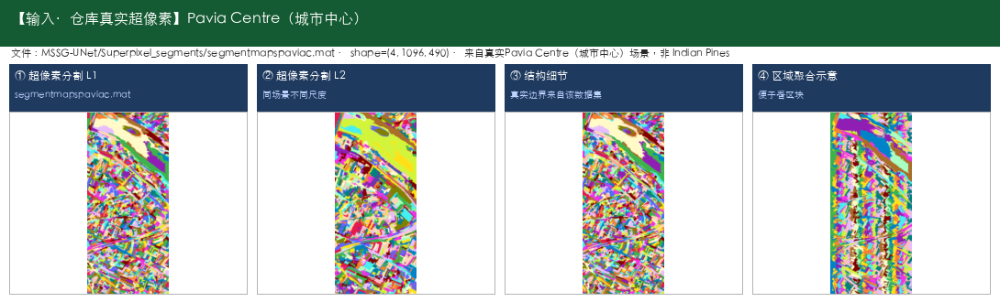

- **输出数据示例：** [Pavia University] 输出为同场景像素级分类图（9类着色）；[Pavia Centre] 输出为同场景像素级分类图（9类着色）

  

  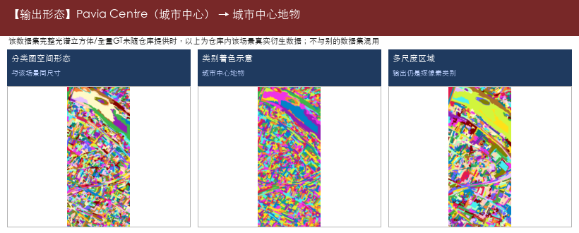

- **典型用途：**

  - 算力受限环境部署
  - 快速出图演示
  - 城市土地利用一张图
  - 区分道路/建筑/绿地/停车场等
  - 规划底图支撑
  - 交通设施识别辅助
  - 湿地土地覆盖监测

- **源码/论文入口：** 仓库未提供链接

---

#### 32. Machine_Learning_Methods —— 经典基线分类（KNN / SVM / CNN）

- **仓库路径：** `2016/Machine_Learning_Methods`
- **论文/题目：** No paper! The project uses the CNN models、the KNN method、the SVM method as classifier in hyperspectral image classification
- **能识别什么（摘要）：** Indian Pines（农田作物与植被（印第安纳松），共16类；145×145，常用200波段，光谱约0.4–2.5μm（400–2500nm））；Salinas（农业区蔬菜/葡萄园/裸土，共16类；512×217，常用204波段）；Pavia University（城市道路/建筑/植被，共9类；610×340（常用），约103波段）

**能识别什么（完整类别明细）：**

- **Indian Pines（农田作物与植被（印第安纳松），共16类；145×145，常用200波段，光谱约0.4–2.5μm（400–2500nm））**

  - 1. 苜蓿（Alfalfa）
  - 2. 玉米-非耕（Corn-notill）
  - 3. 玉米-少耕（Corn-mintill）
  - 4. 玉米（Corn）
  - 5. 牧草-牧场（Grass-pasture）
  - 6. 牧草-树木（Grass-trees）
  - 7. 牧草-已刈（Grass-pasture-mowed）
  - 8. 干草堆/干草仓库（Hay-windrowed）
  - 9. 燕麦（Oats）
  - 10. 大豆-非耕（Soybean-notill）
  - 11. 大豆-少耕（Soybean-mintill）
  - 12. 大豆干净（Soybean-clean）
  - 13. 小麦（Wheat）
  - 14. 树林（Woods）
  - 15. 建筑-草-树-车道（Buildings-Grass-Trees-Drives）
  - 16. 石钢塔（Stone-Steel-Towers）

- **Salinas（农业区蔬菜/葡萄园/裸土，共16类；512×217，常用204波段）**

  - 1. 西兰花绿杂草1（Brocoli_green_weeds_1）
  - 2. 西兰花绿杂草2（Brocoli_green_weeds_2）
  - 3. 休耕地（Fallow）
  - 4. 休耕地-粗耕（Fallow_rough_plow）
  - 5. 休耕地-平整（Fallow_smooth）
  - 6. 茬地（Stubble）
  - 7. 芹菜（Celery）
  - 8. 葡萄园-未修剪（Grapes_untrained）
  - 9. 葡萄园发育土壤（Soil_vinyard_develop）
  - 10. 玉米衰老绿杂草（Corn_senesced_green_weeds）
  - 11. 生菜长叶4周（Lettuce_romaine_4wk）
  - 12. 生菜长叶5周（Lettuce_romaine_5wk）
  - 13. 生菜长叶6周（Lettuce_romaine_6wk）
  - 14. 生菜长叶7周（Lettuce_romaine_7wk）
  - 15. 葡萄园-未修剪2（Vinyard_untrained）
  - 16. 葡萄园-垂直棚架（Vinyard_vertical_trellis）

- **Pavia University（城市道路/建筑/植被，共9类；610×340（常用），约103波段）**

  - 1. 沥青路面（Asphalt）
  - 2. 草地/草甸（Meadows）
  - 3. 砾石（Gravel）
  - 4. 树木（Trees）
  - 5. 涂装金属板（Painted metal sheets）
  - 6. 裸土（Bare Soil）
  - 7. 柏油（Bitumen）
  - 8. 自锁砖块（Self-Blocking Bricks）
  - 9. 阴影（Shadows）

- **代码中的数据集：** Indian Pines、Salinas、Pavia University

- **输入数据示例：** [Indian Pines] 农田作物与植被（印第安纳松），16类；仓库真实原始立方体 `HSI_data/Indian_pines_corrected.mat`（145×145×200）+ `Indian_pines_gt.mat`；[Salinas] 农业区蔬菜/葡萄园/裸土，16类；真实标签 `_raw_datasets/Salinas_gt.mat`（512×217）+ 超像素；影像请下载 `Salinas_corrected.mat`

  

  

- **输出数据示例：** [Indian Pines] 输出为同场景像素级分类图（16类着色）；[Salinas] 输出为同场景像素级分类图（16类着色）

  

  

- **典型用途：**

  - 对照组
  - 教学演示
  - 数据验证

- **源码/论文入口：** 仓库未提供链接

---

#### 33. MAFN —— 高光谱地物分类

- **仓库路径：** `2021/MAFN`
- **论文/题目：** Hyperspectral image classification with multiattention fusion network
- **能识别什么（摘要）：** Indian Pines（农田作物与植被（印第安纳松），共16类；145×145，常用200波段，光谱约0.4–2.5μm（400–2500nm））；Pavia University（城市道路/建筑/植被，共9类；610×340（常用），约103波段）；Kennedy Space Center (KSC)（海岸湿地植被与土地覆盖，共13类；常用176波段，400–2500nm）；Houston（城市精细地物，共15类；IEEE GRSS 城市场景（常见 Houston 2013 设定））

**能识别什么（完整类别明细）：**

- **Indian Pines（农田作物与植被（印第安纳松），共16类；145×145，常用200波段，光谱约0.4–2.5μm（400–2500nm））**

  - 1. 苜蓿（Alfalfa）
  - 2. 玉米-非耕（Corn-notill）
  - 3. 玉米-少耕（Corn-mintill）
  - 4. 玉米（Corn）
  - 5. 牧草-牧场（Grass-pasture）
  - 6. 牧草-树木（Grass-trees）
  - 7. 牧草-已刈（Grass-pasture-mowed）
  - 8. 干草堆/干草仓库（Hay-windrowed）
  - 9. 燕麦（Oats）
  - 10. 大豆-非耕（Soybean-notill）
  - 11. 大豆-少耕（Soybean-mintill）
  - 12. 大豆干净（Soybean-clean）
  - 13. 小麦（Wheat）
  - 14. 树林（Woods）
  - 15. 建筑-草-树-车道（Buildings-Grass-Trees-Drives）
  - 16. 石钢塔（Stone-Steel-Towers）

- **Pavia University（城市道路/建筑/植被，共9类；610×340（常用），约103波段）**

  - 1. 沥青路面（Asphalt）
  - 2. 草地/草甸（Meadows）
  - 3. 砾石（Gravel）
  - 4. 树木（Trees）
  - 5. 涂装金属板（Painted metal sheets）
  - 6. 裸土（Bare Soil）
  - 7. 柏油（Bitumen）
  - 8. 自锁砖块（Self-Blocking Bricks）
  - 9. 阴影（Shadows）

- **Kennedy Space Center (KSC)（海岸湿地植被与土地覆盖，共13类；常用176波段，400–2500nm）**

  - 1. 灌木丛（Scrub）
  - 2. 柳栎沼泽（Willow swamp）
  - 3. CP旱地树丛（CP hammock）
  - 4. 湿地松（Slash pine）
  - 5. 橡树/阔叶（Oak/Broadleaf）
  - 6. 硬木（Hardwood）
  - 7. 沼泽（Swamp）
  - 8. 禾本沼泽（Graminoid marsh）
  - 9. 米草沼泽（Spartina marsh）
  - 10. 香蒲沼泽（Cattail marsh）
  - 11. 盐沼（Salt marsh）
  - 12. 泥滩（Mud flats）
  - 13. 水体（Water）

- **Houston（城市精细地物，共15类；IEEE GRSS 城市场景（常见 Houston 2013 设定））**

  - 1. 健康草地（Healthy grass）
  - 2. 胁迫草地（Stressed grass）
  - 3. 合成草地（Synthetic grass）
  - 4. 树木（Trees）
  - 5. 土壤（Soil）
  - 6. 水体（Water）
  - 7. 居民区（Residential）
  - 8. 商业区（Commercial）
  - 9. 道路（Road）
  - 10. 高速公路（Highway）
  - 11. 铁路（Railway）
  - 12. 停车场1（Parking Lot 1）
  - 13. 停车场2（Parking Lot 2）
  - 14. 网球场（Tennis Court）
  - 15. 跑道（Running Track）

- **代码中的数据集：** Indian Pines、Pavia University、Kennedy Space Center (KSC)、Houston

- **输入数据示例：** [Indian Pines] 农田作物与植被（印第安纳松），16类；仓库真实原始立方体 `HSI_data/Indian_pines_corrected.mat`（145×145×200）+ `Indian_pines_gt.mat`；[Pavia University] 城市道路/建筑/植被，9类；仓库真实标签 `TRpaviaU.mat`/`TSpaviaU.mat`（610×340）+ 超像素 `segmentmapspaviau.mat`；完整立方体请下载到 `_raw_datasets/PaviaU.mat`

  

  

- **输出数据示例：** [Indian Pines] 输出为同场景像素级分类图（16类着色）；[Pavia University] 输出为同场景像素级分类图（9类着色）

  

  

- **典型用途：**

  - 作物种植结构调查
  - 田块地类一张图
  - 区分玉米/大豆等细类
  - 城市土地利用一张图
  - 区分道路/建筑/绿地/停车场等
  - 规划底图支撑
  - 交通设施识别辅助

- **源码/论文入口：** 仓库未提供链接

---

#### 34. MIEPN —— 高光谱地物分类

- **仓库路径：** `2024/MIEPN`
- **论文/题目：** Multidimensional Information Expansion and Processing Network for Hyperspectral Image Classification
- **能识别什么（摘要）：** （代码未明确数据集时，类别以实际标签文件为准）

**能识别什么（完整类别明细）：**

- （无明确公开数据集类别表；下载数据后可按标签文件补全）

- **代码中的数据集：** 未明确

- **输入数据示例：** 未明确数据集且无原始文件，不展示替身数据

  > （原始立方体待下载后补图；当前不顶替）

- **输出数据示例：** 一般为像素级分类图 + OA/AA/Kappa

  > （无对应输出示例图，见文字说明）

- **典型用途：**

  - 地物制图
  - 调查底图
  - 方案演示

- **源码/论文入口：** https://github.com/Candy-CY/Multidimensional_Information_Expansion_and_Processing_Network_for_Hyperspectral_Image_Classification

---

#### 35. MSSG-UNet —— 高光谱地物分类

- **仓库路径：** `2022/MSSG-UNet`
- **论文/题目：** Multilevel Superpixel Structured Graph U-Nets for Hyperspectral Image Classification
- **能识别什么（摘要）：** Indian Pines（农田作物与植被（印第安纳松），共16类；145×145，常用200波段，光谱约0.4–2.5μm（400–2500nm））；Salinas（农业区蔬菜/葡萄园/裸土，共16类；512×217，常用204波段）；Pavia University（城市道路/建筑/植被，共9类；610×340（常用），约103波段）；Pavia Centre（城市中心地物，共9类；约1096×715有效区，约102波段）；Kennedy Space Center (KSC)（海岸湿地植被与土地覆盖，共13类；常用176波段，400–2500nm）；Botswana（三角洲沼泽/林地，共14类；常用145波段，400–2500nm）；Houston2013（城市精细地物（Houston 2013），共15类；2013 IEEE GRSS Data Fusion Contest）；Houston2018（城市精细地物（Houston 2018），共20类；2018 IEEE GRSS Data Fusion Contest（以官方说明为准））

**能识别什么（完整类别明细）：**

- **Indian Pines（农田作物与植被（印第安纳松），共16类；145×145，常用200波段，光谱约0.4–2.5μm（400–2500nm））**

  - 1. 苜蓿（Alfalfa）
  - 2. 玉米-非耕（Corn-notill）
  - 3. 玉米-少耕（Corn-mintill）
  - 4. 玉米（Corn）
  - 5. 牧草-牧场（Grass-pasture）
  - 6. 牧草-树木（Grass-trees）
  - 7. 牧草-已刈（Grass-pasture-mowed）
  - 8. 干草堆/干草仓库（Hay-windrowed）
  - 9. 燕麦（Oats）
  - 10. 大豆-非耕（Soybean-notill）
  - 11. 大豆-少耕（Soybean-mintill）
  - 12. 大豆干净（Soybean-clean）
  - 13. 小麦（Wheat）
  - 14. 树林（Woods）
  - 15. 建筑-草-树-车道（Buildings-Grass-Trees-Drives）
  - 16. 石钢塔（Stone-Steel-Towers）

- **Salinas（农业区蔬菜/葡萄园/裸土，共16类；512×217，常用204波段）**

  - 1. 西兰花绿杂草1（Brocoli_green_weeds_1）
  - 2. 西兰花绿杂草2（Brocoli_green_weeds_2）
  - 3. 休耕地（Fallow）
  - 4. 休耕地-粗耕（Fallow_rough_plow）
  - 5. 休耕地-平整（Fallow_smooth）
  - 6. 茬地（Stubble）
  - 7. 芹菜（Celery）
  - 8. 葡萄园-未修剪（Grapes_untrained）
  - 9. 葡萄园发育土壤（Soil_vinyard_develop）
  - 10. 玉米衰老绿杂草（Corn_senesced_green_weeds）
  - 11. 生菜长叶4周（Lettuce_romaine_4wk）
  - 12. 生菜长叶5周（Lettuce_romaine_5wk）
  - 13. 生菜长叶6周（Lettuce_romaine_6wk）
  - 14. 生菜长叶7周（Lettuce_romaine_7wk）
  - 15. 葡萄园-未修剪2（Vinyard_untrained）
  - 16. 葡萄园-垂直棚架（Vinyard_vertical_trellis）

- **Pavia University（城市道路/建筑/植被，共9类；610×340（常用），约103波段）**

  - 1. 沥青路面（Asphalt）
  - 2. 草地/草甸（Meadows）
  - 3. 砾石（Gravel）
  - 4. 树木（Trees）
  - 5. 涂装金属板（Painted metal sheets）
  - 6. 裸土（Bare Soil）
  - 7. 柏油（Bitumen）
  - 8. 自锁砖块（Self-Blocking Bricks）
  - 9. 阴影（Shadows）

- **Pavia Centre（城市中心地物，共9类；约1096×715有效区，约102波段）**

  - 1. 水体（Water）
  - 2. 树木（Trees）
  - 3. 沥青（Asphalt）
  - 4. 自锁砖块（Self-Blocking Bricks）
  - 5. 柏油（Bitumen）
  - 6. 瓦片（Tiles）
  - 7. 阴影（Shadows）
  - 8. 草地/草甸（Meadows）
  - 9. 裸土（Bare Soil）

- **Kennedy Space Center (KSC)（海岸湿地植被与土地覆盖，共13类；常用176波段，400–2500nm）**

  - 1. 灌木丛（Scrub）
  - 2. 柳栎沼泽（Willow swamp）
  - 3. CP旱地树丛（CP hammock）
  - 4. 湿地松（Slash pine）
  - 5. 橡树/阔叶（Oak/Broadleaf）
  - 6. 硬木（Hardwood）
  - 7. 沼泽（Swamp）
  - 8. 禾本沼泽（Graminoid marsh）
  - 9. 米草沼泽（Spartina marsh）
  - 10. 香蒲沼泽（Cattail marsh）
  - 11. 盐沼（Salt marsh）
  - 12. 泥滩（Mud flats）
  - 13. 水体（Water）

- **Botswana（三角洲沼泽/林地，共14类；常用145波段，400–2500nm）**

  - 1. 水体（Water）
  - 2. 河马草（Hippo grass）
  - 3. 洪泛平原草地1（Floodplain grasses1）
  - 4. 洪泛平原草地2（Floodplain grasses2）
  - 5. 芦苇1（Reeds1）
  - 6. 河岸带（Riparian）
  - 7. 火烧迹地（Firescar2）
  - 8. 岛屿内部（Island interior）
  - 9. 金合欢林地（Acacia woodlands）
  - 10. 金合欢灌丛（Acacia shrublands）
  - 11. 金合欢草地（Acacia grasslands）
  - 12. 矮mopane（Short mopane）
  - 13. 混交mopane（Mixed mopane）
  - 14. 裸露土壤（Exposed soils）

- **Houston2013（城市精细地物（Houston 2013），共15类；2013 IEEE GRSS Data Fusion Contest）**

  - 1. 健康草地（Healthy grass）
  - 2. 胁迫草地（Stressed grass）
  - 3. 合成草地（Synthetic grass）
  - 4. 树木（Trees）
  - 5. 土壤（Soil）
  - 6. 水体（Water）
  - 7. 居民区（Residential）
  - 8. 商业区（Commercial）
  - 9. 道路（Road）
  - 10. 高速公路（Highway）
  - 11. 铁路（Railway）
  - 12. 停车场1（Parking Lot 1）
  - 13. 停车场2（Parking Lot 2）
  - 14. 网球场（Tennis Court）
  - 15. 跑道（Running Track）

- **Houston2018（城市精细地物（Houston 2018），共20类；2018 IEEE GRSS Data Fusion Contest（以官方说明为准））**

  - 1. Healthy grass（健康草地）
  - 2. Stressed grass（胁迫草地）
  - 3. Artificial turf（人造草皮）
  - 4. Evergreen trees（常绿树）
  - 5. Deciduous trees（落叶树）
  - 6. Bare earth（裸地）
  - 7. Water（水体）
  - 8. Residential buildings（居民建筑）
  - 9. Non-residential buildings（非居民建筑）
  - 10. Roads（道路）
  - 11. Sidewalks（人行道）
  - 12. Crosswalks（人行横道）
  - 13. Major thoroughfares（主干道）
  - 14. Highways（高速公路）
  - 15. Railways（铁路）
  - 16. Paved parking lots（铺装停车场）
  - 17. Unpaved parking lots（未铺装停车场）
  - 18. Cars（车辆）
  - 19. Trains（火车）
  - 20. Stadium seats（体育场座席）

- **代码中的数据集：** Indian Pines、Salinas、Pavia University、Pavia Centre、Kennedy Space Center (KSC)、Botswana、Houston2013、Houston2018

- **输入数据示例：** [Indian Pines] 农田作物与植被（印第安纳松），16类；仓库真实原始立方体 `HSI_data/Indian_pines_corrected.mat`（145×145×200）+ `Indian_pines_gt.mat`；[Salinas] 农业区蔬菜/葡萄园/裸土，16类；真实标签 `_raw_datasets/Salinas_gt.mat`（512×217）+ 超像素；影像请下载 `Salinas_corrected.mat`

  

  

- **输出数据示例：** [Indian Pines] 输出为同场景像素级分类图（16类着色）；[Salinas] 输出为同场景像素级分类图（16类着色）

  

  

- **典型用途：**

  - 作物种植结构调查
  - 田块地类一张图
  - 区分玉米/大豆等细类
  - 城市土地利用一张图
  - 区分道路/建筑/绿地/停车场等
  - 规划底图支撑
  - 交通设施识别辅助

- **源码/论文入口：** 仓库未提供链接

---

#### 36. MUNet —— 高光谱地物分类

- **仓库路径：** `2022/MUNet`
- **论文/题目：** Multimodal Hyperspectral Unmixing Insights From Attention Networks
- **能识别什么（摘要）：** Houston（城市精细地物，共15类；IEEE GRSS 城市场景（常见 Houston 2013 设定））

**能识别什么（完整类别明细）：**

- **Houston（城市精细地物，共15类；IEEE GRSS 城市场景（常见 Houston 2013 设定））**

  - 1. 健康草地（Healthy grass）
  - 2. 胁迫草地（Stressed grass）
  - 3. 合成草地（Synthetic grass）
  - 4. 树木（Trees）
  - 5. 土壤（Soil）
  - 6. 水体（Water）
  - 7. 居民区（Residential）
  - 8. 商业区（Commercial）
  - 9. 道路（Road）
  - 10. 高速公路（Highway）
  - 11. 铁路（Railway）
  - 12. 停车场1（Parking Lot 1）
  - 13. 停车场2（Parking Lot 2）
  - 14. 网球场（Tennis Court）
  - 15. 跑道（Running Track）

- **代码中的数据集：** Houston

- **输入数据示例：** [Houston] 城市精细地物，15类；仓库真实超像素 `segmentmapshst.mat`；完整数据见 GRSS 官网，建议存 `_raw_datasets/Houston/`

  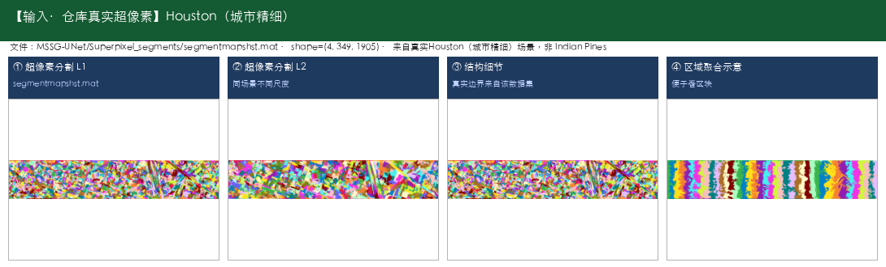

- **输出数据示例：** [Houston] 输出为同场景像素级分类图（15类着色）

  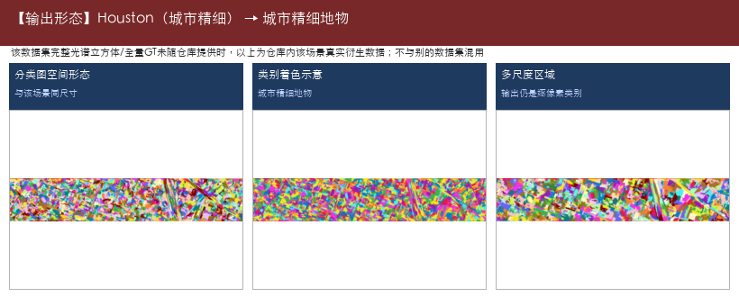

- **典型用途：**

  - 城市土地利用一张图
  - 区分道路/建筑/绿地/停车场等
  - 规划底图支撑
  - 交通设施识别辅助

- **源码/论文入口：** 仓库未提供链接

---

#### 37. NCGLF2 —— 高光谱地物分类

- **仓库路径：** `2023/NCGLF2`
- **论文/题目：** NCGLF2：Network combining global and local features for fusion of multisource remote sensing data
- **能识别什么（摘要）：** Houston2013（城市精细地物（Houston 2013），共15类；2013 IEEE GRSS Data Fusion Contest）

**能识别什么（完整类别明细）：**

- **Houston2013（城市精细地物（Houston 2013），共15类；2013 IEEE GRSS Data Fusion Contest）**

  - 1. 健康草地（Healthy grass）
  - 2. 胁迫草地（Stressed grass）
  - 3. 合成草地（Synthetic grass）
  - 4. 树木（Trees）
  - 5. 土壤（Soil）
  - 6. 水体（Water）
  - 7. 居民区（Residential）
  - 8. 商业区（Commercial）
  - 9. 道路（Road）
  - 10. 高速公路（Highway）
  - 11. 铁路（Railway）
  - 12. 停车场1（Parking Lot 1）
  - 13. 停车场2（Parking Lot 2）
  - 14. 网球场（Tennis Court）
  - 15. 跑道（Running Track）

- **代码中的数据集：** Houston2013

- **输入数据示例：** [Houston2013] 城市精细地物（Houston 2013），15类；仓库真实超像素 `segmentmapshst.mat`；完整数据建议存 `_raw_datasets/Houston2013/`

  

- **输出数据示例：** [Houston2013] 输出为同场景像素级分类图（15类着色）

  

- **典型用途：**

  - 城市土地利用一张图
  - 区分道路/建筑/绿地/停车场等
  - 规划底图支撑
  - 交通设施识别辅助

- **源码/论文入口：** https://github.com/renqi1998

---

#### 38. OSICN —— 高光谱地物分类

- **仓库路径：** `2023/OSICN`
- **论文/题目：** Can Spectral Information Work While Extracting Spatial Distribution? — An Online Spectral Information Compensation Network for HSI Classification
- **能识别什么（摘要）：** Salinas（农业区蔬菜/葡萄园/裸土，共16类；512×217，常用204波段）；Botswana（三角洲沼泽/林地，共14类；常用145波段，400–2500nm）；WHU-Hi（无人机精细农业/地物，共若干类；WHU-Hi-HanChuan / HongHu / LongKou 等子数据集类别不同）

**能识别什么（完整类别明细）：**

- **Salinas（农业区蔬菜/葡萄园/裸土，共16类；512×217，常用204波段）**

  - 1. 西兰花绿杂草1（Brocoli_green_weeds_1）
  - 2. 西兰花绿杂草2（Brocoli_green_weeds_2）
  - 3. 休耕地（Fallow）
  - 4. 休耕地-粗耕（Fallow_rough_plow）
  - 5. 休耕地-平整（Fallow_smooth）
  - 6. 茬地（Stubble）
  - 7. 芹菜（Celery）
  - 8. 葡萄园-未修剪（Grapes_untrained）
  - 9. 葡萄园发育土壤（Soil_vinyard_develop）
  - 10. 玉米衰老绿杂草（Corn_senesced_green_weeds）
  - 11. 生菜长叶4周（Lettuce_romaine_4wk）
  - 12. 生菜长叶5周（Lettuce_romaine_5wk）
  - 13. 生菜长叶6周（Lettuce_romaine_6wk）
  - 14. 生菜长叶7周（Lettuce_romaine_7wk）
  - 15. 葡萄园-未修剪2（Vinyard_untrained）
  - 16. 葡萄园-垂直棚架（Vinyard_vertical_trellis）

- **Botswana（三角洲沼泽/林地，共14类；常用145波段，400–2500nm）**

  - 1. 水体（Water）
  - 2. 河马草（Hippo grass）
  - 3. 洪泛平原草地1（Floodplain grasses1）
  - 4. 洪泛平原草地2（Floodplain grasses2）
  - 5. 芦苇1（Reeds1）
  - 6. 河岸带（Riparian）
  - 7. 火烧迹地（Firescar2）
  - 8. 岛屿内部（Island interior）
  - 9. 金合欢林地（Acacia woodlands）
  - 10. 金合欢灌丛（Acacia shrublands）
  - 11. 金合欢草地（Acacia grasslands）
  - 12. 矮mopane（Short mopane）
  - 13. 混交mopane（Mixed mopane）
  - 14. 裸露土壤（Exposed soils）

- **WHU-Hi（无人机精细农业/地物，共若干类；WHU-Hi-HanChuan / HongHu / LongKou 等子数据集类别不同）**

  - 说明：WHU-Hi 含多个子场景，类别不完全相同。
  - 常见包含：草莓、水稻、大豆、各类蔬菜、道路、裸土、水体等。
  - 请下载后按子数据集标签文件核对完整类别表。

- **代码中的数据集：** Salinas、Botswana、WHU-Hi

- **输入数据示例：** [Salinas] 农业区蔬菜/葡萄园/裸土，16类；真实标签 `_raw_datasets/Salinas_gt.mat`（512×217）+ 超像素；影像请下载 `Salinas_corrected.mat`；[Botswana] 三角洲沼泽/林地，14类；仓库真实超像素 `segmentmapsbot.mat`；完整数据请下载到 `_raw_datasets/`

  

  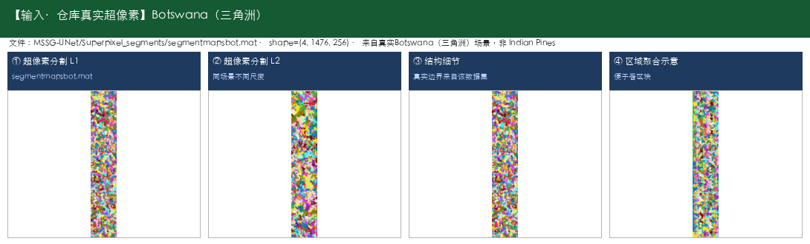

- **输出数据示例：** [Salinas] 输出为同场景像素级分类图（16类着色）；[Botswana] 输出为同场景像素级分类图（14类着色）

  

  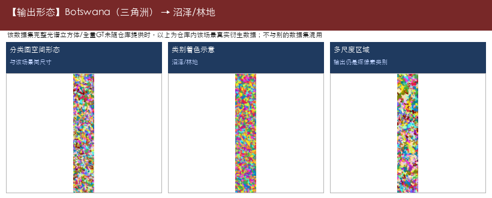

- **典型用途：**

  - 作物种植结构调查
  - 田块地类一张图
  - 区分玉米/大豆等细类
  - 湿地土地覆盖监测
  - 水体/沼泽/林地区分

- **源码/论文入口：** https://github.com/jqyang22/OSICN

---

#### 39. pResNet-HSI —— 高光谱地物分类

- **仓库路径：** `2018/pResNet-HSI`
- **论文/题目：** Deep Pyramidal Residual Networks for Hyperspectral Image Classification
- **能识别什么（摘要）：** Indian Pines（农田作物与植被（印第安纳松），共16类；145×145，常用200波段，光谱约0.4–2.5μm（400–2500nm））；Salinas（农业区蔬菜/葡萄园/裸土，共16类；512×217，常用204波段）；Pavia University（城市道路/建筑/植被，共9类；610×340（常用），约103波段）；Kennedy Space Center (KSC)（海岸湿地植被与土地覆盖，共13类；常用176波段，400–2500nm）

**能识别什么（完整类别明细）：**

- **Indian Pines（农田作物与植被（印第安纳松），共16类；145×145，常用200波段，光谱约0.4–2.5μm（400–2500nm））**

  - 1. 苜蓿（Alfalfa）
  - 2. 玉米-非耕（Corn-notill）
  - 3. 玉米-少耕（Corn-mintill）
  - 4. 玉米（Corn）
  - 5. 牧草-牧场（Grass-pasture）
  - 6. 牧草-树木（Grass-trees）
  - 7. 牧草-已刈（Grass-pasture-mowed）
  - 8. 干草堆/干草仓库（Hay-windrowed）
  - 9. 燕麦（Oats）
  - 10. 大豆-非耕（Soybean-notill）
  - 11. 大豆-少耕（Soybean-mintill）
  - 12. 大豆干净（Soybean-clean）
  - 13. 小麦（Wheat）
  - 14. 树林（Woods）
  - 15. 建筑-草-树-车道（Buildings-Grass-Trees-Drives）
  - 16. 石钢塔（Stone-Steel-Towers）

- **Salinas（农业区蔬菜/葡萄园/裸土，共16类；512×217，常用204波段）**

  - 1. 西兰花绿杂草1（Brocoli_green_weeds_1）
  - 2. 西兰花绿杂草2（Brocoli_green_weeds_2）
  - 3. 休耕地（Fallow）
  - 4. 休耕地-粗耕（Fallow_rough_plow）
  - 5. 休耕地-平整（Fallow_smooth）
  - 6. 茬地（Stubble）
  - 7. 芹菜（Celery）
  - 8. 葡萄园-未修剪（Grapes_untrained）
  - 9. 葡萄园发育土壤（Soil_vinyard_develop）
  - 10. 玉米衰老绿杂草（Corn_senesced_green_weeds）
  - 11. 生菜长叶4周（Lettuce_romaine_4wk）
  - 12. 生菜长叶5周（Lettuce_romaine_5wk）
  - 13. 生菜长叶6周（Lettuce_romaine_6wk）
  - 14. 生菜长叶7周（Lettuce_romaine_7wk）
  - 15. 葡萄园-未修剪2（Vinyard_untrained）
  - 16. 葡萄园-垂直棚架（Vinyard_vertical_trellis）

- **Pavia University（城市道路/建筑/植被，共9类；610×340（常用），约103波段）**

  - 1. 沥青路面（Asphalt）
  - 2. 草地/草甸（Meadows）
  - 3. 砾石（Gravel）
  - 4. 树木（Trees）
  - 5. 涂装金属板（Painted metal sheets）
  - 6. 裸土（Bare Soil）
  - 7. 柏油（Bitumen）
  - 8. 自锁砖块（Self-Blocking Bricks）
  - 9. 阴影（Shadows）

- **Kennedy Space Center (KSC)（海岸湿地植被与土地覆盖，共13类；常用176波段，400–2500nm）**

  - 1. 灌木丛（Scrub）
  - 2. 柳栎沼泽（Willow swamp）
  - 3. CP旱地树丛（CP hammock）
  - 4. 湿地松（Slash pine）
  - 5. 橡树/阔叶（Oak/Broadleaf）
  - 6. 硬木（Hardwood）
  - 7. 沼泽（Swamp）
  - 8. 禾本沼泽（Graminoid marsh）
  - 9. 米草沼泽（Spartina marsh）
  - 10. 香蒲沼泽（Cattail marsh）
  - 11. 盐沼（Salt marsh）
  - 12. 泥滩（Mud flats）
  - 13. 水体（Water）

- **代码中的数据集：** Indian Pines、Salinas、Pavia University、Kennedy Space Center (KSC)

- **输入数据示例：** [Indian Pines] 农田作物与植被（印第安纳松），16类；仓库真实原始立方体 `HSI_data/Indian_pines_corrected.mat`（145×145×200）+ `Indian_pines_gt.mat`；[Salinas] 农业区蔬菜/葡萄园/裸土，16类；真实标签 `_raw_datasets/Salinas_gt.mat`（512×217）+ 超像素；影像请下载 `Salinas_corrected.mat`

  

  

- **输出数据示例：** [Indian Pines] 输出为同场景像素级分类图（16类着色）；[Salinas] 输出为同场景像素级分类图（16类着色）

  

  

- **典型用途：**

  - 作物种植结构调查
  - 田块地类一张图
  - 区分玉米/大豆等细类
  - 城市土地利用一张图
  - 区分道路/建筑/绿地/停车场等
  - 规划底图支撑
  - 湿地土地覆盖监测

- **源码/论文入口：** 仓库未提供链接

---

#### 40. SACNet —— 高光谱地物分类

- **仓库路径：** `2021/SACNet`
- **论文/题目：** Self-Attention Context Network Addressing the Threat of Adversarial Attacks for Hyperspectral Image Classification
- **能识别什么（摘要）：** Indian Pines（农田作物与植被（印第安纳松），共16类；145×145，常用200波段，光谱约0.4–2.5μm（400–2500nm））；Salinas（农业区蔬菜/葡萄园/裸土，共16类；512×217，常用204波段）；Pavia University（城市道路/建筑/植被，共9类；610×340（常用），约103波段）；Kennedy Space Center (KSC)（海岸湿地植被与土地覆盖，共13类；常用176波段，400–2500nm）；Houston（城市精细地物，共15类；IEEE GRSS 城市场景（常见 Houston 2013 设定））

**能识别什么（完整类别明细）：**

- **Indian Pines（农田作物与植被（印第安纳松），共16类；145×145，常用200波段，光谱约0.4–2.5μm（400–2500nm））**

  - 1. 苜蓿（Alfalfa）
  - 2. 玉米-非耕（Corn-notill）
  - 3. 玉米-少耕（Corn-mintill）
  - 4. 玉米（Corn）
  - 5. 牧草-牧场（Grass-pasture）
  - 6. 牧草-树木（Grass-trees）
  - 7. 牧草-已刈（Grass-pasture-mowed）
  - 8. 干草堆/干草仓库（Hay-windrowed）
  - 9. 燕麦（Oats）
  - 10. 大豆-非耕（Soybean-notill）
  - 11. 大豆-少耕（Soybean-mintill）
  - 12. 大豆干净（Soybean-clean）
  - 13. 小麦（Wheat）
  - 14. 树林（Woods）
  - 15. 建筑-草-树-车道（Buildings-Grass-Trees-Drives）
  - 16. 石钢塔（Stone-Steel-Towers）

- **Salinas（农业区蔬菜/葡萄园/裸土，共16类；512×217，常用204波段）**

  - 1. 西兰花绿杂草1（Brocoli_green_weeds_1）
  - 2. 西兰花绿杂草2（Brocoli_green_weeds_2）
  - 3. 休耕地（Fallow）
  - 4. 休耕地-粗耕（Fallow_rough_plow）
  - 5. 休耕地-平整（Fallow_smooth）
  - 6. 茬地（Stubble）
  - 7. 芹菜（Celery）
  - 8. 葡萄园-未修剪（Grapes_untrained）
  - 9. 葡萄园发育土壤（Soil_vinyard_develop）
  - 10. 玉米衰老绿杂草（Corn_senesced_green_weeds）
  - 11. 生菜长叶4周（Lettuce_romaine_4wk）
  - 12. 生菜长叶5周（Lettuce_romaine_5wk）
  - 13. 生菜长叶6周（Lettuce_romaine_6wk）
  - 14. 生菜长叶7周（Lettuce_romaine_7wk）
  - 15. 葡萄园-未修剪2（Vinyard_untrained）
  - 16. 葡萄园-垂直棚架（Vinyard_vertical_trellis）

- **Pavia University（城市道路/建筑/植被，共9类；610×340（常用），约103波段）**

  - 1. 沥青路面（Asphalt）
  - 2. 草地/草甸（Meadows）
  - 3. 砾石（Gravel）
  - 4. 树木（Trees）
  - 5. 涂装金属板（Painted metal sheets）
  - 6. 裸土（Bare Soil）
  - 7. 柏油（Bitumen）
  - 8. 自锁砖块（Self-Blocking Bricks）
  - 9. 阴影（Shadows）

- **Kennedy Space Center (KSC)（海岸湿地植被与土地覆盖，共13类；常用176波段，400–2500nm）**

  - 1. 灌木丛（Scrub）
  - 2. 柳栎沼泽（Willow swamp）
  - 3. CP旱地树丛（CP hammock）
  - 4. 湿地松（Slash pine）
  - 5. 橡树/阔叶（Oak/Broadleaf）
  - 6. 硬木（Hardwood）
  - 7. 沼泽（Swamp）
  - 8. 禾本沼泽（Graminoid marsh）
  - 9. 米草沼泽（Spartina marsh）
  - 10. 香蒲沼泽（Cattail marsh）
  - 11. 盐沼（Salt marsh）
  - 12. 泥滩（Mud flats）
  - 13. 水体（Water）

- **Houston（城市精细地物，共15类；IEEE GRSS 城市场景（常见 Houston 2013 设定））**

  - 1. 健康草地（Healthy grass）
  - 2. 胁迫草地（Stressed grass）
  - 3. 合成草地（Synthetic grass）
  - 4. 树木（Trees）
  - 5. 土壤（Soil）
  - 6. 水体（Water）
  - 7. 居民区（Residential）
  - 8. 商业区（Commercial）
  - 9. 道路（Road）
  - 10. 高速公路（Highway）
  - 11. 铁路（Railway）
  - 12. 停车场1（Parking Lot 1）
  - 13. 停车场2（Parking Lot 2）
  - 14. 网球场（Tennis Court）
  - 15. 跑道（Running Track）

- **代码中的数据集：** Indian Pines、Salinas、Pavia University、Kennedy Space Center (KSC)、Houston

- **输入数据示例：** [Indian Pines] 农田作物与植被（印第安纳松），16类；仓库真实原始立方体 `HSI_data/Indian_pines_corrected.mat`（145×145×200）+ `Indian_pines_gt.mat`；[Salinas] 农业区蔬菜/葡萄园/裸土，16类；真实标签 `_raw_datasets/Salinas_gt.mat`（512×217）+ 超像素；影像请下载 `Salinas_corrected.mat`

  

  

- **输出数据示例：** [Indian Pines] 输出为同场景像素级分类图（16类着色）；[Salinas] 输出为同场景像素级分类图（16类着色）

  

  

- **典型用途：**

  - 对抗扰动稳健性评测
  - 作物种植结构调查
  - 田块地类一张图
  - 区分玉米/大豆等细类
  - 城市土地利用一张图
  - 区分道路/建筑/绿地/停车场等
  - 规划底图支撑

- **源码/论文入口：** 仓库未提供链接

---

#### 41. SGMAE —— 高光谱地物分类

- **仓库路径：** `2025/SGMAE`
- **论文/题目：** SGMAE:Self-Supervised Graph Masked Autoencoders for Hyperspectral Image Classification
- **能识别什么（摘要）：** Houston2018（城市精细地物（Houston 2018），共20类；2018 IEEE GRSS Data Fusion Contest（以官方说明为准））

**能识别什么（完整类别明细）：**

- **Houston2018（城市精细地物（Houston 2018），共20类；2018 IEEE GRSS Data Fusion Contest（以官方说明为准））**

  - 1. Healthy grass（健康草地）
  - 2. Stressed grass（胁迫草地）
  - 3. Artificial turf（人造草皮）
  - 4. Evergreen trees（常绿树）
  - 5. Deciduous trees（落叶树）
  - 6. Bare earth（裸地）
  - 7. Water（水体）
  - 8. Residential buildings（居民建筑）
  - 9. Non-residential buildings（非居民建筑）
  - 10. Roads（道路）
  - 11. Sidewalks（人行道）
  - 12. Crosswalks（人行横道）
  - 13. Major thoroughfares（主干道）
  - 14. Highways（高速公路）
  - 15. Railways（铁路）
  - 16. Paved parking lots（铺装停车场）
  - 17. Unpaved parking lots（未铺装停车场）
  - 18. Cars（车辆）
  - 19. Trains（火车）
  - 20. Stadium seats（体育场座席）

- **代码中的数据集：** Houston2018

- **输入数据示例：** [Houston2018] 城市精细地物（Houston 2018），20类；仓库真实超像素 `segmentmapshstu.mat`；完整数据建议存 `_raw_datasets/Houston2018/`

  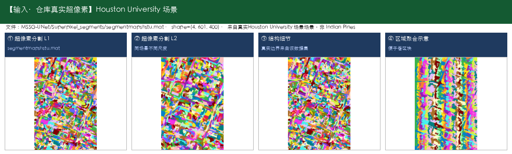

- **输出数据示例：** [Houston2018] 输出为同场景像素级分类图（20类着色）

  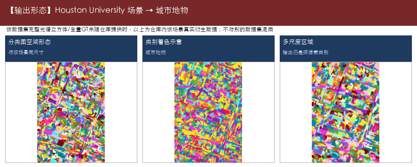

- **典型用途：**

  - 城市土地利用一张图
  - 区分道路/建筑/绿地/停车场等
  - 规划底图支撑
  - 交通设施识别辅助

- **源码/论文入口：** https://github.com/copawloroous/SGMAE

---

#### 42. SKDN —— 高光谱地物分类

- **仓库路径：** `2024/SKDN`
- **论文/题目：** Random Shuffling Data for Hyperspectral Image Classification with Siamese and Knowledge Distillation Network
- **能识别什么（摘要）：** （代码未明确数据集时，类别以实际标签文件为准）

**能识别什么（完整类别明细）：**

- （无明确公开数据集类别表；下载数据后可按标签文件补全）

- **代码中的数据集：** 未明确

- **输入数据示例：** 未明确数据集且无原始文件，不展示替身数据

  > （原始立方体待下载后补图；当前不顶替）

- **输出数据示例：** 一般为像素级分类图 + OA/AA/Kappa

  > （无对应输出示例图，见文字说明）

- **典型用途：**

  - 地物制图
  - 调查底图
  - 方案演示

- **源码/论文入口：** https://github.com/Candy-CY/Random_Shuffling_Data_for_Hyperspectral_Image_Classification_with_SKDN

---

#### 43. SSGRN —— 高光谱地物分类

- **仓库路径：** `2023/SSGRN`
- **论文/题目：** Spectral-Spatial Global Graph Reasoning for Hyperspectral Image Classification
- **能识别什么（摘要）：** Indian Pines（农田作物与植被（印第安纳松），共16类；145×145，常用200波段，光谱约0.4–2.5μm（400–2500nm））；Salinas（农业区蔬菜/葡萄园/裸土，共16类；512×217，常用204波段）；Pavia University（城市道路/建筑/植被，共9类；610×340（常用），约103波段）；Kennedy Space Center (KSC)（海岸湿地植被与土地覆盖，共13类；常用176波段，400–2500nm）；Houston（城市精细地物，共15类；IEEE GRSS 城市场景（常见 Houston 2013 设定））

**能识别什么（完整类别明细）：**

- **Indian Pines（农田作物与植被（印第安纳松），共16类；145×145，常用200波段，光谱约0.4–2.5μm（400–2500nm））**

  - 1. 苜蓿（Alfalfa）
  - 2. 玉米-非耕（Corn-notill）
  - 3. 玉米-少耕（Corn-mintill）
  - 4. 玉米（Corn）
  - 5. 牧草-牧场（Grass-pasture）
  - 6. 牧草-树木（Grass-trees）
  - 7. 牧草-已刈（Grass-pasture-mowed）
  - 8. 干草堆/干草仓库（Hay-windrowed）
  - 9. 燕麦（Oats）
  - 10. 大豆-非耕（Soybean-notill）
  - 11. 大豆-少耕（Soybean-mintill）
  - 12. 大豆干净（Soybean-clean）
  - 13. 小麦（Wheat）
  - 14. 树林（Woods）
  - 15. 建筑-草-树-车道（Buildings-Grass-Trees-Drives）
  - 16. 石钢塔（Stone-Steel-Towers）

- **Salinas（农业区蔬菜/葡萄园/裸土，共16类；512×217，常用204波段）**

  - 1. 西兰花绿杂草1（Brocoli_green_weeds_1）
  - 2. 西兰花绿杂草2（Brocoli_green_weeds_2）
  - 3. 休耕地（Fallow）
  - 4. 休耕地-粗耕（Fallow_rough_plow）
  - 5. 休耕地-平整（Fallow_smooth）
  - 6. 茬地（Stubble）
  - 7. 芹菜（Celery）
  - 8. 葡萄园-未修剪（Grapes_untrained）
  - 9. 葡萄园发育土壤（Soil_vinyard_develop）
  - 10. 玉米衰老绿杂草（Corn_senesced_green_weeds）
  - 11. 生菜长叶4周（Lettuce_romaine_4wk）
  - 12. 生菜长叶5周（Lettuce_romaine_5wk）
  - 13. 生菜长叶6周（Lettuce_romaine_6wk）
  - 14. 生菜长叶7周（Lettuce_romaine_7wk）
  - 15. 葡萄园-未修剪2（Vinyard_untrained）
  - 16. 葡萄园-垂直棚架（Vinyard_vertical_trellis）

- **Pavia University（城市道路/建筑/植被，共9类；610×340（常用），约103波段）**

  - 1. 沥青路面（Asphalt）
  - 2. 草地/草甸（Meadows）
  - 3. 砾石（Gravel）
  - 4. 树木（Trees）
  - 5. 涂装金属板（Painted metal sheets）
  - 6. 裸土（Bare Soil）
  - 7. 柏油（Bitumen）
  - 8. 自锁砖块（Self-Blocking Bricks）
  - 9. 阴影（Shadows）

- **Kennedy Space Center (KSC)（海岸湿地植被与土地覆盖，共13类；常用176波段，400–2500nm）**

  - 1. 灌木丛（Scrub）
  - 2. 柳栎沼泽（Willow swamp）
  - 3. CP旱地树丛（CP hammock）
  - 4. 湿地松（Slash pine）
  - 5. 橡树/阔叶（Oak/Broadleaf）
  - 6. 硬木（Hardwood）
  - 7. 沼泽（Swamp）
  - 8. 禾本沼泽（Graminoid marsh）
  - 9. 米草沼泽（Spartina marsh）
  - 10. 香蒲沼泽（Cattail marsh）
  - 11. 盐沼（Salt marsh）
  - 12. 泥滩（Mud flats）
  - 13. 水体（Water）

- **Houston（城市精细地物，共15类；IEEE GRSS 城市场景（常见 Houston 2013 设定））**

  - 1. 健康草地（Healthy grass）
  - 2. 胁迫草地（Stressed grass）
  - 3. 合成草地（Synthetic grass）
  - 4. 树木（Trees）
  - 5. 土壤（Soil）
  - 6. 水体（Water）
  - 7. 居民区（Residential）
  - 8. 商业区（Commercial）
  - 9. 道路（Road）
  - 10. 高速公路（Highway）
  - 11. 铁路（Railway）
  - 12. 停车场1（Parking Lot 1）
  - 13. 停车场2（Parking Lot 2）
  - 14. 网球场（Tennis Court）
  - 15. 跑道（Running Track）

- **代码中的数据集：** Indian Pines、Salinas、Pavia University、Kennedy Space Center (KSC)、Houston

- **输入数据示例：** [Indian Pines] 农田作物与植被（印第安纳松），16类；仓库真实原始立方体 `HSI_data/Indian_pines_corrected.mat`（145×145×200）+ `Indian_pines_gt.mat`；[Salinas] 农业区蔬菜/葡萄园/裸土，16类；真实标签 `_raw_datasets/Salinas_gt.mat`（512×217）+ 超像素；影像请下载 `Salinas_corrected.mat`

  

  

- **输出数据示例：** [Indian Pines] 输出为同场景像素级分类图（16类着色）；[Salinas] 输出为同场景像素级分类图（16类着色）

  

  

- **典型用途：**

  - 作物种植结构调查
  - 田块地类一张图
  - 区分玉米/大豆等细类
  - 城市土地利用一张图
  - 区分道路/建筑/绿地/停车场等
  - 规划底图支撑
  - 交通设施识别辅助

- **源码/论文入口：** https://github.com/DotWang/SSGRN.git

---

#### 44. SSNSC —— 高光谱地物分类

- **仓库路径：** `2022/SSNSC`
- **论文/题目：** Spectral-Spatial Nearest Subspace Classifier for Hyperspectral Image Classification
- **能识别什么（摘要）：** Indian Pines（农田作物与植被（印第安纳松），共16类；145×145，常用200波段，光谱约0.4–2.5μm（400–2500nm））；Salinas（农业区蔬菜/葡萄园/裸土，共16类；512×217，常用204波段）；Pavia University（城市道路/建筑/植被，共9类；610×340（常用），约103波段）；Pavia Centre（城市中心地物，共9类；约1096×715有效区，约102波段）；Kennedy Space Center (KSC)（海岸湿地植被与土地覆盖，共13类；常用176波段，400–2500nm）；Botswana（三角洲沼泽/林地，共14类；常用145波段，400–2500nm）

**能识别什么（完整类别明细）：**

- **Indian Pines（农田作物与植被（印第安纳松），共16类；145×145，常用200波段，光谱约0.4–2.5μm（400–2500nm））**

  - 1. 苜蓿（Alfalfa）
  - 2. 玉米-非耕（Corn-notill）
  - 3. 玉米-少耕（Corn-mintill）
  - 4. 玉米（Corn）
  - 5. 牧草-牧场（Grass-pasture）
  - 6. 牧草-树木（Grass-trees）
  - 7. 牧草-已刈（Grass-pasture-mowed）
  - 8. 干草堆/干草仓库（Hay-windrowed）
  - 9. 燕麦（Oats）
  - 10. 大豆-非耕（Soybean-notill）
  - 11. 大豆-少耕（Soybean-mintill）
  - 12. 大豆干净（Soybean-clean）
  - 13. 小麦（Wheat）
  - 14. 树林（Woods）
  - 15. 建筑-草-树-车道（Buildings-Grass-Trees-Drives）
  - 16. 石钢塔（Stone-Steel-Towers）

- **Salinas（农业区蔬菜/葡萄园/裸土，共16类；512×217，常用204波段）**

  - 1. 西兰花绿杂草1（Brocoli_green_weeds_1）
  - 2. 西兰花绿杂草2（Brocoli_green_weeds_2）
  - 3. 休耕地（Fallow）
  - 4. 休耕地-粗耕（Fallow_rough_plow）
  - 5. 休耕地-平整（Fallow_smooth）
  - 6. 茬地（Stubble）
  - 7. 芹菜（Celery）
  - 8. 葡萄园-未修剪（Grapes_untrained）
  - 9. 葡萄园发育土壤（Soil_vinyard_develop）
  - 10. 玉米衰老绿杂草（Corn_senesced_green_weeds）
  - 11. 生菜长叶4周（Lettuce_romaine_4wk）
  - 12. 生菜长叶5周（Lettuce_romaine_5wk）
  - 13. 生菜长叶6周（Lettuce_romaine_6wk）
  - 14. 生菜长叶7周（Lettuce_romaine_7wk）
  - 15. 葡萄园-未修剪2（Vinyard_untrained）
  - 16. 葡萄园-垂直棚架（Vinyard_vertical_trellis）

- **Pavia University（城市道路/建筑/植被，共9类；610×340（常用），约103波段）**

  - 1. 沥青路面（Asphalt）
  - 2. 草地/草甸（Meadows）
  - 3. 砾石（Gravel）
  - 4. 树木（Trees）
  - 5. 涂装金属板（Painted metal sheets）
  - 6. 裸土（Bare Soil）
  - 7. 柏油（Bitumen）
  - 8. 自锁砖块（Self-Blocking Bricks）
  - 9. 阴影（Shadows）

- **Pavia Centre（城市中心地物，共9类；约1096×715有效区，约102波段）**

  - 1. 水体（Water）
  - 2. 树木（Trees）
  - 3. 沥青（Asphalt）
  - 4. 自锁砖块（Self-Blocking Bricks）
  - 5. 柏油（Bitumen）
  - 6. 瓦片（Tiles）
  - 7. 阴影（Shadows）
  - 8. 草地/草甸（Meadows）
  - 9. 裸土（Bare Soil）

- **Kennedy Space Center (KSC)（海岸湿地植被与土地覆盖，共13类；常用176波段，400–2500nm）**

  - 1. 灌木丛（Scrub）
  - 2. 柳栎沼泽（Willow swamp）
  - 3. CP旱地树丛（CP hammock）
  - 4. 湿地松（Slash pine）
  - 5. 橡树/阔叶（Oak/Broadleaf）
  - 6. 硬木（Hardwood）
  - 7. 沼泽（Swamp）
  - 8. 禾本沼泽（Graminoid marsh）
  - 9. 米草沼泽（Spartina marsh）
  - 10. 香蒲沼泽（Cattail marsh）
  - 11. 盐沼（Salt marsh）
  - 12. 泥滩（Mud flats）
  - 13. 水体（Water）

- **Botswana（三角洲沼泽/林地，共14类；常用145波段，400–2500nm）**

  - 1. 水体（Water）
  - 2. 河马草（Hippo grass）
  - 3. 洪泛平原草地1（Floodplain grasses1）
  - 4. 洪泛平原草地2（Floodplain grasses2）
  - 5. 芦苇1（Reeds1）
  - 6. 河岸带（Riparian）
  - 7. 火烧迹地（Firescar2）
  - 8. 岛屿内部（Island interior）
  - 9. 金合欢林地（Acacia woodlands）
  - 10. 金合欢灌丛（Acacia shrublands）
  - 11. 金合欢草地（Acacia grasslands）
  - 12. 矮mopane（Short mopane）
  - 13. 混交mopane（Mixed mopane）
  - 14. 裸露土壤（Exposed soils）

- **代码中的数据集：** Indian Pines、Salinas、Pavia University、Pavia Centre、Kennedy Space Center (KSC)、Botswana

- **输入数据示例：** 本模型目录缩减版 IP（8类标签，与标准16类不同）；[Indian Pines] 农田作物与植被（印第安纳松），16类；仓库真实原始立方体 `HSI_data/Indian_pines_corrected.mat`（145×145×200）+ `Indian_pines_gt.mat`；[Salinas] 农业区蔬菜/葡萄园/裸土，16类；真实标签 `_raw_datasets/Salinas_gt.mat`（512×217）+ 超像素；影像请下载 `Salinas_corrected.mat`

  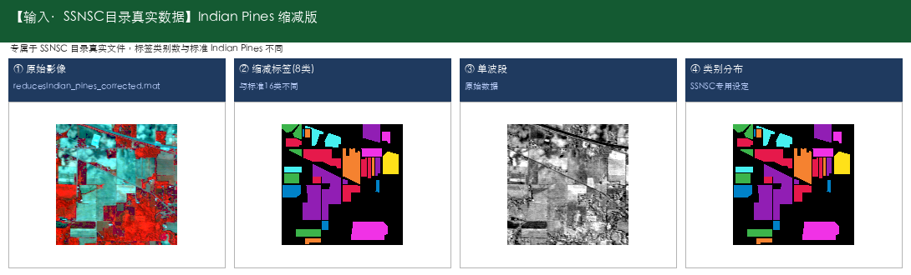

  

- **输出数据示例：** [Indian Pines] 输出为同场景像素级分类图（16类着色）；[Salinas] 输出为同场景像素级分类图（16类着色）

  

  

- **典型用途：**

  - 作物种植结构调查
  - 田块地类一张图
  - 区分玉米/大豆等细类
  - 城市土地利用一张图
  - 区分道路/建筑/绿地/停车场等
  - 规划底图支撑
  - 湿地土地覆盖监测

- **源码/论文入口：** https://doi.org/10.1080/01431161.2022.2055986

---

#### 45. SSRN —— 高光谱地物分类

- **仓库路径：** `2017/SSRN`
- **论文/题目：** Spectral–Spatial Residual Network for Hyperspectral Image Classification
- **能识别什么（摘要）：** Indian Pines（农田作物与植被（印第安纳松），共16类；145×145，常用200波段，光谱约0.4–2.5μm（400–2500nm））；Pavia University（城市道路/建筑/植被，共9类；610×340（常用），约103波段）

**能识别什么（完整类别明细）：**

- **Indian Pines（农田作物与植被（印第安纳松），共16类；145×145，常用200波段，光谱约0.4–2.5μm（400–2500nm））**

  - 1. 苜蓿（Alfalfa）
  - 2. 玉米-非耕（Corn-notill）
  - 3. 玉米-少耕（Corn-mintill）
  - 4. 玉米（Corn）
  - 5. 牧草-牧场（Grass-pasture）
  - 6. 牧草-树木（Grass-trees）
  - 7. 牧草-已刈（Grass-pasture-mowed）
  - 8. 干草堆/干草仓库（Hay-windrowed）
  - 9. 燕麦（Oats）
  - 10. 大豆-非耕（Soybean-notill）
  - 11. 大豆-少耕（Soybean-mintill）
  - 12. 大豆干净（Soybean-clean）
  - 13. 小麦（Wheat）
  - 14. 树林（Woods）
  - 15. 建筑-草-树-车道（Buildings-Grass-Trees-Drives）
  - 16. 石钢塔（Stone-Steel-Towers）

- **Pavia University（城市道路/建筑/植被，共9类；610×340（常用），约103波段）**

  - 1. 沥青路面（Asphalt）
  - 2. 草地/草甸（Meadows）
  - 3. 砾石（Gravel）
  - 4. 树木（Trees）
  - 5. 涂装金属板（Painted metal sheets）
  - 6. 裸土（Bare Soil）
  - 7. 柏油（Bitumen）
  - 8. 自锁砖块（Self-Blocking Bricks）
  - 9. 阴影（Shadows）

- **代码中的数据集：** Indian Pines、Pavia University

- **输入数据示例：** [Indian Pines] 农田作物与植被（印第安纳松），16类；仓库真实原始立方体 `HSI_data/Indian_pines_corrected.mat`（145×145×200）+ `Indian_pines_gt.mat`；[Pavia University] 城市道路/建筑/植被，9类；仓库真实标签 `TRpaviaU.mat`/`TSpaviaU.mat`（610×340）+ 超像素 `segmentmapspaviau.mat`；完整立方体请下载到 `_raw_datasets/PaviaU.mat`

  

  

- **输出数据示例：** [Indian Pines] 输出为同场景像素级分类图（16类着色）；[Pavia University] 输出为同场景像素级分类图（9类着色）

  

  

- **典型用途：**

  - 作物种植结构调查
  - 田块地类一张图
  - 区分玉米/大豆等细类
  - 城市土地利用一张图
  - 区分道路/建筑/绿地/停车场等
  - 规划底图支撑

- **源码/论文入口：** 仓库未提供链接

---

#### 46. TCRL —— 高光谱地物分类

- **仓库路径：** `2023/TCRL`
- **论文/题目：** TCRL: Triple Contrastive Representation Learning for Hyperspectral Image Classification With Noisy Labels
- **能识别什么（摘要）：** （代码未明确数据集时，类别以实际标签文件为准）

**能识别什么（完整类别明细）：**

- （无明确公开数据集类别表；下载数据后可按标签文件补全）

- **代码中的数据集：** 未明确

- **输入数据示例：** 未明确数据集且无原始文件，不展示替身数据

  > （原始立方体待下载后补图；当前不顶替）

- **输出数据示例：** 一般为像素级分类图 + OA/AA/Kappa

  > （无对应输出示例图，见文字说明）

- **典型用途：**

  - 标签噪声下稳健训练

- **源码/论文入口：** https://github.com/chengtan9907/Co-learning-Learning-from-noisy-labels-with-self-supervision

---

#### 47. TP-Net —— 高光谱地物分类

- **仓库路径：** `2022/TP-Net`
- **论文/题目：** A-Triple-Path-Spectral-Spatial-Network-with-Interleave-Attention-for-Hyperspectral-Image-Classificat For HSI classification
- **能识别什么（摘要）：** （代码未明确数据集时，类别以实际标签文件为准）

**能识别什么（完整类别明细）：**

- （无明确公开数据集类别表；下载数据后可按标签文件补全）

- **代码中的数据集：** 未明确

- **输入数据示例：** 未明确数据集且无原始文件，不展示替身数据

  > （原始立方体待下载后补图；当前不顶替）

- **输出数据示例：** 一般为像素级分类图 + OA/AA/Kappa

  > （无对应输出示例图，见文字说明）

- **典型用途：**

  - 地物制图
  - 调查底图
  - 方案演示

- **源码/论文入口：** https://ieeexplore.ieee.org/document/9833261

---

### 少样本分类（标注很少也能用）（10 个）

#### 48. ACDFSL —— 少样本地物分类

- **仓库路径：** `2023/ACDFSL`
- **论文/题目：** Attentive Cross-Domain Few-Shot Learning in Hyperspectral Image Classification
- **能识别什么（摘要）：** Salinas（农业区蔬菜/葡萄园/裸土，共16类；512×217，常用204波段）；Pavia University（城市道路/建筑/植被，共9类；610×340（常用），约103波段）；Kennedy Space Center (KSC)（海岸湿地植被与土地覆盖，共13类；常用176波段，400–2500nm）

**能识别什么（完整类别明细）：**

- **Salinas（农业区蔬菜/葡萄园/裸土，共16类；512×217，常用204波段）**

  - 1. 西兰花绿杂草1（Brocoli_green_weeds_1）
  - 2. 西兰花绿杂草2（Brocoli_green_weeds_2）
  - 3. 休耕地（Fallow）
  - 4. 休耕地-粗耕（Fallow_rough_plow）
  - 5. 休耕地-平整（Fallow_smooth）
  - 6. 茬地（Stubble）
  - 7. 芹菜（Celery）
  - 8. 葡萄园-未修剪（Grapes_untrained）
  - 9. 葡萄园发育土壤（Soil_vinyard_develop）
  - 10. 玉米衰老绿杂草（Corn_senesced_green_weeds）
  - 11. 生菜长叶4周（Lettuce_romaine_4wk）
  - 12. 生菜长叶5周（Lettuce_romaine_5wk）
  - 13. 生菜长叶6周（Lettuce_romaine_6wk）
  - 14. 生菜长叶7周（Lettuce_romaine_7wk）
  - 15. 葡萄园-未修剪2（Vinyard_untrained）
  - 16. 葡萄园-垂直棚架（Vinyard_vertical_trellis）

- **Pavia University（城市道路/建筑/植被，共9类；610×340（常用），约103波段）**

  - 1. 沥青路面（Asphalt）
  - 2. 草地/草甸（Meadows）
  - 3. 砾石（Gravel）
  - 4. 树木（Trees）
  - 5. 涂装金属板（Painted metal sheets）
  - 6. 裸土（Bare Soil）
  - 7. 柏油（Bitumen）
  - 8. 自锁砖块（Self-Blocking Bricks）
  - 9. 阴影（Shadows）

- **Kennedy Space Center (KSC)（海岸湿地植被与土地覆盖，共13类；常用176波段，400–2500nm）**

  - 1. 灌木丛（Scrub）
  - 2. 柳栎沼泽（Willow swamp）
  - 3. CP旱地树丛（CP hammock）
  - 4. 湿地松（Slash pine）
  - 5. 橡树/阔叶（Oak/Broadleaf）
  - 6. 硬木（Hardwood）
  - 7. 沼泽（Swamp）
  - 8. 禾本沼泽（Graminoid marsh）
  - 9. 米草沼泽（Spartina marsh）
  - 10. 香蒲沼泽（Cattail marsh）
  - 11. 盐沼（Salt marsh）
  - 12. 泥滩（Mud flats）
  - 13. 水体（Water）

- **代码中的数据集：** Salinas、Pavia University、Kennedy Space Center (KSC)

- **输入数据示例：** [Salinas] 农业区蔬菜/葡萄园/裸土，16类；真实标签 `_raw_datasets/Salinas_gt.mat`（512×217）+ 超像素；影像请下载 `Salinas_corrected.mat`；[Pavia University] 城市道路/建筑/植被，9类；仓库真实标签 `TRpaviaU.mat`/`TSpaviaU.mat`（610×340）+ 超像素 `segmentmapspaviau.mat`；完整立方体请下载到 `_raw_datasets/PaviaU.mat`

  

  

- **输出数据示例：** [Salinas] 输出为同场景像素级分类图（16类着色）；[Pavia University] 输出为同场景像素级分类图（9类着色）

  

  

- **典型用途：**

  - 少标注制图
  - 新区域冷启动
  - 应急测绘
  - 跨地区迁移
  - 减少重复标注
  - 作物种植结构调查
  - 田块地类一张图

- **源码/论文入口：** 仓库未提供链接

---

#### 49. ASPC —— 少样本地物分类

- **仓库路径：** `2022/ASPC`
- **论文/题目：** Adaptive Spatial Pyramid Constraint for HSI Classification With Limited Training Samples
- **能识别什么（摘要）：** Salinas（农业区蔬菜/葡萄园/裸土，共16类；512×217，常用204波段）

**能识别什么（完整类别明细）：**

- **Salinas（农业区蔬菜/葡萄园/裸土，共16类；512×217，常用204波段）**

  - 1. 西兰花绿杂草1（Brocoli_green_weeds_1）
  - 2. 西兰花绿杂草2（Brocoli_green_weeds_2）
  - 3. 休耕地（Fallow）
  - 4. 休耕地-粗耕（Fallow_rough_plow）
  - 5. 休耕地-平整（Fallow_smooth）
  - 6. 茬地（Stubble）
  - 7. 芹菜（Celery）
  - 8. 葡萄园-未修剪（Grapes_untrained）
  - 9. 葡萄园发育土壤（Soil_vinyard_develop）
  - 10. 玉米衰老绿杂草（Corn_senesced_green_weeds）
  - 11. 生菜长叶4周（Lettuce_romaine_4wk）
  - 12. 生菜长叶5周（Lettuce_romaine_5wk）
  - 13. 生菜长叶6周（Lettuce_romaine_6wk）
  - 14. 生菜长叶7周（Lettuce_romaine_7wk）
  - 15. 葡萄园-未修剪2（Vinyard_untrained）
  - 16. 葡萄园-垂直棚架（Vinyard_vertical_trellis）

- **代码中的数据集：** Salinas

- **输入数据示例：** [Salinas] 农业区蔬菜/葡萄园/裸土，16类；真实标签 `_raw_datasets/Salinas_gt.mat`（512×217）+ 超像素；影像请下载 `Salinas_corrected.mat`

  

- **输出数据示例：** [Salinas] 输出为同场景像素级分类图（16类着色）

  

- **典型用途：**

  - 少标注制图
  - 新区域冷启动
  - 应急测绘
  - 作物种植结构调查
  - 田块地类一张图
  - 区分玉米/大豆等细类

- **源码/论文入口：** 仓库未提供链接

---

#### 50. CDMLC —— 少样本地物分类

- **仓库路径：** `2025/CDMLC`
- **论文/题目：** Few-shot Learning Based on Multi-level Contrast for Cross-domain Hyperspectral Image Classification
- **能识别什么（摘要）：** （代码未明确数据集时，类别以实际标签文件为准）

**能识别什么（完整类别明细）：**

- （无明确公开数据集类别表；下载数据后可按标签文件补全）

- **代码中的数据集：** 未明确

- **输入数据示例：** 未明确数据集且无原始文件，不展示替身数据

  > （原始立方体待下载后补图；当前不顶替）

- **输出数据示例：** 一般为像素级分类图 + OA/AA/Kappa

  > （无对应输出示例图，见文字说明）

- **典型用途：**

  - 少标注制图
  - 新区域冷启动
  - 应急测绘
  - 跨地区迁移
  - 减少重复标注

- **源码/论文入口：** https://github.com/AAAA-CS/CDMLC/tree/main

---

#### 51. CTF-SSCL —— 少样本地物分类；Transformer特征建模

- **仓库路径：** `2024/CTF-SSCL`
- **论文/题目：** CTF-SSCL: CNN-Transformer for Few-shot Hyperspectral Image Classification Assisted by Semisupervised Contrastive Learning
- **能识别什么（摘要）：** （代码未明确数据集时，类别以实际标签文件为准）

**能识别什么（完整类别明细）：**

- （无明确公开数据集类别表；下载数据后可按标签文件补全）

- **代码中的数据集：** 未明确

- **输入数据示例：** 未明确数据集且无原始文件，不展示替身数据

  > （原始立方体待下载后补图；当前不顶替）

- **输出数据示例：** 一般为像素级分类图 + OA/AA/Kappa

  > （无对应输出示例图，见文字说明）

- **典型用途：**

  - 少标注制图
  - 新区域冷启动
  - 应急测绘

- **源码/论文入口：** https://github.com/B-Xi/CTF-SSCL

---

#### 52. DM-MRN —— 少样本地物分类

- **仓库路径：** `2023/DM-MRN`
- **论文/题目：** Multistage Relation Network With Dual-Metric for Few-Shot Hyperspectral Image Classification
- **能识别什么（摘要）：** Salinas（农业区蔬菜/葡萄园/裸土，共16类；512×217，常用204波段）；Pavia University（城市道路/建筑/植被，共9类；610×340（常用），约103波段）；Houston2018（城市精细地物（Houston 2018），共20类；2018 IEEE GRSS Data Fusion Contest（以官方说明为准））

**能识别什么（完整类别明细）：**

- **Salinas（农业区蔬菜/葡萄园/裸土，共16类；512×217，常用204波段）**

  - 1. 西兰花绿杂草1（Brocoli_green_weeds_1）
  - 2. 西兰花绿杂草2（Brocoli_green_weeds_2）
  - 3. 休耕地（Fallow）
  - 4. 休耕地-粗耕（Fallow_rough_plow）
  - 5. 休耕地-平整（Fallow_smooth）
  - 6. 茬地（Stubble）
  - 7. 芹菜（Celery）
  - 8. 葡萄园-未修剪（Grapes_untrained）
  - 9. 葡萄园发育土壤（Soil_vinyard_develop）
  - 10. 玉米衰老绿杂草（Corn_senesced_green_weeds）
  - 11. 生菜长叶4周（Lettuce_romaine_4wk）
  - 12. 生菜长叶5周（Lettuce_romaine_5wk）
  - 13. 生菜长叶6周（Lettuce_romaine_6wk）
  - 14. 生菜长叶7周（Lettuce_romaine_7wk）
  - 15. 葡萄园-未修剪2（Vinyard_untrained）
  - 16. 葡萄园-垂直棚架（Vinyard_vertical_trellis）

- **Pavia University（城市道路/建筑/植被，共9类；610×340（常用），约103波段）**

  - 1. 沥青路面（Asphalt）
  - 2. 草地/草甸（Meadows）
  - 3. 砾石（Gravel）
  - 4. 树木（Trees）
  - 5. 涂装金属板（Painted metal sheets）
  - 6. 裸土（Bare Soil）
  - 7. 柏油（Bitumen）
  - 8. 自锁砖块（Self-Blocking Bricks）
  - 9. 阴影（Shadows）

- **Houston2018（城市精细地物（Houston 2018），共20类；2018 IEEE GRSS Data Fusion Contest（以官方说明为准））**

  - 1. Healthy grass（健康草地）
  - 2. Stressed grass（胁迫草地）
  - 3. Artificial turf（人造草皮）
  - 4. Evergreen trees（常绿树）
  - 5. Deciduous trees（落叶树）
  - 6. Bare earth（裸地）
  - 7. Water（水体）
  - 8. Residential buildings（居民建筑）
  - 9. Non-residential buildings（非居民建筑）
  - 10. Roads（道路）
  - 11. Sidewalks（人行道）
  - 12. Crosswalks（人行横道）
  - 13. Major thoroughfares（主干道）
  - 14. Highways（高速公路）
  - 15. Railways（铁路）
  - 16. Paved parking lots（铺装停车场）
  - 17. Unpaved parking lots（未铺装停车场）
  - 18. Cars（车辆）
  - 19. Trains（火车）
  - 20. Stadium seats（体育场座席）

- **代码中的数据集：** Salinas、Pavia University、Houston2018

- **输入数据示例：** [Salinas] 农业区蔬菜/葡萄园/裸土，16类；真实标签 `_raw_datasets/Salinas_gt.mat`（512×217）+ 超像素；影像请下载 `Salinas_corrected.mat`；[Pavia University] 城市道路/建筑/植被，9类；仓库真实标签 `TRpaviaU.mat`/`TSpaviaU.mat`（610×340）+ 超像素 `segmentmapspaviau.mat`；完整立方体请下载到 `_raw_datasets/PaviaU.mat`

  

  

- **输出数据示例：** [Salinas] 输出为同场景像素级分类图（16类着色）；[Pavia University] 输出为同场景像素级分类图（9类着色）

  

  

- **典型用途：**

  - 少标注制图
  - 新区域冷启动
  - 应急测绘
  - 作物种植结构调查
  - 田块地类一张图
  - 区分玉米/大豆等细类
  - 城市土地利用一张图

- **源码/论文入口：** https://ieeexplore.ieee.org/document/10111060

---

#### 53. MCMD-CFSL —— 少样本地物分类

- **仓库路径：** `2025/MCMD-CFSL`
- **论文/题目：** A Multimodal Prototype Correction and Multidimensional Knowledge Distillation Framework for Cross-Domain Few-Shot Hyperspectral Image Classification
- **能识别什么（摘要）：** （代码未明确数据集时，类别以实际标签文件为准）

**能识别什么（完整类别明细）：**

- （无明确公开数据集类别表；下载数据后可按标签文件补全）

- **代码中的数据集：** 未明确

- **输入数据示例：** 未明确数据集且无原始文件，不展示替身数据

  > （原始立方体待下载后补图；当前不顶替）

- **输出数据示例：** 一般为像素级分类图 + OA/AA/Kappa

  > （无对应输出示例图，见文字说明）

- **典型用途：**

  - 少标注制图
  - 新区域冷启动
  - 应急测绘
  - 跨地区迁移
  - 减少重复标注

- **源码/论文入口：** https://github.com/Li-ZK/MCMD-CFSL-2025

---

#### 54. MCNN-based_HSI_Classification —— 少样本地物分类

- **仓库路径：** `2020/MCNN-based_HSI_Classification`
- **论文/题目：** 3D Octave and 2D Vanilla Mixed Convolutional Neural Network for Hyperspectral Image Classification with Limited Samples
- **能识别什么（摘要）：** Indian Pines（农田作物与植被（印第安纳松），共16类；145×145，常用200波段，光谱约0.4–2.5μm（400–2500nm））；Salinas（农业区蔬菜/葡萄园/裸土，共16类；512×217，常用204波段）；Pavia University（城市道路/建筑/植被，共9类；610×340（常用），约103波段）；Kennedy Space Center (KSC)（海岸湿地植被与土地覆盖，共13类；常用176波段，400–2500nm）；Houston（城市精细地物，共15类；IEEE GRSS 城市场景（常见 Houston 2013 设定））

**能识别什么（完整类别明细）：**

- **Indian Pines（农田作物与植被（印第安纳松），共16类；145×145，常用200波段，光谱约0.4–2.5μm（400–2500nm））**

  - 1. 苜蓿（Alfalfa）
  - 2. 玉米-非耕（Corn-notill）
  - 3. 玉米-少耕（Corn-mintill）
  - 4. 玉米（Corn）
  - 5. 牧草-牧场（Grass-pasture）
  - 6. 牧草-树木（Grass-trees）
  - 7. 牧草-已刈（Grass-pasture-mowed）
  - 8. 干草堆/干草仓库（Hay-windrowed）
  - 9. 燕麦（Oats）
  - 10. 大豆-非耕（Soybean-notill）
  - 11. 大豆-少耕（Soybean-mintill）
  - 12. 大豆干净（Soybean-clean）
  - 13. 小麦（Wheat）
  - 14. 树林（Woods）
  - 15. 建筑-草-树-车道（Buildings-Grass-Trees-Drives）
  - 16. 石钢塔（Stone-Steel-Towers）

- **Salinas（农业区蔬菜/葡萄园/裸土，共16类；512×217，常用204波段）**

  - 1. 西兰花绿杂草1（Brocoli_green_weeds_1）
  - 2. 西兰花绿杂草2（Brocoli_green_weeds_2）
  - 3. 休耕地（Fallow）
  - 4. 休耕地-粗耕（Fallow_rough_plow）
  - 5. 休耕地-平整（Fallow_smooth）
  - 6. 茬地（Stubble）
  - 7. 芹菜（Celery）
  - 8. 葡萄园-未修剪（Grapes_untrained）
  - 9. 葡萄园发育土壤（Soil_vinyard_develop）
  - 10. 玉米衰老绿杂草（Corn_senesced_green_weeds）
  - 11. 生菜长叶4周（Lettuce_romaine_4wk）
  - 12. 生菜长叶5周（Lettuce_romaine_5wk）
  - 13. 生菜长叶6周（Lettuce_romaine_6wk）
  - 14. 生菜长叶7周（Lettuce_romaine_7wk）
  - 15. 葡萄园-未修剪2（Vinyard_untrained）
  - 16. 葡萄园-垂直棚架（Vinyard_vertical_trellis）

- **Pavia University（城市道路/建筑/植被，共9类；610×340（常用），约103波段）**

  - 1. 沥青路面（Asphalt）
  - 2. 草地/草甸（Meadows）
  - 3. 砾石（Gravel）
  - 4. 树木（Trees）
  - 5. 涂装金属板（Painted metal sheets）
  - 6. 裸土（Bare Soil）
  - 7. 柏油（Bitumen）
  - 8. 自锁砖块（Self-Blocking Bricks）
  - 9. 阴影（Shadows）

- **Kennedy Space Center (KSC)（海岸湿地植被与土地覆盖，共13类；常用176波段，400–2500nm）**

  - 1. 灌木丛（Scrub）
  - 2. 柳栎沼泽（Willow swamp）
  - 3. CP旱地树丛（CP hammock）
  - 4. 湿地松（Slash pine）
  - 5. 橡树/阔叶（Oak/Broadleaf）
  - 6. 硬木（Hardwood）
  - 7. 沼泽（Swamp）
  - 8. 禾本沼泽（Graminoid marsh）
  - 9. 米草沼泽（Spartina marsh）
  - 10. 香蒲沼泽（Cattail marsh）
  - 11. 盐沼（Salt marsh）
  - 12. 泥滩（Mud flats）
  - 13. 水体（Water）

- **Houston（城市精细地物，共15类；IEEE GRSS 城市场景（常见 Houston 2013 设定））**

  - 1. 健康草地（Healthy grass）
  - 2. 胁迫草地（Stressed grass）
  - 3. 合成草地（Synthetic grass）
  - 4. 树木（Trees）
  - 5. 土壤（Soil）
  - 6. 水体（Water）
  - 7. 居民区（Residential）
  - 8. 商业区（Commercial）
  - 9. 道路（Road）
  - 10. 高速公路（Highway）
  - 11. 铁路（Railway）
  - 12. 停车场1（Parking Lot 1）
  - 13. 停车场2（Parking Lot 2）
  - 14. 网球场（Tennis Court）
  - 15. 跑道（Running Track）

- **代码中的数据集：** Indian Pines、Salinas、Pavia University、Kennedy Space Center (KSC)、Houston

- **输入数据示例：** [Indian Pines] 农田作物与植被（印第安纳松），16类；仓库真实原始立方体 `HSI_data/Indian_pines_corrected.mat`（145×145×200）+ `Indian_pines_gt.mat`；[Salinas] 农业区蔬菜/葡萄园/裸土，16类；真实标签 `_raw_datasets/Salinas_gt.mat`（512×217）+ 超像素；影像请下载 `Salinas_corrected.mat`

  

  

- **输出数据示例：** [Indian Pines] 输出为同场景像素级分类图（16类着色）；[Salinas] 输出为同场景像素级分类图（16类着色）

  

  

- **典型用途：**

  - 作物种植结构调查
  - 田块地类一张图
  - 区分玉米/大豆等细类
  - 城市土地利用一张图
  - 区分道路/建筑/绿地/停车场等
  - 规划底图支撑
  - 交通设施识别辅助

- **源码/论文入口：** https://arxiv.org/abs/1609.05158

---

#### 55. MLPA —— 少样本地物分类

- **仓库路径：** `2024/MLPA`
- **论文/题目：** Multi-Level Prototype Alignment for Cross-Domain Few-Shot Hyperspectral Image Classification
- **能识别什么（摘要）：** （代码未明确数据集时，类别以实际标签文件为准）

**能识别什么（完整类别明细）：**

- （无明确公开数据集类别表；下载数据后可按标签文件补全）

- **代码中的数据集：** 未明确

- **输入数据示例：** 未明确数据集且无原始文件，不展示替身数据

  > （原始立方体待下载后补图；当前不顶替）

- **输出数据示例：** 一般为像素级分类图 + OA/AA/Kappa

  > （无对应输出示例图，见文字说明）

- **典型用途：**

  - 少标注制图
  - 新区域冷启动
  - 应急测绘
  - 跨地区迁移
  - 减少重复标注

- **源码/论文入口：** https://github.com/hejinrong/MLPA

---

#### 56. S3Net —— 少样本地物分类

- **仓库路径：** `2022/S3Net`
- **论文/题目：** S3Net: Spectral-Spatial Siamese Network for Few-Shot Hyperspectral Image Classification
- **能识别什么（摘要）：** Indian Pines（农田作物与植被（印第安纳松），共16类；145×145，常用200波段，光谱约0.4–2.5μm（400–2500nm））；Salinas（农业区蔬菜/葡萄园/裸土，共16类；512×217，常用204波段）；Pavia University（城市道路/建筑/植被，共9类；610×340（常用），约103波段）；Pavia Centre（城市中心地物，共9类；约1096×715有效区，约102波段）；Kennedy Space Center (KSC)（海岸湿地植被与土地覆盖，共13类；常用176波段，400–2500nm）

**能识别什么（完整类别明细）：**

- **Indian Pines（农田作物与植被（印第安纳松），共16类；145×145，常用200波段，光谱约0.4–2.5μm（400–2500nm））**

  - 1. 苜蓿（Alfalfa）
  - 2. 玉米-非耕（Corn-notill）
  - 3. 玉米-少耕（Corn-mintill）
  - 4. 玉米（Corn）
  - 5. 牧草-牧场（Grass-pasture）
  - 6. 牧草-树木（Grass-trees）
  - 7. 牧草-已刈（Grass-pasture-mowed）
  - 8. 干草堆/干草仓库（Hay-windrowed）
  - 9. 燕麦（Oats）
  - 10. 大豆-非耕（Soybean-notill）
  - 11. 大豆-少耕（Soybean-mintill）
  - 12. 大豆干净（Soybean-clean）
  - 13. 小麦（Wheat）
  - 14. 树林（Woods）
  - 15. 建筑-草-树-车道（Buildings-Grass-Trees-Drives）
  - 16. 石钢塔（Stone-Steel-Towers）

- **Salinas（农业区蔬菜/葡萄园/裸土，共16类；512×217，常用204波段）**

  - 1. 西兰花绿杂草1（Brocoli_green_weeds_1）
  - 2. 西兰花绿杂草2（Brocoli_green_weeds_2）
  - 3. 休耕地（Fallow）
  - 4. 休耕地-粗耕（Fallow_rough_plow）
  - 5. 休耕地-平整（Fallow_smooth）
  - 6. 茬地（Stubble）
  - 7. 芹菜（Celery）
  - 8. 葡萄园-未修剪（Grapes_untrained）
  - 9. 葡萄园发育土壤（Soil_vinyard_develop）
  - 10. 玉米衰老绿杂草（Corn_senesced_green_weeds）
  - 11. 生菜长叶4周（Lettuce_romaine_4wk）
  - 12. 生菜长叶5周（Lettuce_romaine_5wk）
  - 13. 生菜长叶6周（Lettuce_romaine_6wk）
  - 14. 生菜长叶7周（Lettuce_romaine_7wk）
  - 15. 葡萄园-未修剪2（Vinyard_untrained）
  - 16. 葡萄园-垂直棚架（Vinyard_vertical_trellis）

- **Pavia University（城市道路/建筑/植被，共9类；610×340（常用），约103波段）**

  - 1. 沥青路面（Asphalt）
  - 2. 草地/草甸（Meadows）
  - 3. 砾石（Gravel）
  - 4. 树木（Trees）
  - 5. 涂装金属板（Painted metal sheets）
  - 6. 裸土（Bare Soil）
  - 7. 柏油（Bitumen）
  - 8. 自锁砖块（Self-Blocking Bricks）
  - 9. 阴影（Shadows）

- **Pavia Centre（城市中心地物，共9类；约1096×715有效区，约102波段）**

  - 1. 水体（Water）
  - 2. 树木（Trees）
  - 3. 沥青（Asphalt）
  - 4. 自锁砖块（Self-Blocking Bricks）
  - 5. 柏油（Bitumen）
  - 6. 瓦片（Tiles）
  - 7. 阴影（Shadows）
  - 8. 草地/草甸（Meadows）
  - 9. 裸土（Bare Soil）

- **Kennedy Space Center (KSC)（海岸湿地植被与土地覆盖，共13类；常用176波段，400–2500nm）**

  - 1. 灌木丛（Scrub）
  - 2. 柳栎沼泽（Willow swamp）
  - 3. CP旱地树丛（CP hammock）
  - 4. 湿地松（Slash pine）
  - 5. 橡树/阔叶（Oak/Broadleaf）
  - 6. 硬木（Hardwood）
  - 7. 沼泽（Swamp）
  - 8. 禾本沼泽（Graminoid marsh）
  - 9. 米草沼泽（Spartina marsh）
  - 10. 香蒲沼泽（Cattail marsh）
  - 11. 盐沼（Salt marsh）
  - 12. 泥滩（Mud flats）
  - 13. 水体（Water）

- **代码中的数据集：** Indian Pines、Salinas、Pavia University、Pavia Centre、Kennedy Space Center (KSC)

- **输入数据示例：** [Indian Pines] 农田作物与植被（印第安纳松），16类；仓库真实原始立方体 `HSI_data/Indian_pines_corrected.mat`（145×145×200）+ `Indian_pines_gt.mat`；[Salinas] 农业区蔬菜/葡萄园/裸土，16类；真实标签 `_raw_datasets/Salinas_gt.mat`（512×217）+ 超像素；影像请下载 `Salinas_corrected.mat`

  

  

- **输出数据示例：** [Indian Pines] 输出为同场景像素级分类图（16类着色）；[Salinas] 输出为同场景像素级分类图（16类着色）

  

  

- **典型用途：**

  - 少标注制图
  - 新区域冷启动
  - 应急测绘
  - 作物种植结构调查
  - 田块地类一张图
  - 区分玉米/大豆等细类
  - 城市土地利用一张图

- **源码/论文入口：** https://sites.google.com/site/zhaohuixuers/

---

#### 57. S4L-FSC —— 少样本地物分类

- **仓库路径：** `2025/S4L-FSC`
- **论文/题目：** Spectral-Spatial Self-Supervised Learning for Few-Shot Hyperspectral Image Classification
- **能识别什么（摘要）：** （代码未明确数据集时，类别以实际标签文件为准）

**能识别什么（完整类别明细）：**

- （无明确公开数据集类别表；下载数据后可按标签文件补全）

- **代码中的数据集：** 未明确

- **输入数据示例：** 未明确数据集且无原始文件，不展示替身数据

  > （原始立方体待下载后补图；当前不顶替）

- **输出数据示例：** 一般为像素级分类图 + OA/AA/Kappa

  > （无对应输出示例图，见文字说明）

- **典型用途：**

  - 少标注制图
  - 新区域冷启动
  - 应急测绘

- **源码/论文入口：** https://github.com/Li-ZK/DCFSL-2021

---

### 跨场景/跨域迁移（2 个）

#### 58. S2PST —— 跨地区/跨场景迁移分类

- **仓库路径：** `2025/S2PST`
- **论文/题目：** Spectral Structure-Aware Initialization and Probability-Consistent Self-Training for Cross-scene Hyperspectral Image Classification
- **能识别什么（摘要）：** （代码未明确数据集时，类别以实际标签文件为准）

**能识别什么（完整类别明细）：**

- （无明确公开数据集类别表；下载数据后可按标签文件补全）

- **代码中的数据集：** 未明确

- **输入数据示例：** 未明确数据集且无原始文件，不展示替身数据

  > （原始立方体待下载后补图；当前不顶替）

- **输出数据示例：** 一般为像素级分类图 + OA/AA/Kappa

  > （无对应输出示例图，见文字说明）

- **典型用途：**

  - 跨地区迁移
  - 减少重复标注

- **源码/论文入口：** https://github.com/liurongwhm/S2PST

---

#### 59. SSDC —— 跨地区/跨场景迁移分类

- **仓库路径：** `2023/SSDC`
- **论文/题目：** Spectral-Spatial Distribution Consistent Network Based on Meta-Learning for Cross-Domain Hyperspectral Image Classification
- **能识别什么（摘要）：** （代码未明确数据集时，类别以实际标签文件为准）

**能识别什么（完整类别明细）：**

- （无明确公开数据集类别表；下载数据后可按标签文件补全）

- **代码中的数据集：** 未明确

- **输入数据示例：** 未明确数据集且无原始文件，不展示替身数据

  > （原始立方体待下载后补图；当前不顶替）

- **输出数据示例：** 一般为像素级分类图 + OA/AA/Kappa

  > （无对应输出示例图，见文字说明）

- **典型用途：**

  - 跨地区迁移
  - 减少重复标注

- **源码/论文入口：** 仓库未提供链接

---

### 开放集识别（能发现未知类）（2 个）

#### 60. HyLiOSR —— 开放集识别（能标出未知类）；可融合激光雷达

- **仓库路径：** `2025/HyLiOSR`
- **论文/题目：** HyLiOSR: Staged Progressive Learning for Joint Open-Set Recognition of Hyperspectral and LiDAR Data
- **能识别什么（摘要）：** Pavia University（城市道路/建筑/植被，共9类；610×340（常用），约103波段）；Houston（城市精细地物，共15类；IEEE GRSS 城市场景（常见 Houston 2013 设定））；Trento（城郊地物（常配合 LiDAR），共6类；多源 HSI+LiDAR）；MUUFL（校园/城市地物（常配合 LiDAR），共11类；多源 HSI+LiDAR）；另：可把训练未见过的“未知类”单独标出；另：可结合激光雷达

**能识别什么（完整类别明细）：**

- **Pavia University（城市道路/建筑/植被，共9类；610×340（常用），约103波段）**

  - 1. 沥青路面（Asphalt）
  - 2. 草地/草甸（Meadows）
  - 3. 砾石（Gravel）
  - 4. 树木（Trees）
  - 5. 涂装金属板（Painted metal sheets）
  - 6. 裸土（Bare Soil）
  - 7. 柏油（Bitumen）
  - 8. 自锁砖块（Self-Blocking Bricks）
  - 9. 阴影（Shadows）

- **Houston（城市精细地物，共15类；IEEE GRSS 城市场景（常见 Houston 2013 设定））**

  - 1. 健康草地（Healthy grass）
  - 2. 胁迫草地（Stressed grass）
  - 3. 合成草地（Synthetic grass）
  - 4. 树木（Trees）
  - 5. 土壤（Soil）
  - 6. 水体（Water）
  - 7. 居民区（Residential）
  - 8. 商业区（Commercial）
  - 9. 道路（Road）
  - 10. 高速公路（Highway）
  - 11. 铁路（Railway）
  - 12. 停车场1（Parking Lot 1）
  - 13. 停车场2（Parking Lot 2）
  - 14. 网球场（Tennis Court）
  - 15. 跑道（Running Track）

- **Trento（城郊地物（常配合 LiDAR），共6类；多源 HSI+LiDAR）**

  - 1. 苹果树（Apple trees）
  - 2. 建筑（Buildings）
  - 3. 地面（Ground）
  - 4. 木材（Woods）
  - 5. 葡萄园（Vineyard）
  - 6. 道路（Roads）

- **MUUFL（校园/城市地物（常配合 LiDAR），共11类；多源 HSI+LiDAR）**

  - 1. 树木（Trees）
  - 2. 多为草地（Mostly grass）
  - 3. 混合地物（Mixed ground surface）
  - 4. 裸土/沙地（Dirt and sand）
  - 5. 道路（Road）
  - 6. 水体（Water）
  - 7. 建筑旁阴影（Building shadow）
  - 8. 建筑（Building）
  - 9. 人行道（Sidewalk）
  - 10. 黄色路缘（Yellow curb）
  - 11. 布质遮盖物（Cloth panels）

- **代码中的数据集：** Pavia University、Houston、Trento、MUUFL

- **输入数据示例：** [Pavia University] 城市道路/建筑/植被，9类；仓库真实标签 `TRpaviaU.mat`/`TSpaviaU.mat`（610×340）+ 超像素 `segmentmapspaviau.mat`；完整立方体请下载到 `_raw_datasets/PaviaU.mat`；[Houston] 城市精细地物，15类；仓库真实超像素 `segmentmapshst.mat`；完整数据见 GRSS 官网，建议存 `_raw_datasets/Houston/`

  

  

- **输出数据示例：** [Pavia University] 输出为同场景像素级分类图（9类着色）；[Houston] 输出为同场景像素级分类图（15类着色）

  

  

- **典型用途：**

  - 发现未知地物
  - 异常告警
  - 多源联合调查
  - 建筑道路植被分层
  - 城市土地利用一张图
  - 区分道路/建筑/绿地/停车场等
  - 规划底图支撑

- **源码/论文入口：** http://doi.org/10.1109/TGRS.2025.3545926

---

#### 61. SSMLP-RPL —— 开放集识别（能标出未知类）

- **仓库路径：** `2022/SSMLP-RPL`
- **论文/题目：** Spectral–Spatial MLP-Like Network With Reciprocal Points Learning for Open-Set Hyperspectral Image Classification
- **能识别什么（摘要）：** Indian Pines（农田作物与植被（印第安纳松），共16类；145×145，常用200波段，光谱约0.4–2.5μm（400–2500nm））；Salinas（农业区蔬菜/葡萄园/裸土，共16类；512×217，常用204波段）；Pavia University（城市道路/建筑/植被，共9类；610×340（常用），约103波段）；Pavia Centre（城市中心地物，共9类；约1096×715有效区，约102波段）；Kennedy Space Center (KSC)（海岸湿地植被与土地覆盖，共13类；常用176波段，400–2500nm）；Botswana（三角洲沼泽/林地，共14类；常用145波段，400–2500nm）；Houston（城市精细地物，共15类；IEEE GRSS 城市场景（常见 Houston 2013 设定））；另：可把训练未见过的“未知类”单独标出

**能识别什么（完整类别明细）：**

- **Indian Pines（农田作物与植被（印第安纳松），共16类；145×145，常用200波段，光谱约0.4–2.5μm（400–2500nm））**

  - 1. 苜蓿（Alfalfa）
  - 2. 玉米-非耕（Corn-notill）
  - 3. 玉米-少耕（Corn-mintill）
  - 4. 玉米（Corn）
  - 5. 牧草-牧场（Grass-pasture）
  - 6. 牧草-树木（Grass-trees）
  - 7. 牧草-已刈（Grass-pasture-mowed）
  - 8. 干草堆/干草仓库（Hay-windrowed）
  - 9. 燕麦（Oats）
  - 10. 大豆-非耕（Soybean-notill）
  - 11. 大豆-少耕（Soybean-mintill）
  - 12. 大豆干净（Soybean-clean）
  - 13. 小麦（Wheat）
  - 14. 树林（Woods）
  - 15. 建筑-草-树-车道（Buildings-Grass-Trees-Drives）
  - 16. 石钢塔（Stone-Steel-Towers）

- **Salinas（农业区蔬菜/葡萄园/裸土，共16类；512×217，常用204波段）**

  - 1. 西兰花绿杂草1（Brocoli_green_weeds_1）
  - 2. 西兰花绿杂草2（Brocoli_green_weeds_2）
  - 3. 休耕地（Fallow）
  - 4. 休耕地-粗耕（Fallow_rough_plow）
  - 5. 休耕地-平整（Fallow_smooth）
  - 6. 茬地（Stubble）
  - 7. 芹菜（Celery）
  - 8. 葡萄园-未修剪（Grapes_untrained）
  - 9. 葡萄园发育土壤（Soil_vinyard_develop）
  - 10. 玉米衰老绿杂草（Corn_senesced_green_weeds）
  - 11. 生菜长叶4周（Lettuce_romaine_4wk）
  - 12. 生菜长叶5周（Lettuce_romaine_5wk）
  - 13. 生菜长叶6周（Lettuce_romaine_6wk）
  - 14. 生菜长叶7周（Lettuce_romaine_7wk）
  - 15. 葡萄园-未修剪2（Vinyard_untrained）
  - 16. 葡萄园-垂直棚架（Vinyard_vertical_trellis）

- **Pavia University（城市道路/建筑/植被，共9类；610×340（常用），约103波段）**

  - 1. 沥青路面（Asphalt）
  - 2. 草地/草甸（Meadows）
  - 3. 砾石（Gravel）
  - 4. 树木（Trees）
  - 5. 涂装金属板（Painted metal sheets）
  - 6. 裸土（Bare Soil）
  - 7. 柏油（Bitumen）
  - 8. 自锁砖块（Self-Blocking Bricks）
  - 9. 阴影（Shadows）

- **Pavia Centre（城市中心地物，共9类；约1096×715有效区，约102波段）**

  - 1. 水体（Water）
  - 2. 树木（Trees）
  - 3. 沥青（Asphalt）
  - 4. 自锁砖块（Self-Blocking Bricks）
  - 5. 柏油（Bitumen）
  - 6. 瓦片（Tiles）
  - 7. 阴影（Shadows）
  - 8. 草地/草甸（Meadows）
  - 9. 裸土（Bare Soil）

- **Kennedy Space Center (KSC)（海岸湿地植被与土地覆盖，共13类；常用176波段，400–2500nm）**

  - 1. 灌木丛（Scrub）
  - 2. 柳栎沼泽（Willow swamp）
  - 3. CP旱地树丛（CP hammock）
  - 4. 湿地松（Slash pine）
  - 5. 橡树/阔叶（Oak/Broadleaf）
  - 6. 硬木（Hardwood）
  - 7. 沼泽（Swamp）
  - 8. 禾本沼泽（Graminoid marsh）
  - 9. 米草沼泽（Spartina marsh）
  - 10. 香蒲沼泽（Cattail marsh）
  - 11. 盐沼（Salt marsh）
  - 12. 泥滩（Mud flats）
  - 13. 水体（Water）

- **Botswana（三角洲沼泽/林地，共14类；常用145波段，400–2500nm）**

  - 1. 水体（Water）
  - 2. 河马草（Hippo grass）
  - 3. 洪泛平原草地1（Floodplain grasses1）
  - 4. 洪泛平原草地2（Floodplain grasses2）
  - 5. 芦苇1（Reeds1）
  - 6. 河岸带（Riparian）
  - 7. 火烧迹地（Firescar2）
  - 8. 岛屿内部（Island interior）
  - 9. 金合欢林地（Acacia woodlands）
  - 10. 金合欢灌丛（Acacia shrublands）
  - 11. 金合欢草地（Acacia grasslands）
  - 12. 矮mopane（Short mopane）
  - 13. 混交mopane（Mixed mopane）
  - 14. 裸露土壤（Exposed soils）

- **Houston（城市精细地物，共15类；IEEE GRSS 城市场景（常见 Houston 2013 设定））**

  - 1. 健康草地（Healthy grass）
  - 2. 胁迫草地（Stressed grass）
  - 3. 合成草地（Synthetic grass）
  - 4. 树木（Trees）
  - 5. 土壤（Soil）
  - 6. 水体（Water）
  - 7. 居民区（Residential）
  - 8. 商业区（Commercial）
  - 9. 道路（Road）
  - 10. 高速公路（Highway）
  - 11. 铁路（Railway）
  - 12. 停车场1（Parking Lot 1）
  - 13. 停车场2（Parking Lot 2）
  - 14. 网球场（Tennis Court）
  - 15. 跑道（Running Track）

- **代码中的数据集：** Indian Pines、Salinas、Pavia University、Pavia Centre、Kennedy Space Center (KSC)、Botswana、Houston

- **输入数据示例：** [Indian Pines] 农田作物与植被（印第安纳松），16类；仓库真实原始立方体 `HSI_data/Indian_pines_corrected.mat`（145×145×200）+ `Indian_pines_gt.mat`；[Salinas] 农业区蔬菜/葡萄园/裸土，16类；真实标签 `_raw_datasets/Salinas_gt.mat`（512×217）+ 超像素；影像请下载 `Salinas_corrected.mat`

  

  

- **输出数据示例：** [Indian Pines] 输出为同场景像素级分类图（16类着色）；[Salinas] 输出为同场景像素级分类图（16类着色）

  

  

- **典型用途：**

  - 发现未知地物
  - 异常告警
  - 作物种植结构调查
  - 田块地类一张图
  - 区分玉米/大豆等细类
  - 城市土地利用一张图
  - 区分道路/建筑/绿地/停车场等

- **源码/论文入口：** https://github.com/xuegeeker

---

### 高光谱 + 激光雷达融合（2 个）

#### 62. HypelCNN —— 高光谱地物分类；可融合激光雷达

- **仓库路径：** `2024/HypelCNN`
- **论文/题目：** A Deep Learning Classification Framework with Spectral and Spatial Feature Fusion Layers for Hyperspectral and Lidar Sensor Data
- **能识别什么（摘要）：** Houston（城市精细地物，共15类；IEEE GRSS 城市场景（常见 Houston 2013 设定））；另：可结合激光雷达

**能识别什么（完整类别明细）：**

- **Houston（城市精细地物，共15类；IEEE GRSS 城市场景（常见 Houston 2013 设定））**

  - 1. 健康草地（Healthy grass）
  - 2. 胁迫草地（Stressed grass）
  - 3. 合成草地（Synthetic grass）
  - 4. 树木（Trees）
  - 5. 土壤（Soil）
  - 6. 水体（Water）
  - 7. 居民区（Residential）
  - 8. 商业区（Commercial）
  - 9. 道路（Road）
  - 10. 高速公路（Highway）
  - 11. 铁路（Railway）
  - 12. 停车场1（Parking Lot 1）
  - 13. 停车场2（Parking Lot 2）
  - 14. 网球场（Tennis Court）
  - 15. 跑道（Running Track）

- **代码中的数据集：** Houston

- **输入数据示例：** [Houston] 城市精细地物，15类；仓库真实超像素 `segmentmapshst.mat`；完整数据见 GRSS 官网，建议存 `_raw_datasets/Houston/`

  

- **输出数据示例：** [Houston] 输出为同场景像素级分类图（15类着色）

  

- **典型用途：**

  - 多源联合调查
  - 建筑道路植被分层
  - 城市土地利用一张图
  - 区分道路/建筑/绿地/停车场等
  - 规划底图支撑
  - 交通设施识别辅助

- **源码/论文入口：** 仓库未提供链接

---

#### 63. MSA-GCN —— 高光谱地物分类；可融合激光雷达

- **仓库路径：** `2024/MSA-GCN`
- **论文/题目：** Interactive Enhanced Network Based on Multihead Self-Attention and Graph Convolution for Classification of Hyperspectral and LiDAR Data
- **能识别什么（摘要）：** Houston2013（城市精细地物（Houston 2013），共15类；2013 IEEE GRSS Data Fusion Contest）；Trento（城郊地物（常配合 LiDAR），共6类；多源 HSI+LiDAR）；MUUFL（校园/城市地物（常配合 LiDAR），共11类；多源 HSI+LiDAR）；另：可结合激光雷达

**能识别什么（完整类别明细）：**

- **Houston2013（城市精细地物（Houston 2013），共15类；2013 IEEE GRSS Data Fusion Contest）**

  - 1. 健康草地（Healthy grass）
  - 2. 胁迫草地（Stressed grass）
  - 3. 合成草地（Synthetic grass）
  - 4. 树木（Trees）
  - 5. 土壤（Soil）
  - 6. 水体（Water）
  - 7. 居民区（Residential）
  - 8. 商业区（Commercial）
  - 9. 道路（Road）
  - 10. 高速公路（Highway）
  - 11. 铁路（Railway）
  - 12. 停车场1（Parking Lot 1）
  - 13. 停车场2（Parking Lot 2）
  - 14. 网球场（Tennis Court）
  - 15. 跑道（Running Track）

- **Trento（城郊地物（常配合 LiDAR），共6类；多源 HSI+LiDAR）**

  - 1. 苹果树（Apple trees）
  - 2. 建筑（Buildings）
  - 3. 地面（Ground）
  - 4. 木材（Woods）
  - 5. 葡萄园（Vineyard）
  - 6. 道路（Roads）

- **MUUFL（校园/城市地物（常配合 LiDAR），共11类；多源 HSI+LiDAR）**

  - 1. 树木（Trees）
  - 2. 多为草地（Mostly grass）
  - 3. 混合地物（Mixed ground surface）
  - 4. 裸土/沙地（Dirt and sand）
  - 5. 道路（Road）
  - 6. 水体（Water）
  - 7. 建筑旁阴影（Building shadow）
  - 8. 建筑（Building）
  - 9. 人行道（Sidewalk）
  - 10. 黄色路缘（Yellow curb）
  - 11. 布质遮盖物（Cloth panels）

- **代码中的数据集：** Houston2013、Trento、MUUFL

- **输入数据示例：** [Houston2013] 城市精细地物（Houston 2013），15类；仓库真实超像素 `segmentmapshst.mat`；完整数据建议存 `_raw_datasets/Houston2013/`；[Trento] 城郊地物（常配合 LiDAR），6类；仓库未附带原始文件；请按模型 readme 下载到 `_raw_datasets/Trento/`；[MUUFL] 校园/城市地物（常配合 LiDAR），11类；仓库未附带原始文件；请按模型 readme 下载到 `_raw_datasets/MUUFL/`

  

- **输出数据示例：** [Houston2013] 输出为同场景像素级分类图（15类着色）；[Trento] 输出为同场景像素级分类图（6类着色）；[MUUFL] 输出为同场景像素级分类图（11类着色）

  

- **典型用途：**

  - 多源联合调查
  - 建筑道路植被分层
  - 城市土地利用一张图
  - 区分道路/建筑/绿地/停车场等
  - 规划底图支撑
  - 交通设施识别辅助
  - 城郊/园区精细地物管理

- **源码/论文入口：** 仓库未提供链接

---

### 高光谱–多光谱融合 / 质量提升（2 个）

#### 64. ADASR —— 高光谱–多光谱融合 / 质量提升

- **仓库路径：** `2023/ADASR`
- **论文/题目：** An Adversarial Auto-Augmentation Framework for Hyperspectral and Multispectral Data Fusion
- **能识别什么（摘要）：** Houston（城市精细地物，共15类；IEEE GRSS 城市场景（常见 Houston 2013 设定））；另：高光谱与多光谱融合提质

**能识别什么（完整类别明细）：**

- **Houston（城市精细地物，共15类；IEEE GRSS 城市场景（常见 Houston 2013 设定））**

  - 1. 健康草地（Healthy grass）
  - 2. 胁迫草地（Stressed grass）
  - 3. 合成草地（Synthetic grass）
  - 4. 树木（Trees）
  - 5. 土壤（Soil）
  - 6. 水体（Water）
  - 7. 居民区（Residential）
  - 8. 商业区（Commercial）
  - 9. 道路（Road）
  - 10. 高速公路（Highway）
  - 11. 铁路（Railway）
  - 12. 停车场1（Parking Lot 1）
  - 13. 停车场2（Parking Lot 2）
  - 14. 网球场（Tennis Court）
  - 15. 跑道（Running Track）

- **代码中的数据集：** Houston

- **输入数据示例：** [Houston] 城市精细地物，15类；仓库真实超像素 `segmentmapshst.mat`；完整数据见 GRSS 官网，建议存 `_raw_datasets/Houston/`

  

- **输出数据示例：** [Houston] 输出为同场景像素级分类图（15类着色）

  

- **典型用途：**

  - 融合提质
  - 服务精细分类
  - 城市土地利用一张图
  - 区分道路/建筑/绿地/停车场等
  - 规划底图支撑
  - 交通设施识别辅助

- **源码/论文入口：** https://github.com/fangfang11-plog/ADASR

---

#### 65. MTLSC-Diff —— 高光谱–多光谱融合 / 质量提升

- **仓库路径：** `2024/MTLSC-Diff`
- **论文/题目：** MTLSC-Diff: Multitask learning with diffusion models for hyperspectral image super-resolution and classification
- **能识别什么（摘要）：** （代码未明确数据集时，类别以实际标签文件为准）

**能识别什么（完整类别明细）：**

- （无明确公开数据集类别表；下载数据后可按标签文件补全）

- **代码中的数据集：** 未明确

- **输入数据示例：** 未明确数据集且无原始文件，不展示替身数据

  > （原始立方体待下载后补图；当前不顶替）

- **输出数据示例：** 一般为像素级分类图 + OA/AA/Kappa

  > （无对应输出示例图，见文字说明）

- **典型用途：**

  - 先超分辨再分类

- **源码/论文入口：** https://github.com/Jiahuiqu/MTLSC-Diff

---

### 大模型/预训练（1 个）

#### 66. SpectralGPT —— 高光谱地物分类；大模型预训练后迁移

- **仓库路径：** `2024/SpectralGPT`
- **论文/题目：** SpectralGPT: Spectral Remote Sensing Foundation Model
- **能识别什么（摘要）：** BigEarthNet（大范围多标签场景，共43类；Sentinel-2 大规模场景（多标签））

**能识别什么（完整类别明细）：**

- **BigEarthNet（大范围多标签场景，共43类；Sentinel-2 大规模场景（多标签））**

  - 说明：BigEarthNet 为多标签场景分类，约 43 个 CORINE 土地覆盖类。
  - 示例：城市结构、农田、牧场、阔叶林、针叶林、混交林、自然草原、沼泽、水体等。
  - 完整 43 类请见 BigEarthNet 官方说明。

- **代码中的数据集：** BigEarthNet

- **输入数据示例：** [BigEarthNet] 大范围多标签场景，43类；仓库未附带原始文件；请按 SpectralGPT 说明获取

  > （原始立方体待下载后补图；当前不顶替）

- **输出数据示例：** [BigEarthNet] 输出为同场景像素级分类图（43类着色）

  > （无对应输出示例图，见文字说明）

- **典型用途：**

  - 预训练复用
  - 迁移冷启动

- **源码/论文入口：** https://github.com/phelber/EuroSAT#eurosat-land-use-and-land-cover-classification-with-sentinel-2

---

### Mamba 新架构分类（5 个）

#### 67. MambaHSI —— 高光谱地物分类；Mamba高效建模；Transformer特征建模

- **仓库路径：** `2024/MambaHSI`
- **论文/题目：** MambaHSI: Spatial-Spectral Mamba for Hyperspectral Image Classification
- **能识别什么（摘要）：** Pavia University（城市道路/建筑/植被，共9类；610×340（常用），约103波段）；Houston（城市精细地物，共15类；IEEE GRSS 城市场景（常见 Houston 2013 设定））；WHU-Hi（无人机精细农业/地物，共若干类；WHU-Hi-HanChuan / HongHu / LongKou 等子数据集类别不同）

**能识别什么（完整类别明细）：**

- **Pavia University（城市道路/建筑/植被，共9类；610×340（常用），约103波段）**

  - 1. 沥青路面（Asphalt）
  - 2. 草地/草甸（Meadows）
  - 3. 砾石（Gravel）
  - 4. 树木（Trees）
  - 5. 涂装金属板（Painted metal sheets）
  - 6. 裸土（Bare Soil）
  - 7. 柏油（Bitumen）
  - 8. 自锁砖块（Self-Blocking Bricks）
  - 9. 阴影（Shadows）

- **Houston（城市精细地物，共15类；IEEE GRSS 城市场景（常见 Houston 2013 设定））**

  - 1. 健康草地（Healthy grass）
  - 2. 胁迫草地（Stressed grass）
  - 3. 合成草地（Synthetic grass）
  - 4. 树木（Trees）
  - 5. 土壤（Soil）
  - 6. 水体（Water）
  - 7. 居民区（Residential）
  - 8. 商业区（Commercial）
  - 9. 道路（Road）
  - 10. 高速公路（Highway）
  - 11. 铁路（Railway）
  - 12. 停车场1（Parking Lot 1）
  - 13. 停车场2（Parking Lot 2）
  - 14. 网球场（Tennis Court）
  - 15. 跑道（Running Track）

- **WHU-Hi（无人机精细农业/地物，共若干类；WHU-Hi-HanChuan / HongHu / LongKou 等子数据集类别不同）**

  - 说明：WHU-Hi 含多个子场景，类别不完全相同。
  - 常见包含：草莓、水稻、大豆、各类蔬菜、道路、裸土、水体等。
  - 请下载后按子数据集标签文件核对完整类别表。

- **代码中的数据集：** Pavia University、Houston、WHU-Hi

- **输入数据示例：** [Pavia University] 城市道路/建筑/植被，9类；仓库真实标签 `TRpaviaU.mat`/`TSpaviaU.mat`（610×340）+ 超像素 `segmentmapspaviau.mat`；完整立方体请下载到 `_raw_datasets/PaviaU.mat`；[Houston] 城市精细地物，15类；仓库真实超像素 `segmentmapshst.mat`；完整数据见 GRSS 官网，建议存 `_raw_datasets/Houston/`

  

  

- **输出数据示例：** [Pavia University] 输出为同场景像素级分类图（9类着色）；[Houston] 输出为同场景像素级分类图（15类着色）

  

  

- **典型用途：**

  - 作物种植结构调查
  - 田块地类一张图
  - 区分玉米/大豆等细类
  - 城市土地利用一张图
  - 区分道路/建筑/绿地/停车场等
  - 规划底图支撑
  - 交通设施识别辅助

- **源码/论文入口：** https://doi.org/10.1109/TGRS.2024.3430985

---

#### 68. MambaHSI+ —— 高光谱地物分类

- **仓库路径：** `2025/MambaHSI_Plus`
- **论文/题目：** MambaHSI+: Multidirectional State Propagation for Efficient Hyperspectral Image Classification
- **能识别什么（摘要）：** （代码未明确数据集时，类别以实际标签文件为准）

**能识别什么（完整类别明细）：**

- （无明确公开数据集类别表；下载数据后可按标签文件补全）

- **代码中的数据集：** 未明确

- **输入数据示例：** 未明确数据集且无原始文件，不展示替身数据

  > （原始立方体待下载后补图；当前不顶替）

- **输出数据示例：** 一般为像素级分类图 + OA/AA/Kappa

  > （无对应输出示例图，见文字说明）

- **典型用途：**

  - 地物制图
  - 调查底图
  - 方案演示

- **源码/论文入口：** https://github.com/RockAilab/MambaHSI_Plus

---

#### 69. MambaMoE —— 高光谱地物分类

- **仓库路径：** `2025/MambaMoE`
- **论文/题目：** MambaMoE: Mixture-of-Spectral-Spatial-Experts State Space Model for Hyperspectral Image Classification
- **能识别什么（摘要）：** Indian Pines（农田作物与植被（印第安纳松），共16类；145×145，常用200波段，光谱约0.4–2.5μm（400–2500nm））；Salinas（农业区蔬菜/葡萄园/裸土，共16类；512×217，常用204波段）；Pavia University（城市道路/建筑/植被，共9类；610×340（常用），约103波段）；Houston2013（城市精细地物（Houston 2013），共15类；2013 IEEE GRSS Data Fusion Contest）；Houston2018（城市精细地物（Houston 2018），共20类；2018 IEEE GRSS Data Fusion Contest（以官方说明为准））；WHU-Hi（无人机精细农业/地物，共若干类；WHU-Hi-HanChuan / HongHu / LongKou 等子数据集类别不同）

**能识别什么（完整类别明细）：**

- **Indian Pines（农田作物与植被（印第安纳松），共16类；145×145，常用200波段，光谱约0.4–2.5μm（400–2500nm））**

  - 1. 苜蓿（Alfalfa）
  - 2. 玉米-非耕（Corn-notill）
  - 3. 玉米-少耕（Corn-mintill）
  - 4. 玉米（Corn）
  - 5. 牧草-牧场（Grass-pasture）
  - 6. 牧草-树木（Grass-trees）
  - 7. 牧草-已刈（Grass-pasture-mowed）
  - 8. 干草堆/干草仓库（Hay-windrowed）
  - 9. 燕麦（Oats）
  - 10. 大豆-非耕（Soybean-notill）
  - 11. 大豆-少耕（Soybean-mintill）
  - 12. 大豆干净（Soybean-clean）
  - 13. 小麦（Wheat）
  - 14. 树林（Woods）
  - 15. 建筑-草-树-车道（Buildings-Grass-Trees-Drives）
  - 16. 石钢塔（Stone-Steel-Towers）

- **Salinas（农业区蔬菜/葡萄园/裸土，共16类；512×217，常用204波段）**

  - 1. 西兰花绿杂草1（Brocoli_green_weeds_1）
  - 2. 西兰花绿杂草2（Brocoli_green_weeds_2）
  - 3. 休耕地（Fallow）
  - 4. 休耕地-粗耕（Fallow_rough_plow）
  - 5. 休耕地-平整（Fallow_smooth）
  - 6. 茬地（Stubble）
  - 7. 芹菜（Celery）
  - 8. 葡萄园-未修剪（Grapes_untrained）
  - 9. 葡萄园发育土壤（Soil_vinyard_develop）
  - 10. 玉米衰老绿杂草（Corn_senesced_green_weeds）
  - 11. 生菜长叶4周（Lettuce_romaine_4wk）
  - 12. 生菜长叶5周（Lettuce_romaine_5wk）
  - 13. 生菜长叶6周（Lettuce_romaine_6wk）
  - 14. 生菜长叶7周（Lettuce_romaine_7wk）
  - 15. 葡萄园-未修剪2（Vinyard_untrained）
  - 16. 葡萄园-垂直棚架（Vinyard_vertical_trellis）

- **Pavia University（城市道路/建筑/植被，共9类；610×340（常用），约103波段）**

  - 1. 沥青路面（Asphalt）
  - 2. 草地/草甸（Meadows）
  - 3. 砾石（Gravel）
  - 4. 树木（Trees）
  - 5. 涂装金属板（Painted metal sheets）
  - 6. 裸土（Bare Soil）
  - 7. 柏油（Bitumen）
  - 8. 自锁砖块（Self-Blocking Bricks）
  - 9. 阴影（Shadows）

- **Houston2013（城市精细地物（Houston 2013），共15类；2013 IEEE GRSS Data Fusion Contest）**

  - 1. 健康草地（Healthy grass）
  - 2. 胁迫草地（Stressed grass）
  - 3. 合成草地（Synthetic grass）
  - 4. 树木（Trees）
  - 5. 土壤（Soil）
  - 6. 水体（Water）
  - 7. 居民区（Residential）
  - 8. 商业区（Commercial）
  - 9. 道路（Road）
  - 10. 高速公路（Highway）
  - 11. 铁路（Railway）
  - 12. 停车场1（Parking Lot 1）
  - 13. 停车场2（Parking Lot 2）
  - 14. 网球场（Tennis Court）
  - 15. 跑道（Running Track）

- **Houston2018（城市精细地物（Houston 2018），共20类；2018 IEEE GRSS Data Fusion Contest（以官方说明为准））**

  - 1. Healthy grass（健康草地）
  - 2. Stressed grass（胁迫草地）
  - 3. Artificial turf（人造草皮）
  - 4. Evergreen trees（常绿树）
  - 5. Deciduous trees（落叶树）
  - 6. Bare earth（裸地）
  - 7. Water（水体）
  - 8. Residential buildings（居民建筑）
  - 9. Non-residential buildings（非居民建筑）
  - 10. Roads（道路）
  - 11. Sidewalks（人行道）
  - 12. Crosswalks（人行横道）
  - 13. Major thoroughfares（主干道）
  - 14. Highways（高速公路）
  - 15. Railways（铁路）
  - 16. Paved parking lots（铺装停车场）
  - 17. Unpaved parking lots（未铺装停车场）
  - 18. Cars（车辆）
  - 19. Trains（火车）
  - 20. Stadium seats（体育场座席）

- **WHU-Hi（无人机精细农业/地物，共若干类；WHU-Hi-HanChuan / HongHu / LongKou 等子数据集类别不同）**

  - 说明：WHU-Hi 含多个子场景，类别不完全相同。
  - 常见包含：草莓、水稻、大豆、各类蔬菜、道路、裸土、水体等。
  - 请下载后按子数据集标签文件核对完整类别表。

- **代码中的数据集：** Indian Pines、Salinas、Pavia University、Houston2013、Houston2018、WHU-Hi

- **输入数据示例：** [Indian Pines] 农田作物与植被（印第安纳松），16类；仓库真实原始立方体 `HSI_data/Indian_pines_corrected.mat`（145×145×200）+ `Indian_pines_gt.mat`；[Salinas] 农业区蔬菜/葡萄园/裸土，16类；真实标签 `_raw_datasets/Salinas_gt.mat`（512×217）+ 超像素；影像请下载 `Salinas_corrected.mat`

  

  

- **输出数据示例：** [Indian Pines] 输出为同场景像素级分类图（16类着色）；[Salinas] 输出为同场景像素级分类图（16类着色）

  

  

- **典型用途：**

  - 作物种植结构调查
  - 田块地类一张图
  - 区分玉米/大豆等细类
  - 城市土地利用一张图
  - 区分道路/建筑/绿地/停车场等
  - 规划底图支撑
  - 交通设施识别辅助

- **源码/论文入口：** https://github.com/YichuXu/MambaMoE

---

#### 70. PHDMamba —— 高光谱地物分类；Mamba高效建模

- **仓库路径：** `2025/PHDMamba`
- **论文/题目：** PHDMamba: Progressive Hybrid Mamba for Hyperspectral Image Classification
- **能识别什么（摘要）：** （代码未明确数据集时，类别以实际标签文件为准）

**能识别什么（完整类别明细）：**

- （无明确公开数据集类别表；下载数据后可按标签文件补全）

- **代码中的数据集：** 未明确

- **输入数据示例：** 未明确数据集且无原始文件，不展示替身数据

  > （原始立方体待下载后补图；当前不顶替）

- **输出数据示例：** 一般为像素级分类图 + OA/AA/Kappa

  > （无对应输出示例图，见文字说明）

- **典型用途：**

  - 地物制图
  - 调查底图
  - 方案演示

- **源码/论文入口：** https://github.com/YichuXu/PHDMamba

---

#### 71. SSFTM —— 高光谱地物分类；Mamba高效建模

- **仓库路径：** `2026/SSFTM`
- **论文/题目：** Spectral State Fusion Tree Mamba for Hyperspectral Image Classification
- **能识别什么（摘要）：** （代码未明确数据集时，类别以实际标签文件为准）

**能识别什么（完整类别明细）：**

- （无明确公开数据集类别表；下载数据后可按标签文件补全）

- **代码中的数据集：** 未明确

- **输入数据示例：** 未明确数据集且无原始文件，不展示替身数据

  > （原始立方体待下载后补图；当前不顶替）

- **输出数据示例：** 一般为像素级分类图 + OA/AA/Kappa

  > （无对应输出示例图，见文字说明）

- **典型用途：**

  - 地物制图
  - 调查底图
  - 方案演示

- **源码/论文入口：** https://github.com/copawloroous/SSFTM

---

### Transformer 类分类（14 个）

#### 72. CS2DT —— 高光谱地物分类；Transformer特征建模

- **仓库路径：** `2023/CS2DT`
- **论文/题目：** Cross Spatial–Spectral Dense Transformer for Hyperspectral Image Classification
- **能识别什么（摘要）：** Indian Pines（农田作物与植被（印第安纳松），共16类；145×145，常用200波段，光谱约0.4–2.5μm（400–2500nm））；Salinas（农业区蔬菜/葡萄园/裸土，共16类；512×217，常用204波段）；Pavia University（城市道路/建筑/植被，共9类；610×340（常用），约103波段）；Kennedy Space Center (KSC)（海岸湿地植被与土地覆盖，共13类；常用176波段，400–2500nm）；Botswana（三角洲沼泽/林地，共14类；常用145波段，400–2500nm）；Houston（城市精细地物，共15类；IEEE GRSS 城市场景（常见 Houston 2013 设定））

**能识别什么（完整类别明细）：**

- **Indian Pines（农田作物与植被（印第安纳松），共16类；145×145，常用200波段，光谱约0.4–2.5μm（400–2500nm））**

  - 1. 苜蓿（Alfalfa）
  - 2. 玉米-非耕（Corn-notill）
  - 3. 玉米-少耕（Corn-mintill）
  - 4. 玉米（Corn）
  - 5. 牧草-牧场（Grass-pasture）
  - 6. 牧草-树木（Grass-trees）
  - 7. 牧草-已刈（Grass-pasture-mowed）
  - 8. 干草堆/干草仓库（Hay-windrowed）
  - 9. 燕麦（Oats）
  - 10. 大豆-非耕（Soybean-notill）
  - 11. 大豆-少耕（Soybean-mintill）
  - 12. 大豆干净（Soybean-clean）
  - 13. 小麦（Wheat）
  - 14. 树林（Woods）
  - 15. 建筑-草-树-车道（Buildings-Grass-Trees-Drives）
  - 16. 石钢塔（Stone-Steel-Towers）

- **Salinas（农业区蔬菜/葡萄园/裸土，共16类；512×217，常用204波段）**

  - 1. 西兰花绿杂草1（Brocoli_green_weeds_1）
  - 2. 西兰花绿杂草2（Brocoli_green_weeds_2）
  - 3. 休耕地（Fallow）
  - 4. 休耕地-粗耕（Fallow_rough_plow）
  - 5. 休耕地-平整（Fallow_smooth）
  - 6. 茬地（Stubble）
  - 7. 芹菜（Celery）
  - 8. 葡萄园-未修剪（Grapes_untrained）
  - 9. 葡萄园发育土壤（Soil_vinyard_develop）
  - 10. 玉米衰老绿杂草（Corn_senesced_green_weeds）
  - 11. 生菜长叶4周（Lettuce_romaine_4wk）
  - 12. 生菜长叶5周（Lettuce_romaine_5wk）
  - 13. 生菜长叶6周（Lettuce_romaine_6wk）
  - 14. 生菜长叶7周（Lettuce_romaine_7wk）
  - 15. 葡萄园-未修剪2（Vinyard_untrained）
  - 16. 葡萄园-垂直棚架（Vinyard_vertical_trellis）

- **Pavia University（城市道路/建筑/植被，共9类；610×340（常用），约103波段）**

  - 1. 沥青路面（Asphalt）
  - 2. 草地/草甸（Meadows）
  - 3. 砾石（Gravel）
  - 4. 树木（Trees）
  - 5. 涂装金属板（Painted metal sheets）
  - 6. 裸土（Bare Soil）
  - 7. 柏油（Bitumen）
  - 8. 自锁砖块（Self-Blocking Bricks）
  - 9. 阴影（Shadows）

- **Kennedy Space Center (KSC)（海岸湿地植被与土地覆盖，共13类；常用176波段，400–2500nm）**

  - 1. 灌木丛（Scrub）
  - 2. 柳栎沼泽（Willow swamp）
  - 3. CP旱地树丛（CP hammock）
  - 4. 湿地松（Slash pine）
  - 5. 橡树/阔叶（Oak/Broadleaf）
  - 6. 硬木（Hardwood）
  - 7. 沼泽（Swamp）
  - 8. 禾本沼泽（Graminoid marsh）
  - 9. 米草沼泽（Spartina marsh）
  - 10. 香蒲沼泽（Cattail marsh）
  - 11. 盐沼（Salt marsh）
  - 12. 泥滩（Mud flats）
  - 13. 水体（Water）

- **Botswana（三角洲沼泽/林地，共14类；常用145波段，400–2500nm）**

  - 1. 水体（Water）
  - 2. 河马草（Hippo grass）
  - 3. 洪泛平原草地1（Floodplain grasses1）
  - 4. 洪泛平原草地2（Floodplain grasses2）
  - 5. 芦苇1（Reeds1）
  - 6. 河岸带（Riparian）
  - 7. 火烧迹地（Firescar2）
  - 8. 岛屿内部（Island interior）
  - 9. 金合欢林地（Acacia woodlands）
  - 10. 金合欢灌丛（Acacia shrublands）
  - 11. 金合欢草地（Acacia grasslands）
  - 12. 矮mopane（Short mopane）
  - 13. 混交mopane（Mixed mopane）
  - 14. 裸露土壤（Exposed soils）

- **Houston（城市精细地物，共15类；IEEE GRSS 城市场景（常见 Houston 2013 设定））**

  - 1. 健康草地（Healthy grass）
  - 2. 胁迫草地（Stressed grass）
  - 3. 合成草地（Synthetic grass）
  - 4. 树木（Trees）
  - 5. 土壤（Soil）
  - 6. 水体（Water）
  - 7. 居民区（Residential）
  - 8. 商业区（Commercial）
  - 9. 道路（Road）
  - 10. 高速公路（Highway）
  - 11. 铁路（Railway）
  - 12. 停车场1（Parking Lot 1）
  - 13. 停车场2（Parking Lot 2）
  - 14. 网球场（Tennis Court）
  - 15. 跑道（Running Track）

- **代码中的数据集：** Indian Pines、Salinas、Pavia University、Kennedy Space Center (KSC)、Botswana、Houston

- **输入数据示例：** [Indian Pines] 农田作物与植被（印第安纳松），16类；仓库真实原始立方体 `HSI_data/Indian_pines_corrected.mat`（145×145×200）+ `Indian_pines_gt.mat`；[Salinas] 农业区蔬菜/葡萄园/裸土，16类；真实标签 `_raw_datasets/Salinas_gt.mat`（512×217）+ 超像素；影像请下载 `Salinas_corrected.mat`

  

  

- **输出数据示例：** [Indian Pines] 输出为同场景像素级分类图（16类着色）；[Salinas] 输出为同场景像素级分类图（16类着色）

  

  

- **典型用途：**

  - 作物种植结构调查
  - 田块地类一张图
  - 区分玉米/大豆等细类
  - 城市土地利用一张图
  - 区分道路/建筑/绿地/停车场等
  - 规划底图支撑
  - 交通设施识别辅助

- **源码/论文入口：** https://ieeexplore.ieee.org/abstract/document/10268928

---

#### 73. CTN —— 高光谱地物分类；Transformer特征建模

- **仓库路径：** `2022/CTN`
- **论文/题目：** Convolutional Transformer Network for Hyperspectral Image Classification
- **能识别什么（摘要）：** Indian Pines（农田作物与植被（印第安纳松），共16类；145×145，常用200波段，光谱约0.4–2.5μm（400–2500nm））；Pavia University（城市道路/建筑/植被，共9类；610×340（常用），约103波段）

**能识别什么（完整类别明细）：**

- **Indian Pines（农田作物与植被（印第安纳松），共16类；145×145，常用200波段，光谱约0.4–2.5μm（400–2500nm））**

  - 1. 苜蓿（Alfalfa）
  - 2. 玉米-非耕（Corn-notill）
  - 3. 玉米-少耕（Corn-mintill）
  - 4. 玉米（Corn）
  - 5. 牧草-牧场（Grass-pasture）
  - 6. 牧草-树木（Grass-trees）
  - 7. 牧草-已刈（Grass-pasture-mowed）
  - 8. 干草堆/干草仓库（Hay-windrowed）
  - 9. 燕麦（Oats）
  - 10. 大豆-非耕（Soybean-notill）
  - 11. 大豆-少耕（Soybean-mintill）
  - 12. 大豆干净（Soybean-clean）
  - 13. 小麦（Wheat）
  - 14. 树林（Woods）
  - 15. 建筑-草-树-车道（Buildings-Grass-Trees-Drives）
  - 16. 石钢塔（Stone-Steel-Towers）

- **Pavia University（城市道路/建筑/植被，共9类；610×340（常用），约103波段）**

  - 1. 沥青路面（Asphalt）
  - 2. 草地/草甸（Meadows）
  - 3. 砾石（Gravel）
  - 4. 树木（Trees）
  - 5. 涂装金属板（Painted metal sheets）
  - 6. 裸土（Bare Soil）
  - 7. 柏油（Bitumen）
  - 8. 自锁砖块（Self-Blocking Bricks）
  - 9. 阴影（Shadows）

- **代码中的数据集：** Indian Pines、Pavia University

- **输入数据示例：** [Indian Pines] 农田作物与植被（印第安纳松），16类；仓库真实原始立方体 `HSI_data/Indian_pines_corrected.mat`（145×145×200）+ `Indian_pines_gt.mat`；[Pavia University] 城市道路/建筑/植被，9类；仓库真实标签 `TRpaviaU.mat`/`TSpaviaU.mat`（610×340）+ 超像素 `segmentmapspaviau.mat`；完整立方体请下载到 `_raw_datasets/PaviaU.mat`

  

  

- **输出数据示例：** [Indian Pines] 输出为同场景像素级分类图（16类着色）；[Pavia University] 输出为同场景像素级分类图（9类着色）

  

  

- **典型用途：**

  - 作物种植结构调查
  - 田块地类一张图
  - 区分玉米/大豆等细类
  - 城市土地利用一张图
  - 区分道路/建筑/绿地/停车场等
  - 规划底图支撑

- **源码/论文入口：** 仓库未提供链接

---

#### 74. DCN-T —— 高光谱地物分类；Transformer特征建模

- **仓库路径：** `2023/DCN-T`
- **论文/题目：** Dual Context Network with Transformer for Hyperspectral Image Classification
- **能识别什么（摘要）：** WHU-Hi（无人机精细农业/地物，共若干类；WHU-Hi-HanChuan / HongHu / LongKou 等子数据集类别不同）

**能识别什么（完整类别明细）：**

- **WHU-Hi（无人机精细农业/地物，共若干类；WHU-Hi-HanChuan / HongHu / LongKou 等子数据集类别不同）**

  - 说明：WHU-Hi 含多个子场景，类别不完全相同。
  - 常见包含：草莓、水稻、大豆、各类蔬菜、道路、裸土、水体等。
  - 请下载后按子数据集标签文件核对完整类别表。

- **代码中的数据集：** WHU-Hi

- **输入数据示例：** [WHU-Hi] 无人机精细农业/地物，若干类；仓库未附带原始文件；请下载到 `_raw_datasets/WHU-Hi/`

  > （原始立方体待下载后补图；当前不顶替）

- **输出数据示例：** [WHU-Hi] 输出为同场景像素级分类图（若干类着色）

  > （无对应输出示例图，见文字说明）

- **典型用途：**

  - 作物种植结构调查
  - 田块地类一张图
  - 区分玉米/大豆等细类

- **源码/论文入口：** https://github.com/DotWang/DCN-T.git

---

#### 75. DSFormer —— 高光谱地物分类；Transformer特征建模

- **仓库路径：** `2025/DSFormer`
- **论文/题目：** Dual Selective Fusion Transformer Network for Hyperspectral Image Classification
- **能识别什么（摘要）：** Indian Pines（农田作物与植被（印第安纳松），共16类；145×145，常用200波段，光谱约0.4–2.5μm（400–2500nm））；Salinas（农业区蔬菜/葡萄园/裸土，共16类；512×217，常用204波段）；Pavia University（城市道路/建筑/植被，共9类；610×340（常用），约103波段）；Houston2013（城市精细地物（Houston 2013），共15类；2013 IEEE GRSS Data Fusion Contest）；Houston2018（城市精细地物（Houston 2018），共20类；2018 IEEE GRSS Data Fusion Contest（以官方说明为准））；WHU-Hi（无人机精细农业/地物，共若干类；WHU-Hi-HanChuan / HongHu / LongKou 等子数据集类别不同）

**能识别什么（完整类别明细）：**

- **Indian Pines（农田作物与植被（印第安纳松），共16类；145×145，常用200波段，光谱约0.4–2.5μm（400–2500nm））**

  - 1. 苜蓿（Alfalfa）
  - 2. 玉米-非耕（Corn-notill）
  - 3. 玉米-少耕（Corn-mintill）
  - 4. 玉米（Corn）
  - 5. 牧草-牧场（Grass-pasture）
  - 6. 牧草-树木（Grass-trees）
  - 7. 牧草-已刈（Grass-pasture-mowed）
  - 8. 干草堆/干草仓库（Hay-windrowed）
  - 9. 燕麦（Oats）
  - 10. 大豆-非耕（Soybean-notill）
  - 11. 大豆-少耕（Soybean-mintill）
  - 12. 大豆干净（Soybean-clean）
  - 13. 小麦（Wheat）
  - 14. 树林（Woods）
  - 15. 建筑-草-树-车道（Buildings-Grass-Trees-Drives）
  - 16. 石钢塔（Stone-Steel-Towers）

- **Salinas（农业区蔬菜/葡萄园/裸土，共16类；512×217，常用204波段）**

  - 1. 西兰花绿杂草1（Brocoli_green_weeds_1）
  - 2. 西兰花绿杂草2（Brocoli_green_weeds_2）
  - 3. 休耕地（Fallow）
  - 4. 休耕地-粗耕（Fallow_rough_plow）
  - 5. 休耕地-平整（Fallow_smooth）
  - 6. 茬地（Stubble）
  - 7. 芹菜（Celery）
  - 8. 葡萄园-未修剪（Grapes_untrained）
  - 9. 葡萄园发育土壤（Soil_vinyard_develop）
  - 10. 玉米衰老绿杂草（Corn_senesced_green_weeds）
  - 11. 生菜长叶4周（Lettuce_romaine_4wk）
  - 12. 生菜长叶5周（Lettuce_romaine_5wk）
  - 13. 生菜长叶6周（Lettuce_romaine_6wk）
  - 14. 生菜长叶7周（Lettuce_romaine_7wk）
  - 15. 葡萄园-未修剪2（Vinyard_untrained）
  - 16. 葡萄园-垂直棚架（Vinyard_vertical_trellis）

- **Pavia University（城市道路/建筑/植被，共9类；610×340（常用），约103波段）**

  - 1. 沥青路面（Asphalt）
  - 2. 草地/草甸（Meadows）
  - 3. 砾石（Gravel）
  - 4. 树木（Trees）
  - 5. 涂装金属板（Painted metal sheets）
  - 6. 裸土（Bare Soil）
  - 7. 柏油（Bitumen）
  - 8. 自锁砖块（Self-Blocking Bricks）
  - 9. 阴影（Shadows）

- **Houston2013（城市精细地物（Houston 2013），共15类；2013 IEEE GRSS Data Fusion Contest）**

  - 1. 健康草地（Healthy grass）
  - 2. 胁迫草地（Stressed grass）
  - 3. 合成草地（Synthetic grass）
  - 4. 树木（Trees）
  - 5. 土壤（Soil）
  - 6. 水体（Water）
  - 7. 居民区（Residential）
  - 8. 商业区（Commercial）
  - 9. 道路（Road）
  - 10. 高速公路（Highway）
  - 11. 铁路（Railway）
  - 12. 停车场1（Parking Lot 1）
  - 13. 停车场2（Parking Lot 2）
  - 14. 网球场（Tennis Court）
  - 15. 跑道（Running Track）

- **Houston2018（城市精细地物（Houston 2018），共20类；2018 IEEE GRSS Data Fusion Contest（以官方说明为准））**

  - 1. Healthy grass（健康草地）
  - 2. Stressed grass（胁迫草地）
  - 3. Artificial turf（人造草皮）
  - 4. Evergreen trees（常绿树）
  - 5. Deciduous trees（落叶树）
  - 6. Bare earth（裸地）
  - 7. Water（水体）
  - 8. Residential buildings（居民建筑）
  - 9. Non-residential buildings（非居民建筑）
  - 10. Roads（道路）
  - 11. Sidewalks（人行道）
  - 12. Crosswalks（人行横道）
  - 13. Major thoroughfares（主干道）
  - 14. Highways（高速公路）
  - 15. Railways（铁路）
  - 16. Paved parking lots（铺装停车场）
  - 17. Unpaved parking lots（未铺装停车场）
  - 18. Cars（车辆）
  - 19. Trains（火车）
  - 20. Stadium seats（体育场座席）

- **WHU-Hi（无人机精细农业/地物，共若干类；WHU-Hi-HanChuan / HongHu / LongKou 等子数据集类别不同）**

  - 说明：WHU-Hi 含多个子场景，类别不完全相同。
  - 常见包含：草莓、水稻、大豆、各类蔬菜、道路、裸土、水体等。
  - 请下载后按子数据集标签文件核对完整类别表。

- **代码中的数据集：** Indian Pines、Salinas、Pavia University、Houston2013、Houston2018、WHU-Hi

- **输入数据示例：** [Indian Pines] 农田作物与植被（印第安纳松），16类；仓库真实原始立方体 `HSI_data/Indian_pines_corrected.mat`（145×145×200）+ `Indian_pines_gt.mat`；[Salinas] 农业区蔬菜/葡萄园/裸土，16类；真实标签 `_raw_datasets/Salinas_gt.mat`（512×217）+ 超像素；影像请下载 `Salinas_corrected.mat`

  

  

- **输出数据示例：** [Indian Pines] 输出为同场景像素级分类图（16类着色）；[Salinas] 输出为同场景像素级分类图（16类着色）

  

  

- **典型用途：**

  - 作物种植结构调查
  - 田块地类一张图
  - 区分玉米/大豆等细类
  - 城市土地利用一张图
  - 区分道路/建筑/绿地/停车场等
  - 规划底图支撑
  - 交通设施识别辅助

- **源码/论文入口：** https://github.com/YichuXu/DSFormer

---

#### 76. HSIFormer —— 高光谱地物分类；Transformer特征建模

- **仓库路径：** `2024/HSIFormer`
- **论文/题目：** HSIFormer: An Efficient Vision Transformer Framework for Enhanced Hyperspectral Image Classification Using Local Window Attention
- **能识别什么（摘要）：** Indian Pines（农田作物与植被（印第安纳松），共16类；145×145，常用200波段，光谱约0.4–2.5μm（400–2500nm））；Salinas（农业区蔬菜/葡萄园/裸土，共16类；512×217，常用204波段）；Pavia University（城市道路/建筑/植被，共9类；610×340（常用），约103波段）；Botswana（三角洲沼泽/林地，共14类；常用145波段，400–2500nm）；WHU-Hi（无人机精细农业/地物，共若干类；WHU-Hi-HanChuan / HongHu / LongKou 等子数据集类别不同）

**能识别什么（完整类别明细）：**

- **Indian Pines（农田作物与植被（印第安纳松），共16类；145×145，常用200波段，光谱约0.4–2.5μm（400–2500nm））**

  - 1. 苜蓿（Alfalfa）
  - 2. 玉米-非耕（Corn-notill）
  - 3. 玉米-少耕（Corn-mintill）
  - 4. 玉米（Corn）
  - 5. 牧草-牧场（Grass-pasture）
  - 6. 牧草-树木（Grass-trees）
  - 7. 牧草-已刈（Grass-pasture-mowed）
  - 8. 干草堆/干草仓库（Hay-windrowed）
  - 9. 燕麦（Oats）
  - 10. 大豆-非耕（Soybean-notill）
  - 11. 大豆-少耕（Soybean-mintill）
  - 12. 大豆干净（Soybean-clean）
  - 13. 小麦（Wheat）
  - 14. 树林（Woods）
  - 15. 建筑-草-树-车道（Buildings-Grass-Trees-Drives）
  - 16. 石钢塔（Stone-Steel-Towers）

- **Salinas（农业区蔬菜/葡萄园/裸土，共16类；512×217，常用204波段）**

  - 1. 西兰花绿杂草1（Brocoli_green_weeds_1）
  - 2. 西兰花绿杂草2（Brocoli_green_weeds_2）
  - 3. 休耕地（Fallow）
  - 4. 休耕地-粗耕（Fallow_rough_plow）
  - 5. 休耕地-平整（Fallow_smooth）
  - 6. 茬地（Stubble）
  - 7. 芹菜（Celery）
  - 8. 葡萄园-未修剪（Grapes_untrained）
  - 9. 葡萄园发育土壤（Soil_vinyard_develop）
  - 10. 玉米衰老绿杂草（Corn_senesced_green_weeds）
  - 11. 生菜长叶4周（Lettuce_romaine_4wk）
  - 12. 生菜长叶5周（Lettuce_romaine_5wk）
  - 13. 生菜长叶6周（Lettuce_romaine_6wk）
  - 14. 生菜长叶7周（Lettuce_romaine_7wk）
  - 15. 葡萄园-未修剪2（Vinyard_untrained）
  - 16. 葡萄园-垂直棚架（Vinyard_vertical_trellis）

- **Pavia University（城市道路/建筑/植被，共9类；610×340（常用），约103波段）**

  - 1. 沥青路面（Asphalt）
  - 2. 草地/草甸（Meadows）
  - 3. 砾石（Gravel）
  - 4. 树木（Trees）
  - 5. 涂装金属板（Painted metal sheets）
  - 6. 裸土（Bare Soil）
  - 7. 柏油（Bitumen）
  - 8. 自锁砖块（Self-Blocking Bricks）
  - 9. 阴影（Shadows）

- **Botswana（三角洲沼泽/林地，共14类；常用145波段，400–2500nm）**

  - 1. 水体（Water）
  - 2. 河马草（Hippo grass）
  - 3. 洪泛平原草地1（Floodplain grasses1）
  - 4. 洪泛平原草地2（Floodplain grasses2）
  - 5. 芦苇1（Reeds1）
  - 6. 河岸带（Riparian）
  - 7. 火烧迹地（Firescar2）
  - 8. 岛屿内部（Island interior）
  - 9. 金合欢林地（Acacia woodlands）
  - 10. 金合欢灌丛（Acacia shrublands）
  - 11. 金合欢草地（Acacia grasslands）
  - 12. 矮mopane（Short mopane）
  - 13. 混交mopane（Mixed mopane）
  - 14. 裸露土壤（Exposed soils）

- **WHU-Hi（无人机精细农业/地物，共若干类；WHU-Hi-HanChuan / HongHu / LongKou 等子数据集类别不同）**

  - 说明：WHU-Hi 含多个子场景，类别不完全相同。
  - 常见包含：草莓、水稻、大豆、各类蔬菜、道路、裸土、水体等。
  - 请下载后按子数据集标签文件核对完整类别表。

- **代码中的数据集：** Indian Pines、Salinas、Pavia University、Botswana、WHU-Hi

- **输入数据示例：** [Indian Pines] 农田作物与植被（印第安纳松），16类；仓库真实原始立方体 `HSI_data/Indian_pines_corrected.mat`（145×145×200）+ `Indian_pines_gt.mat`；[Salinas] 农业区蔬菜/葡萄园/裸土，16类；真实标签 `_raw_datasets/Salinas_gt.mat`（512×217）+ 超像素；影像请下载 `Salinas_corrected.mat`

  

  

- **输出数据示例：** [Indian Pines] 输出为同场景像素级分类图（16类着色）；[Salinas] 输出为同场景像素级分类图（16类着色）

  

  

- **典型用途：**

  - 作物种植结构调查
  - 田块地类一张图
  - 区分玉米/大豆等细类
  - 城市土地利用一张图
  - 区分道路/建筑/绿地/停车场等
  - 规划底图支撑
  - 湿地土地覆盖监测

- **源码/论文入口：** https://github.com/user-attachments/assets/e25b44df-e47d-4ca0-a80b-53370b62ca62

---

#### 77. HyT_NAS —— 高光谱地物分类；Transformer特征建模

- **仓库路径：** `2022/HyT_NAS`
- **论文/题目：** Grafting Transformer on Automatically Designed Convolutional Neural Network for Hyperspectral Image Classification
- **能识别什么（摘要）：** （代码未明确数据集时，类别以实际标签文件为准）

**能识别什么（完整类别明细）：**

- （无明确公开数据集类别表；下载数据后可按标签文件补全）

- **代码中的数据集：** 未明确

- **输入数据示例：** 未明确数据集且无原始文件，不展示替身数据

  > （原始立方体待下载后补图；当前不顶替）

- **输出数据示例：** 一般为像素级分类图 + OA/AA/Kappa

  > （无对应输出示例图，见文字说明）

- **典型用途：**

  - 地物制图
  - 调查底图
  - 方案演示

- **源码/论文入口：** 仓库未提供链接

---

#### 78. LFSMIM —— 高光谱地物分类；Transformer特征建模

- **仓库路径：** `2024/LFSMIM`
- **论文/题目：** A Low-Frequency Spectral Masked Image Modeling Method for Hyperspectral Image Classification
- **能识别什么（摘要）：** Indian Pines（农田作物与植被（印第安纳松），共16类；145×145，常用200波段，光谱约0.4–2.5μm（400–2500nm））

**能识别什么（完整类别明细）：**

- **Indian Pines（农田作物与植被（印第安纳松），共16类；145×145，常用200波段，光谱约0.4–2.5μm（400–2500nm））**

  - 1. 苜蓿（Alfalfa）
  - 2. 玉米-非耕（Corn-notill）
  - 3. 玉米-少耕（Corn-mintill）
  - 4. 玉米（Corn）
  - 5. 牧草-牧场（Grass-pasture）
  - 6. 牧草-树木（Grass-trees）
  - 7. 牧草-已刈（Grass-pasture-mowed）
  - 8. 干草堆/干草仓库（Hay-windrowed）
  - 9. 燕麦（Oats）
  - 10. 大豆-非耕（Soybean-notill）
  - 11. 大豆-少耕（Soybean-mintill）
  - 12. 大豆干净（Soybean-clean）
  - 13. 小麦（Wheat）
  - 14. 树林（Woods）
  - 15. 建筑-草-树-车道（Buildings-Grass-Trees-Drives）
  - 16. 石钢塔（Stone-Steel-Towers）

- **代码中的数据集：** Indian Pines

- **输入数据示例：** 本模型目录自带 `IndianPine.mat`；[Indian Pines] 农田作物与植被（印第安纳松），16类；仓库真实原始立方体 `HSI_data/Indian_pines_corrected.mat`（145×145×200）+ `Indian_pines_gt.mat`

  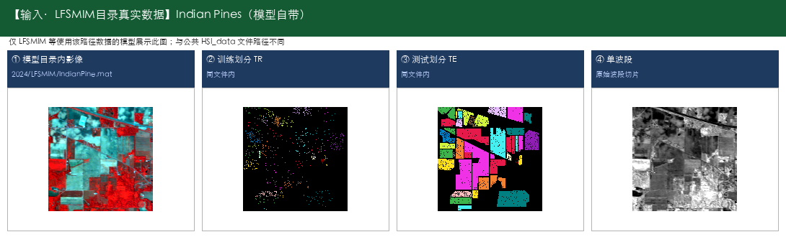

  

- **输出数据示例：** [Indian Pines] 输出为同场景像素级分类图（16类着色）

  

- **典型用途：**

  - 作物种植结构调查
  - 田块地类一张图
  - 区分玉米/大豆等细类

- **源码/论文入口：** https://ieeexplore.ieee.org/abstract/document/10416647

---

#### 79. morphFormer —— 高光谱地物分类；Transformer特征建模

- **仓库路径：** `2023/morphFormer`
- **论文/题目：** Spectral–Spatial Morphological Attention Transformer for Hyperspectral Image Classification
- **能识别什么（摘要）：** Houston（城市精细地物，共15类；IEEE GRSS 城市场景（常见 Houston 2013 设定））；Trento（城郊地物（常配合 LiDAR），共6类；多源 HSI+LiDAR）；MUUFL（校园/城市地物（常配合 LiDAR），共11类；多源 HSI+LiDAR）

**能识别什么（完整类别明细）：**

- **Houston（城市精细地物，共15类；IEEE GRSS 城市场景（常见 Houston 2013 设定））**

  - 1. 健康草地（Healthy grass）
  - 2. 胁迫草地（Stressed grass）
  - 3. 合成草地（Synthetic grass）
  - 4. 树木（Trees）
  - 5. 土壤（Soil）
  - 6. 水体（Water）
  - 7. 居民区（Residential）
  - 8. 商业区（Commercial）
  - 9. 道路（Road）
  - 10. 高速公路（Highway）
  - 11. 铁路（Railway）
  - 12. 停车场1（Parking Lot 1）
  - 13. 停车场2（Parking Lot 2）
  - 14. 网球场（Tennis Court）
  - 15. 跑道（Running Track）

- **Trento（城郊地物（常配合 LiDAR），共6类；多源 HSI+LiDAR）**

  - 1. 苹果树（Apple trees）
  - 2. 建筑（Buildings）
  - 3. 地面（Ground）
  - 4. 木材（Woods）
  - 5. 葡萄园（Vineyard）
  - 6. 道路（Roads）

- **MUUFL（校园/城市地物（常配合 LiDAR），共11类；多源 HSI+LiDAR）**

  - 1. 树木（Trees）
  - 2. 多为草地（Mostly grass）
  - 3. 混合地物（Mixed ground surface）
  - 4. 裸土/沙地（Dirt and sand）
  - 5. 道路（Road）
  - 6. 水体（Water）
  - 7. 建筑旁阴影（Building shadow）
  - 8. 建筑（Building）
  - 9. 人行道（Sidewalk）
  - 10. 黄色路缘（Yellow curb）
  - 11. 布质遮盖物（Cloth panels）

- **代码中的数据集：** Houston、Trento、MUUFL

- **输入数据示例：** [Houston] 城市精细地物，15类；仓库真实超像素 `segmentmapshst.mat`；完整数据见 GRSS 官网，建议存 `_raw_datasets/Houston/`；[Trento] 城郊地物（常配合 LiDAR），6类；仓库未附带原始文件；请按模型 readme 下载到 `_raw_datasets/Trento/`；[MUUFL] 校园/城市地物（常配合 LiDAR），11类；仓库未附带原始文件；请按模型 readme 下载到 `_raw_datasets/MUUFL/`

  

- **输出数据示例：** [Houston] 输出为同场景像素级分类图（15类着色）；[Trento] 输出为同场景像素级分类图（6类着色）；[MUUFL] 输出为同场景像素级分类图（11类着色）

  

- **典型用途：**

  - 城市土地利用一张图
  - 区分道路/建筑/绿地/停车场等
  - 规划底图支撑
  - 交通设施识别辅助
  - 城郊/园区精细地物管理

- **源码/论文入口：** https://ieeexplore.ieee.org/document/10036472

---

#### 80. MRViT —— 高光谱地物分类；Transformer特征建模

- **仓库路径：** `2022/MRViT`
- **论文/题目：** Mixed Convolutions with Vision Transformer in Hyperspectral Image Classification
- **能识别什么（摘要）：** Salinas（农业区蔬菜/葡萄园/裸土，共16类；512×217，常用204波段）；Pavia University（城市道路/建筑/植被，共9类；610×340（常用），约103波段）；Kennedy Space Center (KSC)（海岸湿地植被与土地覆盖，共13类；常用176波段，400–2500nm）

**能识别什么（完整类别明细）：**

- **Salinas（农业区蔬菜/葡萄园/裸土，共16类；512×217，常用204波段）**

  - 1. 西兰花绿杂草1（Brocoli_green_weeds_1）
  - 2. 西兰花绿杂草2（Brocoli_green_weeds_2）
  - 3. 休耕地（Fallow）
  - 4. 休耕地-粗耕（Fallow_rough_plow）
  - 5. 休耕地-平整（Fallow_smooth）
  - 6. 茬地（Stubble）
  - 7. 芹菜（Celery）
  - 8. 葡萄园-未修剪（Grapes_untrained）
  - 9. 葡萄园发育土壤（Soil_vinyard_develop）
  - 10. 玉米衰老绿杂草（Corn_senesced_green_weeds）
  - 11. 生菜长叶4周（Lettuce_romaine_4wk）
  - 12. 生菜长叶5周（Lettuce_romaine_5wk）
  - 13. 生菜长叶6周（Lettuce_romaine_6wk）
  - 14. 生菜长叶7周（Lettuce_romaine_7wk）
  - 15. 葡萄园-未修剪2（Vinyard_untrained）
  - 16. 葡萄园-垂直棚架（Vinyard_vertical_trellis）

- **Pavia University（城市道路/建筑/植被，共9类；610×340（常用），约103波段）**

  - 1. 沥青路面（Asphalt）
  - 2. 草地/草甸（Meadows）
  - 3. 砾石（Gravel）
  - 4. 树木（Trees）
  - 5. 涂装金属板（Painted metal sheets）
  - 6. 裸土（Bare Soil）
  - 7. 柏油（Bitumen）
  - 8. 自锁砖块（Self-Blocking Bricks）
  - 9. 阴影（Shadows）

- **Kennedy Space Center (KSC)（海岸湿地植被与土地覆盖，共13类；常用176波段，400–2500nm）**

  - 1. 灌木丛（Scrub）
  - 2. 柳栎沼泽（Willow swamp）
  - 3. CP旱地树丛（CP hammock）
  - 4. 湿地松（Slash pine）
  - 5. 橡树/阔叶（Oak/Broadleaf）
  - 6. 硬木（Hardwood）
  - 7. 沼泽（Swamp）
  - 8. 禾本沼泽（Graminoid marsh）
  - 9. 米草沼泽（Spartina marsh）
  - 10. 香蒲沼泽（Cattail marsh）
  - 11. 盐沼（Salt marsh）
  - 12. 泥滩（Mud flats）
  - 13. 水体（Water）

- **代码中的数据集：** Salinas、Pavia University、Kennedy Space Center (KSC)

- **输入数据示例：** [Salinas] 农业区蔬菜/葡萄园/裸土，16类；真实标签 `_raw_datasets/Salinas_gt.mat`（512×217）+ 超像素；影像请下载 `Salinas_corrected.mat`；[Pavia University] 城市道路/建筑/植被，9类；仓库真实标签 `TRpaviaU.mat`/`TSpaviaU.mat`（610×340）+ 超像素 `segmentmapspaviau.mat`；完整立方体请下载到 `_raw_datasets/PaviaU.mat`

  

  

- **输出数据示例：** [Salinas] 输出为同场景像素级分类图（16类着色）；[Pavia University] 输出为同场景像素级分类图（9类着色）

  

  

- **典型用途：**

  - 作物种植结构调查
  - 田块地类一张图
  - 区分玉米/大豆等细类
  - 城市土地利用一张图
  - 区分道路/建筑/绿地/停车场等
  - 规划底图支撑
  - 湿地土地覆盖监测

- **源码/论文入口：** https://doi.org/10.1109/ICCT56141.2022.10073347

---

#### 81. MVAHN —— 高光谱地物分类；Transformer特征建模

- **仓库路径：** `2023/MVAHN`
- **论文/题目：** Multiple Vision Architectures-based Hybrid Network for Hyperspectral Image Classification
- **能识别什么（摘要）：** Indian Pines（农田作物与植被（印第安纳松），共16类；145×145，常用200波段，光谱约0.4–2.5μm（400–2500nm））

**能识别什么（完整类别明细）：**

- **Indian Pines（农田作物与植被（印第安纳松），共16类；145×145，常用200波段，光谱约0.4–2.5μm（400–2500nm））**

  - 1. 苜蓿（Alfalfa）
  - 2. 玉米-非耕（Corn-notill）
  - 3. 玉米-少耕（Corn-mintill）
  - 4. 玉米（Corn）
  - 5. 牧草-牧场（Grass-pasture）
  - 6. 牧草-树木（Grass-trees）
  - 7. 牧草-已刈（Grass-pasture-mowed）
  - 8. 干草堆/干草仓库（Hay-windrowed）
  - 9. 燕麦（Oats）
  - 10. 大豆-非耕（Soybean-notill）
  - 11. 大豆-少耕（Soybean-mintill）
  - 12. 大豆干净（Soybean-clean）
  - 13. 小麦（Wheat）
  - 14. 树林（Woods）
  - 15. 建筑-草-树-车道（Buildings-Grass-Trees-Drives）
  - 16. 石钢塔（Stone-Steel-Towers）

- **代码中的数据集：** Indian Pines

- **输入数据示例：** [Indian Pines] 农田作物与植被（印第安纳松），16类；仓库真实原始立方体 `HSI_data/Indian_pines_corrected.mat`（145×145×200）+ `Indian_pines_gt.mat`

  

- **输出数据示例：** [Indian Pines] 输出为同场景像素级分类图（16类着色）

  

- **典型用途：**

  - 作物种植结构调查
  - 田块地类一张图
  - 区分玉米/大豆等细类

- **源码/论文入口：** https://github.com/ZJier/MVAHN/assets/103825398/e5745f08-238b-44d7-bdbd-0c936aa2ce94

---

#### 82. SpectralFormer —— 高光谱地物分类；Transformer特征建模

- **仓库路径：** `2022/SpectralFormer`
- **论文/题目：** SpectralFormer Rethinking Hyperspectral Image Classification With Transformers
- **能识别什么（摘要）：** Houston（城市精细地物，共15类；IEEE GRSS 城市场景（常见 Houston 2013 设定））

**能识别什么（完整类别明细）：**

- **Houston（城市精细地物，共15类；IEEE GRSS 城市场景（常见 Houston 2013 设定））**

  - 1. 健康草地（Healthy grass）
  - 2. 胁迫草地（Stressed grass）
  - 3. 合成草地（Synthetic grass）
  - 4. 树木（Trees）
  - 5. 土壤（Soil）
  - 6. 水体（Water）
  - 7. 居民区（Residential）
  - 8. 商业区（Commercial）
  - 9. 道路（Road）
  - 10. 高速公路（Highway）
  - 11. 铁路（Railway）
  - 12. 停车场1（Parking Lot 1）
  - 13. 停车场2（Parking Lot 2）
  - 14. 网球场（Tennis Court）
  - 15. 跑道（Running Track）

- **代码中的数据集：** Houston

- **输入数据示例：** [Houston] 城市精细地物，15类；仓库真实超像素 `segmentmapshst.mat`；完整数据见 GRSS 官网，建议存 `_raw_datasets/Houston/`

  

- **输出数据示例：** [Houston] 输出为同场景像素级分类图（15类着色）

  

- **典型用途：**

  - 城市土地利用一张图
  - 区分道路/建筑/绿地/停车场等
  - 规划底图支撑
  - 交通设施识别辅助

- **源码/论文入口：** 仓库未提供链接

---

#### 83. SSFTT —— 高光谱地物分类；Transformer特征建模

- **仓库路径：** `2022/SSFTT`
- **论文/题目：** Spectral Spatial Feature Tokenization Transformer for Hyperspectral Image Classification
- **能识别什么（摘要）：** Indian Pines（农田作物与植被（印第安纳松），共16类；145×145，常用200波段，光谱约0.4–2.5μm（400–2500nm））

**能识别什么（完整类别明细）：**

- **Indian Pines（农田作物与植被（印第安纳松），共16类；145×145，常用200波段，光谱约0.4–2.5μm（400–2500nm））**

  - 1. 苜蓿（Alfalfa）
  - 2. 玉米-非耕（Corn-notill）
  - 3. 玉米-少耕（Corn-mintill）
  - 4. 玉米（Corn）
  - 5. 牧草-牧场（Grass-pasture）
  - 6. 牧草-树木（Grass-trees）
  - 7. 牧草-已刈（Grass-pasture-mowed）
  - 8. 干草堆/干草仓库（Hay-windrowed）
  - 9. 燕麦（Oats）
  - 10. 大豆-非耕（Soybean-notill）
  - 11. 大豆-少耕（Soybean-mintill）
  - 12. 大豆干净（Soybean-clean）
  - 13. 小麦（Wheat）
  - 14. 树林（Woods）
  - 15. 建筑-草-树-车道（Buildings-Grass-Trees-Drives）
  - 16. 石钢塔（Stone-Steel-Towers）

- **代码中的数据集：** Indian Pines

- **输入数据示例：** [Indian Pines] 农田作物与植被（印第安纳松），16类；仓库真实原始立方体 `HSI_data/Indian_pines_corrected.mat`（145×145×200）+ `Indian_pines_gt.mat`

  

- **输出数据示例：** [Indian Pines] 输出为同场景像素级分类图（16类着色）

  

- **典型用途：**

  - 作物种植结构调查
  - 田块地类一张图
  - 区分玉米/大豆等细类

- **源码/论文入口：** https://doi.org/10.1109/TGRS.2022.3144158

---

#### 84. SSMTR —— 高光谱地物分类；Transformer特征建模

- **仓库路径：** `2023/SSMTR`
- **论文/题目：** Spectral–Spatial Masked Transformer With Supervised and Contrastive Learning for Hyperspectral Image Classification
- **能识别什么（摘要）：** Indian Pines（农田作物与植被（印第安纳松），共16类；145×145，常用200波段，光谱约0.4–2.5μm（400–2500nm））；Pavia University（城市道路/建筑/植被，共9类；610×340（常用），约103波段）；Houston（城市精细地物，共15类；IEEE GRSS 城市场景（常见 Houston 2013 设定））

**能识别什么（完整类别明细）：**

- **Indian Pines（农田作物与植被（印第安纳松），共16类；145×145，常用200波段，光谱约0.4–2.5μm（400–2500nm））**

  - 1. 苜蓿（Alfalfa）
  - 2. 玉米-非耕（Corn-notill）
  - 3. 玉米-少耕（Corn-mintill）
  - 4. 玉米（Corn）
  - 5. 牧草-牧场（Grass-pasture）
  - 6. 牧草-树木（Grass-trees）
  - 7. 牧草-已刈（Grass-pasture-mowed）
  - 8. 干草堆/干草仓库（Hay-windrowed）
  - 9. 燕麦（Oats）
  - 10. 大豆-非耕（Soybean-notill）
  - 11. 大豆-少耕（Soybean-mintill）
  - 12. 大豆干净（Soybean-clean）
  - 13. 小麦（Wheat）
  - 14. 树林（Woods）
  - 15. 建筑-草-树-车道（Buildings-Grass-Trees-Drives）
  - 16. 石钢塔（Stone-Steel-Towers）

- **Pavia University（城市道路/建筑/植被，共9类；610×340（常用），约103波段）**

  - 1. 沥青路面（Asphalt）
  - 2. 草地/草甸（Meadows）
  - 3. 砾石（Gravel）
  - 4. 树木（Trees）
  - 5. 涂装金属板（Painted metal sheets）
  - 6. 裸土（Bare Soil）
  - 7. 柏油（Bitumen）
  - 8. 自锁砖块（Self-Blocking Bricks）
  - 9. 阴影（Shadows）

- **Houston（城市精细地物，共15类；IEEE GRSS 城市场景（常见 Houston 2013 设定））**

  - 1. 健康草地（Healthy grass）
  - 2. 胁迫草地（Stressed grass）
  - 3. 合成草地（Synthetic grass）
  - 4. 树木（Trees）
  - 5. 土壤（Soil）
  - 6. 水体（Water）
  - 7. 居民区（Residential）
  - 8. 商业区（Commercial）
  - 9. 道路（Road）
  - 10. 高速公路（Highway）
  - 11. 铁路（Railway）
  - 12. 停车场1（Parking Lot 1）
  - 13. 停车场2（Parking Lot 2）
  - 14. 网球场（Tennis Court）
  - 15. 跑道（Running Track）

- **代码中的数据集：** Indian Pines、Pavia University、Houston

- **输入数据示例：** [Indian Pines] 农田作物与植被（印第安纳松），16类；仓库真实原始立方体 `HSI_data/Indian_pines_corrected.mat`（145×145×200）+ `Indian_pines_gt.mat`；[Pavia University] 城市道路/建筑/植被，9类；仓库真实标签 `TRpaviaU.mat`/`TSpaviaU.mat`（610×340）+ 超像素 `segmentmapspaviau.mat`；完整立方体请下载到 `_raw_datasets/PaviaU.mat`

  

  

- **输出数据示例：** [Indian Pines] 输出为同场景像素级分类图（16类着色）；[Pavia University] 输出为同场景像素级分类图（9类着色）

  

  

- **典型用途：**

  - 作物种植结构调查
  - 田块地类一张图
  - 区分玉米/大豆等细类
  - 城市土地利用一张图
  - 区分道路/建筑/绿地/停车场等
  - 规划底图支撑
  - 交通设施识别辅助

- **源码/论文入口：** https://doi.org/10.1109/TGRS.2023.3264235

---

#### 85. SSTN —— 高光谱地物分类；Transformer特征建模

- **仓库路径：** `2021/SSTN`
- **论文/题目：** Spatial-Spectral Transformer for Hyperspectral Image Classification
- **能识别什么（摘要）：** Indian Pines（农田作物与植被（印第安纳松），共16类；145×145，常用200波段，光谱约0.4–2.5μm（400–2500nm））；Pavia University（城市道路/建筑/植被，共9类；610×340（常用），约103波段）；Kennedy Space Center (KSC)（海岸湿地植被与土地覆盖，共13类；常用176波段，400–2500nm）

**能识别什么（完整类别明细）：**

- **Indian Pines（农田作物与植被（印第安纳松），共16类；145×145，常用200波段，光谱约0.4–2.5μm（400–2500nm））**

  - 1. 苜蓿（Alfalfa）
  - 2. 玉米-非耕（Corn-notill）
  - 3. 玉米-少耕（Corn-mintill）
  - 4. 玉米（Corn）
  - 5. 牧草-牧场（Grass-pasture）
  - 6. 牧草-树木（Grass-trees）
  - 7. 牧草-已刈（Grass-pasture-mowed）
  - 8. 干草堆/干草仓库（Hay-windrowed）
  - 9. 燕麦（Oats）
  - 10. 大豆-非耕（Soybean-notill）
  - 11. 大豆-少耕（Soybean-mintill）
  - 12. 大豆干净（Soybean-clean）
  - 13. 小麦（Wheat）
  - 14. 树林（Woods）
  - 15. 建筑-草-树-车道（Buildings-Grass-Trees-Drives）
  - 16. 石钢塔（Stone-Steel-Towers）

- **Pavia University（城市道路/建筑/植被，共9类；610×340（常用），约103波段）**

  - 1. 沥青路面（Asphalt）
  - 2. 草地/草甸（Meadows）
  - 3. 砾石（Gravel）
  - 4. 树木（Trees）
  - 5. 涂装金属板（Painted metal sheets）
  - 6. 裸土（Bare Soil）
  - 7. 柏油（Bitumen）
  - 8. 自锁砖块（Self-Blocking Bricks）
  - 9. 阴影（Shadows）

- **Kennedy Space Center (KSC)（海岸湿地植被与土地覆盖，共13类；常用176波段，400–2500nm）**

  - 1. 灌木丛（Scrub）
  - 2. 柳栎沼泽（Willow swamp）
  - 3. CP旱地树丛（CP hammock）
  - 4. 湿地松（Slash pine）
  - 5. 橡树/阔叶（Oak/Broadleaf）
  - 6. 硬木（Hardwood）
  - 7. 沼泽（Swamp）
  - 8. 禾本沼泽（Graminoid marsh）
  - 9. 米草沼泽（Spartina marsh）
  - 10. 香蒲沼泽（Cattail marsh）
  - 11. 盐沼（Salt marsh）
  - 12. 泥滩（Mud flats）
  - 13. 水体（Water）

- **代码中的数据集：** Indian Pines、Pavia University、Kennedy Space Center (KSC)

- **输入数据示例：** [Indian Pines] 农田作物与植被（印第安纳松），16类；仓库真实原始立方体 `HSI_data/Indian_pines_corrected.mat`（145×145×200）+ `Indian_pines_gt.mat`；[Pavia University] 城市道路/建筑/植被，9类；仓库真实标签 `TRpaviaU.mat`/`TSpaviaU.mat`（610×340）+ 超像素 `segmentmapspaviau.mat`；完整立方体请下载到 `_raw_datasets/PaviaU.mat`

  

  

- **输出数据示例：** [Indian Pines] 输出为同场景像素级分类图（16类着色）；[Pavia University] 输出为同场景像素级分类图（9类着色）

  

  

- **典型用途：**

  - 作物种植结构调查
  - 田块地类一张图
  - 区分玉米/大豆等细类
  - 城市土地利用一张图
  - 区分道路/建筑/绿地/停车场等
  - 规划底图支撑
  - 湿地土地覆盖监测

- **源码/论文入口：** 仓库未提供链接

---

### 综述与基线（了解用）（2 个）

#### 86. HSI_DeepLearning_Review —— 方法综述与选型参考

- **仓库路径：** `2016/HSI_DeepLearning_Review`
- **论文/题目：** Deep Feature Extraction and Classification of Hyperspectral Images Based on Convolutional Neural Networks
- **能识别什么（摘要）：** 本身不做业务识别；用于方法选型。

**能识别什么（完整类别明细）：**

- （无明确公开数据集类别表；下载数据后可按标签文件补全）

- **代码中的数据集：** Indian Pines、Salinas、Pavia University、Houston

- **输入数据示例：** [Indian Pines] 农田作物与植被（印第安纳松），16类；仓库真实原始立方体 `HSI_data/Indian_pines_corrected.mat`（145×145×200）+ `Indian_pines_gt.mat`；[Salinas] 农业区蔬菜/葡萄园/裸土，16类；真实标签 `_raw_datasets/Salinas_gt.mat`（512×217）+ 超像素；影像请下载 `Salinas_corrected.mat`

  

  

- **输出数据示例：** [Indian Pines] 输出为同场景像素级分类图（16类着色）；[Salinas] 输出为同场景像素级分类图（16类着色）

  

  

- **典型用途：**

  - 技术调研
  - 汇报底稿
  - 选型清单

- **源码/论文入口：** 仓库未提供链接

---

#### 87. HSISurvey —— 方法综述与选型参考

- **仓库路径：** `2024/HSISurvey`
- **论文/题目：** A Comprehensive Survey for Hyperspectral Image Classification: The Evolution from Conventional to Transformers and Mamba Models
- **能识别什么（摘要）：** 本身不做业务识别；用于方法选型。

**能识别什么（完整类别明细）：**

- （无明确公开数据集类别表；下载数据后可按标签文件补全）

- **代码中的数据集：** 未明确

- **输入数据示例：** 未明确数据集且无原始文件，不展示替身数据

  > （原始立方体待下载后补图；当前不顶替）

- **输出数据示例：** 一般为像素级分类图 + OA/AA/Kappa

  > （无对应输出示例图，见文字说明）

- **典型用途：**

  - 技术调研
  - 汇报底稿
  - 选型清单

- **源码/论文入口：** https://github.com/mahmad000/HSIC-2024

---

## 6. 附录

### 6.1 名称对照

| 目录名 | 文档中名称 |
|--------|------------|
| DABAN | DADBN |
| HybridSN_Exploring_3D_2D | HybridSN |
| MambaHSI_Plus | MambaHSI+ |
| CDMLC | Model Description 未单列；题名取自 readme |

### 6.2 审阅说明

- 本文件供学习、提问与修改；**确认后再转 Word**。
- 修改建议可直接改本 Markdown，或告诉我要改的条目。
- 图片相对路径基于本仓库根目录；用支持本地预览的编辑器打开即可看见图。
- 信息不虚构精度数值；缺原始数据处已标明。

### 6.3 相关文件

- `数据集人工下载清单.md`
- `高光谱分类小模型-领导精简版.docx`（旧版 Word，确认 Markdown 后再更新）
- `高光谱图像分类小模型整理.docx`（技术完整版）
- `_demo_figs/`（预览图）

